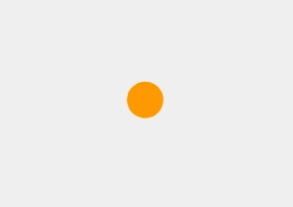
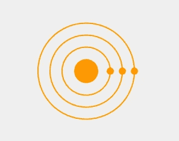

# 被扑腾:邮递员动画

> 原文：<https://itnext.io/get-fluttered-postman-animation-d1760416b680?source=collection_archive---------2----------------------->

邮递员加载屏幕动画

你们中的很多人以前一定用过 Postman。今天我们要构建邮差加载屏幕动画，直接进入吧。

我们将把这个动画分成三个简单的里程碑—

1.  画内圆和同心圆。
2.  在每个同心圆上放置(画出)小球。
3.  最后，让球变得疯狂。

# **里程碑#1 —画圆**

在 Flutter 中绘制形状最简单的方法是使用`CustomPaint`小部件。现在，如何使用 CustomPaint 绘制一个圆？
`CustomPaint`接受一个负责绘制形状的`painter`参数。使用`CustomPainter`类实现了一个`painter`。查找我们找到的文件-

> 若要实现自定义画图器，请子类化或实现此接口来定义您的自定义画图委托。 [CustomPaint](https://api.flutter.dev/flutter/widgets/CustomPaint-class.html) 子类必须实现 [paint](https://api.flutter.dev/flutter/rendering/CustomPainter/paint.html) 和 [shouldRepaint](https://api.flutter.dev/flutter/rendering/CustomPainter/shouldRepaint.html) 方法，也可以选择实现 [hitTest](https://api.flutter.dev/flutter/rendering/CustomPainter/hitTest.html) 和 [shouldRebuildSemantics](https://api.flutter.dev/flutter/rendering/CustomPainter/shouldRebuildSemantics.html) 方法，以及[semantics builder](https://api.flutter.dev/flutter/rendering/CustomPainter/semanticsBuilder.html)getter。

因此，我们盲目地遵循万能的文献告诉我们的。我们创建一个类，并将其扩展到 CustomPainter，实现所需的方法。它看起来像这样-

如文档中所写，必要的方法是`paint`和`shouldRepaint`方法。要理解`paint`方法是如何工作的，简单地说，就像这样,`paint`方法使用一个`Paint`对象来绘制固定`Size`的`Canvas`。让我们按照这些步骤来看看它的实际效果—

1.  创建一个绘画对象(包含如何绘制形状的信息，例如笔画类型、笔画宽度等)
2.  选取固定偏移(包含有关在画布中绘制形状的位置的信息)
3.  调用绘图函数(它包含关于要绘制的形状类型的信息，例如圆、弧、线等)

屏幕上终于出现了一个圆圈。

现在让我们继续构建其余的同心圆。如果你仔细观察，这个圆和其他三个同心圆唯一的区别就是半径不同，没有颜色填充。因此，我们又画了三个不同半径的圆。Paint 对象的`paintStyle`属性负责您想要如何绘制圆。`PaintStyle.stroke`只是勾勒形状，不填充。所以我们通过添加以下内容再画三个圆-

现在我们有了可以放球的圆圈。

# 里程碑#2 —放置小圆圈

这部分是所有三个里程碑中最容易的。创建一个圆，用想要的颜色填充它，并把它放在一个特定的位置，这是我们到目前为止学到的东西。这里，我们只需要创建三个相同的圆，并将它们放置在三个同心圆的半径上。这些圆圈的位置有点棘手。如果你足够努力地思考，小圈子将遵循的路径具有以下逻辑—

【x = size.width/2+radiusOfPath * math . cos(initial displace+rotation angle * rotation speed)
y = size.height/2+radiusOfPath * math . sin(initial displace+rotation angle * rotation speed)

其中，
*intial displace*是我们要开始旋转动画的角度， *rotationAngle* 是任意给定时刻的旋转角度，*rotations speed*是小圆绕内圆旋转的速度。现在我们将保持*初始位移、旋转角度*和*旋转速度*为零，我们将在实现第三个里程碑时设置它们。

# 里程碑#3 —制作圆圈动画

剩下的就是让这些圆以不同的速度绕着内圈旋转。如果我们能够随时改变*旋转角度*的值，这就可以实现。因此，这为在 Flutter 中使用[补间动画](https://flutter.dev/docs/development/ui/animations/tutorial)提供了一个完美的例子。如果你有补间动画的经验，你会知道`Animation`和`AnimationController`是实现它们所需要的两个关键对象。使用这个动画对象，我们将随时改变*旋转角度*的值。为了将`animation.value`从小部件传递到 CustomPainter，我们将使用 rotationFactor 变量。我们的旋转角度现在由以下逻辑定义—

*rotation angle = rotation factor * math . pi*

剩下的另一件事是圆圈旋转的速度。我个人把最里面一圈的速度设定为中间一圈的两倍，中间一圈的速度是最外面一圈的两倍。

现在是最后一个变化。这是一个非常小的变化，但确实是一个关键的变化。默认情况下，`shouldRepaint`方法返回 false。我们必须把它改成真的。原因在于理解 shouldRepaint 方法的作用。本质上，它所做的就是控制 CustomPainter 小部件的重建。更简单地说，每当调用 CustomPainter 类的新实例时都会调用它。因此，将其设置为 true 允许我们在每次创建新实例时构建一个新的 CustomPainter。我们正在为`animation.value`中的每一个新刻度创建一个新实例。

这是整个动画的最终代码—

> 非常感谢您阅读这篇文章。我会鼓励你用不同的方法来构建它，或者用你从中学到的东西来构建其他东西。☕
> 请在评论中分享你的想法和建议。我会试着每周发表一篇新文章。下次见。🤓
> 到那时，快乐飘飘。🍺