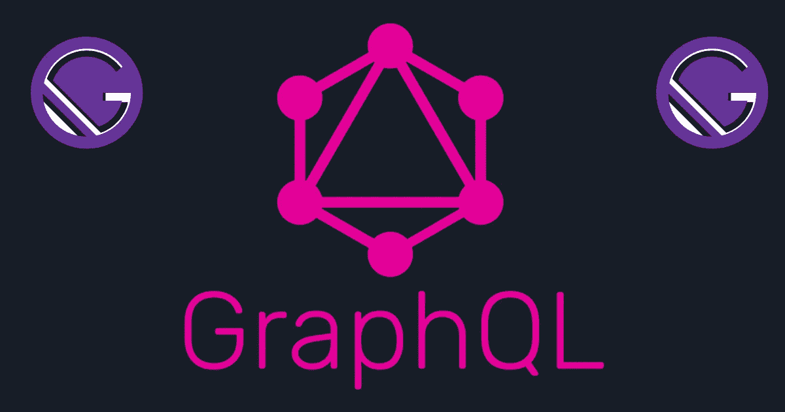
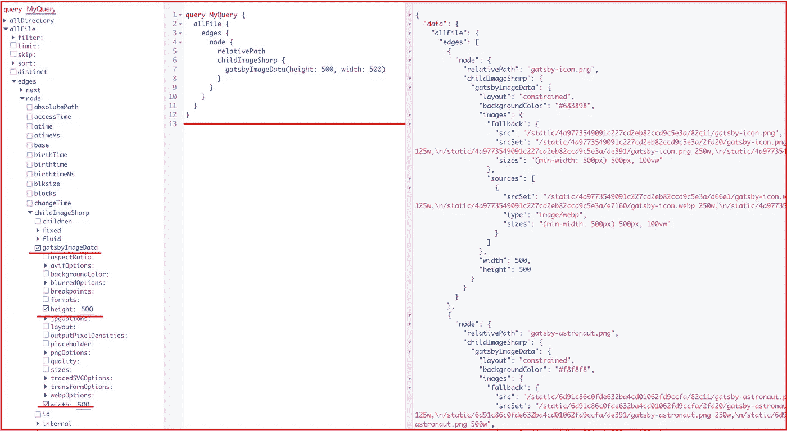
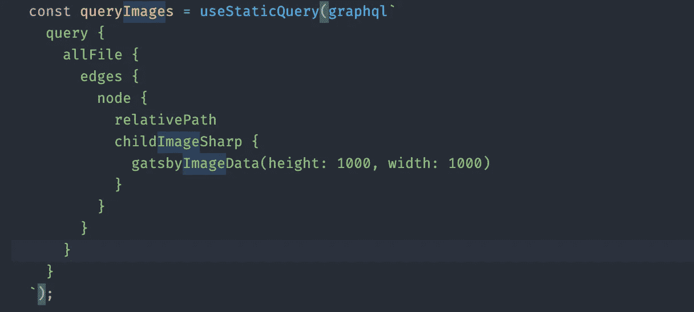
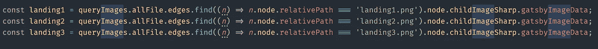

# 获取多个图像 Graphql — Gatsby 3.0

> 原文：<https://itnext.io/get-multiple-images-graphql-gatsby-3-0-dbedf1eefb4f?source=collection_archive---------0----------------------->



# **简介**

大家好，最近我面临着在一个组件中使用 GraphQL 显示几个图像的任务。在我们深入本教程之前，我必须承认 Gastby 和 Graphql 不是我的强项，所以如果有人有更简单的方法，我洗耳恭听。

# 先决条件

*   我假设您已经安装了 node.js 和 npm。
*   一个正在进行的**盖茨比 3** 项目。
*   我们将使用 **<盖茨比形象></盖茨比形象>**

# 第一步

前往 GraphQL，graph QL 的图形界面。

```
[http://localhost:8000/___graphql](http://localhost:8000/___graphql)
```



我们的查询—我们现在查询 images 文件夹中的所有图像。



# 第二步

接下来，我们将添加一个函数，通过图像的相对路径/名称来获取图像，



现在我们可以在 UI 中显示图像了。

```
<GatsbyImage *image*={landing1} *alt*='some alt' />
```


E asy！


# 结论

Gastby 是一个优秀的静电发生器，结合 GraphQL 它接近完美！