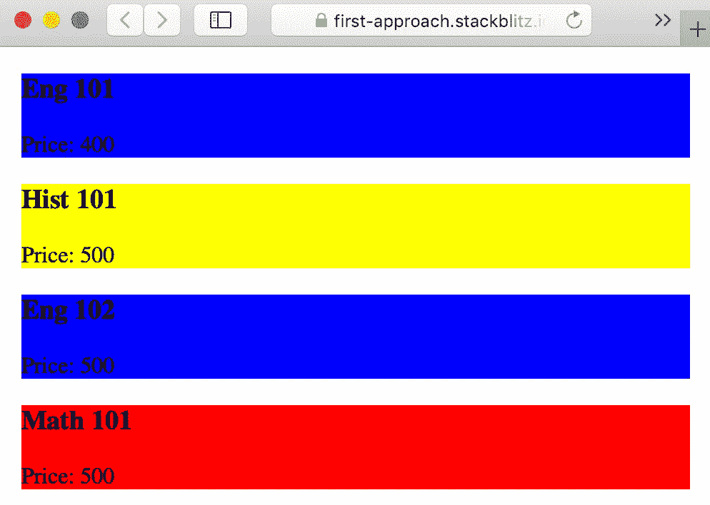

# 用 OOP 去除 Angular 应用中的 if 语句

> 原文：<https://itnext.io/get-rid-of-if-statements-in-your-angular-app-with-oop-1efdf91da577?source=collection_archive---------0----------------------->

当我们第一次开始使用 Angular 时，我们很容易对 Angular 团队提供的开箱即用的功能感到惊讶。例如，用于状态管理的 NgRx 就像是它自己的小框架，存在于其中。还有，作为前端开发人员，我们需要赶上 Bootstrap，Typescript，Javascript，Material，CSS 预处理等。

> 当新技术淹没我们时，我们可能会忘记帮助我们向相关方封装逻辑的最佳软件工程范例之一:OOP。

Angular 是用 Typescript 构建的，这一事实降低了具有 OOP 语言背景的开发人员的学习曲线。下面我们来看一个用例，如果觉得有帮助请跟我来。

# 要求:

## 业务需求:

我们正在建立一个广告网站，显示当地私人教师的课程。他希望以下内容成为 MVP:

1.  开设英语课程、历史课程、数学课程。
2.  用蓝色突出显示英语课程
3.  黄色的历史课程
4.  红色的数学课程

## 其他:

课程信息可以通过 Web API 获取。我们在演示应用程序中用 http-data.service.ts 来模拟它。

# 解决方案:

## 方法 1 -最简单和正确的解决方案:

创建一个显示课程名称和价格的 CourseComponent。在该组件中，我们用 ngOnInit 中的一些 if 检查来更改背景颜色。

课程组件和测试用例

*结果:*

*完整 app:*[https://first-approach.stackblitz.io/](https://first-approach.stackblitz.io/) *完整代码:*[https://github . com/leopangchan/OOP-ts-demo/tree/master/src/app](https://github.com/leopangchan/oop-ts-demo/tree/master/src/app)

*这里的问题是什么:*

1.  CourseComponent 的 ngOnInit 中的逻辑并不是一个接受输入，吐出输出的纯函数。在 spec 文件中，我们需要正确地设置组件来测试一个独立的逻辑。如果更多的逻辑进入 ngOnInit，我们将无法单独测试依赖逻辑。
2.  如果逻辑比着色更复杂，组件就不再具有代表性。

## **方法 2——将逻辑移至服务:**

哦！我们有业务逻辑，想要一个更干净的组件？当然可以！我们可以把它转移到服务中。这样，很明显，逻辑只涉及 CourseComponent，因为它位于由组件导入的 CourseService 中。它也变成了一个纯函数，更容易进行单元测试。

带有服务的 CourseComponent 的重构版本

*完整代码:*[https://github . com/leopangchan/OOP-ts-demo/tree/service-approach/src/app](https://github.com/leopangchan/oop-ts-demo/tree/service-approach/src/app)

现在看起来很不错。但是让我们问自己一个存在于所有软件工程师大脑中的问题:我们能做得更好吗？逻辑真的被封装在正确的地方了吗？

*这里的问题是什么:*

if-check 无法扩展。假设 6 个月后，导师发现他的市场合适，于是雇佣了更多的人。自然，他想在网站上提供更多的课程。

# *新业务需求:*

1.  支持 2 种以上的课程
2.  类型和价格改变背景颜色。

## **方法 2——将逻辑转移到服务中:**

使用方法 2，我们可以在 CourseService 的 getColor()中再添加 2 个 if-check。

课程服务

*完整代码:*[https://github . com/leopangchan/OOP-ts-demo/tree/service-approach-new-courses/src/app](https://github.com/leopangchan/oop-ts-demo/tree/service-approach-new-courses/src/app)

当然，它是可行的，并且是可单元测试的。

*这里的问题是什么:*

1.  每个 if 块拥有不同的逻辑来获得背景色。尽管它是可行的并且是单元可测试的，但是 if-check 的列表可以扩展得更多，并且在每个块中可以有更多的嵌套 if-check。
2.  如果将来我们有了除了着色之外的依赖于课程的逻辑，这个服务看起来就很难看了。

## **方法 3:去掉带有多态性的 if 语句**

借助一些 OOP 直觉，我们可以快速指出父类——Course 和子类(如 EngCourse 和 HistCourse)之间的继承关系。我们可以在父节点中定义 getColor()的默认实现，子节点可以根据需要覆盖它。所以，让我们一步一步地重构我们的应用程序:

步骤 1-创建父类和子类:

请注意，我已经将课程界面更改为一个类，这允许我们拥有函数或类变量的值的默认实现。为了维护一个定义良好的 API 响应实体，我添加了一个 CourseRes 接口。

步骤 2 —创建课程实例:

根据类型，我们需要不同的类实例。我已经重构了课程服务:

这个工厂函数帮助我们利用四个 OOP 概念的基础:1 .抽象 2。封装 3。传承 4。多态性。(鸣谢:在评论区大声喊出 [Muthukumaran](https://medium.com/@muthuishere?source=responses---------2-----------------------) 的建议。)

步骤 3 —使用工厂功能:

我们正在 AppComponent 中创建实例，以便将来其他组件可以重用它们。

最后一步—在课程组件中使用课程实例:

我们在 CourseComponent 中调用 getColor()。通过运行时多态性使用正确的实现。

*完整 app:*[https://oop-approach-2.stackblitz.io/](https://oop-approach-2.stackblitz.io/)*完整代码:*[https://github . com/leopangchan/OOP-ts-demo/tree/OOP-approach/src/app](https://github.com/leopangchan/oop-ts-demo/tree/oop-approach/src/app)

*这种方法有什么好处:*

1.  易于单元测试。因为它是用纯类和函数构建的，所以我们在编写测试时不需要模仿服务或组件(请查看完整代码以了解更多细节)。
2.  与外界高度隔绝
3.  CourseComponent 是哑的/表示性的
4.  面向对象背景的开发人员易于阅读
5.  没有很长的假设检验列表

# 总结:

为了展示实现，业务需求被过度简化了。现实世界中的应用程序极有可能具有比这复杂 100 倍或更多的逻辑。那时，将逻辑封装到每个类类型是一个巨大的可伸缩性提升！