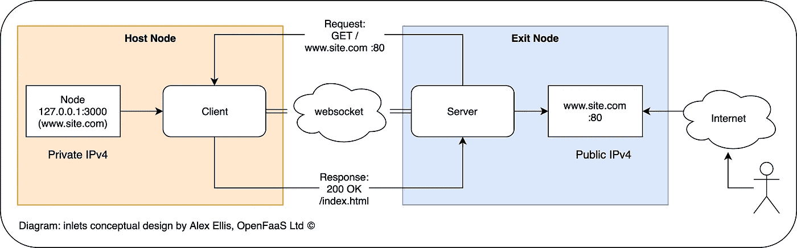
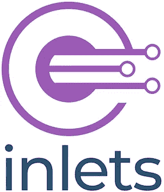

# 入口入门:HTTP & websockets 的 OSS 隧道

> 原文：<https://itnext.io/get-started-with-free-http-and-websocket-tunnels-30c9ac3fd247?source=collection_archive---------2----------------------->

你可能听说过各种免费提供 HTTP 隧道的网站，但它似乎总是带有严重的限制或相对较高的价格标签。我想告诉你如何开始一个开源隧道，你可以免费托管自己。

使用 HTTP 隧道的主要原因是为了获得一个公共端点，您可以与您的团队、客户或第三方 API 共享该端点来接收 webhooks。

> 考虑测试与 PayPal 或 Stripe 等支付处理器的计费集成。你将如何把这个网络钩子连接到你的笔记本电脑或本地网络上？这几乎是不可能的，除非你使用 HTTP 隧道。

现在，在引言中，我提到了很多 SaaS 隧道都有严重的限制，比如每小时 60 次浏览，或者在 URL 改变前 7 小时的持续时间。大约一年前，我开始着手解决这个问题，并创建了一个开源项目，这意味着你可以托管一个带有公共 IP 的廉价 VPS 或 VM，并在那里运行你的隧道服务器。



然后，您可以在笔记本电脑或本地网络上运行您的客户端，它将充当一种路由器。所有客户端从公共 IP 连接到您的服务，并被重定向到您的本地服务。

# 引入入口



现在，Inlets 拥有 6k GitHub stars 和世界各地的许多用户，还有自己的社区和 [Slack 频道](https://slack.openfaas.io/)。

> 您可以使用自己的 Terraform 或我们为您创建的免费工具之一来手动配置入口出口服务器。

使用 inlets 的免费 OSS 版本，您可以获得一个 HTTP 隧道，它可以支持 TLS，也可以代理 websocket 流量。使用专业版，您可以获得内置的标准自动 TLS 加密，并可以代理任何 TCP 流量，如数据库、TLS、RDP、VNC、SSH 和专有 TCP 协议。

使用[入口二进制](https://github.com/inlets/inlets)进行手动供应可提供:

*   总量控制
*   使用任何云或现有主机
*   按照您喜欢的方式配置 TLS

使用 [inletsctl](https://github.com/inlets/inletsctl) 进行自动配置

*   inletsctl 在 Azure、DigitalOcean、Civo、Google Cloud、Amazon 和 Packet 中的任意一个上创建云主机
*   如果使用专业版，您将获得作为软件包一部分的内置 TLS 加密
*   或者您可以通过 SSH 登录，然后添加 TLS
*   与 OSS 或 PRO 版本配合使用

不需要 Kubernetes、Docker 或任何与容器有关的东西。

带[入口的自动化-操作员](https://github.com/inlets/inlets-operator/)

*   inlets-operator 是一个 Kubernetes 集成，它接受集群中的任何负载平衡器服务，并在公共云上为其创建一个虚拟机，然后用该 IP 更新本地集群
*   它也可以支持使用 inlets PRO 的 IngressController
*   它自带隧道 CRD，便于管理
*   共享来自 inletsctl 的相同配置代码，并且可以与 OSS 或 PRO 版本一起使用

# 尝试一下

从 GitHub 获取`inletsctl`:

```
curl -sSL [https://inletsctl.inlets.dev](https://inletsctl.inlets.dev) | sudo sh
```

您现在可以使用 inletsctl 下载 inlets 客户机/服务器二进制文件，稍后我们将使用 inlets 客户机命令。

```
inletsctl download# Or download the PRO editioninletsctl download --pro
```

运行一个本地 HTTP 服务器，这样您就有东西可以代理了:

```
mkdir -p /tmp/shared-files/
cd /tmp/shared-files/
echo "Welcome to my shared files" > readme.txt
```

如果您安装了 Python，您可以在这个文件夹中启动一个简单的服务器，它将监听端口 8000。

```
python -m SimpleHTTPServer
```

现在使用 inletsctl 创建一个出口服务器，记住，如果您愿意，您可以手动完成这个操作，然后运行服务器。

```
inletsctl create --provider digitalocean \
  --region lon1 \
  --access-token-file ~/Downloads/access-token
```

我从我的 DigitalOcean dashboard 保存了一个访问令牌，它将用于创建我的退出服务器。

几秒钟后，你会得到一个可以用来连接你的客户端的命令。

```
Using provider: digitalocean
Requesting host: romantic-ritchie0 in lon1, from digitalocean2020/03/17 17:54:18 Provisioning host with DigitalOcean
Host: 185188454, status:
[1/500] Host: 185188454, status: new
... 
```

如果您使用的是 inlets-pro，那么您只需再添加一个标志来配置 pro 服务器:

```
inletsctl create --provider digitalocean \
  --region lon1 \
  --access-token-file ~/Downloads/access-token \
  --remote-tcp 127.0.0.1
```

附加标志是`--remote-tcp`,它告诉服务器在哪里代理 TCP 流量的传入请求。通常这是您的本地计算机。

```
Inlets OSS exit-node summary:
IP: 206.189.18.72Auth-token: SLcdRh1nZR1yBNTm1kJsGNJKxu9V40eEwcIx1ZTXl1RiGtUONj70gyvNmMOdeCsf
Command:export UPSTREAM=http://127.0.0.1:8000
inlets client --remote "ws://206.189.18.72:8080" \
--token "SLcdRh1nZR1yBNTm1kJsGNJKxu9V40eEwcIx1ZTXl1RiGtUONj70gyvNmMOdeCsf" \
--upstream $UPSTREAMTo Delete:
inletsctl delete --provider digitalocean --id "185188454"
```

*   您的身份验证令牌用于向出口服务器验证您的 inlets 客户端或 inlets PRO 客户端。
*   该 IP 是您的用户将访问的公共 IP
*   上游 URL 是将传入请求发送到的地方，在我们的 Python 服务器示例中，它已经被正确地设置为端口 8000，但是正如您所看到的，这可以指向另一台 PC。

```
export UPSTREAM=http://127.0.0.1:8000
inlets client --remote "ws://206.189.18.72:8080" \
--token "SLcdRh1nZR1yBNTm1kJsGNJKxu9V40eEwcIx1ZTXl1RiGtUONj70gyvNmMOdeCsf" \
--upstream $UPSTREAM2020/03/17 17:57:16 Welcome to inlets.dev! Find out more at [https://github.com/inlets/inlets](https://github.com/inlets/inlets)
2020/03/17 17:57:16 Starting client - version 2.6.4
2020/03/17 17:57:16 Upstream:  => [http://127.0.0.1:8000](http://127.0.0.1:8000)
2020/03/17 17:57:16 Token: "SLcdRh1nZR1yBNTm1kJsGNJKxu9V40eEwcIx1ZTXl1RiGtUONj70gyvNmMOdeCsf"
INFO[0000] Connecting to proxy                           url="ws://206.189.18.72:8080/tunnel"
```

现在，您可以连接到公共 IP 并与您的同事或朋友分享:

```
curl 206.189.18.72<!DOCTYPE html PUBLIC "-//W3C//DTD HTML 3.2 Final//EN"><html>
<title>Directory listing for /</title>
<body>
<h2>Directory listing for /</h2>
<hr>
<ul>
<li><a href="readme.txt">readme.txt</a>
</ul>
<hr>
</body>
</html>
```

如你所见，它如预期的那样工作。

更进一步:

*   你甚至可以继续添加一个虚名 DNS 名称，如 client-x.example.com。
*   您可能希望为 inletsctl 创建的主机添加 TLS 加密，您可以使用您最喜欢的反向代理来实现。[在我最初的指南中，我用的是 Caddy，配置简单得不能再简单了](https://blog.alexellis.io/https-inlets-local-endpoints/)。
*   尝试使用 Socket.io 公开一个依赖于 websockets 的应用程序，比如一个 [Node.js 应用程序](https://socket.io)
*   将您的[Kubernetes Ingres controller 暴露在互联网上](https://docs.inlets.dev/#/get-started/quickstart-ingresscontroller-cert-manager?id=expose-your-ingresscontroller-and-get-tls-from-letsencrypt)
*   [用 inlets PRO 暴露 SSH](https://docs.inlets.dev/#/get-started/quickstart-tcp-ssh?id=get-ssh-access-from-anywhere)

## 包扎

因为我已经用完了我的出口服务器，所以我现在要删除它。

```
inletsctl delete --provider digitalocean --id "185188454" --access-token-file ~/Downloads/access-token
```

我将 inlets 作为云原生隧道引入，因为它可以与 Docker 和 Kubernetes 很好地集成，但是它也可以单独作为简单的二进制文件或与 systemd 一起工作。它是多拱的，所以也适用于树莓派，并且易于安装。对于那些想要内置加密和 TCP 支持的人来说， [inlets-pro 可以购买，或者免费试用 14 天](https://docs.inlets.dev/#/?id=pricing)。

你也可以在 OpenFaaS Ltd 商店购买一个[入口杯、t 恤和帽衫。](https://store.openfaas.com/)

提醒一下，这里有三种口味的入口:

*   [入口客户端/服务器二进制](https://github.com/inlets/inlets)用于简单的自我管理隧道
*   [inletsctl](https://github.com/inlets/inletsctl) 自动化云虚拟机和出口服务器
*   [入口——运营商](https://github.com/inlets/inlets-operator/),可实现 Kubernetes 服务和云虚拟机创建的自动化