# 获取您的 k0s 开发集群

> 原文：<https://itnext.io/get-your-k0s-development-cluster-7491a1c76aca?source=collection_archive---------3----------------------->

## "如果你能运行 Lens，你将拥有开发集群，永远可用！"

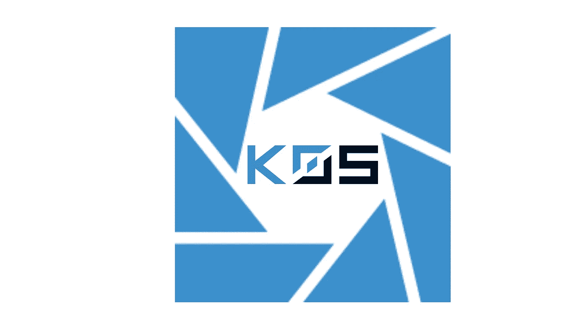

如果你经常使用 Kubernetes，你可能会从 [Mirantis](https://medium.com/u/fedcaa2e9074?source=post_page-----7491a1c76aca--------------------------------) 中看到 Lens Kubernetes IDE。我个人使用 Lens，并向任何利用 Kubernetes 的人推荐它，无论你是在操作方面还是在应用程序管理方面。

就在最近(几天前)，Lens 团队宣布了 Lens Spaces 的一个新的 alpha 功能:用户现在可以直接从 Lens 运行和访问免费的开发集群。该开发集群是一个单节点集群，运行在 AWS 上的一个 2 vCPUs、8gb RAM 节点上(集群位置将来可能会改变)。由于该功能仍处于测试阶段，许多变化和增强将很快出现。官方声明可在[这里](https://medium.com/k8slens/kubernetes-for-everyone-785959e2c6d7)获得。

在这篇快速的文章中，我们将看看启动 Dev 集群的所有必要步骤(提示:非常简单👍)

ℹ️由于该功能是 alpha 版，目前只能通过[邀请](https://docs.google.com/forms/d/e/1FAIpQLSfnEl2foYjJEcIU2PmEQemnDMoi53sye2TaPEy90bXMvoxPlA/viewform)访问。

一旦您获得访问权限，您将需要登录到您的 Lens Spaces 帐户，并选择新的个人空间环境。从那里，您可以进入群集目录，并立即开始调配开发群集。

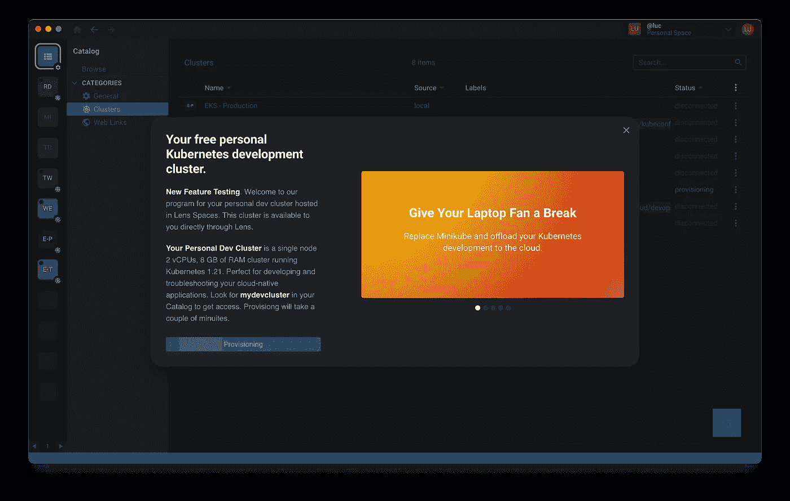

开发群集的设置正在进行

只需几分钟，群集就可以启动并运行。与此同时，您将大致了解一下集群特性及其特征。

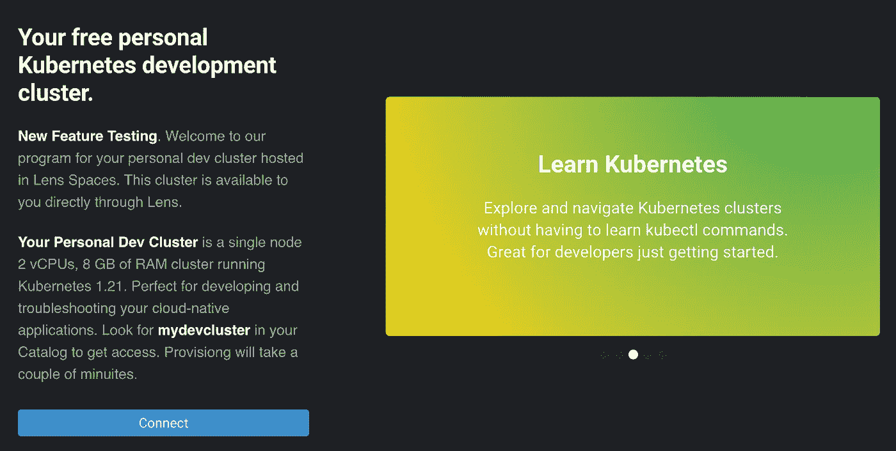

一个 2 vCPUs、8gb RAM 的单节点群集现已准备就绪，可以使用

配置完成后，您可以立即连接到集群，全面了解集群中发生的一切。

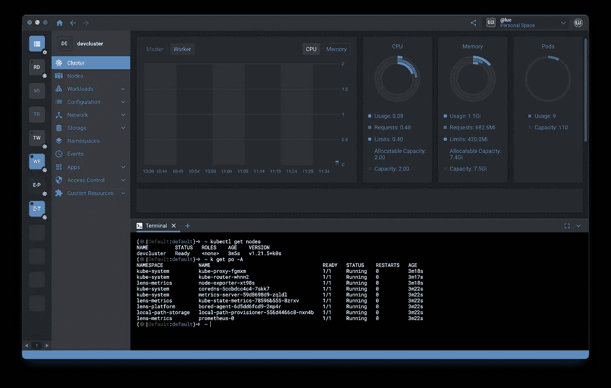

开发集群已准备就绪，并配备了监控单元

现在让我们在集群中运行一个新的工作负载。我们将使用以下命令创建一个简单的 [ghost 映像](https://hub.docker.com/_/ghost)和相关的服务:

```
**$ kubectl run ghost --image=ghost:4 --expose --port 2368**
service/ghost created
pod/ghost created
```

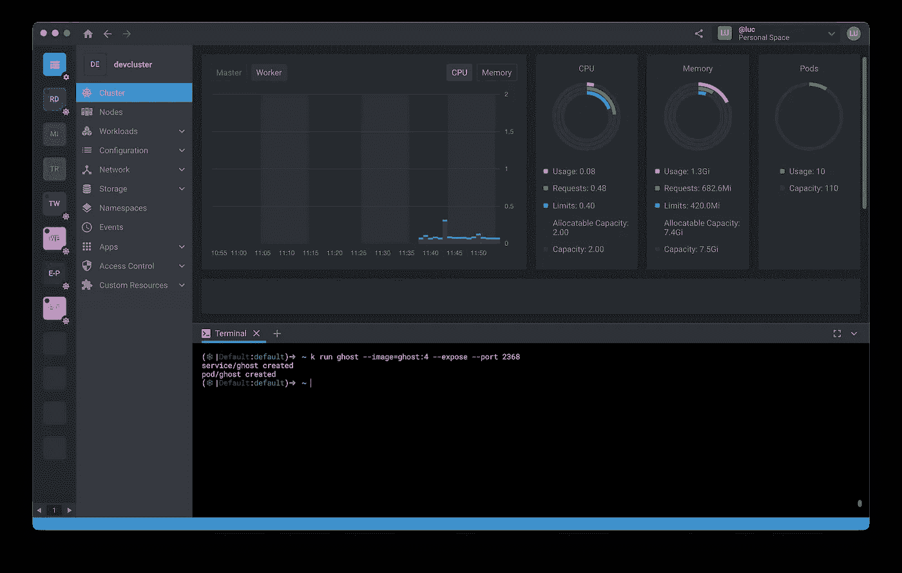

使用 Lens 集成终端在集群中运行工作负载

Dev 集群可通过安全的端到端隧道和加密经由 Lens Spaces 进行访问，并且不向外界公开。为了访问上面创建的服务，您需要运行端口转发。

```
$ kubectl port-forward svc/ghost 8080:2368
```

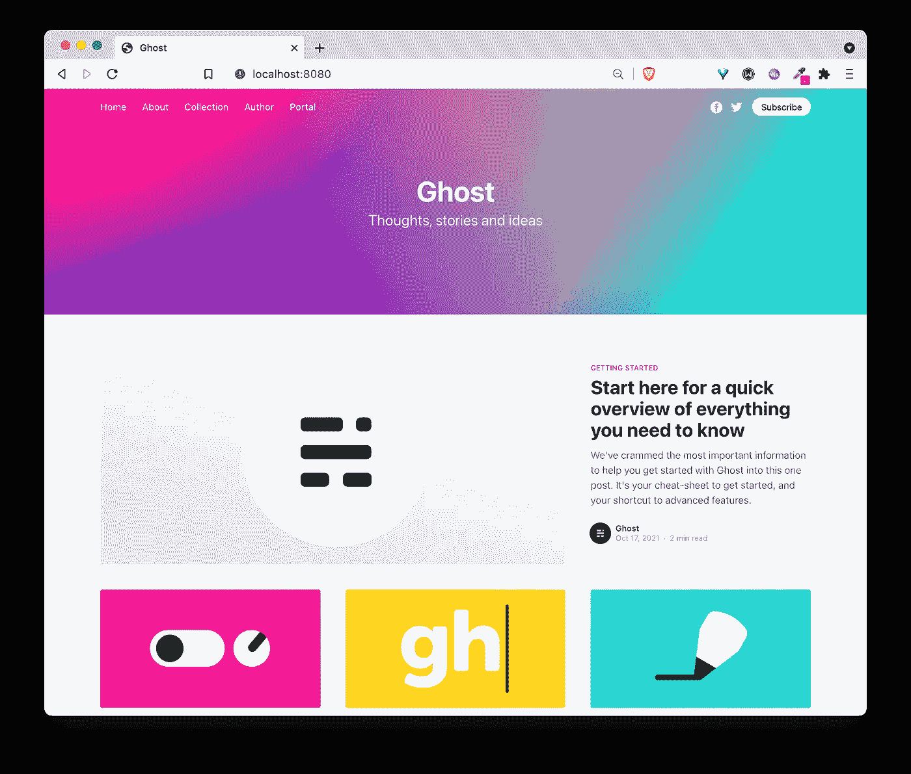

通过端口转发访问 ghost 服务

由于 Dev 集群位于您的个人镜头空间中，您可以轻松地与任何地方的团队成员共享该集群。可以通过用户名/电子邮件地址或可共享的链接进行共享。通过共享空间共享集群是一个很棒的功能，可以用于演示、调试和许多其他事情。

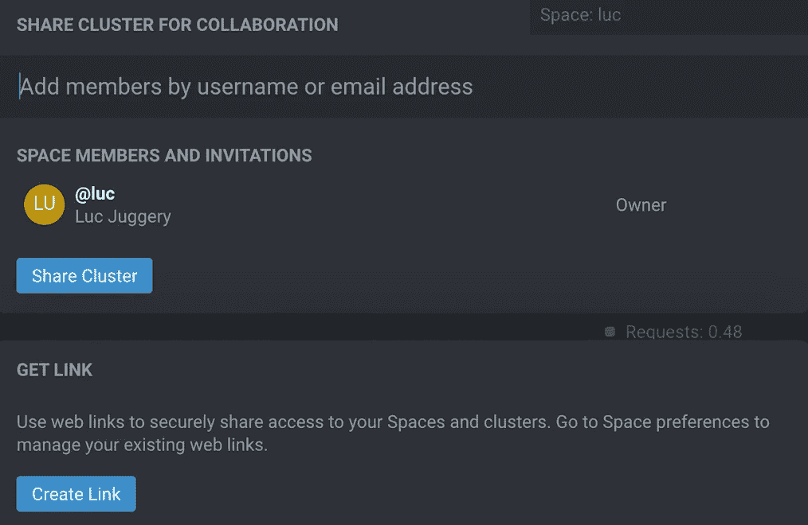

群集的共享选项可以为其他成员提供只读访问权限

另一方面(感谢 [Edward Ionel](https://medium.com/u/faaf6d0be397?source=post_page-----7491a1c76aca--------------------------------) 接受我的分享请求:)，新成员可以看到集群并在其中导航。

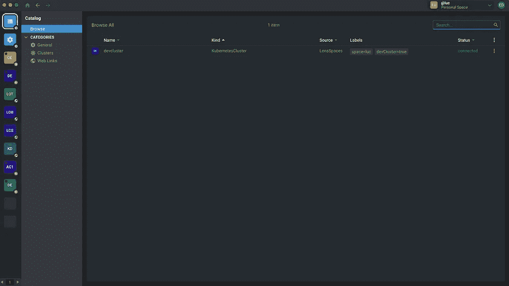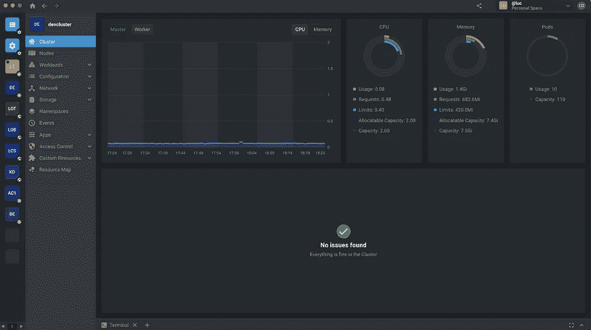

从新成员的角度查看集群

正如我们在下面看到的，幽灵舱也在那里。

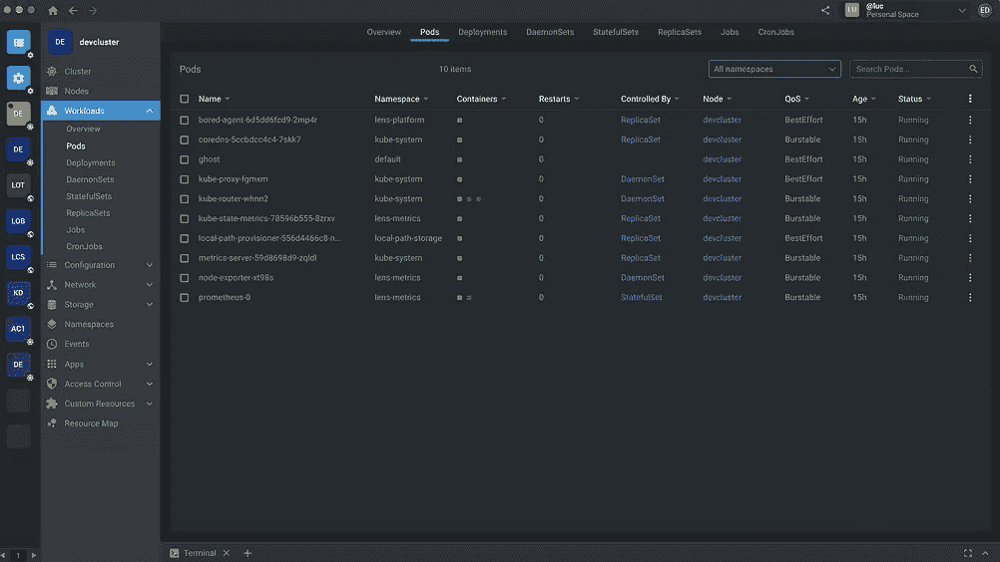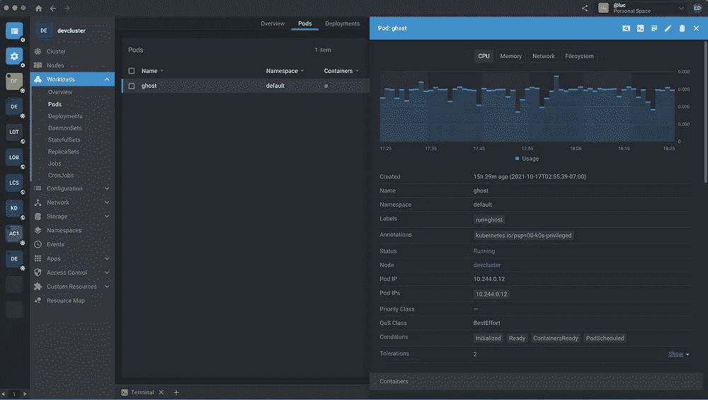

新成员看到的幽灵舱

这篇快速的帖子展示了如何通过 Lens 第一次访问 Dev 集群。这绝对是 Lens 的一大附加功能。我期待新功能的到来……:)