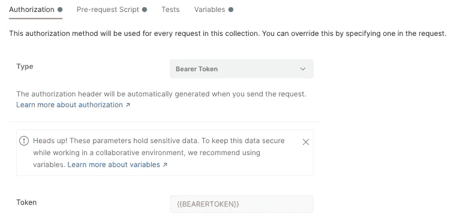
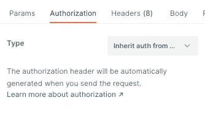

# 在 Postman / Newman 中自动获取集合的不记名令牌

> 原文：<https://itnext.io/getting-a-bearer-token-in-postman-newman-automatically-for-a-collection-d3001a0dc1ea?source=collection_archive---------0----------------------->

马库斯·斯皮斯克在 [Unsplash](https://unsplash.com?utm_source=medium&utm_medium=referral) 上的照片

我们的平台需要一个不记名令牌来对所有 API 进行认证。在正常的流程中，我们从前端 UI 获得这个令牌；然而，我希望能够执行一些自动化测试，这不涉及前端。

该团队创建了一个仅供内部使用的服务，它允许我通过编程获得一个带有用户名和密码(没有 2FA)的不记名令牌。这是该团队用于他们将要做的其他一些测试的，它完全符合要求。

现在我有一个 Curl 命令可以运行，这很棒，但只是一部分。

# 自动化邮递员

现在我有了一个获得令牌的方法，我想让它自动化，这样我就可以[通过纽曼在 GitLab CI/CD](/automating-api-testing-with-newman-1e5d0aabcec) 中运行收藏。为了实现这一点，我需要 Postman/Newman 能够自动获取这个令牌，然后在它的所有调用中使用它。

这正是“预请求脚本”的用途！让我们来看看如何将它添加到集合中。

在集合中，没有一个请求，您将需要设置 2 件事。

## 授权选项卡

在 Authorization 选项卡中，将类型设置为 Bearer Token，对于令牌 put 变量的值，我使用了{{BEARERTOKEN}}

## 预请求脚本选项卡

在“请求前脚本”选项卡中，这就是神奇的地方。在这里，我们将使用 Postman 用正确的参数调用我们的 API，解析响应并用不记名令牌设置一个变量。

当然你需要修改以适应你的需求，但是下面是对我有用的。我从 API 得到一个 JSON 响应，其中的令牌在 access_token 键中。

## 请求设置

现在您已经设置了这两项，您的每个请求和文件夹都需要设置为从父项继承身份验证。这将使用集合中的不记名令牌！

# 结论

现在，您已经自动授权您的 Postman 收藏，您可以通过 Postman 或 Newman 完全自动地运行您的收藏。这对于我的用例来说非常完美，因为每当团队在我们的开发或 QA Kubernetes 环境中构建和部署一个新的容器时，我都希望运行一个完整的 API 测试。因为我们使用 GitLab，所以我能够使用 Newman 容器并从那里运行集合。我将很快写下这个过程。

希望你觉得这有用，如果是这样，请鼓掌或分享出来。