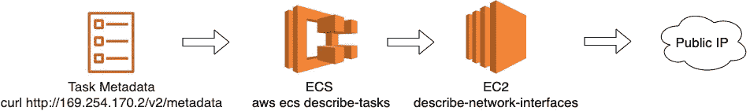
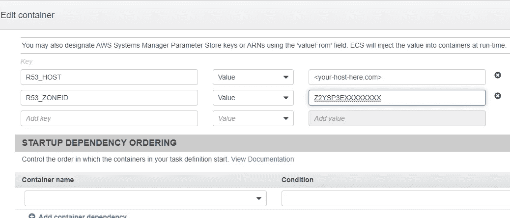

# 获取 ECS Fargate 容器的持久地址。

> 原文：<https://itnext.io/getting-a-persistant-address-to-a-ecs-fargate-container-3df5689f6e56?source=collection_archive---------1----------------------->

## 实用开发工具

## 应该很容易吧？其实不是。我是这样做的。

我的 ECS 容器在哪里？—[Jens Johnsson](https://unsplash.com/@jens_johnsson?utm_source=unsplash&utm_medium=referral&utm_content=creditCopyText)在 [Unsplash](https://unsplash.com/photos/hUqt9UQM_5Q?utm_source=unsplash&utm_medium=referral&utm_content=creditCopyText) 上的照片

因此，我们有一个 EC2 实例，它的寿命比自己长，[密钥丢失了(在这里阅读我们如何恢复内容)](/breaking-in-to-a-ec2-instance-c01443f61ce9)并且需要替换它。

与其为它重新安装一个全新的 EC2 服务器，我想，嘿，为什么不做一个小的 docker 容器并在 Fargate 上部署它，这应该足够简单了，对吧？

事实证明，实际上有两个复杂的问题，其中一个我将在这里讨论，另一个是另一篇文章的主题:[提示，它将涉及使用 l](/stay-in-control-with-your-private-npm-registry-f7d1d4791698) 锁定/冻结注册表的字节安全。

另一个挑战，乍一看，似乎微不足道。

维克多·加西亚在 [Unsplash](https://unsplash.com?utm_source=medium&utm_medium=referral) 上拍摄的照片

我只需要为运行 Statsd 应用程序的 ECS Fargate 容器保留相同的公共地址。正如人们可能猜测的那样，这个地址在我们的整个环境中使用，在大量的服务和应用程序中配置。不断改变配置测试将是一场噩梦。

不幸的是，使用内部 IP(这对于这样的服务来说完全有意义)是不可能的，因为服务需要从多个 VPC 可达，而由于 IP 重叠，没有 VPC 对等的可能性。

现在，在你们大喊“使用 AWS ECS 服务发现”之前，我只想指出…该服务目前不适用于公共 IP，仅适用于内部 IP。如果您一直读到这里，请在下面的链接中为添加 ECS 功能投票😃

> 很遗憾，ECS 服务发现目前不发布公共 IP，仅发布内部 IP…

 [## [ECS][请求]:公共 IP 服务发现问题# 737 AWS/containers-路线图

### 机构群体注意事项请通过添加👍对原始问题的反应，以帮助社区和…

github.com](https://github.com/aws/containers-roadmap/issues/737) 

但是，在 AWS 的好人们添加这个功能之前，请继续阅读。

因此，我们要做的是让 ECS 在每次 docker 容器启动时用公共 IP 地址更新 Route53。这样，我们可以在我们的应用程序和服务中使用服务的 DNS 名称。

(是的，我以前就有一个)bert sz 在 [Unsplash](https://unsplash.com?utm_source=medium&utm_medium=referral) 上拍摄的照片

环顾四周，我已经看到了该解决方案的一些不同变体，但我得到的最接近的是部署一个 Lambda 函数，该函数由 ECS 生命周期中的状态变化触发。[像这个](https://medium.com/@andreas.pasch/automatic-public-dns-for-fargate-managed-containers-in-amazon-ecs-f0ca0a0334b5)或者[这个。对我来说，这样的解决方案有点...对我的用例来说臃肿。我想让我的溶液很好地，包含在…容器里。而不是开始使用(并支付)更多的服务。(使用 ALB/NLB 完成小型 ECS Fargate 任务的成本很容易超过实际 ECS 本身的成本)](https://medium.com/galvanize/static-ip-applications-on-aws-ecs-c7d411421d4f)

由于我有点守旧，我将使用 Bash 和 CLI 工具来完成这项工作。😁

我将从我的容器开始，它是[官方 Statsd 容器](https://github.com/statsd/statsd)，从那里我们将稍微修改我们的 docker 文件以安装 AWSCLI 包和 jq 工具，并添加定制脚本来准备和执行对 Route53 的 UPSERT。

我们还将利用 ECS 变量来了解要修改哪个 DNS 记录。这样，我们将能够使用不同的公共 IP 运行相同的容器，一个用于我们的测试环境，一个用于。生产等。

## Dockerfile 文件

我们将创建一个包装器脚本，并使用它来代替我们现有的入口点配置

启动 statsd 的未更改 docker 文件大致如下:

我们将把上面的入口点换成一个包装器脚本，它执行我们的 Route53 魔术，然后启动节点应用程序。同时，让我们添加我们的依赖项， **awscli** 和 **jq**

‼️注意你使用的是哪个版本的 awscli。我花了太多的时间来解决为什么我的容器没有像预期的那样运行。我第一次尝试使用 apt-get 来安装它，给了我一个旧版本，它没有失败，但在 API 响应中遗漏了一些元素。

Entrypoint.sh 很简单:

这是在**更新-route53.sh** 是我们的奇迹发生的地方。

1.  首先，我们调用任务元数据端点来获取当前的 TaskARN 和集群 ID。
2.  使用这些，我们调用 ECS API 来获取我们连接的网络接口(ENI)。
3.  最后，我们调用 EC2 API 来获取 ENI 的详细信息，即我们的公共 IP 地址。

当我们知道我们的公共 IP 时，我们使用 ECS 任务定义中提供的设置构建一个 UPSERT 记录并发送给 Route53 API。

以下是完整的更新-route53.sh:

## ECS 任务配置

现在，为了实现上述目标，我们需要一些额外的访问权限，以便能够从 API 获取信息并更新 Route53。

根据您的设置和安全需求，您可能希望下面的内容更严格一些。

**💡**在将下面的资源添加到您的 ECS 任务角色之前，不要忘记将其更改为 Route53 ZoneID

最后一步是配置 ECS 环境变量，这些变量将指示脚本修改哪个 Route53 区域以及创建或更新哪个 DNS 记录。

就是这样！现在，您可以重新启动 ECS 实例，一旦新容器启动，它将自动使用其公共 IP 更新 Route53 DNS 条目。