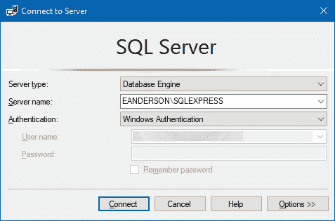
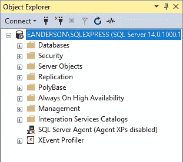
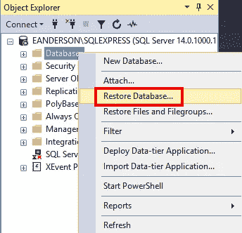
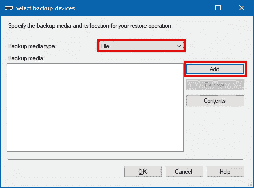
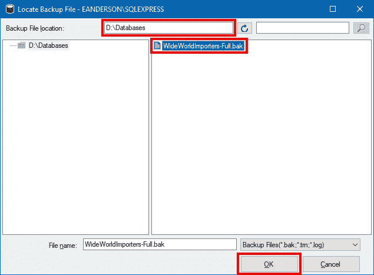
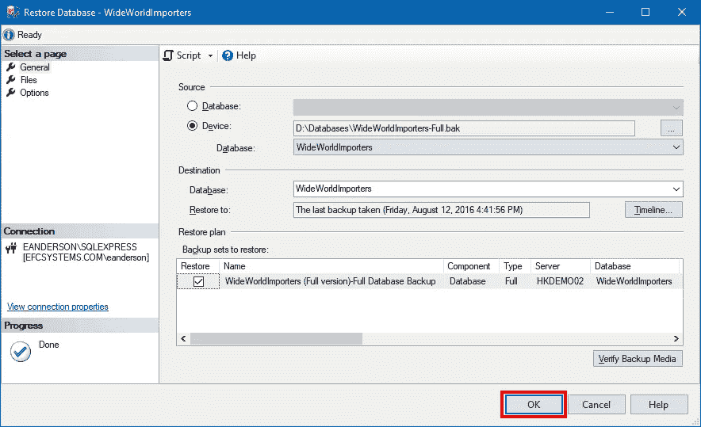
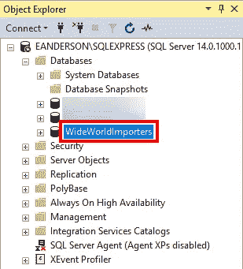
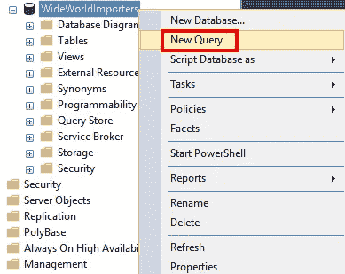

# 获取示例 SQL Server 数据库

> 原文：<https://itnext.io/getting-a-sample-sql-server-database-91f0a5a65c0d?source=collection_archive---------6----------------------->

正如经常发生的那样，这不是我今天要写的文章。前几天，我们在工作中遇到了一个问题，我想写下来，但是要这样做，我需要一个示例数据库(我不能使用工作中的数据)。我想要比我的普通单表联系人数据库更充实的东西。我在 google 上搜索 AdventureWorks，因为这是我经常在示例中看到的示例数据库。

## 选择

事实证明，AdventureWorks 并不是目前唯一的 SQL Server 示例数据库选项。微软有一个 [SQL Server Samples](https://github.com/Microsoft/sql-server-samples/tree/master/samples/databases) repo，根据你的需求有三个不同的选项。以下是对所有这些选项的描述和链接。

> [](https://github.com/Microsoft/sql-server-samples/blob/master/samples/databases/wide-world-importers)
> 
> **SQL Server 2016 和 Azure SQL 数据库的新示例数据库。它展示了 SQL Server 2016 和 Azure SQL 数据库的核心功能，适用于事务处理(OLTP)、数据仓库和分析(OLAP)工作负载，以及混合事务和分析处理(HTAP)工作负载。**
> 
> **[**contoso-数据仓库**](https://github.com/Microsoft/sql-server-samples/blob/master/samples/databases/contoso-data-warehouse)**
> 
> **说明将数据加载到 Azure SQL 数据仓库的示例数据仓库。**
> 
> **[**AdventureWorks**](https://github.com/Microsoft/sql-server-samples/blob/master/samples/databases/adventure-works)**
> 
> **用于 SQL Server 的示例数据库和 Analysis Services 模型。**

**因为我不是在处理数据仓库，所以中间的选择是不可能的。AdventureWorks 仍然是一个有效的选项，但我不能错过 WideWorldImporters，这是用于展示 SQL Server 2016 的最新示例。**

## **入门指南**

**确保您已经安装了 [SQL Server](https://www.microsoft.com/en-us/sql-server/sql-server-downloads) 和[SQL Server Management Studio](https://docs.microsoft.com/en-us/sql/ssms/download-sql-server-management-studio-ssms)。对于 SQL Server，我们将使用内部版本。我推荐使用[开发者版](https://go.microsoft.com/fwlink/?linkid=853016)，因为只要不在生产中使用，它就能免费提供全套功能。一旦你安装了以上两个软件，是时候下载数据库相关的文件了。**

**在撰写本文时，这个 [GitHub 发布页面](https://github.com/Microsoft/sql-server-samples/releases/tag/wide-world-importers-v1.0)包含了最新的入门信息，是的，是从 2016 年 6 月开始的。列出了很多选项，但是我们感兴趣的文件是[WideWorldImporters-full . bak](https://github.com/Microsoft/sql-server-samples/releases/download/wide-world-importers-v1.0/WideWorldImporters-Full.bak)。如果你正在寻找探索 SQL Server 2016 的一些新功能，你也应该抓住 [sample-scripts.zip](https://github.com/Microsoft/sql-server-samples/releases/download/wide-world-importers-v1.0/sample-scripts.zip) 来玩，但这不在这篇文章中讨论。**

## **还原数据库**

**现在我们已经有了要恢复的数据库的备份，是时候打开 SQL Server Management Studio 了。在“连接”对话框中，连接到您希望数据库终止的服务器。在本例中，我连接到在本地 PC 上运行的 SQL Server 实例。当你全部设置好后，点击**连接**按钮。**

****

**连接后，您应该会在**对象资源管理器**窗口中看到所选的服务器。**

****

**右键单击**数据库**文件夹(或者您喜欢的节点)，然后单击**恢复数据库**。**

****

**这将启动还原数据库对话框。这个对话框充满了内容，但是我们将把重点放在从备份文件恢复数据库所需的最少内容上。首先，选择**设备**选项，然后点击 **…** 按钮。**

****

**这将显示“选择备份设备”对话框。我们要使用**文件的**类型然后点击**添加**按钮。**

****

**在下一个屏幕上，您需要输入备份文件的路径。我不知道为什么，但这不是查找文件的最简单的对话框。我发现使用 Windows 资源管理器更容易找到备份文件所在的目录，并将其复制到**备份文件位置**。选择正确的目录后，选择备份文件并点击**确定**。**

****

**回到**选择备份设备**对话框，点击**确定**按钮继续。这将使您回到**恢复数据库**对话框，该对话框将显示所选备份的信息。点击**确定**按钮开始恢复过程。**

****

**大约一分钟后，恢复过程应该完成。如果您在**对象资源管理器**窗口中展开**数据库**节点，您应该会看到列出了恢复的数据库。**

****

## **数据生成**

**WideWorldImporters 数据库附带了一个存储过程，它将生成当前数据供您使用。这不是一个快速的过程，所以如果您决定运行它，请做好等待的准备。右键单击并选择**新建查询**，为 WideWorldImporters 数据库打开一个新的查询窗口。**

****

**如果您运行以下查询，它将启动数据生成过程。**

```
EXECUTE DataLoadSimulation.PopulateDataToCurrentDate
    @AverageNumberOfCustomerOrdersPerDay = 60,
    @SaturdayPercentageOfNormalWorkDay = 50,
    @SundayPercentageOfNormalWorkDay = 0,
    @IsSilentMode = 1,
    @AreDatesPrinted = 1;
```

**官方文件有更多关于数据生成的细节。从文件来看，它说数据生成每年需要大约 10 分钟，从 2016 年开始，所以你看到的是 30 分钟的最低运行时间(根据我的测试，每年 10 分钟的数字太低了)。请注意，备份会附带数据，因此只有在您需要最新数据时才需要此过程。**

## **包扎**

**上面的过程并不难，但是如果你像我一样，没有怎么做过数据库备份，希望这篇文章对你有所帮助。我相信您会发现示例数据库对于尝试 SQL Server 的一些新功能或者对于可以公开使用的数据源很有帮助。**

**请务必查看全球进口商的[官方文档页面](https://docs.microsoft.com/en-us/sql/samples/wide-world-importers-what-is)。它有更多的信息以及对其他工作负载用例(如数据仓库)的说明。**

***最初发表于* [*埃里克·安德森*](https://elanderson.net/2018/09/getting-a-sample-sql-server-database/) *。***