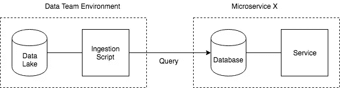
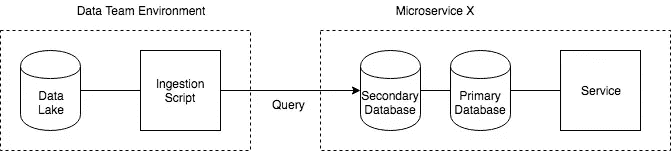
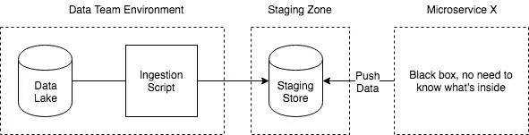

# 从微服务获取数据到数据湖—第 1 部分:从数据库

> 原文：<https://itnext.io/getting-data-to-data-lake-from-microservices-part-1-from-databases-d5e55c4a0829?source=collection_archive---------1----------------------->

假设您有几个服务协同工作来服务一个业务。您的每个服务在一个域或有界的上下文中都有明确的职责。现在，作为一个数据团队，您希望将您的数据放入数据湖，以便能够对其进行处理，无论是为了洞察(仪表板/报告)，还是为了支持其他计划，如基于机器学习的用例。

现在你质疑自己。*如何将数据放入数据湖？*这篇博文将以数据库为数据源。

# 显而易见——从数据库接收数据

一个显而易见的替代方法是将数据从数据库复制到您的数据湖中。最简单的方法是安排一个脚本，比如每小时或每天。该脚本将从数据库中查询数据，然后将数据写入您的数据湖。

问题解决了？

等一下……对于将这种方法作为长期解决方案，您需要注意的一件事是:*真的，直接访问生产数据库吗？如果查询导致数据库负载过高，降低了服务质量，该怎么办？*

首先也是最重要的，它违背了拥有微服务架构(或任何面向服务的架构)的目的。拥有微服务意味着除了拥有数据库的服务之外，不能从外部访问数据库。通常数据团队是*而不是*等同于服务的所有者，这使得情况变得更糟。

避免服务降级风险的一个解决方案是针对读取副本或辅助实例进行查询。但是如果数据库所有者决定改变数据模型会发生什么呢？如果服务所有者决定改变数据库技术并进行迁移，会发生什么？如果选择的数据库不支持辅助/读取副本功能，该怎么办？此外，如果数据库与您的数据湖位于不同的专用网络中，如何访问数据库？更不用说暴露数据库带来的安全问题了。

如果你处于创业的早期阶段，基本上每个人都拥有一切，那么这种方法可能适合。但是当你的组织越来越大的时候，事情就变得棘手了。

# 将数据推送到临时区域

将数据转移到 data lake 的更有利于微服务的方式是要求每个微服务所有者将他们的数据推送到一个暂存区。你可以把这个中转区想象成一个 SFTP 服务器、S3 / GCS 桶或者任何可以用来存放数据的临时地方。因此，数据团队不应该担心每个团队使用什么数据库，是否可能有副本，或者如何访问数据库。

对于每个微服务，最好将暂存区分开。微服务所有者将拥有写入权限。但是数据组只有阅读的权限。这样我们就能确保角色的清晰划分。

这意味着每个微服务的所有者都有责任提供数据。从组织的角度来看，这也是一种风险。微服务所有者通常将此视为次要责任，有时并未真正全力监控并确保流程在商定的 SLO 内顺利进行。

数据团队和微服务所有者必须就这种依赖性达成一致，并就如何进行日常操作达成一致。还需要进行定期的运营审查，以查看每个微服务是否真正履行了完整、及时地放置数据的责任。

另一个需要考虑的问题是，每个微服务所有者必须自己构建从数据库查询并写入暂存区的脚本。数据团队可以通过提供库、框架，或者至少是关于如何查询和向临时区域写入数据指导，来帮助减轻这种低效率。除此之外，数据格式标准化也很重要。

# 其他方式

我还听说过其他几种方法:

*   使用 CDC(变更数据捕获),这是一种非常特定于数据库的方法，对于具有各种数据库的微服务可能不太适用。在这两者之间还缺少一个风险日志。这种解决方案的一些例子是用于 Postgres 的[bottle water](https://github.com/confluentinc/bottledwater-pg)，用于 Oracle 的 GoldenGate 等。如果你需要一个接近实时的数据滞后，这是合适的
*   每次数据处理直接查询数据库。Imho 完全不推荐。数据湖将获取数据和处理数据分开。它还有点像一个“缓存”,所以我们不应该每次想要处理数据时都去打扰生产数据库。
*   听过另一个吗？让我知道！！！

# 问题解决了？还没有…点击流怎么样？

点击流或日志通常不存储在数据库中，并且具有不同的挑战。

敬请期待下一篇博文！

*免责声明:此处表达的观点仅代表我个人，不代表我雇主的观点。*