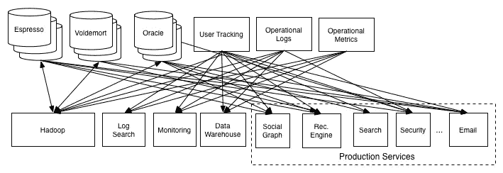
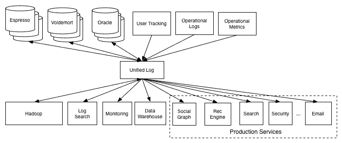
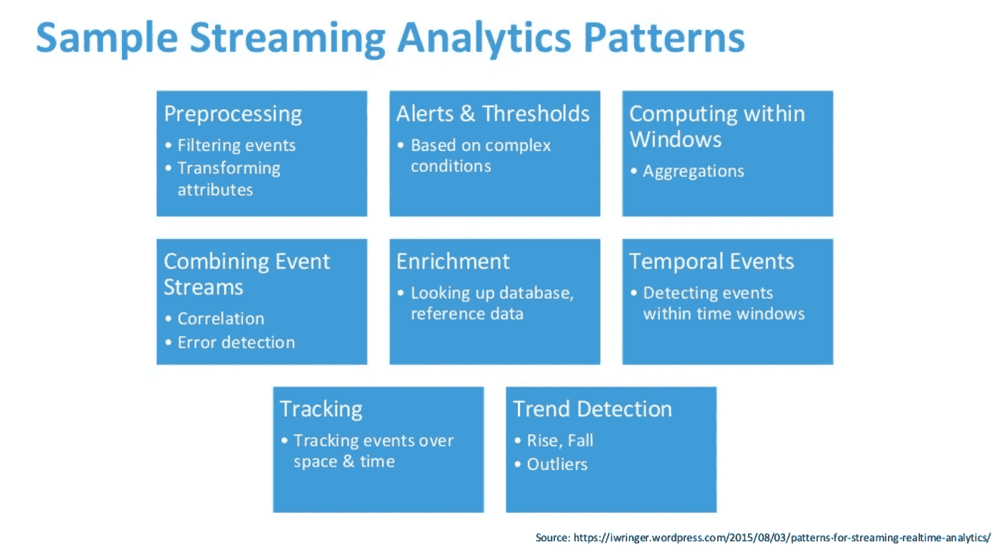

# 从微服务获取数据到数据湖—第 2 部分:日志或点击流

> 原文：<https://itnext.io/getting-data-to-data-lake-from-microservices-part-2-the-logs-or-clickstream-e91fa7461867?source=collection_archive---------2----------------------->

*这是“从微服务获取数据到数据湖”系列的第 2 部分，第 1 部分检查* [*从微服务获取数据到数据湖—第 1 部分:从数据库*](https://medium.com/@rendybjunior/getting-data-to-data-lake-from-microservices-part-1-from-databases-d5e55c4a0829) *。*

有些数据根本不存储在数据库中，而是被视为日志。通常这是因为没有必要将活动保持为一种状态来使应用程序功能正常工作。例如，Amazon 没有理由在事务数据库中存储关键字 user searched，但是它必须存储添加到购物车中的商品，以便用户可以继续结帐。

具体到电子商务领域，有一个术语叫做*点击流*，基本上是指用户在浏览器中的每一次点击。点击流通常非常重要，可以了解转化率如何，我们做得好不好。例如，如果用户添加到购物车，但很少进行结账，这意味着购物车到结账的转化率很低，在特定的步骤中有问题，可能很难进行支付或什么的。

> 日志可能是最简单的存储抽象。这是一个只附加的、完全有序的记录序列，按时间排序

*日志插图(图片取自博客)*

以上引用是我认为描述日志的最佳方式。摘自[著名博客](https://engineering.linkedin.com/distributed-systems/log-what-every-software-engineer-should-know-about-real-time-datas-unifying)关于日志的概念以及 LinkedIn 为何打造 Kafka。

现在回到我们的主要话题，*如何将日志数据放入数据湖？*

# 显而易见——聚合现有日志

我们再次从显而易见的开始。让我们以一个基于网络的电子商务为具体例子。通常对于基于 web 的电子商务，它使用类似 nginx 的负载平衡器作为努力的一部分，以使前端水平可伸缩。通常，工程师会将所有 http 请求记录到日志文件或集中的日志系统中。

另一个例子是您的服务记录几个级别的行为:信息、警告、错误。通常，您会将它们记录到文件或集中式日志记录系统中，如 CloudWatch Log 或 Stackdriver。

如果已经有了这种日志，最简单的方法就是立即将日志放入数据湖。您可以使用许多日志聚合器，如 Apache Flume 或 Talend。然而，使用日志聚合器有几个问题:

*   数据以不同的格式出现，有时它只是一个简单的日志，每行都很难解析
*   没有明确的合同，如果日志格式改变，那么我们将有另一个维护成本
*   每个服务都需要安装代理，将日志聚集到集中日志系统

为了避免与格式及其变更相关的问题，如果您能够在整个组织内标准化日志，将会非常有帮助。一种非常有效的格式是 JSON(该文件需要很好地压缩，JSON 冗长且解析成本高)。

等等，还有其他选择吗？

# 微服务主动将活动推送到统一日志

Jay Kreps 在我上面提到的博客文章中提出的统一日志概念，现已被证明是必备架构的一部分。它被许多公司采用，甚至云巨头也创建了自己的统一日志，如 AWS Kinesis。

统一日志简化了体系结构，避免了多对多依赖性灾难，如下所示

统一日志:之前(图片取自博客帖子)

敬这个。

统一日志:之后(图片取自博客帖子)

这种替代方案并不能解决聚合日志的所有问题，但是请原谅我，这种设计有更多的优点。

基本上每个微服务都会主动将数据推送到这个统一的日志中，以约定的格式发布。其他系统可以订阅日志并做他们想做的任何事情。发布者和订阅者都同意每个日志流的特定模式。

在这种情况下，我们想要的是订阅统一日志，并将数据写入我们的数据湖。为了做到这一点，我们可以安排一个从统一日志中批量读取数据并将其写入数据湖的作业。以 Apache Kafka 作为统一日志的例子，我们可以使用 Spark 流定期将数据写入数据湖。或者我们可以为这项工作使用一些更具体的东西，如[goblin](https://github.com/apache/incubator-gobblin)。其他托管服务的替代品是 GCP PubSub 或 AWS Kinesis。

流用例，摘自 [spark meetup 幻灯片](https://www.slideshare.net/punesparkmeetup/spark-meetup-stream-processing-use-cases)

这种统一日志的强大之处在于，它支持实时数据处理。这就是为什么它被广泛采用，事情变得越来越快，现在的业务需要实时处理和决策。以欺诈检测为例，我们需要能够尽快检测到模式，以便在欺诈发生时采取正确的措施。另一个用例是进行趋势分析，以便我们可以实时检测异常。

# 统一日志的详细信息

使用统一日志概念比聚合日志更好。然而，在采用这种方法时，需要解决一些细节问题:

*   **它需要高度可用和高性能**，我们引入统一日志作为我们架构的核心，这意味着它需要是一个非常有弹性的组件。
*   **了解你的数据需求**(性能、完整性、准确性等)，以便确定你需要什么样的承诺:最多一次，至少一次，或者正好一次。为了在高负载下实现高性能，一次承诺的成本要高得多。
*   **了解客户图书馆的行为很重要。从客户端的角度来看，将数据发送到统一日志不应该花费太多精力。为了实现这一点，通常客户端不会为每条记录发送数据，而是缓冲到一定量，最终刷新到统一的日志。这是很好的性能，但也有数据丢失的风险，比如说，如果数据在缓冲区中，并且没有正常关闭(关闭前刷新)，将会有数据丢失。**
*   **集中式架构**，这是必须的，这样我们才能确保订阅者始终能够读取和处理发布者发送的数据。让数据无模式化意味着未来的灾难，就像断了线的用户。
*   **统一日志即服务**，要考虑的一件事是要有一个在物理上包装统一日志的服务。好处是我们可以将微服务从对物理存储的依赖中分离出来，例如 Kafka。但是它引入了开销，更不用说服务需要惊人的可伸缩性和高可用性。

# 数据库接收与日志

如果您仔细考虑，数据库上的更改也可以被视为日志。以此为例，假设在一个电子商务中，我们在购物车中保存物品的状态，状态如下:ADDED _ TO _ CART→payed→DELIVERED。实际上，我们也可以把它作为一个日志:1)添加到购物车日志，2)支付日志，3)交付日志。通常数据库也以日志的形式存储对数据库的操作，以 Postgres 为例。

我的观点是，无论是从数据库获取的数据，还是点击流，都可以存储为日志。然而，对于来自数据库摄取的数据，需要重新设计才能做到。一种方法是将[观察器](https://sourcemaking.com/design_patterns/observer)放在写入数据库的部分代码中。这种模式通常被称为[事件源架构模式](https://martinfowler.com/eaaDev/EventSourcing.html)。

当采用这种模式时，有几件事情需要考虑，但是最重要的一点总是归结为数据的正确性。我们如何确保作为状态存在于数据库中的数据与作为日志存在于数据湖中的数据的完整性。

总结一下，主要有两种方法可以将数据放入数据湖，要么从数据库中提取数据，要么将数据从微服务主动推送到统一日志中。理想情况下，我们应该能够将所有数据视为日志。然而，它伴随着复杂性，需要根据具体情况进行处理。

免责声明:此处表达的观点仅代表我个人的观点，不代表我雇主的观点。