# 使用 C#获得功能

> 原文：<https://itnext.io/getting-functional-with-c-6c74bf279616?source=collection_archive---------0----------------------->

随着 C#的成熟，它一直在采用函数式编程的元素。正如我之前讨论过的，在许多情况下，C#继续与 TypeScript 和 JavaScript 融合。

我有一个小的 repo，在那里我与 C#的更多功能方面分享了我的一些实验:

 [## GitHub-Charlie digital/js-ts-cs harp:一个展示 C# 10 函数技术的资源库…

### 这个库旨在突出 C#中可用的各种功能技术。点击此处阅读更多内容…

github.com](https://github.com/CharlieDigital/js-ts-csharp) 

[受 Reddit 帖子](https://www.reddit.com/r/csharp/comments/ups0y4/can_i_store_functions_in_a_list_but_when_i_call/)中一个问题的启发(你可以在那里看到我的原始回复)，让我们来看看这个实验室的最新成员。

## 使用 Lambda 表达式

为了方便起见，我们可以通过创建 [lambda 表达式](https://docs.microsoft.com/en-us/dotnet/csharp/language-reference/operators/lambda-expressions)到“alias”`Console.WriteLine`来开始我们的实验:

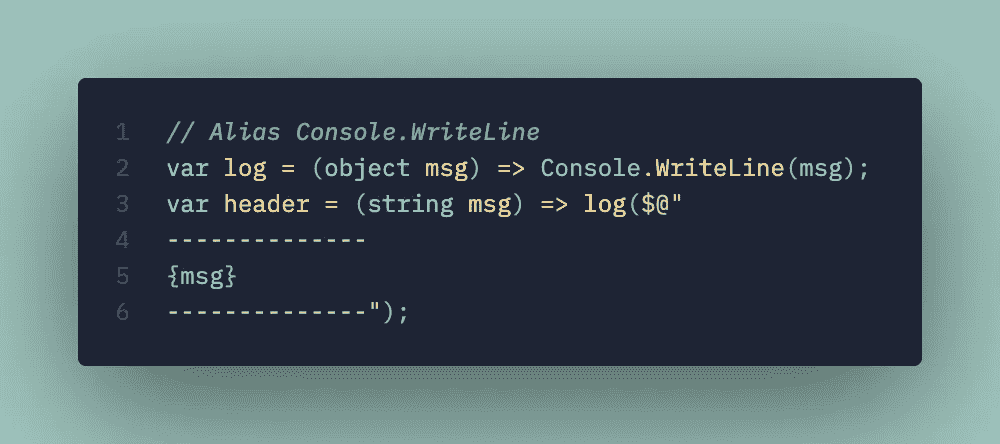

这是减少代码中视觉混乱的一个非常方便的方法。我在引号中使用“alias ”,因为我们所做的只是编写一个名为`log`的函数，但是使用 lambda 表达式和局部函数使它更加简洁。

## Lambda 表达式列表

我们的第一个例子是一个简单的函数数组。我们可以遍历数组，用我们的输入调用每个函数:

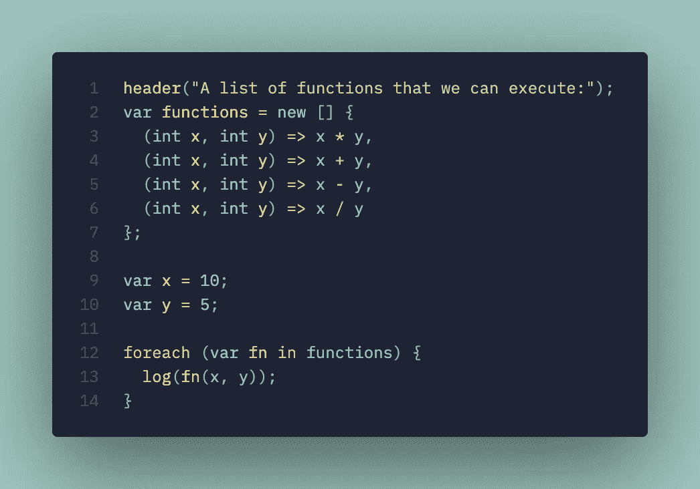

***用例*** :验证器，当运行不同的计算来比较不同算法的结果时，快速而肮脏的轻量级[责任链](https://refactoring.guru/design-patterns/chain-of-responsibility)。

## 命名 Lambda 表达式

我们还可以通过将函数放入字典中，将它们命名为字符串:

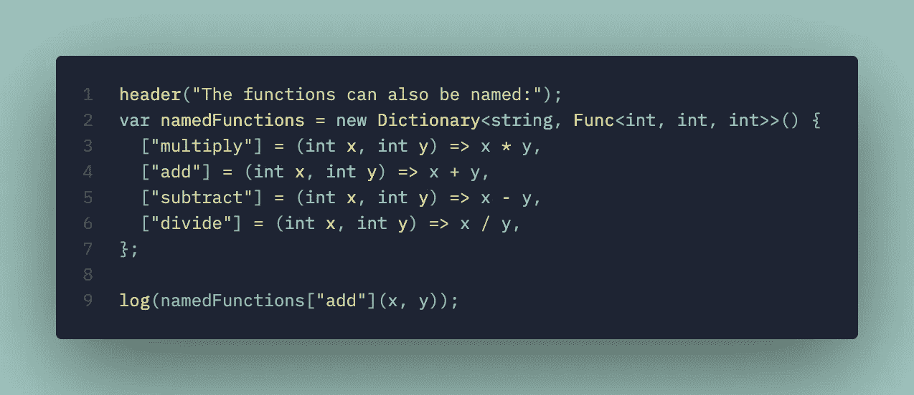

这看起来应该与任何编写 JavaScript 或 TypeScript 的人非常相似(尽管在 C#中有点冗长，因为编译器无法推断出`namedFunctions`的类型，因为 C#有不止一个字典类型( *idea* ):我们能让它默认为`Dictionary<string,string>`吗？那就太棒了。)

***用例*** :通过使用字符串索引器代替属性上的反射，用一个更有性能的选项替换反射。

## Lambda 表达式的引用

我们还可以使用 lambda 表达式的引用列表:

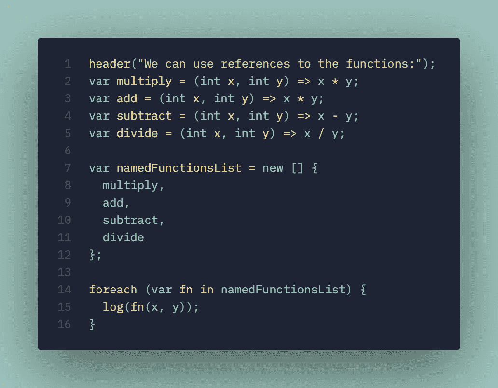

## 接受任意数量的参数

利用 [LINQ](https://docs.microsoft.com/en-us/dotnet/csharp/programming-guide/concepts/linq/) ，我们可以接受任意数量的参数:

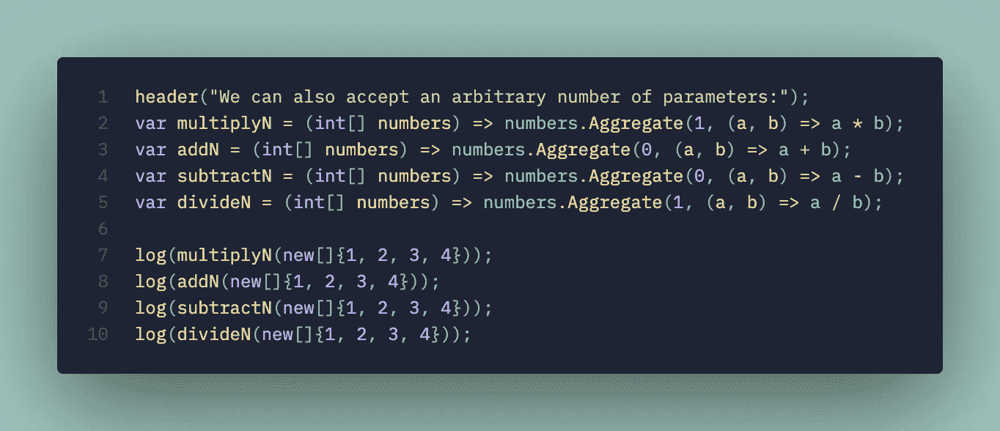

## 用另一个 Lambda 表达式包装

我们可以将 lambda 表达式的列表包装在另一个 lambda 表达式中:

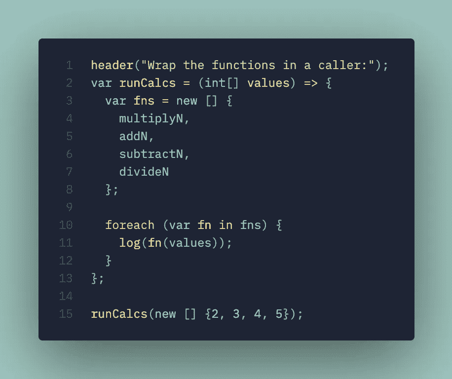

## 在字典中返回结果

我们可以将结果作为一个字典返回，如果我们通过 JSON 与前端接口，这个字典会很有用:

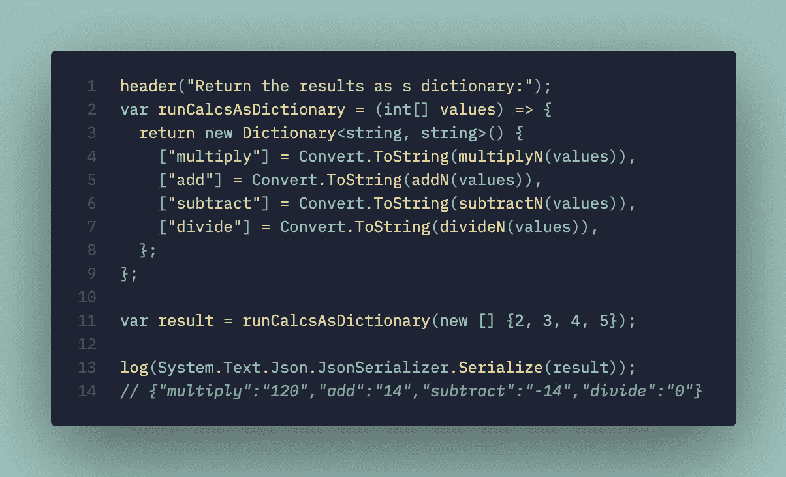

***用例:*** *动态生成 JSON 结果到一个前端，验证你想要的地方有一个键值标识哪个验证器失败。*

## 以元组的形式返回结果

我们还可以将结果作为一个元组:

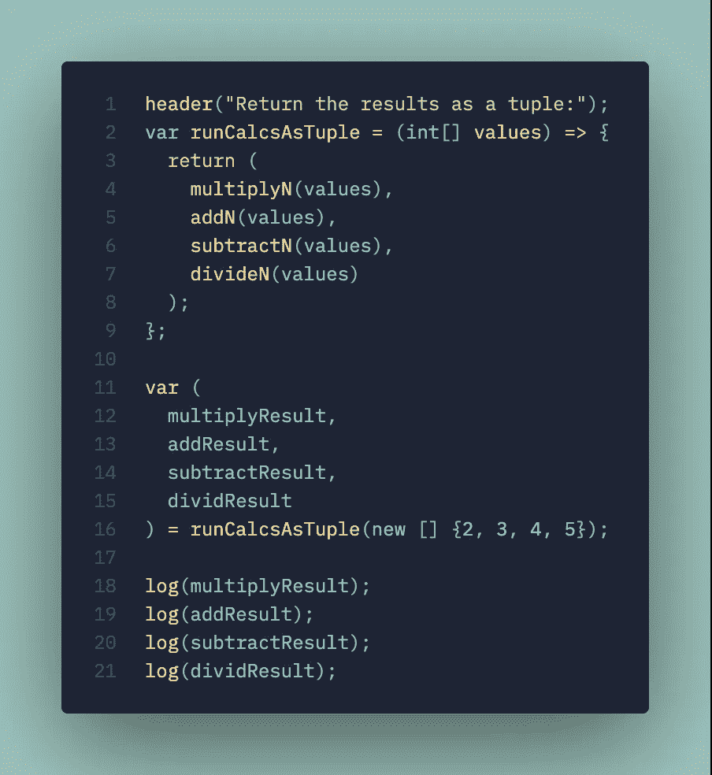

## 按参数数量执行

使用 C# [开关表达式](https://docs.microsoft.com/en-us/dotnet/csharp/language-reference/operators/switch-expression)，可以根据参数数量选择输出:

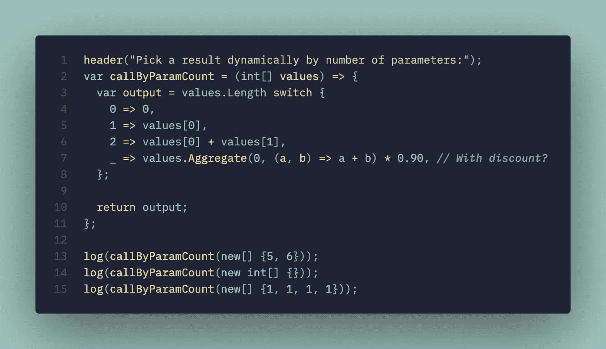

我真的很喜欢 switch 表达式的表现力，事实上，虽然它远比替代方案更紧凑，但它似乎没有失去任何可读性；我认为这实际上改善了它。

## 参数和λ表达式的数量

我们甚至可以将开关表达式与 lambda 表达式结合起来:

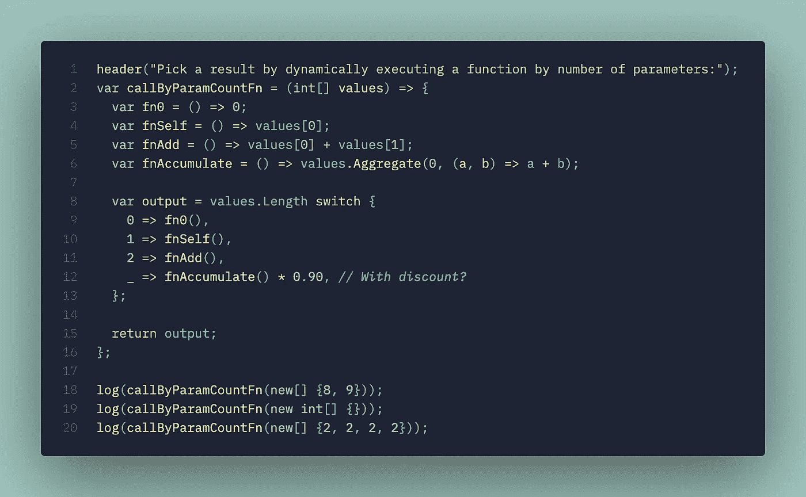

## 模式匹配开关表达式与内联 Lambda 表达式

或者将这些相同的 lambda 表达式与 switch 表达式内联:

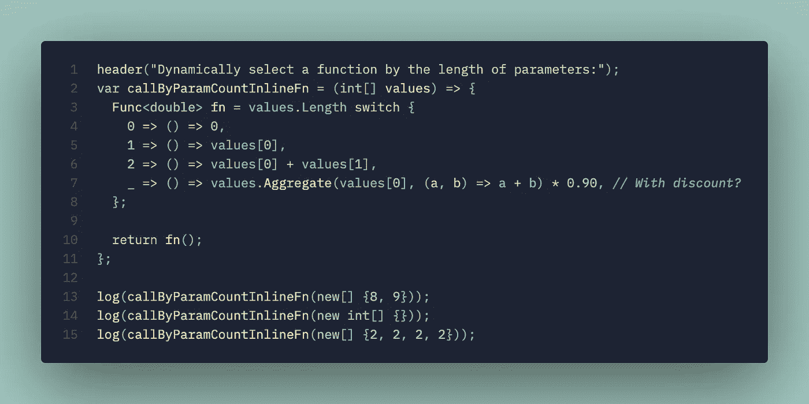

## 通过参数类型执行 Lambda

关于 switch 表达式，我最喜欢的一点是，我们甚至可以通过类型进行切换，并在一个简洁的语句中进行赋值:

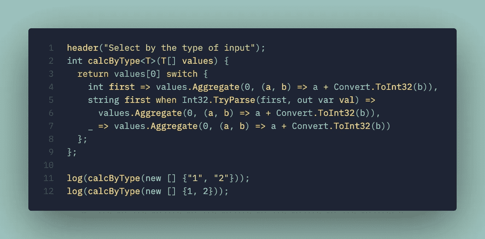

[Tim Deschryver 有一组很好的例子来说明 C#](https://timdeschryver.dev/blog/pattern-matching-examples-in-csharp) 中的模式匹配是多么有趣。到目前为止，这是 C#最好的特性之一！

我希望这个小实验室能激起你探索 C#更多功能的兴趣。许多 C#开发人员要么没有意识到这些特性，要么主动回避语言的这些特性🤣。对我来说，这些是一些最有趣的语言特性，switch 表达式是任何语言中最通用的表达式之一(至少是我使用的语言！).

lambda 表达式和局部函数的一个最好的用途是它可以简化调用，否则你将需要来回传递额外的参数。换句话说，如果您有一个带有参数(A，B，C)的入口函数，它可能会调用一个需要(B，C， *D 【T11， *E* )的辅助函数，其中 D 和 E 是在入口函数中计算的。使用 lambda 表达式和局部函数允许您捕获作用域，而不必在函数中有重叠的参数集(有时，那些帮助函数并不真正配得上它们自己的顶级方法！).*

看看 repo 和 ***包含了 C#和*** 更多的功能方面。网！