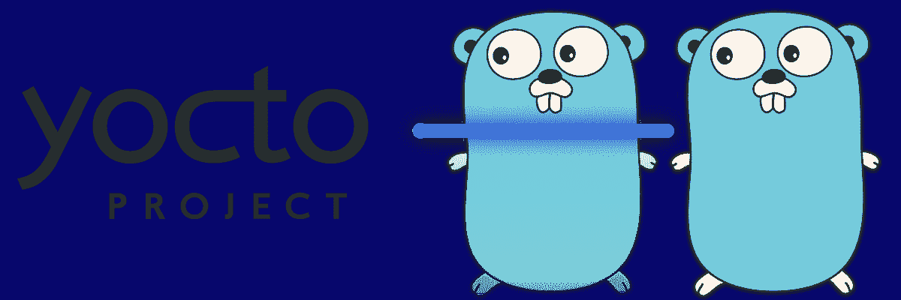
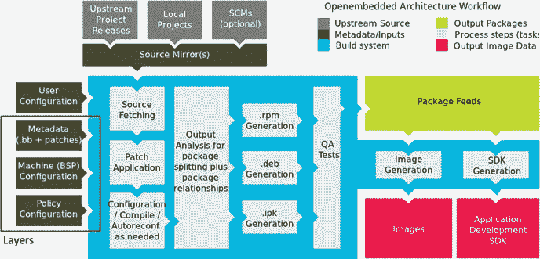

# 走向物联网

> 原文：<https://itnext.io/getting-go-onto-internet-things-582396ff2760?source=collection_archive---------6----------------------->

如何使用 Yocto 为嵌入式 Linux 目标编译 Go 代码



大量生产地鼠

Go 主要被认为是创建高性能云应用程序的语言。开发者可能忽略的是，Go 对于开发物联网设备来说也很棒。其高效处理请求的能力、易于开发、合理的内存占用以及与 C 良好接口的能力，使其成为物联网项目中 Java、C++或 Python 的绝佳替代品。

对于大多数 Go 开发者来说，在瞄准物联网设备时，最大的挑战不是编写代码，而是编译代码。有几种技术可以用来交叉编译，所有这些技术都需要向 Go 编译器传递不同的标志。嵌入式目标的有限磁盘空间也可能激励开发人员选择非传统的二进制架构，例如启用链接库，这会使构建标志更加复杂。出于这些原因，对于来自编译“刚刚工作”的云平台的开发人员来说，Go embedded 编译可能会特别令人沮丧。

在这篇文章中，我将解释如何通过使用 Yocto 构建系统来简化物联网嵌入式主板的 Go 编译。我将首先回顾一下我为什么选择 Yocto，以及它是如何工作的。我不会深入讨论如何为一个板设置 Yocto 开发环境，因为这通常是由制造商或开源社区提供的。相反，我将关注如何通过创建 Yocto 输入文件类型:bitbake recipes 来编译 Go 代码。这将通过展示一个非常简单的方法来完成，该方法将编译[官方 Go 项目示例](https://github.com/golang/example)，然后检查 Yocto 从中生成的输出。接下来，我将介绍一些在 go 菜谱中定制的公共参数，以定制一个构建。然后，我将介绍一些可能需要在特殊情况下使用的更高级的围棋食谱类型。最后，我将简要讨论一下我使用 Yocto 编译 Go 经验。

# 为什么要用 Yocto 交叉编译？



Yocto 环境——在 [Yocto Mega 手册](https://www.yoctoproject.org/docs/2.4.2/mega-manual/mega-manual.html)中有更多解释

有许多构建系统旨在帮助自动交叉编译，但是没有一个像 Yocto 那样同时迎合新手和专业人士。它非常受片上系统/模块/板制造商的欢迎，并且也支持爱好嵌入式板( [BeagleBone 板](http://www.jumpnowtek.com/beaglebone/BeagleBone-Systems-with-Yocto.html)和 [Raspberry Pi](http://www.jumpnowtek.com/rpi/Raspberry-Pi-Systems-with-Yocto.html) )。Yocto 的工作原理是将构建 Linux 映像的过程分解成组件，并允许通过“bitbake recipes”为每个组件提供适应性编译指令(Yocto 使用的主要工具称为 bitbake)。配方获取关于目标的信息，并编译使用它们的指令，以生成映像(OS+应用程序)或部署包(apt-get、dnf、yum 等)。).为了简化配方的创建，有配方库、bitbake 类和包含文件，它们极大地简化了特定语言的编译。最近 Yocto 版本，Rocko onward，通过这样的库扩展了对 Go 的支持。结果是，一个 10 行的 bitbake 方法可以让 Go 应用程序在 Yocto 支持的数百块板上构建。

# 基本的默认配方

以下是用于 [Go 示例项目](https://github.com/golang/example)的 bitbake 工作配方。本节将解释它是如何被创建的，以及它所控制的一些基本编译机制。该配方确实需要一个额外的配方用于`golang/x`库，该配方在**高级配方**部分给出并解释。一旦两个文件都在 Yocto 搜索路径中，那么就可以构建 Go 示例项目了。

## 创建基本围棋程序

```
//github.com-golang-example.bb                                                                                                                           DESCRIPTION = "The Go Example Project"SRC_URI = "git://github.com/golang/example.git;protocol=https;"
SRCREV = "${AUTOREV}"
LICENSE = "Apache-2.0"
LIC_FILES_CHKSUM = "file://${WORKDIR}/${PN}-${PV}/src/${GO_IMPORT}/LICENSE;md5=3b83ef96387f14655fc854ddc3c6bd57"DEPENDS += "golang.org-x"inherit go
GO_IMPORT = "github.com/golang/example"
```

Go bitbake 配方文件是根据某些指南命名的。 [Yocto/Go 社区](https://blog.gopheracademy.com/advent-2015/go-in-a-yocto-project/)想出了一个主意，通过用“`-`”替换“`/`”，使文件名尽可能地反映 Go 导入字符串，以简化依赖性管理。关于文件名是否应该在 Go 导入路径中保留顶级域，存在一些分歧，因此这可能不在其他开发人员的配方文件名中。对于 Go 示例项目，Go 导入路径应该是`github.com/golang/example`，因此配方文件名应该是`github.com-golang-example.bb`。

简单配方包含几个字段，这些字段并不是 Go 配方所独有的，它们与描述、源位置和许可证有关。描述字段是一个快速的简介，解释食谱的用途。`SRC_URI`和`SRCREV`字段是为了告诉 Yocto 在哪里可以找到源代码。在这种情况下，`SRC_URI`字段告诉 yocto 通过 https 使用 git 从 github 下载源代码，`SRCREV`字段有特殊的值`${AUTOREV}`,告诉 Yocto 从存储库头部获取。还可以定制这些字段，以选择代码的特定分支或提交，从而进行更严格的版本控制。Go recipes 中不同的一个默认行为是，代码不是下载到`${WORKDIR}/${PN}-${PV}/src/`，而是下载到`${WORKDIR}/${PN}-${PV}/src/${GO_IMPORT}` ，因为 GOPATH 是在`${WORKDIR}/${PN}-${PV}`创建的。许可字段`LICENSE`和`LIC_FILES_CHKSUM`传达许可文件类型、位置和校验和。在这个例子中，我们告诉 Yocto 许可证文件在克隆的 git 存储库中，并提供它的 MD5 校验和。如果您的项目没有标准许可证或根本没有许可证，那么用`CLOSED`替换`LICENSE` 字段值或在`${COMMON_LICENSE_DIR}`中找到一个类似的许可证。这些领域出现在大多数 Yocto 食谱上，所以如果有任何问题，那么 Yocto 上的通用教程应该会提供答案。

依赖关系也需要在配方中传达。这是通过向`DEPENDS`域添加其他配方名称来完成的。我们不能使用`go get`命令，所以我们必须用其他 Yocto 配方替换这个功能。虽然这可能很麻烦，但是食谱可以被其他包重用，从而更容易重用。对于我们的例子，Go Example 项目需要`golang-x`库。这些紧密耦合库的配方更高级，我将在**高级配方-多包配方**部分中介绍。目前，我们只需要知道这个配方的名称是`golang.org-x.bb`，并通过将`DEPENDS += "golang-x"`插入配方来添加它作为一个依赖项。

最后一步是添加 Go 配方库。`include go`语句继承了`go.bbclass`语句，后者添加了 Go 编译函数并在后台修改现有行为。这就是为什么菜谱使用`GO_IMPORT` 字段值将源代码下载到一个特殊的目录中。该语句还向我们的配方添加了其他特殊参数，我们将在后面的小节中探讨这些参数。

## 构建和结果

假设您已经激活了 Yocto 环境，构建这个项目非常简单。首先，确保`github.com-golang-example.bb`和`golang.org-x.bb` 位于 Yocto 可以找到它们的目录中(如果遇到问题，将它们放在其他可用的`bb` 文件旁边会有帮助)。接下来，如果项目之前已经构建过，您可能需要使用命令`bitbake -c cleanall github.com-golang-example`删除旧的工件。然后运行命令`bitbake github.com-golang-example`开始主要构建。这将自动构建`golang-x` 库以及 Go 编译所需的所有其他工具。

在编译过程中，Yocto 将尝试编译代码，然后打包进行部署。编译器标志由配方抽象，以及什么二进制文件放入什么包中。通常包类型是 RPM，但也可以是其他格式。在成功的标准构建之后，您应该能够在`<YOCTO-DIR>/tmp/deploy/rpm` 目录中找到包含配方名称`github.com-golang-example` 的 rpm。名称以`github.com-golang-example-1.0-r0` 开头的 RPM 包含主要应用程序，可以使用`dnf`或`rpm`安装到您的目标上。

```
Error:
 Problem: conflicting requests
  - nothing provides go-runtime >= 1.9.4 needed by github.com-golang-example-1.0-r0.cortexa7hf_neon
```

当你试图安装这个 RPM 时，你可能会得到上面的错误。原因是 Go 应用程序的默认 bitbake 编译器配置在`shared`模式下生成二进制文件，并将它们链接到`go-runtime` 库。你可以在这里阅读更多关于共享构建模式[的信息。这可能是为了减少嵌入式目标的二进制大小，以便许多 Go 应用程序都可以共享运行时。`go-runtime-1.9.4` RPM 应该在您找到主应用程序 RPM 的同一个文件夹中，并且可以在没有任何其他依赖的情况下安装。在安装了`go-runtime`包之后，你应该能够正确无误地安装主 RPM，并且所有生成的二进制文件都将被放置在`/usr/bin`中。](http://blog.ralch.com/tutorial/golang-sharing-libraries/)

# 其他生成的 rpm

除了包含已编译的 Go 应用程序的 RPM 之外，还有四个默认生成的 RPM。我将简要回顾一下这些 rpm 的用途，以及它们在我们的示例项目中包含的内容。

## pTest RPM— `github.com-golang-example-ptest-1.0-r0`

缺省情况下，Go bitbake 方法创建一个 rpm，其中填充了与一个包相关联的已编译 Go 测试。如果你安装了这个 rpm，你可以通过进入`/usr/lib`中的相应目录并运行`run-ptest`来运行所有的测试。下面是正在运行的 ptest 的一个示例:

```
:~# /usr/lib/github.com-golang-example/ptest/run-ptest
=== RUN   TestIsTagged
--- PASS: TestIsTagged (0.02s)
=== RUN   TestIntegration
--- PASS: TestIntegration (0.04s)
PASS
=== RUN   TestReverse
--- PASS: TestReverse (0.00s)
PASS
PASS: github.com-golang-example
```

## 开发速度— `github.com-golang-example-dev-1.0-r0`

静态开发 RPM 包含所有用于开发的源文件，并将它们安装到一个`/usr/lib/go`中。这可以作为控制源的另一种方法。在 Go 示例项目中，静态开发 RPM 将安装:

```
/usr/lib/go/src/github.com/golang/example/LICENSE
/usr/lib/go/src/github.com/golang/example/README.md
/usr/lib/go/src/github.com/golang/example/appengine-hello
/usr/lib/go/src/github.com/golang/example/appengine-hello/README.md
/usr/lib/go/src/github.com/golang/example/appengine-hello/app.go
/usr/lib/go/src/github.com/golang/example/appengine-hello/app.yaml
/usr/lib/go/src/github.com/golang/example/appengine-hello/static
...
...
...
/usr/lib/go/src/github.com/golang/example/stringutil/reverse_test.go
/usr/lib/go/src/github.com/golang/example/template
/usr/lib/go/src/github.com/golang/example/template/image.tmpl
/usr/lib/go/src/github.com/golang/example/template/index.tmpl
/usr/lib/go/src/github.com/golang/example/template/main.go
```

## dbg RPM — `github.com-golang-example-dbg-1.0-r0`

DBG 包包含生成的应用程序和测试的调试符号。调试符号可由`gdb`至[主动调试 Go 代码](https://golang.org/doc/gdb)使用。对于 Go 示例项目，dbg RPM 将安装:

```
/usr/bin/.debug/defsuses
/usr/bin/.debug/doc
/usr/bin/.debug/gotypes
/usr/bin/.debug/hello
/usr/bin/.debug/hugeparam
/usr/bin/.debug/implements
/usr/bin/.debug/lookup
/usr/bin/.debug/nilfunc
/usr/bin/.debug/outyet
/usr/bin/.debug/pkginfo
/usr/bin/.debug/skeleton
/usr/bin/.debug/template
/usr/bin/.debug/typeandvalue
/usr/lib/github.com-golang-example/ptest/github.com/golang/example/outyet/.debug/outyet.test
/usr/lib/github.com-golang-example/ptest/github.com/golang/example/stringutil/.debug/stringutil.test
/usr/src/debug/github.com-golang-example/1.0-r0/build/src/github.com/golang/example/outyet/main.go
/usr/src/debug/github.com-golang-example/1.0-r0/build/src/github.com/golang/example/outyet/main_test.go
/usr/src/debug/github.com-golang-example/1.0-r0/build/src/github.com/golang/example/stringutil/reverse.go
/usr/src/debug/github.com-golang-example/1.0-r0/build/src/github.com/golang/example/stringutil/reverse_test.go
```

## 静态设备转速— `github.com-golang-example-staticdev-1.0-r0`

staticdev RPM 包含包中使用的编译好的 Go 库。这些可以用来加速编译。对于 Go 示例项目，这个 RPM 将安装:

```
/usr/lib/go/pkg/linux_arm_dynlink/github.com/golang/example/appengine-hello.a
/usr/lib/go/pkg/linux_arm_dynlink/github.com/golang/example/stringutil.a
```

# 修改基本配方

## 生成单个非链接的可执行文件

缺省情况下，Go bitbake 配方会生成链接到 Go 运行时库的应用程序。这可能会使部署和依赖性管理变得复杂。出于这些和其他原因，您可能希望让 Yocto 将 Go 应用程序构建为完全包含的应用程序的默认二进制类型。为此，只需将`GO_LINKSHARED = ""`添加到食谱中。结果是主 RPM 将具有相同的名称，但是不需要安装`go-runtime` rpm。

## 范围构建

默认情况下，尝试在一个项目中构建所有可能的产品。这是通过在 Go 导入字符串的末尾向 Go 编译器发出`...`参数来实现的。当您只想编译一个库而不是相关的命令时，这可能会很麻烦。为了防止这种情况，您可以通过改变配方中的`GO_INSTALL`字段来确定构建的范围。例如，要将构建范围限定在顶层目录中的包，您可以在 recipe 中输入`GO_INSTALL = "${GO_IMPORT}”`。

## 禁用测试

有时，测试需要额外的包，或者还没有准备好在目标环境中运行，开发人员希望不要构建它们。要告诉 Yocto 不要构建测试，您可以将`PTEST_ENABLED="0"`添加到配方中。这将防止产生`ptest` rpm。

# 高级食谱

## 多包食谱— Golang.org-X 库

有些 Go 包与其他包耦合得如此紧密，以至于最好将它们组合到一个 Yocto 菜谱中。最常见的例子是`golang-x` 库。它们是许多围棋项目所需要的，也是相互依赖的。以下是多包 bitbake 配方，将导入所有`golang-x`配方，以确保满足依赖性。

```
//golang.org-x.bb
DESCRIPTION = "Go X libraries"SRC_URI = "\
         git://github.com/golang/net.git;protocol=https;name=net;destsuffix=${PN}-${PV}/src/golang.org/x/net \
         git://github.com/golang/text.git;protocol=https;name=text;destsuffix=${PN}-${PV}/src/golang.org/x/text \
         git://github.com/golang/tools.git;protocol=https;name=tools;destsuffix=${PN}-${PV}/src/golang.org/x/tools \
         git://github.com/golang/crypto.git;protocol=https;name=crypto;destsuffix=${PN}-${PV}/src/golang.org/x/crypto \
         git://github.com/golang/sys.git;protocol=https;name=sys;destsuffix=${PN}-${PV}/src/golang.org/x/sys \
         "
 SRCREV_text = "${AUTOREV}"
 SRCREV_net = "${AUTOREV}"
 SRCREV_crypto = "${AUTOREV}"
 SRCREV_tools = "${AUTOREV}"
 SRCREV_sys = "${AUTOREV}"LICENSE = "MIT"
 LIC_FILES_CHKSUM = "file://${COMMON_LICENSE_DIR}/MIT;md5=0835ade698e0bcf8506ecda2f7b4f302"inherit go
 GO_IMPORT = "golang.org/x"
```

这个食谱在几个方面不同于基本的围棋食谱。首先，所有给定的`SRC_URI` 值都有两个额外的参数:`name` 和`destsuffix`。`name` 参数用于将源标识为子包的一部分。`destsuffix` 参数是告诉 Yocto 手动将源文件放在哪里。这是必需的，因为每个包都有自己的`GO_IMPORT`值，所以我们不能依赖默认行为。下一个区别是每个子包都有自己的`SRCREV` 字段。现在它们都被设置为从它们相应的库的头部拉出来，但是这可以用来单独地对它们进行版本控制。最后一个区别是引用的`LICENSE` 不在存储库中，而是内置在 Yocto 中。这并不是多包方法所独有的，只有在这种情况下才需要，因为库有一个非典型的许可(Go 许可)。

## Cgo 食谱— github.com-mattn-go-sqlite3

> 交叉编译时，必须指定一个 C 交叉编译器供 cgo 使用。— cgo GoDoc

Cgo 从两个方面使 Yocto 食谱变得复杂。第一种方式是，当交叉编译时，go 编译器必须被明确告知 cgo 正在被使用，而不像传统的 Go 编译那样只是指出这一点。要在 Yocto 中做到这一点，必须将`CGO_ENABLED = "1"`添加到配方中。第二种方式是必须考虑 C 的依赖性。这包括库，也可能包括链接器标志，具体取决于代码中的 cgo 指令。库通常是通过`DEPENDS`将它们的配方作为依赖项添加进来的。链接器标志由`LDFLAGS`处理，值就像 gcc 参数一样给出(例如:pthread 库的`LDFALGS = "-lpthread”`)。Yocto 还设置了许多其他标志，总体来说，Yocto 极大地简化了 cgo 交叉编译。

```
//github.com-mattn-go-sqlite3.bb
DESCRIPTION = "The mattn SQLite3 Go Library"
GO_IMPORT = "github.com/mattn/go-sqlite3"inherit goDEPENDS="sqlite3"SRC_URI = "git://github.com/mattn/go-sqlite3.git;protocol=https;"
SRCREV = "${AUTOREV}"
LICENSE = "MIT"
LIC_FILES_CHKSUM = "file://${S}/src/${GO_IMPORT}/LICENSE;md5=2b7590a6661bc1940f50329c495898c6"CGO_ENABLED = "1"
```

# 讨论

Yocto 已经真正开始在围棋开发方面取得进展。在 Rocko 版本之前，有几个不同版本的 Go 配方库正在使用，所有这些都需要在使用它们的 Go 配方中设置不同的选项。这意味着很难为每个人都可以使用的依赖关系创建配方。在 Rocko 和更高版本中，Yocto 已经标准化了 Go 菜谱库，并极大地扩展了它们的功能。总的来说，它使得编译过程变得非常容易。

Yocto 和 Go 目前的一个不足之处是依赖性管理。没有一个包含 Go 软件包配方的中央存储库，尽管现在使用 Go 标准配方库应该更容易创建。理想情况下，一旦 Go 开始用`vgo`标准化版本控制，Yocto 的配方就可以通过编程生成。同时，食谱写作并不困难，所以即使一个项目需要 10 个包，你通常可以在一个小时内写完。虽然有点烦人，但 Yocto 提供的功能远不止这些。