# 获取 Google OAuth2 客户端 ID 和客户端密码

> 原文：<https://itnext.io/getting-google-oauth2-client-id-and-client-secret-24eb698dfee4?source=collection_archive---------6----------------------->

# 1.在谷歌云控制台中创建一个项目

如果你已经有一个谷歌云项目，你可以跳过这一步。

前往你的[谷歌云控制台](https://console.cloud.google.com)。确保您登录了正确的 Google 帐户。如果你从来没有去过控制台，谷歌会提醒你一些条款和条件。按照指示，你将到达仪表板。进入仪表板后，点击导航栏中的**选择项目**下拉菜单。

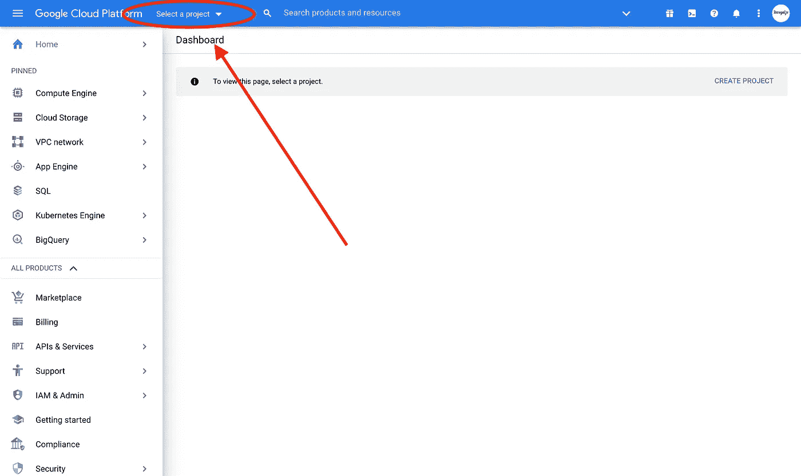

接下来，点击一个 N **ew 项目**

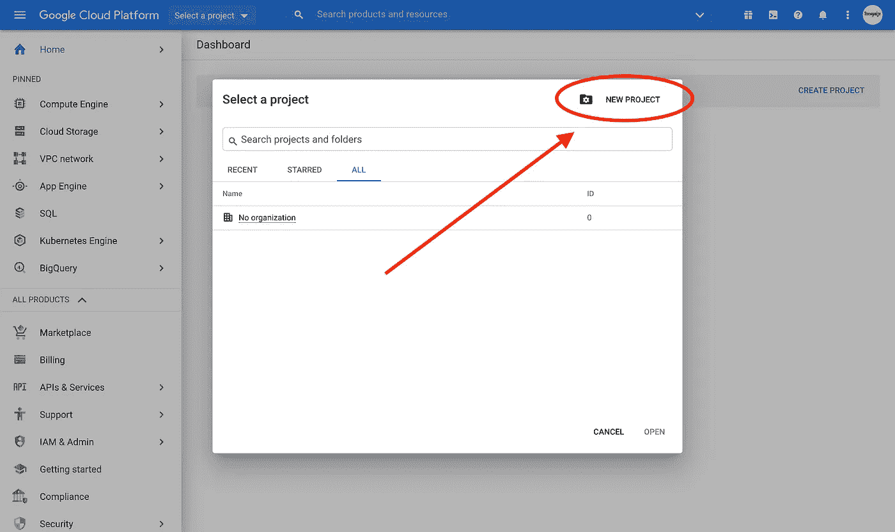

输入项目的详细信息，然后单击**创建**

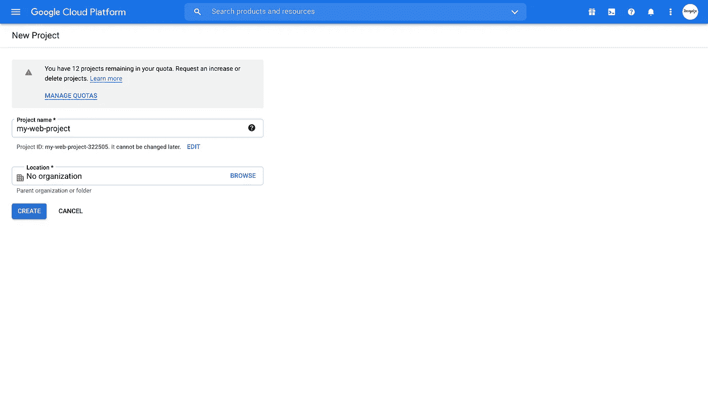

# 2.配置同意屏幕

项目完成后，您将看到项目仪表板。现在从侧边栏中，点击 **API &服务**，并从下拉菜单中选择**凭证**。如果你没有看到侧边栏，点击汉堡包图标。

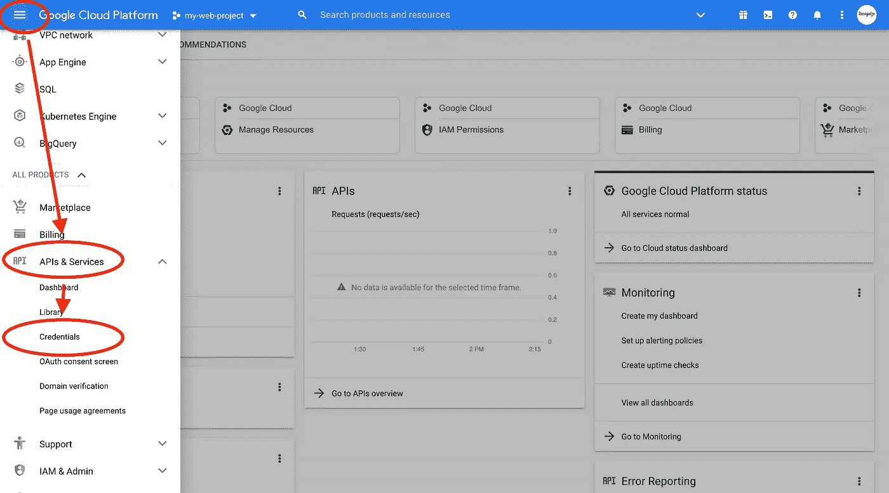

进入 API & Services 的凭证部分后，点击**配置同意屏幕**。

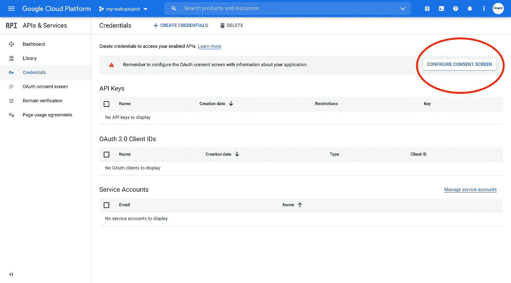

在下一页，选择**外部**点击**创建**。

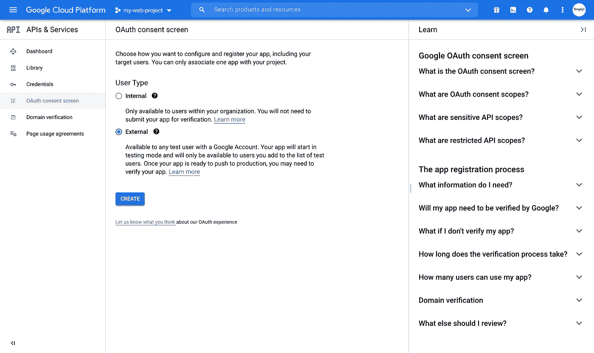

在下一页—填写以下详细信息。您只需提供必填字段的详细信息，然后点击**保存并继续**。

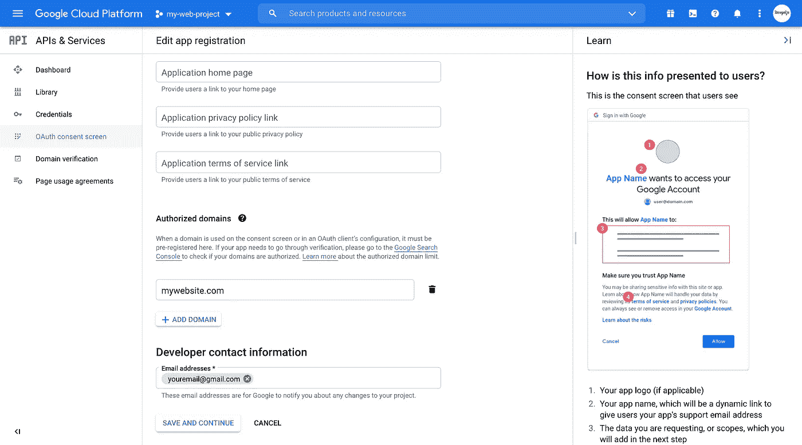

在下一个屏幕中，您需要选择您需要的范围。点击**添加或移除范围**并选择前 3 个范围。这些是非敏感范围，不需要私有用户数据。保存设置并继续。

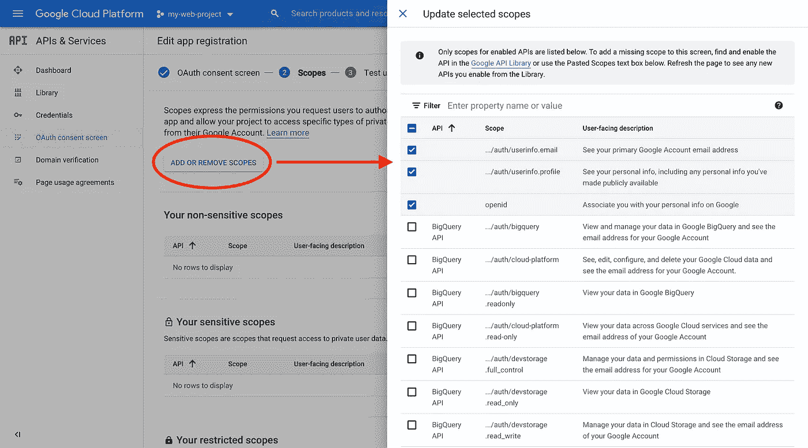

下一个屏幕将显示**测试用户**设置。在开发过程中，您可以使用此功能仅对某些用户进行测试。对于本例，我们将跳过这一步，继续进行**总结**。按照说明继续，我们将到达完成的同意屏幕。点击**发布应用**。

# 3.创建 **OAuth 客户端 ID**

现在，我们已经完成了同意屏幕，回到凭据部分。

点击**创建凭证**并选择 **OAuth 客户端 ID** 。

在下一页上，添加详细信息。确保根据您自己的域和开发设置添加授权的 Javascript 源和授权的重定向 URIs。在实现 Google 认证时，授权重定向 URI 也被称为**回调 URI** 。

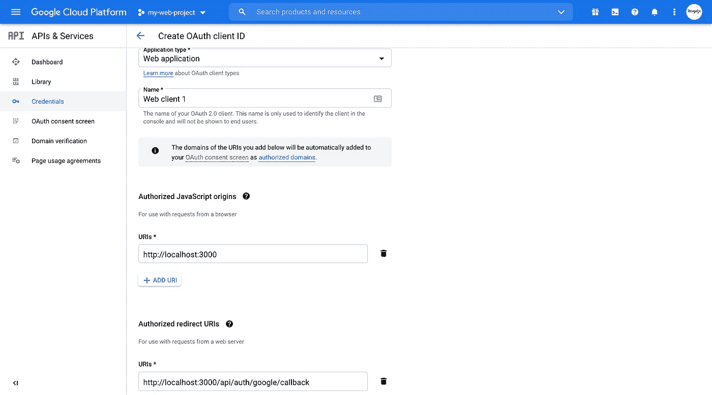

点击**创建**即可！将出现一个弹出窗口，显示您可以在应用程序中使用的 Google 客户端 ID 和 Google 客户端密码。

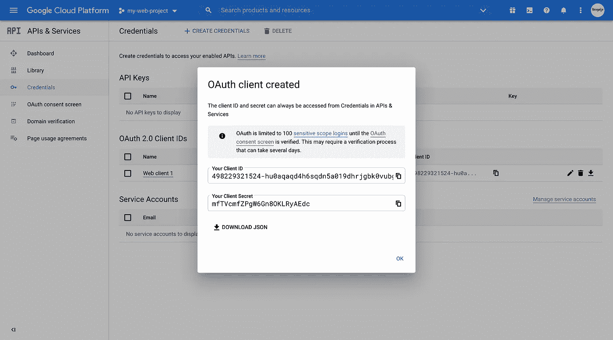

如果您需要再次获取凭证，您可以随时返回到项目的 API 和服务的凭证部分。您创建的所有凭据都将在此列出。单击任何凭据名称。

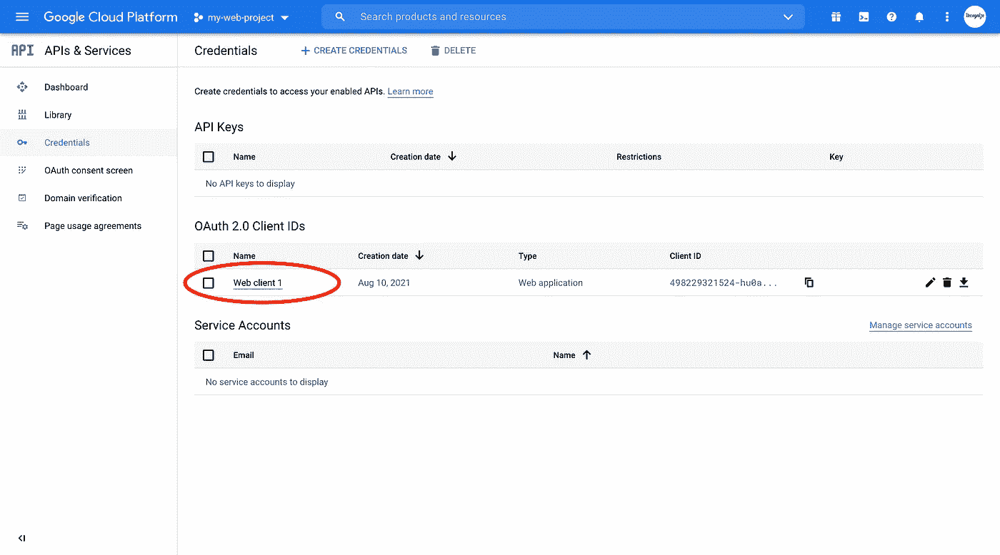

您的凭据将列在右上角。

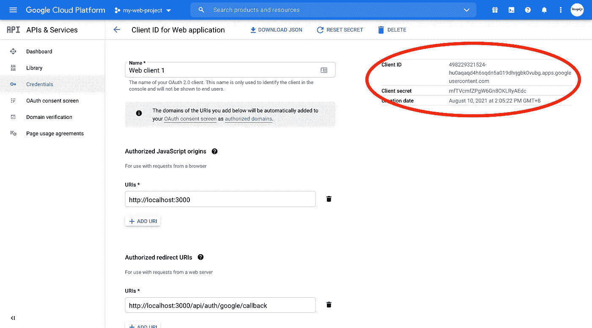

享受谷歌认证的乐趣！🥳

照片由[飞:D](https://unsplash.com/@flyd2069?utm_source=unsplash&utm_medium=referral&utm_content=creditCopyText) 在 [Unsplash](https://unsplash.com/s/photos/security?utm_source=unsplash&utm_medium=referral&utm_content=creditCopyText)