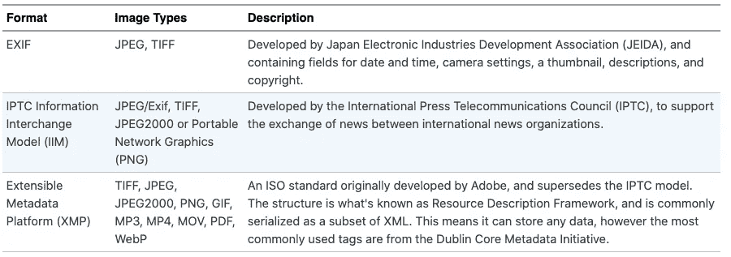

# 使用 Node.js 获取图像元数据(EXIF)

> 原文：<https://itnext.io/getting-image-metadata-exif-using-node-js-bd14aeee981d?source=collection_archive---------0----------------------->


作者图片

我们可以在图像中存储额外的数据，比如地理位置坐标、文本字符串等等。虽然有很好的 GUI 应用程序来处理这些数据，但我们有时需要在 Node.js 程序中处理这些数据。例如，静态网站生成器平台，如 AkashaCMS，可能使用存储在图像中的元数据来自动提供标题或工具提示文本。在本教程中，我们将探索如何读取 Node.js 中的元数据。

本文的目标是了解如何在 Node.js 程序中访问图像元数据。

准确地说，什么是图像元数据？它是图像文件中像素以外的额外数据。像素是我们看到的图像的视觉部分。但是，图像中还可以包含其他非视觉数据项。其中大部分是关于相机、曝光甚至地理位置的数据，但也有可能附加任意信息。

一种可能的用途是按照拍摄地点对图像进行分类。或者，我们可以存储描述、标题或其他文本项，这些内容将由内容管理系统显示。正如我们将看到的，在图像中可能存储的数据有一个很长的列表。

访问这些数据的基本原理是，我们需要使用它们来帮助驱动应用程序，向用户显示一些数据，或者做其他任何事情。如何使用这些数据取决于您，但是第一步是知道如何检索这些数据。因为有几个用于这个目的的包，我们将展示每个包的小示例脚本。

有几种元数据格式可用:



作者图片

这很好，为了在实践中了解这意味着什么，让我们在 Gimp 中打开一张照片。


作者图片

这张图片拍摄于 2013 年 7 月，第二届 BC-BC 电动车耐力跑期间。BC-BC 赛事的特色是一场从不列颠哥伦比亚到下加利福尼亚的比赛，展示了电动汽车即使在 2013 年也能长距离行驶的能力。现在，这似乎是一件司空见惯的事情，因为几家电动汽车制造商正在提供远程电动汽车，但在 2013 年，这种想法是胡说八道，任何电动汽车都可以进行如此长的旅程。十几辆或更多的汽车参与其中，现在这种旅行已经很平常了，这要归功于快速充电基础设施的增加。这张照片是在红木城的一家汽车经销店拍摄的，它是该活动的众多中途站之一。但是我已经分心了。

这里的要点是——在 Gimp v2.10 中——你打开一个图像文件，然后在*图像*菜单中你会发现一个*元数据*子菜单，它有一个选择来*编辑*元数据，还有一个选择来*查看*它。这张照片是用奥林巴斯 E-PL2 拍摄的，这是我当时拥有的一台微型四分之三无反光镜相机。我已经向下滚动到曝光区域，我看到图像稍微曝光过度，因为曝光偏差在 *0 EV* 。我现在知道通常最好设置为 *-2/3 EV* ，但是我又分心了。真正的要点是有奥林巴斯特有的 EXIF 价值观和通用的 EXIF。图片价值观。它还有 XMP 和 IPTC 数据的选项卡，在本例中这两个选项卡都是空的。

有接近无数的图形用户界面应用程序用于编辑图像中的 EXIF、XMP 和 IPTC 的数据。其中一些提供批量编辑，也就是说一次为一组图片设置值。对于其他的，比如 Gimp，一次只能编辑一个图像文件。

有一些开源命令行工具，如`exif`、`exiv2`、`exempi`和`exiftool`，它们不仅可以读取和写入 EXIF 值，还可以读取和写入更多值。我使用 macOS，并使用 MacPorts，四个工具是使用以下命令安装的:

```
$ sudo port install exif exiv2 exempi exiftool
 ... 
$ exif /Volumes/david/media/2013-07-02-BC-BC/P7050342.JPG 
$ exiv2 pr /Volumes/david/media/2013-07-02-BC-BC/P7050342.JPG 
$ exempi -x /Volumes/david/media/2013-07-02-BC-BC/P7050342.JPG 
$ exiftool -l /Volumes/david/media/2013-07-02-BC-BC/P7050342.JPG
```

有关进一步的用法，请参见每个命令的相应帮助信息。

一个相关的工具是 ImageMagick 套件。顾名思义，这是一组用图像表演魔术的工具。其中一个工具，`identify`，对于检查图像数据很有用。

```
$ identify -verbose \
       /Volumes/david/media/2013-07-02-BC-BC/P7050342.JPG
```

这些不同的工具以不同的方式呈现相同的数据。很难指出哪种工具比其他工具更好。Exiftool 提供了令人眼花缭乱的长选项列表，但代价是令人困惑的冗长文档。幸运的是，Exiv2 的文档更容易理解。

但是，介绍够了。本文的重点是，我们如何在 Node.js 程序中访问图像元数据？

我们的攻击计划是在 npm 注册表中搜索读取图像元数据的包，这些包可能会更改这些数据，并对它们进行测试。

我们将创建几个小脚本，所以让我们从创建一个项目目录并初始化`package.json`开始:

```
$ mkdir image-metadata 
$ cd image-metadata 
$ npm init -y
```

这当然是我们为每个 Node.js 项目所做的。

# 使用`exif-parser`从图像中读取 EXIF 标签

对于第一个脚本，让我们安装`exif-parser`包:

```
$ npm install exif-parser --save  
+ exif-parser@0.1.12 
added 1 package from 1 contributor and audited 1 package in 1.915s
found 0 vulnerabilities
```

这是一个相对流行的包，它的主要目的是从图像中读取 EXIF 数据。

根据 [exif-parser 文档](https://www.npmjs.com/package/exif-parser)，我们为它提供一个缓冲区，调用`parse`方法，然后我们得到一个名为`tags`的对象。这很简单。

我们将编写简单的脚本，使用 ES6 模块，并使用顶级异步，如下所述: [Node.js 脚本编写者:顶级异步/等待现在可用](https://techsparx.com/nodejs/async/top-level-async.html)

创建一个名为`exif-parser.mjs`的文件，包含以下内容:

```
import { promises as fs } from 'fs'; 
import ExifParser from 'exif-parser'; const imgbuffer = await fs.readFile(process.argv[2]); 
const parser = ExifParser.create(imgbuffer); parser.enableBinaryFields(true); 
parser.enableTagNames(true); 
parser.enableImageSize(true); 
parser.enableReturnTags(true); const img = parser.parse(); console.log(img.tags);
```

我们在命令行中读取名为。如果我们不提供一个`encoding`，那么`fs.readFile`方法将返回一个包含文件数据的`Buffer`。这正是我们需要的`ExifParser.create`功能。接下来我们要做的是确保设置了一些选项，然后我们调用`parse`，最后打印标签:

```
$ node exif-parser.mjs \
       /Volumes/david/media/2013-07-02-BC-BC/P7050342.JPG 
{
 ImageDescription: 'OLYMPUS DIGITAL CAMERA ',
 Make: 'OLYMPUS IMAGING CORP. ',
 Model: 'E-PL2 ',
 XResolution: 314,
 YResolution: 314,
 ResolutionUnit: 2,
 ...
}
```

我们走吧，简单易用的方法来读取 EXIF 标签。我看到的唯一问题是，这遗漏了 Gimp 在这个文件中显示的许多数据。也就是说，Gimp 显示了大量特定于 Olympus 的标记，这里没有显示。

# 使用`exifreader`读取图像元数据

让我们进入下一个包，`exifreader`。它支持多种图像类型，还支持 Exif、IPTC、XMP、ICC 和 MPF 元数据。这可能是一个非常好的选择。

安装:

```
$ npm install exifreader --save + exifreader@4.0.0
added 2 packages from 1 contributor and audited 3 packages in 4.157s 
found 0 vulnerabilities
```

[文档页面](https://www.npmjs.com/package/exifreader)说如果我们想要一个有限版本的包来支持有限的需求，我们可以生成一个定制的模块。以这种方式安装支持所有文件类型和元数据类型。

现在创建一个名为`exifreader.mjs`的文件，包含:

```
import { promises as fs } from 'fs'; 
import ExifReader from 'exifreader';   
const imgbuffer = await fs.readFile(process.argv[2]); //////// You can do this instead 
// const tags = await ExifReader.load(process.argv[2]); const tags = ExifReader.load(imgbuffer, {
     expanded: true,
     includeUnknown: true 
}); console.log(tags);
```

有一个 options 对象，在本例中，我们设置了每个记录的选项。

```
$ node exifreader.mjs /Volumes/david/media/2013-07-02-BC-BC/P7050342.JPG  
{
   file: {
     'Bits Per Sample': { value: 8, description: '8' },
     'Image Height': { value: 3024, description: '3024px' },
     'Image Width': { value: 4032, description: '4032px' },
     'Color Components': { value: 3, description: '3' },
     Subsampling: {
         value: [Array], description: 'YCbCr4:2:2 (2 1)' }
   },
   Thumbnail: {
     Compression: { id: 259, value: 6, description: 6 },
     XResolution: { id: 282, value: [Array], description: '72' },
     YResolution: { id: 283, value: [Array], description: '72' },
     ResolutionUnit: { id: 296, value: 2, description: 'inches' },
     JPEGInterchangeFormat: {
          id: 513, value: 11476, description: 11476 },
     JPEGInterchangeFormatLength: {
          id: 514, value: 6929, description: 6929 },
     type: 'image/jpeg',
     image: ArrayBuffer { ... },
     base64: [Getter]
   },
   exif: {
     ImageDescription: {
       id: 270,
       value: [Array],
       description: 'OLYMPUS DIGITAL CAMERA         '
     },
     Make: { id: 271, value: [Array],
       description: 'OLYMPUS IMAGING CORP.  ' },
     Model: { id: 272, value: [Array],
       description: 'E-PL2           ' },
     XResolution: { id: 282, value: [Array], description: '314' },
     YResolution: { id: 283, value: [Array], description: '314' },
     ResolutionUnit: { id: 296, value: 2, description: 'inches' },
     ...
   },
  iptc: {
     'Model Version': { id: 256, value: [Array], description: '4' },
     'Coded Character Set': {
          id: 346, value: [Array], description: 'UTF-8' },
     'Record Version': {
          id: 512, value: [Array], description: '4' },
     'By-line': {
          id: 592, value: [Array], description: 'Picasa' }   },
   xmp: {
     about: { value: '', attributes: {}, description: '' },
     ModifyDate: {
       value: '2013-07-08T15:40:38-07:00',
       attributes: {},
       description: '2013-07-08T15:40:38-07:00'
     },
     creator: {
       value: [Array], attributes: {}, description: 'Picasa' }
   }
 }
```

返回的对象有五个字段:`file`，描述文件，`Thumbnail`，包含缩略图，`exif`，包含 EXIF 数据，`iptc`，包含 IPTC 数据，`xmp`，包含 XMP 数据。它是一种很好的数据结构，很容易理解。

# 使用`exiftool-vendored`读取图像元数据

有两个 Node.js 包围绕着`exiftool`程序，`exiftool`和`exiftool2`，看起来它们不是好的选择。相反，`exiftool-vendored`看起来更像是`exiftool`的包装。

现在的情况是`exiftool`是一个 Perl 脚本，可以作为常规命令行工具使用。这些包装器包在后台执行这个脚本，而不是在 Node.js 中实现元数据解析，让`exiftool-vendored`有趣的是高质量的 API。

```
$ npm install exiftool-vendored --save + exiftool-vendored@15.6.0
added 6 packages from 6 contributors and audited 10 packages in 13.673s
found 0 vulnerabilities
```

文档站点[给出了这个包能做什么的感觉。也就是说，它能够从图像文件中读取一个很长的元数据项列表，其中支持的标签来自一个很大的样本图像库。在某些情况下，文档还会让您参考`exiftool`文档。](https://photostructure.github.io/exiftool-vendored.js/)

要参考的一个重要页面是[支持的标签列表](https://photostructure.github.io/exiftool-vendored.js/interfaces/Tags.html)。

现在，创建一个名为`exiftool-vendored.mjs`的文件，其中包含:

```
import { exiftool } from 'exiftool-vendored'; // The `exiftool` import is a prebaked instance of the ExifTool class with 
// sensible defaults.  If you want different defaults, change the  
// import statement and run this instead:  
// const exiftool = new ExifTool({ taskTimeoutMillis: 5000 })const tags = await exiftool.read(process.argv[2]);
console.log(tags);
exiftool.end();
```

正如评论中所说，您可以通过自己调用`ExifTool`构造函数来创建一个定制的`exiftool`实例。

调用`exiftool.read`异步读取已命名的图像文件，并返回一个`tags`对象。我们也可以用它来写标签，等等。

需要调用`exiftool.end`以便脚本退出。

```
$ node exiftool-vendored.mjs /Volumes/david/media/2013-07-02-BC-BC/P7050342.JPG  
{
   SourceFile: '/Volumes/david/media/2013-07-02-BC-BC/P7050342.JPG',
   errors: [],   ExifToolVersion: 12.34,
   FileName: 'P7050342.JPG',
   Directory: '/Volumes/david/media/2013-07-02-BC-BC',
   FileSize: '4.3 MiB',
   FileModifyDate: ExifDateTime {
     year: 2013,
     month: 7,
     day: 5,
     hour: 10,
     minute: 52,
     second: 4,
     millisecond: 0,
     tzoffsetMinutes: -420,
     rawValue: '2013:07:05 10:52:04-07:00',
     zoneName: 'UTC-7'
   },
   ... 
}
```

这将打印出返回的对象。需要注意的一件重要事情是，这个对象没有列出 IPTC 或 XMP 字段等。发生的事情是，我在这里使用的图像不包含这些种类的标签。

底层工具`exiftool`支持其他类型的元数据。并且查阅标签文档页面验证它将读取所有受`exiftool`支持的标签。

# 使用`imagemagick`读取图像元数据

ImageMagick 包是一套全面的工具，不仅可以读取图像元数据，还可以执行各种切片和切割操作。那个包裹的细节见 http://www.imagemagick.org/。

Node.js 的 [imagemagick 包是命令行工具的包装器。要使用此软件包，您必须首先安装 ImageMagick。幸运的是，它很容易获得，例如通过 MacPorts 或 macOS 上的 HomeBrew，或者在 Linux 发行版的标准包管理器中。](https://www.npmjs.com/package/imagemagick)

```
$ npm install imagemagick --save + imagemagick@0.1.3 
added 1 package from 1 contributor and audited 11 packages in 8.568s 
found 0 vulnerabilities
```

然后创建一个名为`imagemagick.mjs`的文件，其中包含:

```
import im from 'imagemagick'; const metadata = await new Promise((resolve, reject) => {
     im.readMetadata(process.argv[2], function(err, metadata) {
         if (err) reject(err);
         else resolve(metadata);
     });
}); console.log(metadata); const identified = await new Promise((resolve, reject) => {
     im.identify(process.argv[2], function(err, metadata) {
         if (err) reject(err);
         else resolve(metadata);
     }); 
}); console.log(identified);
```

首先，这个包是对 Node.js 旧时代的回归，在那里所有的事情都是通过回调函数来完成的。这个包的一个主要问题是，它已经九年没有更新了，因此对 Promise 的一无所知，因此我们不能对这个包使用`await`。这意味着我们必须用一个承诺包装来包裹它，如下所示。

我们演示了两种读取元数据的方法。

`readMetadata`方法调用`identify` CLI 工具。它解析输出，并返回包含数据的对象。

可选地，我们可以使用`identify`方法，该方法也调用`identify` CLI 工具，解析输出，并返回包含数据的对象。这两个物体相似，但不同。你可能更喜欢其中一个。

# 使用`sharp`读取图像元数据

Sharp 是一个现代的图像处理包，是 JavaScript 的原生包。您不需要使用命令行工具，而是需要处理一个很好的 JavaScript API。它有许多方法，其中之一是读取图像元数据，甚至更改元数据的能力。

完整文档:[https://sharp.pixelplumbing.com/](https://sharp.pixelplumbing.com/)

包主页:[https://www.npmjs.com/package/sharp](https://www.npmjs.com/package/sharp)

```
$ npm install sharp --save  
+ sharp@0.29.3 
added 67 packages from 197 contributors and audited 78 packages in 44.277s  
found 0 vulnerabilities
```

因为这依赖于一个本地代码库 libvips，所以它要么下载一个预编译的库，要么编译这个库，作为`npm install`阶段的一部分。

创建一个名为`sharp.mjs`的文件，其中包含:

```
import sharp from 'sharp';  
const data = await sharp(process.argv[2]).metadata(); 
console.log(data);
```

Sharp 是一个现代的软件包，它使用了一个富有表现力的 API。这意味着`sharp`函数返回一个带有支持链接操作的 API 方法的对象。目前我们感兴趣的是元数据，它是我们用这种方法得到的。

这看起来很简单，但是…

```
$ node sharp.mjs /Volumes/david/media/2013-07-02-BC-BC/P7050342.JPG
{
   format: 'jpeg',
   width: 4032,
   height: 3024,
   space: 'srgb',
   channels: 3,
   depth: 'uchar',
   density: 314,
   chromaSubsampling: '4:2:0',
   isProgressive: false,
   hasProfile: false,
   hasAlpha: false,
   exif: <Buffer 45 78 69 66 ... >,
   iptc: <Buffer 50 68 6f 74 ... >,
   xmp: <Buffer 3c 3f 78 70 ... >
 }
```

结果是`exif`、`iptc`和`xmp`字段包含原始数据，而不是经过解析的数据。哈姆。这是一个不透明的物体，我们无法从它那里获取磁场。这不是希望的结果，也不符合夏普的其他功能。

换句话说，Sharp 还包括一个在创建新图像时设置元数据字段的方法。使用 Sharp 文档中的示例，让我们编写另一个脚本，`sharp-add-copyright.mjs`:

```
import sharp from 'sharp';  
const data = await sharp(process.argv[2])
     .withMetadata({
         exif: {
             IFD0: {
                 Copyright: process.argv[3]
             }
         }
     })
     .toFile(process.argv[4]);
```

此示例将图像输入到 Sharp 处理流，将版权数据添加到 EXIF，并将结果输出到新文件。顺便说一下，这是 Sharp 使用的典型模式，即从输入到输出构建一个处理管道。

我们可以这样运行这个例子:

```
$ node sharp-add-copyright.mjs \
       /Volumes/david/media/2013-07-02-BC-BC/P7050342.JPG \ 
       'David Herron' \
       img-copyright.jpg
```

我拍摄了这张照片，所以我应该得到版权。接下来，在输入文件和输出文件上运行`exif`命令，您会看到输出文件现在列出了:

```
Copyright           |David Herron (Photographer) - [None] (Editor)
```

这是很好的，我们可以修改 EXIF 设置使用夏普。但是，如果夏普能够展示 EXIF、IPTC 和 XMP 标签的结构，难道不是很有意义吗？为什么它做不到这一点？

# 设置 EXIF/IPTC/XMP 元数据值

这使我们面临一个共同的任务，不仅要读取元数据值，还要修改它们。我们已经演示了几种在 Node.js 应用程序中读取元数据值的方法，我们可以使用这些方法来构建基于元数据的图像索引。但是，要创建一个有用的索引，我们需要设置元数据值。在互联网上发布图片之前，我们不应该在元数据中附上版权声明吗？

让我们从命令行工具开始。在 ImageMagick 套件中，似乎必须有一个使用`convert`或`mogrify`命令设置 EXIF 值的咒语。但是我没能解决这个问题。相反，我发现`exiftool`命令更简单。

```
$ exiftool -copyright='David Herron' -artist='David Herron' \
 /Volumes/david/media/ 2013-07-02-BC-BC/P7050342.JPG 
$ exif /Volumes/david/media/ 2013-07-02-BC-BC/P7050342.JPG 
... 
Artist    |David Herron 
... 
Copyright |David Herron (Photographer) - [None] (Editor) 
...
```

从 Node.js 脚本驱动它的最有效方式是使用`shelljs`包。Shelljs 帮助您编写通常作为 shell 脚本编写的内容，但是这些脚本更易于移植，可以在 Windows 上不加修改地运行(例如)。

经过一些试验，我最终得到了下面的脚本:

```
import { default as shell } from 'shelljs'; const artist = process.argv[2]; 
const fn = process.argv[3];  
shell.exec(`exiftool -copyright -artist ${fn}`);  
shell.exec(`exiftool -copyright='${artist}' -artist='${artist}' ${fn}`);  
shell.exec(`exiftool -copyright -artist ${fn}`);
```

这个脚本演示了这种变化，因此比通常的脚本更加冗长。

```
$ node shelljs-add-exif.mjs 'David Herron' \
 /Volumes/david/media/2013-07-02-BC-BC/P7050340.JPGCopyright :
Artist :
 1 image files updated 
Copyright : David Herron 
Artist : David Herron
```

浏览一下 shelljs 文档会给你各种各样的想法。

请注意，该脚本正在打印每个命令的输出。这可以通过自定义以下内容来更改:

```
shell.exec(`exiftool -copyright='${artist}' -artist='${artist}' ${fn}`,
      (code, stdout, stderr) => {
         // code is the process exit code
         // stdout is the text from the standard output
         // stderr is the text from the standard error output 
});
```

例如，可以通过使用`shell.cp`命令在修改文件之前复制它来改进这个脚本。另一个想法是使用 GUI 应用程序进行初始筛选，设置 EXIF 标签来标记每个图像的处理，然后脚本查询哪些文件设置了某些 EXIF/XMP/etc 标签，并执行给定的操作。

类似的工具是`zx`([https://npmjs.com/package/zx](https://npmjs.com/package/zx))。

在[https://exiftool.org/](https://exiftool.org/)有大量关于图像元数据的细节..虽然`exiftool`命令非常强大，但在清晰度和易用性方面还有很多不足之处。项目页面是这样说的:

> *如果你觉得有必要将“find”或“awk”与 ExifTool 结合使用，那么你很可能还没有发现 ExifTool 的全部威力。*

我对此有不同的看法。人们在使用 ExifTool 时转向其他工具，这表达了他们对不同用户界面的渴望。“非常棒的工具”一定要有“很长的学习曲线”吗？我相信让普通人也能理解的用户界面或 API 是很重要的。

另一个工具 exi v2([https://exiv2.org/index.html](https://exiv2.org/index.html))与 ExifTool 大致相同。它支持与 ExifTool 相同的元数据类型，其网站也有大量关于图像元数据的信息。因为它是用 C++实现的，所以更容易集成到其他应用程序中。它的命令行工具更容易理解。例如:

```
$ exiv2 -M"reg myprefix http://ns.myprefix.me/" \
 -M"add Xmp.myprefix.Whom Mr. Smith" \
 -M"set Exif.Image.Artist Mr. Smith" \
 image.jpg
```

这演示了如何使用一种相当容易理解的语法来设置多个元数据值。需要`reg`命令，以便 XMP 支持知道如何记录`Xmp.myprefix`。

这将打印所有元数据。

```
$ exiv2 -g Whom -g Artist \
       /Volumes/david/media/2013-07-02-BC-BC/P7050341.JPG 
Exif.Image .Artist Ascii 13 David Herron 
Xmp.myprefix .Whom XmpText 12 David Herron
```

`-g`选项是我们在元数据中搜索特定值的方式。

Exiv2 有一个 Node.js 模块，我们在荣誉奖部分简单讨论一下。

# 剥离图像元数据

另一个常见的任务是剥离元数据以最小化任何隐私问题。例如，您的手机图像通常具有地理位置数据。给脸书贴上你在杂货店发现的一个有趣的标志，你会立刻通知任何查看这张图片的人照片拍摄地的纬度/经度。这类信息可能会被用来对付你。

使用 ImageMagick，我们可以这样做:

```
$ convert /Volumes/david/media/2013-07-02-BC-BC/P7050340.JPG \
         -strip \
         img-stripped.jpg 
$ exif img-stripped.jpg  
Corrupt data The data provided does not follow the specification. 
ExifLoader: The data supplied does not seem to contain EXIF data.
```

结果是一个完美的 JPEG，但是没有 EXIF/XMP/etc 数据。

使用 Exiv2，`-d`选项相当于`-strip`命令。或者，您可以使用`-M del Exif.foo.bar`来针对特定的标签进行删除。

对前面显示的`sharp-add-copyright.mjs`脚本的简单修改可以去掉特定的元数据标签。例如，显示相机类型或曝光的标签不构成隐私问题，而地理定位标签则构成。修改该脚本，将这些标记设置为空值，就可以达到这个目的。

# 荣誉奖

在研究这篇文章的过程中，我遇到了一些很有前途的工具，但它们还不够有用。

Node.js 的 [Exiv2 包与 Exiv2 C++库接口。文档显示了一个非常好的 API。但是，它只与 Node.js v0.8.x 兼容，与当前的 Node.js 不兼容。](https://www.npmjs.com/package/exiv2)

[@11ways/exiv2 包](https://www.npmjs.com/package/@11ways/exiv2)可能是为 modern Node.js 更新它的一个分支，事实上，它在 macOS 上与 Node.js 16.x 一起安装，但在这样做时会打印出无数警告。以下程序成功读取了图像元数据:

```
import { default as ex } from '@11ways/exiv2'; const tags = await new Promise((resolve, reject) => {
     ex.getImageTags(process.argv[2], function(err, tags) {
         if (err) reject(err);
         else resolve(tags);
     }); 
}); console.log(tags);
```

因为原 API 是 7 年的，不支持承诺等。据推测，`@11ways`团队正在开发这个包，如果没有别的事情，他们还有一堆警告要解决。

Node.js 的 [Exifer 包看起来很有前途。要读取 EXIF、IPTC 或 XMP 标签，需要使用附加软件包。但是在测试中，它似乎不能正常工作。](https://www.npmjs.com/package/exifer)

Node.js 的 [piexif 包看起来很有前途。虽然文档表明它可以读取元数据，也可以插入元数据，但并不完全清楚该怎么做。](https://github.com/hMatoba/piexifjs)

# 摘要

我们已经了解了一系列读取和操作图像元数据的工具。

Node.js 对该区域的支持很弱。虽然有几个软件包很好地支持读取图像元数据，但是一旦你想要操作(添加、删除或更改)元数据，你就只能使用其他工具了。但是如果我们的目标是交付 Node.js 应用程序或服务，我们就有所欠缺。

我们对 Node.js 代码的最佳选择是集成 Exiv2 命令行界面。要探索的另一个步骤是更新它的 Node.js 包以支持现代 Node.js 版本。

另一个探索的步骤是让 Sharp 包交付解析的 EXIF/IPTC/XMP 数据。Sharp 的优势在于它是一个通用的图像操作库，可以按原样用于设置元数据值。

# 关于作者

[***大卫·赫伦***](https://techsparx.com/about.html) *:大卫·赫伦是一名作家和软件工程师，专注于技术的明智使用。他对太阳能、风能和电动汽车等清洁能源技术特别感兴趣。David 在硅谷从事了近 30 年的软件工作，从电子邮件系统到视频流，再到 Java 编程语言，他已经出版了几本关于 Node.js 编程和电动汽车的书籍。*

*最初发表于*[*https://techsparx.com*](https://techsparx.com/nodejs/graphics/image-metadata.html)*。*