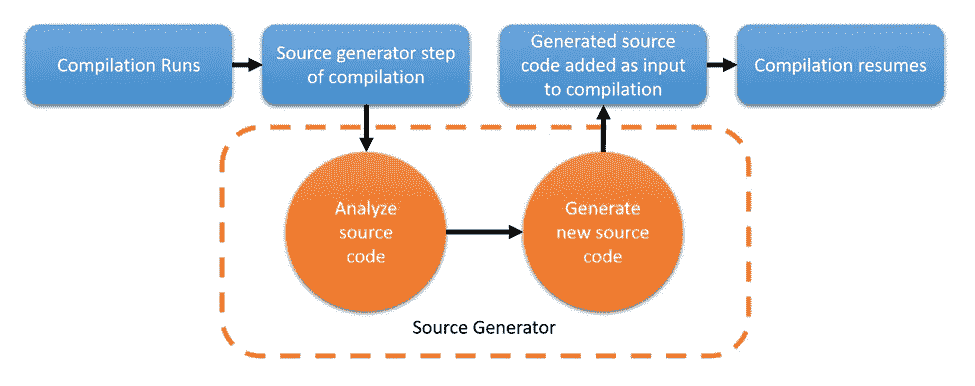
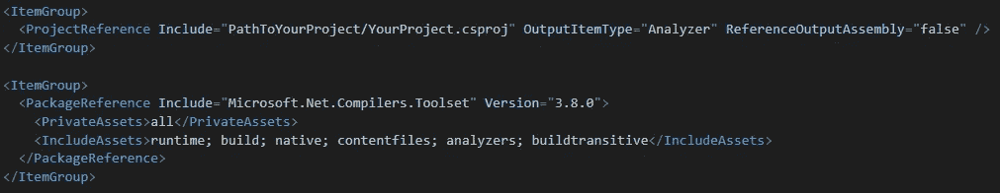
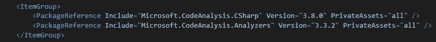

# 进入源代码生成器。网

> 原文：<https://itnext.io/getting-into-source-generators-in-net-6bf6d4e9e346?source=collection_archive---------1----------------------->


如果你曾经尝试过自己自动生成 C#代码，你可能使用过 T4 文本模板，或者你创建了一个小的应用程序，它在后/预构建事件设置中运行，你也知道这有时有多复杂。

好了，现在有一个新的孩子来做这项工作:罗斯林的源发电机！或许你已经听说过它们，但从未真正尝试过。我想给你一个简短的介绍和一些实际操作的例子，告诉你如何在你的项目中使用它们！

# 为什么&什么

到目前为止，我之前提到的现有选项只作用于纯文本模型。然而，有一个主要的区别:现有的解决方案大多是在编译前生成代码，或者在编译后生成代码，所以它们只能依赖于可用的元数据，并通过反射来处理它。

然而，源生成器在编译周期内工作**。这里有一个简单的概述:**



源生成器实质上接收到了现有程序迄今为止的一个完整的语法树，并且可以完整地分析它。这可以深入到分析变量赋值，并基于此生成代码。

简而言之，源代码生成器可以在运行时做很多以前通过反射完成的工作。例如 Asp.Net 模型&控制器绑定，或者依赖注入。阿迪框架可以从技术上分析你的代码，找出哪些绑定被解析，并提前生成代码，而不是在运行时使用反射来影响性能。听起来是不是很棒？

# 如何使用它

到目前为止(2021 年 9 月)，仍然有一些严格的，有时是未记录的要求，以使源发生器工作。以下是我用来让一切正常工作的设置:

在引用端(希望使用生成代码的项目)，我们的。csproj 需要包含以下设置:



这是我们在接收端需要做的所有事情。注意，接收端也可以是. Net 5.0 项目，没有任何问题。

在发电机上。csproj 方面，我们还有一些设置要做:

*   源发生器需要驻留在**中。网标 2.0 项目**。这仍然是一个很难的要求，如果你的代码库的其余部分已经存在，这可能会有点尴尬。Net 5.0。
*   您的 souce generator 项目需要导入以下两个包:



现在我们准备实现一个源生成器！

# 实现生成器

源生成器是一个实现了 *ISourceGenerator* 接口的类，标记有 *GeneratorAttribute* :

```
[Generator]
public class MyGenerator : ISourceGenerator
{
    public void Initialize(GeneratorInitializationContext context)
    {
    } public void Execute(GeneratorExecutionContext context)
    {
    }
}
```

生成器实现了来自 *ISourceGenerator* 接口的两个方法。总结一下:

*   *初始化*方法，用于在编译时分析语法树。对于简单的生成器来说，它应该只发出基于非上下文的代码，这也可以完全跳过。
*   *执行*方法，负责实际发出源代码。如前所述，这种方法会将源代码添加到编译周期中，并且与其他技术相比，不需要重新开始编译。

源生成器和基于反射的生成之间有很大的概念上的区别。虽然基于反射的代码将继续前进并探索基于 CLR *类型*的元数据，但源代码生成器将在编译周期中实际访问程序的*语法树*。此时不会发出任何已编译的类型，所以反射在这里不起作用。当我试图理解这个概念的时候，我马上得出的最接近的联系是一个*表达式< Func <..> >。*表达式也代表了代码可以分析的表达式树，在概念层面上，这与语法树非常相似。

现在，让我们继续实现一个生成器，它发出以下接口的简单实现:

```
public interface IAnimal
{
    void MakeNoise();
    void MakeNoise(string withNoise);
}
```

然而，为了使它更有趣，我们将在调用项目提供的相同名称空间中生成它。下面是这段代码的样子:

```
[Generator]
public class PlainGenerator : ISourceGenerator
{
     public void Initialize(GeneratorInitializationContext context)
     {
     } public void Execute(GeneratorExecutionContext context)
     {
         var callingEntrypoint = context.Compilation.GetEntryPoint(context.CancellationToken); var sb = new StringBuilder(); sb.Append(@$"
using SourceGenerator.Console.Interfaces;namespace {$"{callingEntrypoint!.ContainingNamespace.ContainingNamespace.Name}.{callingEntrypoint!.ContainingNamespace.Name}"}
{{
public class CustomDuck : IAnimal
{{
 public void MakeNoise()
 {{
  System.Console.WriteLine(""Hello from custom duck"");
 }}public void MakeNoise(string withNoise)
 {{
  System.Console.WriteLine($""Hello from custom duck with noise: {{withNoise}}"");
 }}
}}
}}
  "); context.AddSource("CustomDuck", SourceText.From(sb.ToString(), Encoding.UTF8));
 }
}
```

大部分代码应该与常规代码生成器非常相似。我们使用一个 stringbuilder 并追加一个表示我们想要发出的代码的逐字字符串。

然而，在这种情况下，我们也从编译上下文中获取调用入口点。*上下文。Compilation* 属性允许我们访问当前的编译信息，入口点代表实际的入口点，就像我们程序中的 Main()方法一样。我使用这个生成器的控制台应用程序驻留在 *SourceGenerator 中。控制台*名称空间。带有包含名称空间的*。名字*我们可以抢到这个名字。然而，每个包含的名称空间只代表一层名称空间，所以为了接收整个名称空间，我们需要在这里经历两层。

为了发出文件，我们调用了*。AddSource()* 方法。这个方法需要两个参数，第一个参数是发出的源的惟一标识符，第二个参数是实际的 sorce 文本，它来自我们的 stringbuilder，在上面指定各自的编码。

如果一切都设置正确，我们现在可以在 Program.cs 中使用 *CustomDuck* 类型，就像它是一个常规类一样:

```
namespace SourceGenerator.Console
{
    public class Program
    {
        public static void Main(string[] args)
        {
            var customDuck = new CustomDuck();
            customDuck.MakeNoise();
            customDuck.MakeNoise("Additional noise");
        }
    }
}// Output:
Hello from custom duck
Hello from custom duck with noise: Additional noise
```

太棒了，成功了！因为我们在名称空间 *SourceGenerator 中。控制台*并且不需要为 *CustomDuck* 指定任何其他东西，我们知道我们所做的命名空间工作也是可行的！

# 更复杂的发电机

既然我们现在已经用一个简单的发电机预热了，让我们来处理一些不同的东西。

我们现在想要实现一个生成器，它自动生成一个装饰器，当调用在接口上有一个特定的属性时，该装饰器测量并记录调用各个接口实现者所用的时间。

这是我们的设置:

```
public class GenerateDecoratorAttribute : Attribute
{
}[GenerateDecorator]
public interface IAnimal
{
    void MakeNoise();
    void MakeNoise(string withNoise);
}[GenerateDecorator]
public interface ICar
{
    void Drive();
}
```

让我们看看发电机:

```
[Generator]
public class DuckGenerator : ISourceGenerator
{
    internal class SyntaxReceiver : ISyntaxReceiver
    {
        public List<InterfaceDeclarationSyntax> DecoratorRequestingInterfaces { get; } =
       new List<InterfaceDeclarationSyntax>();

        public void OnVisitSyntaxNode(SyntaxNode syntaxNode)
        {
            // Get all interfaces with any attributes
            if (!(syntaxNode is InterfaceDeclarationSyntax ids) || !ids.AttributeLists.Any())
            {
                return;
            } var requiresGeneration = ids.AttributeLists
                .Select(x => x.Attributes)
                .SelectMany(x => x)
                .Select(x => x.Name)
                .OfType<IdentifierNameSyntax>()
                .Any(x => x.Identifier.ValueText ==           "GenerateDecorator");

           if (requiresGeneration)
           {
               DecoratorRequestingInterfaces.Add(ids);
          }
      }
  } public void Initialize(GeneratorInitializationContext context)
    {
       context.RegisterForSyntaxNotifications(() => new SyntaxReceiver());
    }

    ...
}
```

首先，我们将看到 Initialize 方法，这次我们使用它来分析现有的代码。标准的方法是注册一个*isyntaxereceiver*，它接收相应的 *SyntaxNode* 进行分析。

在我们的实现中，我们希望找到作为接口的所有语法节点，并将我们需要的属性添加到它们的声明中。我们将保存在公共列表中找到的节点。作为 Roslyn 和 Analyzers 的新手，要弄清楚有哪些节点类型并不容易，也没有很好的文档记录。通常节点被类型化为一个接口，它可以有多个实现，并且整个分析过程可能需要大量的类型检查。类型列表可以在[https://docs . Microsoft . com/en-us/dot net/API/Microsoft . code analysis . cs harp . syntax？view=roslyn-dotnet-3.11.0](https://docs.microsoft.com/en-us/dotnet/api/microsoft.codeanalysis.csharp.syntax?view=roslyn-dotnet-3.11.0) 。我主要是通过阅读 roslyn 源代码、找出接口的具体实现以及调试生成器来找到自己的路。

为了调试生成器，我们可以添加一个 ***调试器。Launch()*** 在*内任意位置初始化*或*执行*方法，编译时 VS 会提示我们在 csc.exe 进程上附加一个调试器。

转到执行方法:

```
public void Execute(GeneratorExecutionContext context)
{
    // Get our SyntaxReceiver back
    if (!(context.SyntaxReceiver is SyntaxReceiver receiver))
    {
        throw new ArgumentException("Received invalid receiver in Execute step");
    } foreach (var ids in receiver.DecoratorRequestingInterfaces)
    {
        var methods = ids.DescendantNodes().OfType<MethodDeclarationSyntax>(); var sourceBuilder = new StringBuilder(); var interfaceName = ids.Identifier.ValueText;
        var className = $"Decorated{ids.Identifier.ValueText.Substring(1)}";

        sourceBuilder.Append("using System.Diagnostics;\n");
        sourceBuilder.Append("using SourceGenerator.Console.Interfaces;\n");
        sourceBuilder.Append("\n");
        sourceBuilder.Append("namespace SourceGenerator.Console.Decorators\n");
        sourceBuilder.Append("{\n");
        sourceBuilder.Append($"\tpublic class {className} : {interfaceName}\n");
        sourceBuilder.Append("\t{\n");
        sourceBuilder.Append($"\t\tprivate {interfaceName} _decorated;\n");
        sourceBuilder.Append("\n");
        sourceBuilder.Append($"\t\tpublic {className}({interfaceName} decorated)\n");
        sourceBuilder.Append("\t\t{\n");
        sourceBuilder.Append("\t\t\t_decorated = decorated;\n");
        sourceBuilder.Append("\t\t}\n");
        sourceBuilder.Append("\n"); foreach (var method in methods)
            {
                var methodName = method.Identifier.Text; sourceBuilder.Append($"\t\tpublic {((PredefinedTypeSyntax) method.ReturnType).Keyword.Text} {methodName}("); var parameterIdentifiers = new List<string>(); for (var i = 0; i < method.ParameterList.Parameters.Count; i++)
                {
                    var parameter = method.ParameterList.Parameters[i];
                    if (!(parameter.Type is PredefinedTypeSyntax typeSyntax))
                    {
                        return;
                    } var type = typeSyntax.Keyword.Text;
                    var name = parameter.Identifier.ValueText; sourceBuilder.Append($"{type} {name}"); parameterIdentifiers.Add(name); if (i != method.ParameterList.Parameters.Count - 1)
                    {
                        sourceBuilder.Append(",");
                    }
               }
              sourceBuilder.Append(")\n");
              sourceBuilder.Append("\t\t{\n"); sourceBuilder.Append("\t\t\tvar sw = Stopwatch.StartNew();\n");
              sourceBuilder.Append($"\t\t\t_decorated.{methodName}({string.Join(",", parameterIdentifiers)});\n");
              sourceBuilder.Append("\t\t\tsw.Stop();\n");
                      sourceBuilder.Append("\t\t\tSystem.Console.WriteLine($\"Elapsed time: {sw.Elapsed}\");\n");
              sourceBuilder.Append("\t\t}\n");
              sourceBuilder.Append("\n");
          } sourceBuilder.Append("\t}\n");
          sourceBuilder.Append("}"); context.AddSource(ids.Identifier.ValueText, SourceText.From(sourceBuilder.ToString(), Encoding.UTF8));
    }
}
```

在第一行中，我们可以获取我们在*初始化*步骤中构建的*isyntaxereceiver*，它是同一个实例，因此保存了我们之前编译的接口节点列表。现在我们可以采取行动了。代码应该是不言自明的。我们用来自接口的相应元数据构建常规类，然后添加我们需要实现的方法。

因为我们想要构建一个装饰器，所以我们实现了相应的接口，并接收了它的一个对象作为构造函数参数。

我们的每个方法都添加了一个秒表，用方法的参数调用底层对象的方法，然后记录经过的时间。

对于源代码，请在[https://github.com/Sossenbinder/SourceGeneratorDemo](https://github.com/Sossenbinder/SourceGeneratorDemo)按照您自己的速度随意探索。正如我已经提到的，进入找出正确节点类型的最佳状态确实需要一些时间。获取调试器，并探索编译上下文。

生成装饰器后，让我们测试一下代码。回到我们的 Program.cs，我们现在可以使用装饰器:

```
System.Console.WriteLine("Running application");
System.Console.WriteLine("---");IAnimal duck = new Duck();System.Console.WriteLine("Regular duck:");
duck.MakeNoise();
duck.MakeNoise("additional noise");System.Console.WriteLine("Decorated duck:");
duck = new DecoratedAnimal(duck);
duck.MakeNoise();
duck.MakeNoise("additional noise");ICar car = new Toyota();
System.Console.WriteLine("Regular car:");
car.Drive();
System.Console.WriteLine("Decorated car:");
car = new DecoratedCar(car);
car.Drive();// Output:
Running application
---
Regular duck:
Quack
Quack with additional noise
Decorated duck:
Quack
Elapsed time: 00:00:00.0295439
Quack with additional noise
Elapsed time: 00:00:00.0612864
Regular car:
Driving
Decorated car:
Driving
Elapsed time: 00:00:00.1066615
```

太好了！我们生成的装饰器正在工作。我们需要做的只是用自定义属性标记我们想要装饰的各个接口。

因此，底线是，源代码生成器是语言的一个很好的补充。很高兴看到对代码生成的一些一流支持，这些支持被允许与编译周期挂钩。然而，到目前为止，文档并不是很好。特别是我给出的更复杂的例子，为了理解整个流程以及如何使用语法树，需要花费相当多的时间来研究，这绝对是一个不同于我以前使用的基于反射的生成器的模型。

然而，随着更多工具、更好的调试和更多语言支持的到来，我很高兴能越来越多地使用这个特性！