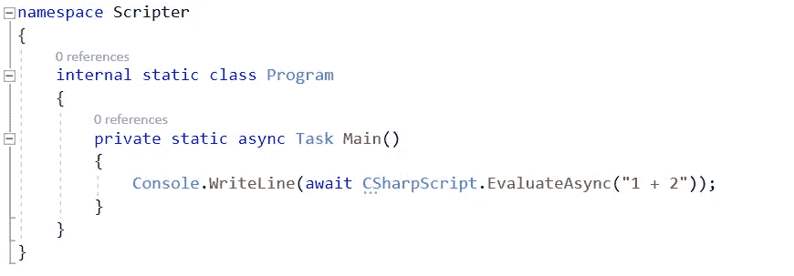
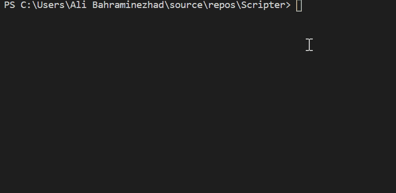
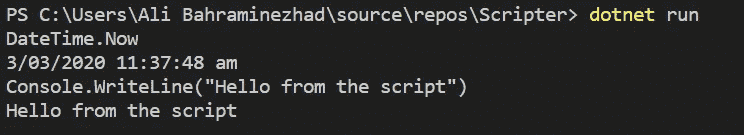
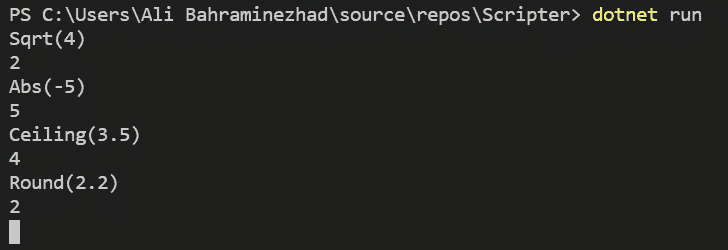
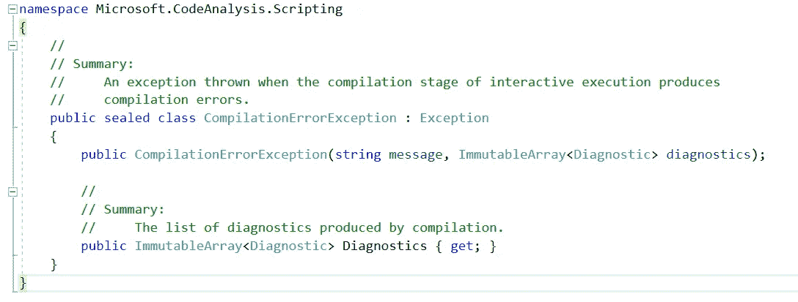
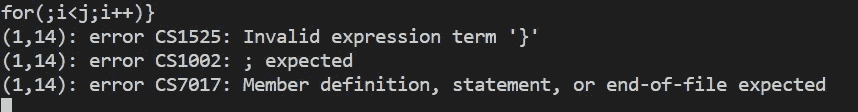
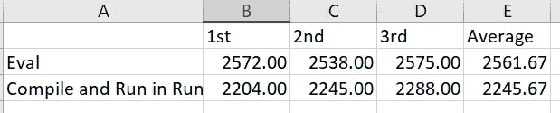
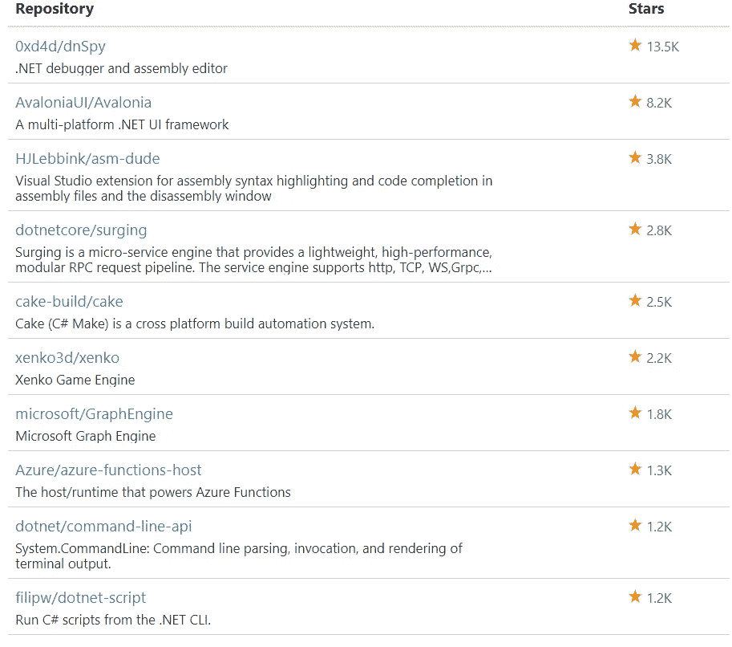

# Roslyn C#脚本 API 入门

> 原文：<https://itnext.io/getting-start-with-roslyn-c-scripting-api-d2ea10338d2b?source=collection_archive---------1----------------------->



。NET 编译器平台或罗斯林是在市场上一段时间。罗斯林是一套编译器，代码分析 API。网络语言。它也是运行时执行动态代码运行时的脚本 API。

当然，并不是所有的平台都支持脚本 API，因为它需要桌面。NET Framework 4.6+或。NET Core 1.1(自 [Roslyn v2.0.0-rc3](https://www.nuget.org/packages/Microsoft.CodeAnalysis.Scripting/2.0.0-rc3) ，Visual Studio 2017 RC3 开始支持)。脚本 API 不能在 UWA 和。因为应用程序模型不支持加载运行时生成的代码。虽然最新稳定版的脚本 API 只支持针对**的项目。网标二**以上。

## 让我们写一点脚本

为了能够在中使用脚本 API。NET，[微软。code analysis . cs harp . scripting](https://www.nuget.org/packages/Microsoft.CodeAnalysis.CSharp.Scripting/)包必须安装在您的项目上。

```
dotnet add package Microsoft.CodeAnalysis.CSharp.Scripting
```

API 本身设计良好，易于使用，几乎涵盖了从添加引用、编译到评估简单代码的大部分场景。您可以在`Micorosft.CodeAnalysis.CSharp.Scripting`中访问`CSharpScript`类。

在下面的代码中，它读取用户在控制台输入中键入的任何内容，并立即执行并返回结果。

```
// Nampespace below should be used to use CSharpScript
// using Microsoft.CodeAnalysis.CSharp.Scripting;while(true)
{
 var codeToEval = Console.ReadLine();
 var result = await CSharpScript.EvaluateAsync(codeToEval);
 Console.WriteLine(result);
}
```



示例代码的运行

`CsharpScript.EvaluateAsync`方法是一种评估字符串代码的异步方法。如果您喜欢强类型 eval，可以使用它的泛型方法。

```
int sum = await CsharpScript.EvaluateAsync<int>("1 + 2");
```

## 添加命名空间

正如你在上面的例子中看到的，我使用完全限定来使用像`System.DateTime`这样的方法。您可以通过在 EvaluateAsync 方法中使用`ScriptOptions`参数来实现。

```
while(true)
{
 var codeToEval = Console.ReadLine();var result = await CSharpScript.EvaluateAsync(codeToEval,  ScriptOptions.Default.WithImports("System")); 

 Console.WriteLine(result);
}
```

`ScriptOptions.Default.WithImports("System")`将`using System;`添加到脚本中。



现在你可以看到，我对代码进行了无条件评估。

## 向脚本中添加类型的成员

你们都和`System.Math`班合作过。有时，您更喜欢将类成员添加到脚本中直接使用，而不调用它们的类名。例如，而不是`System.Math.Abs`只说`Abs`。像添加引用一样，如果您使用带有类名的`WithImports`，它会添加`using static System.Math;`。

```
while(true)
{
 var codeToEval = Console.ReadLine();var result = await CSharpScript.EvaluateAsync(codeToEval, ScriptOptions.Default.WithImports("System.Math"));  

 Console.WriteLine(result);
}
```



## 添加引用

使用`WithReferences`方法添加引用也很容易。

```
var result = await CSharpScript.EvaluateAsync("System.Net.Dns.GetHostName()", ScriptOptions.Default.WithReferences(typeof(System.Net.Dns).Assembly));
```

## 前一次评估的持续评估

在之前的所有样本中，我们只逐行评估，这些样本之间没有任何关联。假设我们想要评估以下输入:

```
line1: int a = 1;
line2: int b = 2;
line3: int c = a + b ;
line4: Console.WriteLine(c);
```

对于这种场景，首先，您使用`RunAsync`评估并运行该方法，然后您可以使用`ContinueWithAsync`继续相同的上下文。

```
var state = await CSharpScript.RunAsync("int a = 1;");state = await state.ContinueWithAsync("int b = 2;");
state = await state.ContinueWithAsync("int c = a + b;");
state = await state.ContinueWithAsync("c");Console.WriteLine(state.ReturnValue);
```

每当你用 RunAsync 或 ContinueWithAsync 评估你的代码时，你可以通过`ReturnValue`属性得到值。

💡如果被评估的代码没有任何返回值，如`int a =1;`,`ReturnValue`属性将为空。

## 错误处理

您可以通过一个简单的 try-catch 块来捕获`CompilationErrorException`异常，从而实现错误处理。



这个异常类有`Diagnostics`属性，有了这个属性，你可以访问所有的编译问题。

```
try
{
 var result = await CSharpScript.EvaluateAsync(codeToEval);
 Console.WriteLine(result);
}
catch (CompilationErrorException e)
{
 Console.WriteLine(string.Join(Environment.NewLine, e.Diagnostics));
}
```

上面代码的`Diagnostics`的结果可能如下图所示:



## 表演

评估的第一次调用总是很慢，您需要在您的项目中考虑它。除了第一次调用之外，它还会在您每次调用内存中的代码时编译和评估代码。

在需要频繁执行动态代码/脚本的情况下，最好先编译再执行。

```
// compile once
var script = CSharpScript.Create(code);// run many timesfor(var i=0;i<100;i++)
   var result = await script.RunAsync();
```

在下图中，您可以看到先编译脚本的速度有多快。



## 使用脚本 API 的场景

在谈论您未来或当前项目的可能场景之前，我想展示一个 GitHub 上使用该 API 的项目列表。



[你可以在 NuGet 包的 GitHub 使用部分找到这个列表](https://www.nuget.org/packages/Microsoft.CodeAnalysis.CSharp.Scripting/3.5.0-beta3-final#)

想象一下，在你的软件中，你想给你的用户一个机会来创建他们的宏或规则，你不想强迫他们用 Visual Studio 来发布一个 DLL。如果你看上面的图片，你会发现很多可能性。

对你的 C#脚本感到满意。

## 相关文章

1.  [cs harp 脚本编写的搭便车指南](/hitchhikers-guide-to-the-c-scripting-13e45f753af9)