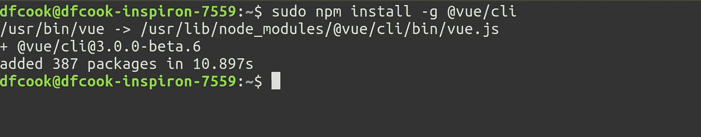
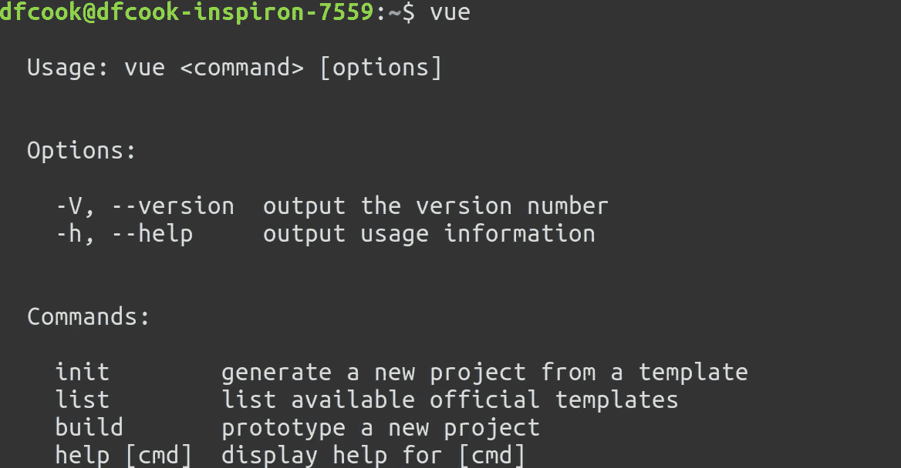
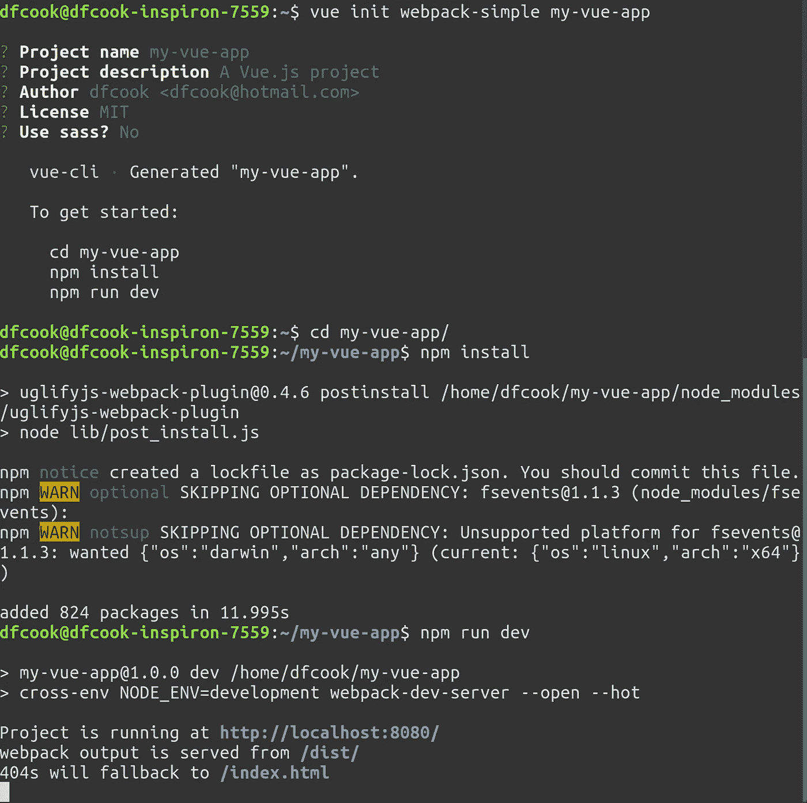
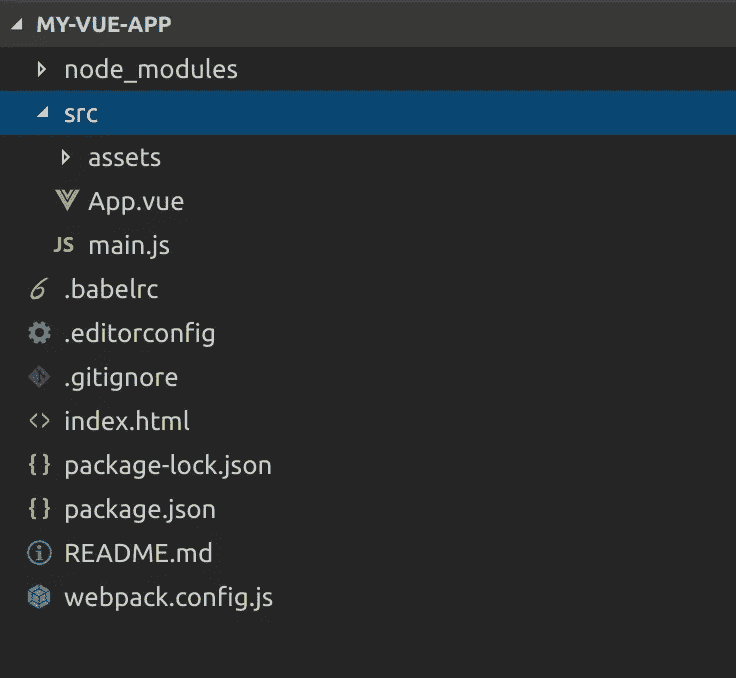
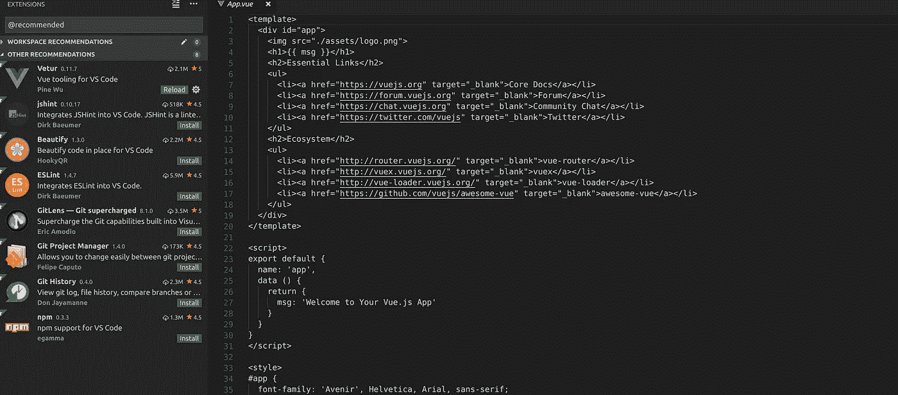
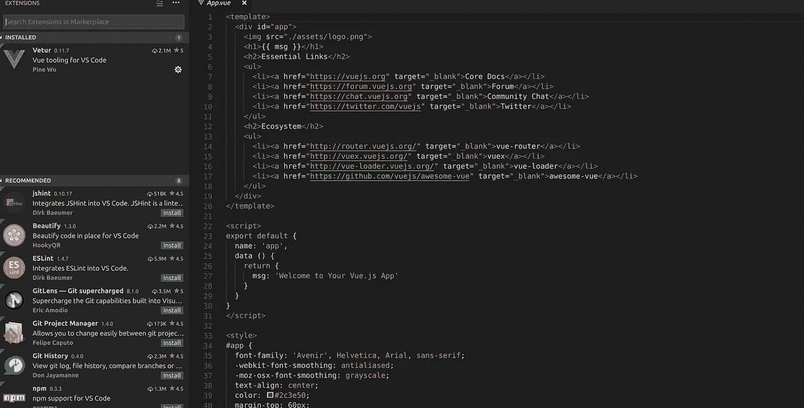
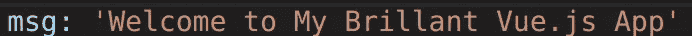

# 入门:Vue.js 和 Visual Studio 代码

> 原文：<https://itnext.io/getting-started-vue-js-and-visual-studio-code-6990f92e918a?source=collection_archive---------1----------------------->


> [点击这里在 LinkedIn 上分享这篇文章](https://www.linkedin.com/cws/share?url=https%3A%2F%2Fitnext.io%2Fgetting-started-vue-js-and-visual-studio-code-6990f92e918a)

2018 年的 Web 开发，可以感觉是在超音速前进。对于第一次构建自己的网站的新开发人员来说，不知道从哪里开始会很困惑。

本教程实际上并不是关于构建该站点的，它旨在帮助您在您的机器上安装一个工作环境，以便您只需担心如何使用 Vue.js 和 Visual Studio 代码来构建您需要的代码。

# [武威 js](https://vuejs.org/)

Vue.js 是一个现代的、渐进式的 javascript 框架，用于构建用户界面，在本例中用于构建 web 应用程序。它是当今三大 javascript 框架之一(另外两个是脸书的 React 和谷歌的 Angular)。与其他框架不同，Vue.js 最初是由一个开发人员[尤雨溪](https://medium.com/u/4f198f5f1f12?source=post_page-----6990f92e918a--------------------------------)创建的。它以简单、令人敬畏的文档和友好、平易近人的社区而闻名。

Vue 附带了一些很棒的工具，让你很容易上手，特别是一个[命令行界面](https://github.com/vuejs/vue-cli/blob/dev/docs/README.md)，它会确保你安装了正确的依赖项。

# [Visual Studio 代码](https://code.visualstudio.com/)

Visual Studio Code (VSCode)是微软的一款免费开源文本编辑器。自发布以来，由于其过多的扩展、定期添加的功能以及用户界面的速度和响应能力，它已经获得了巨大的欢迎。

# [Node.js](https://nodejs.org)

Node.js 是 Google Chrome 自带的基于 V8 引擎的 javascript 运行时构建，它对于现代 javascript 开发非常重要，尤其是因为它附带了 [npm](https://nodejs.org/) ，这是一个包管理器和脚本运行器，可以管理应用程序的所有依赖项。

# vue-cli 入门

首先安装一些软件，所有平台的 Node.js 下载在这里[可用，Mac、Windows 和 Linux 的 VSCode 在这里](https://nodejs.org/en/download/)和[可用](https://code.visualstudio.com/download)。

下载节点后，我们可以安装 Vue.js cli，打开终端并输入以下内容:

```
npm install -g @vue/cli
```

如果您在 linux 上运行，您需要在命令前面加上 sudo，您应该会看到类似下面的输出。



这个命令将 vue-cli 作为一个全局(因此是-g)包安装在我们的机器上。这意味着可以从命令行使用“vue”命令。现在就试试吧…..



现在，我们可以使用 init 命令从模板生成我们的 web 应用程序，我们将使用 webpack-simple 模板，但是您不需要了解 webpack 的所有信息(它是一个模块构建器，本身就是一个复杂的主题),因为 vue-cli 会为您处理这些信息。

```
vue init webpack-simple my-vue-app
```

输入上述命令将开始创建新的 vue 应用程序。它将在 my-vue-app 目录下创建，你只需要等待模板下载，然后回答一些配置问题，现在保留默认答案是安全的。

安装完成后，cd 进入新目录并输入:

```
npm install
npm run dev
```

这些命令指示 npm 下载项目需要的所有依赖项，然后启动应用程序。此时，您的终端应该如下所示:



希望你的浏览器在 [http://localhost:8080](http://localhost:8080) 打开时，会有一个漂亮的欢迎页面，里面全是重要的链接。恭喜你！您已经用 Vue.js 创建了您的第一个 web 应用程序。

# Visual Studio 代码入门

现在我们有了我们的框架应用程序，我们可以在 Visual Studio 代码中打开它。按 Ctrl+C 停止 web 服务器，然后输入:

```
code .
```

这将在当前目录中启动 VSCode，VSCode 是一个基于文件夹的编辑器，它不需要像一些大型 IDE(如 visual studio)那样的项目文件。在左侧，您应该会看到应用程序中文件夹的树形视图。



展开 src 文件夹并单击 App.vue，这将在右侧窗格中打开该文件。您应该还会收到来自 VSCode 的推荐弹出窗口，提示您安装 Vetur 扩展。

[Vetur](https://marketplace.visualstudio.com/items?itemName=octref.vetur) 是 VSCode 的惊人扩展，它为你的 Vue 单文件组件提供了以下内容:

*   语法突出显示
*   小片
*   蚂蚁
*   林挺/错误检查
*   格式化
*   自动完成
*   排除故障

因此，点击安装，扩展选项卡将打开，Vetur 应该安装，一旦完成，Vetur 图标旁边应该有一个蓝色的重新加载按钮，点击这个和这个:



变成了这个！



所有的 html、javascript 和 css 代码都从简单的灰色变成了漂亮的语法高亮颜色。

VSCode 有大量的扩展，可以处理 javascript、css 和其他 web 组件，而且非常易于配置。

现在，回到您的控制台，再次启动服务器:

```
npm run dev
```

vue-cli 已将热模块重新加载配置为 web 服务器安装的一部分，这意味着您可以在 VSCode 中更改您的应用程序，这些更改应该立即在您的浏览器中可见。

现在试试吧，在 App.vue 中，找到设置 msg 数据字段的那一行，把它改成别的:



转到您的浏览器，消息应该已经更新，而不需要重新启动您的服务器。

# 接下来呢？

现在，您有了一个使用 Vue.js 创建 web 应用程序的工作环境。要继续这一旅程，网上有大量优秀的资源。vue 文档中有很多有用的例子，在 youtube 和 T2 的 udemy 上有教程，在 T4 社交媒体上也有友好、平易近人的人，他们喜欢和 Vue.js 分享他们的经历

我希望这篇文章是有用的，这是我第一次尝试写关于编码的文章，希望得到反馈。