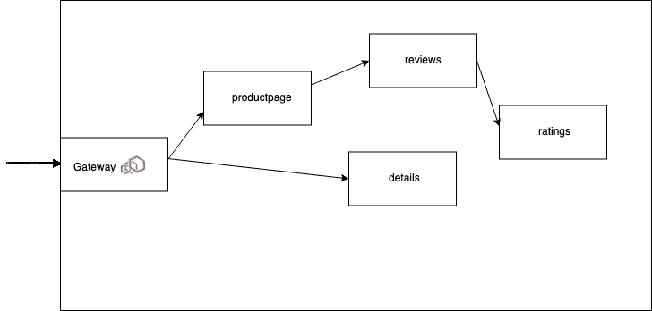
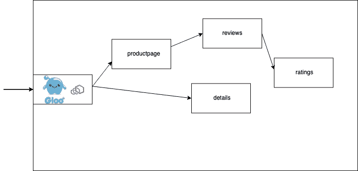
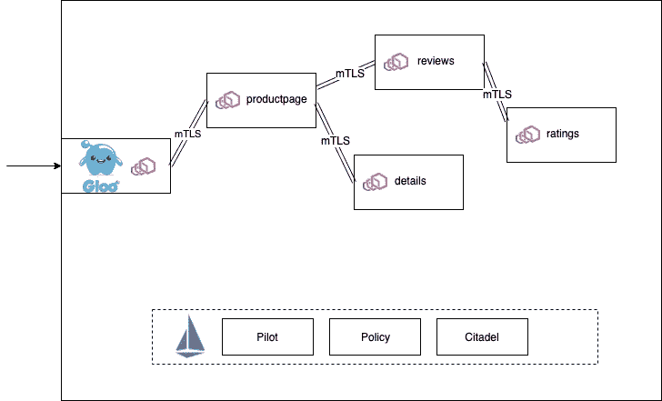

# 开始使用服务网格从网关开始

> 原文：<https://itnext.io/getting-started-with-a-service-mesh-starts-with-a-gateway-62a470350242?source=collection_archive---------3----------------------->

# 开始使用服务网格从网关开始

两年多来，我一直在服务网(service mesh)和 T2 特使代理(Envoy Proxy)上帮忙发布消息。看到社区是如何成长的，更重要的是，看到组织是如何开始使用它来解决困难的生产和运营问题的，真是令人惊讶。随着[我在 Red Hat 的时光](https://blog.christianposta.com/moving-on-from-red-hat/)，以及[现在的 Solo.io](https://blog.christianposta.com/career/new-adventure-starts-at-solo-io/) ，我很幸运地在他们的服务网格采用之旅中与组织密切合作。

这次，我开发了这种方法来成功地在生产中采用服务网格:

1.  深入了解最终服务网格的数据平面技术
2.  理想情况下，首先使用共享网关，以较小的流量部分运行数据平面
3.  选择应用程序子集以启用网状(基于边车)网络
4.  缓慢地启用服务网格中能够提供最大价值的功能
5.  冲洗并重复步骤 2–4

我离开 Red Hat 加入 Solo.io 的一个重要原因是我们对服务网格的[愿景，包括这个简单的采用列表，非常一致](https://medium.com/solo-io/the-multi-mesh-vision-and-how-supergloo-will-bring-it-to-life-a89891d8815c)。博客的其余部分是我们目前如何使用网关和数据平面优先的方法来帮助客户采用服务网格。

## 了解特使代理

[Envoy](https://www.envoyproxy.io) 已经成为许多服务网格技术的基础数据层。像 [Istio](https://istio.io) 、 [Consul Connect](https://www.consul.io) 、 [AWS App Mesh](https://aws.amazon.com/app-mesh/) 、 [Grey Matter](https://deciphernow.com/grey-matter) (其他来自现有 [API 管理厂商](https://medium.com/solo-io/api-gateways-are-going-through-an-identity-crisis-d1d833a313d7)的也有可能在路上)都是基于 Envoy 的。

特使是一项极其强大、通用和复杂的技术。在过去从事消息传递基础设施的工作中，[有一件事一直困扰着我](https://blog.christianposta.com/activemq/from-inside-the-code-activemq-network-connectors/),那就是从一个管道向另一个管道传递消息(或字节)表面上看起来很容易，但实际上比你想象的要困难得多。理解 Envoy 是如何工作的非常重要，包括它的各种过滤器、它收集的遥测数据以及它的配置 API 是如何工作的。这种理解最好通过在您的环境中操作 Envoy 的经验来获得。

理想情况下，您从单个特使部署(逻辑上是单个)开始部署您的应用程序。

## 使用基于 Envoy 构建的网关作为垫脚石

当采用服务网格时，使用 Envoy 作为共享网关是一个很好的起点。在我的书 [*Istio in Action*](https://www.manning.com/books/istio-in-action) 中，我在书的开头介绍了 Istio [网关资源](https://istio.io/docs/tasks/traffic-management/ingress/ingress-control/)及其相关配置[，](https://livebook.manning.com/book/istio-in-action/chapter-4)，因为这是开始使用 Istio 的最佳方式。该网关构建在 Envoy 上，可以部署您的微服务，而无需被迫构建完整的网格(即，在您的所有应用程序旁边注入 sidecars。

使用网关作为应用程序的前端意味着您既可以获得运行 Envoy 的操作体验，也可以获得“服务网格精简版”体验。当网关就位时，您可以获得一些强大的流量路由控制(包括基于百分比的路由、基于标头/方法的路由以及影子流量等)、TLS 终止/通过、TCP 控制等。

像 Istio 网关这样的简单网关可能是在开始时向您的集群提供基本流量入口的好方法，但基于 Envoy 构建的功能更全的 API 网关可能会提供更多好处。

## 建立在特使之上的更好的网关

现实是，当将集群/未来服务网格之外的客户端连接到集群/服务网格内运行的那些服务时，[必须考虑一个残酷的现实](https://medium.com/solo-io/api-gateways-are-going-through-an-identity-crisis-d1d833a313d7):现有组织已经有了关于流量如何流动的假设，并且应该受到保护。

例如，当通过网关将流量引入集群或新的服务网格时，我们需要解决以下问题:

*   贮藏
*   尖峰停止/速率限制
*   最终用户/客户 oauth 流程
*   HMAC/消息签名
*   jwt 验证(包括与现有 JWT 发行者或身份管理集成)
*   网络应用防火墙(WAF)
*   消息转换
*   API 编排

和许多其他人。换句话说，这个入口点需要比 a basic Envoy 网关(即 Istio 的网关)更强大、更有能力。它需要处理 API 网关中常见的熟悉的 edge 功能。

Solo.io 的 Gloo 是一个基于代理的 API 网关，它提供了两个世界的精华:

1.  通过简化采用单一前端网关的体验以及
2.  处理熟悉的 API 网关功能的能力。

Gloo 允许你[结合 API 网关和服务网格的特性](https://gloo.solo.io/gloo_integrations/)。Gloo 与所有服务网格实现完全集成，如 [Istio、Consul、AWS App Mesh 和 Linkerd](https://gloo.solo.io/gloo_integrations/service_mesh/) 。在指导团队实施 Envoy 的同时，我们已经通过这种简单的迭代方法获得了很多客户的成功。

[Gloo](https://gloo.solo.io/introduction/whygloo/)不同于[其他基于 Envoy](https://gloo.solo.io/introduction/others/) 构建的 API 网关，因为它是由一个拥有丰富的 Envoy 操作经验的团队构建的，是一个可扩展、灵活的控制平台，具有安全第一的思想，以及 Kubernetes 本地和非 Kubernetes 部署。

## 包扎

如果您正在迈向服务网格，请记住这一简单、可靠且真实的采用方法。Envoy 是事实上的服务网格数据平面(除了 Linkerd——至少在这一点上),围绕 Envoy 构建您的策略是重要的第一步。如果您正在探索不是基于 Envoy 构建的 API 管理或网关 L7 网络技术，您可能希望再看一眼，特别是如果您正在寻找一个到服务网格的简单入口。