# Azure DevOps 入门

> 原文：<https://itnext.io/getting-started-with-azure-devops-3158bf38544d?source=collection_archive---------7----------------------->

我最近在 Azure DevOps 的构建和发布管道方面做了很多工作，虽然这在我脑海中还记忆犹新，但我将发布几篇帖子来提醒我一些我已经学到的东西，可能会用到，也可能不会用到。这篇文章将作为后续文章的起点，供过去可能没有使用过 Azure DevOps 的读者阅读。


在继续之前，请确保注册一个[免费 Azure DevOps 帐户](https://azure.microsoft.com/en-us/services/devops/)。

## 创建新项目

当你第一次登录 Azure DevOps 时，你应该会看到类似下面的东西，它在左边列出了你的所有组织，ericlanderson 是我使用的样本组织。在页面的 man 部分，确保你在**项目**选项卡上，然后点击**新项目**按钮。

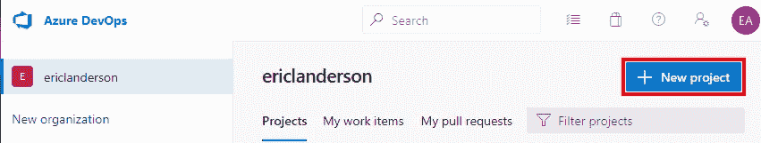

在下一个屏幕上，只需要一个项目名称。如果您确实希望允许公众访问项目，您必须调整组织策略。在高级下，你也可以调整你想要如何管理项目的工作，但是这超出了这篇文章的范围。完成后，点击**创建**按钮。

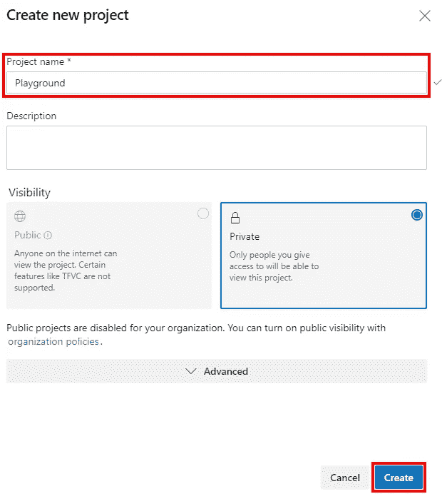

## 初始化一个回购

项目创建完成后，您将进入项目登录页面，如下所示。现在我们想为这个项目初始化一个新的 repo。点击 **Repos** 按钮。

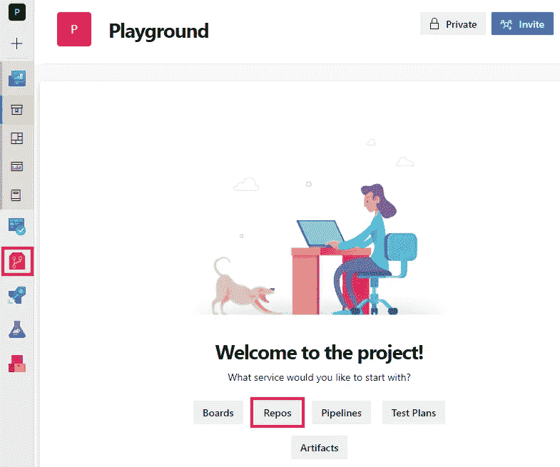

因为示例项目将会是。对于 Visual Studio，我选择使用. gitignore。选择所需选项后，点击**初始化**按钮。

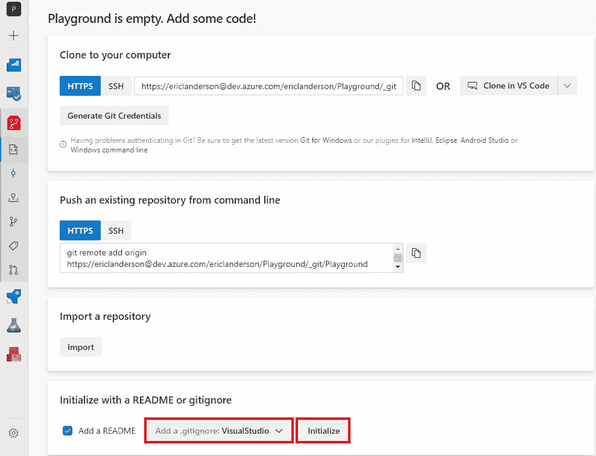

初始化过程完成后，您将被带到 repo 的文件视图。

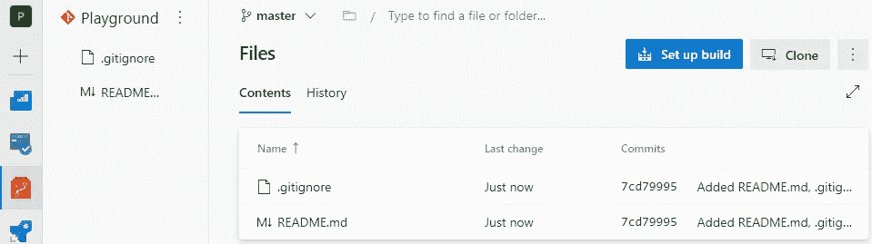

## 连接到项目并从 Visual Studio 克隆 repo

现在我们有了 Azure DevOps 设置，是时候切换到 Visual Studio 并与我们的新项目交互了。在 Visual Studio 中，与 Azure DevOps 的所有交互都将通过**团队资源管理器**窗口进行。第一步是连接到项目。在团队资源管理器窗口中点击插头图标。

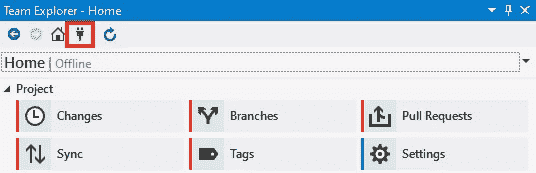

接下来，点击**管理连接**，然后点击**连接到项目**。

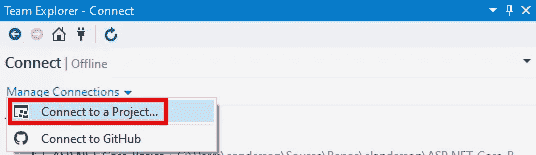

在显示的对话框中，您需要使用下拉菜单并选择**添加一个帐户**，如果您已经像我一样连接了一个帐户，如果没有，那么过程可能会略有不同。

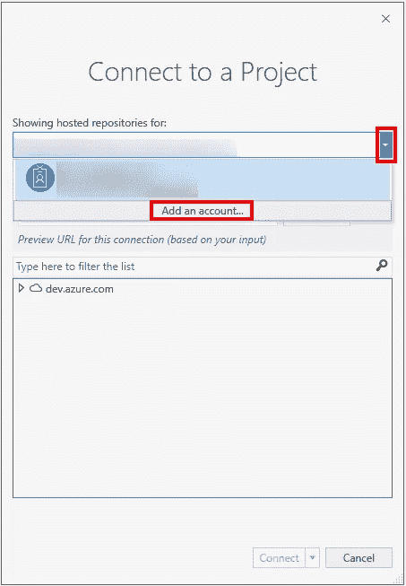

在使用您的 Azure DevOps 凭据完成登录过程后，您应该会看到您的组织被列出，并且在它下面是您的项目。在这种情况下，项目和回购具有相同的名称。选择回购并点击**克隆**。

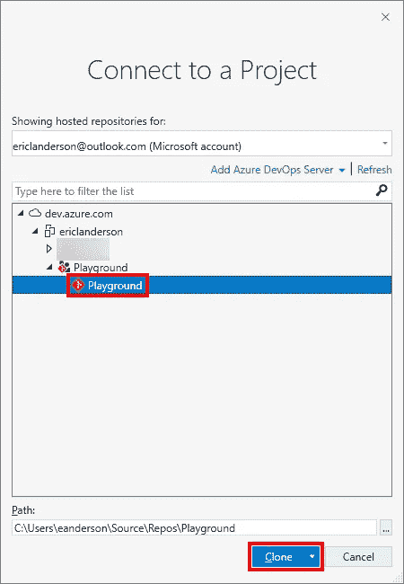

## 创建示例应用程序

既然已经克隆了回购协议，我将使用。NET CLI。从上面的副本的根文件夹中打开命令提示符，并使用以下命令创建一个新的 Visual Studio 解决方案。

```
dotnet new sln -n Playground
```

接下来，使用下面的命令创建一个新的 web 应用程序。

```
dotnet new webapp -o src/WebApp1
```

然后将新项目添加到解决方案文件中。

```
dotnet sln add src/WebApp1/WebApp1.csproj
```

然后，我重复了一次项目创建过程，主要是为了让我们在未来的帖子中有更多的工作。下面是创建第二个项目并将其添加到现有解决方案中的命令。

```
dotnet new webapp -o src/WebApp2
dotnet sln add src/WebApp2/WebApp2.csproj
```

## 提交代码并推送到 Azure DevOps

回到 Visual Studio 的 Team Explorer 窗口中，我们需要切换到 **Changes** 区域。有几种方法可以到达修改区域。如果您在家庭区域，可以单击“更改”按钮。

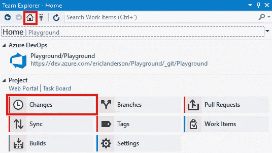

另一个选项是单击当前区域，并从下拉菜单中选择新区域。例如，在下面的截图中，我点击**分支**显示下拉菜单，然后可以点击**变更**。

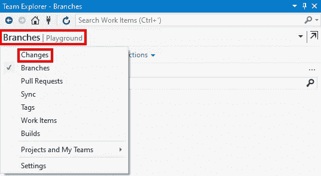

输入提交消息，如果您使用**全部提交**按钮上的下拉菜单并选择**全部提交并同步**，它会将所有更改推送到关联的 Azure DevOps 分支。

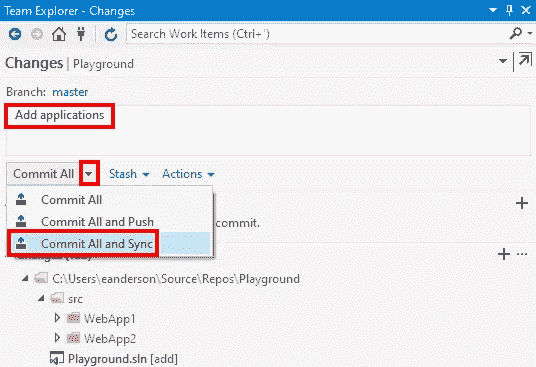

## 包扎

如果你是 Azure DevOps 的新手，希望这能给你一个好的起点，并为将来的一些帖子提供一个基础。

*最初发表于* [*埃里克·安德森*](https://elanderson.net/2020/02/getting-started-with-azure-devops/) *。*