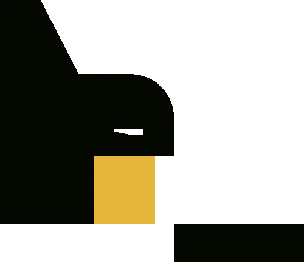
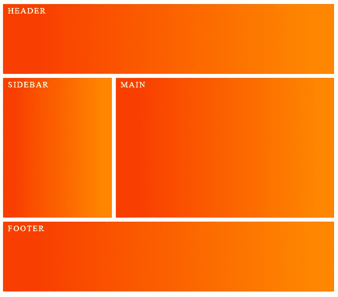

# 3 分钟后 BEM！

> 原文：<https://itnext.io/getting-started-with-bem-6d59317d9ba1?source=collection_archive---------0----------------------->



图片来自[粉碎杂志](https://www.smashingmagazine.com/2018/06/bem-for-beginners/)

如果您不熟悉 BEM，那么入门很简单！它将为原本不存在的样式表增加大量的结构、可伸缩性和健壮性。

**那么什么是 BEM 呢？**

> BEM—**B**lock**E**element**M**odifier 是一种帮助你在前端开发中创建可重用组件和代码共享的方法论—[getbem.com](http://getbem.com/)

如果你见过类似`form__submit--disabled`的类名，那就是 BEM 在起作用。这种方法的使用允许我们在 HTML 和 CSS/Sass 文件中创建更加一致的编码结构。

**我该怎么做？**

你所需要做的就是根据 BEM 命名约定来命名你的类。这篇文章提供了一个快速运行下来..

🤓*想跟上网络发展的步伐吗？*
🚀想要最新的新闻直接发送到你的收件箱吗？
🎉加入一个不断壮大的设计师&开发者社区！

**在这里订阅我的简讯→**[**https://ease out . EO . page**](https://easeout.eo.page/)

# 街区

*块*是元素所在的容器或上下文。它应该能够独立存在，并且在代码的整体结构中仍然有意义。典型的布局通常包括页眉、侧栏、主要内容区域&页脚，这些都被认为是块:



所以块是形成代码结构根的独立元素，在这个例子中我们有`.header, .sidebar, .main`和`.footer`。它们不依赖于页面上的任何其他块/元素。

每个块中都包含元素..

# 元素

*元素*是块的一部分，在块外没有语义含义。因为每个元素在语义上都与它的块相关联。语法如下:

`.block__element{}`

元素使用块名编写，由两个下划线连接。

例如，我们的标题可能包含一个徽标、导航条和搜索框。这些元素类的命名如下:

`.header__logo{}`

`.header__navbar{}`

`.header__searchbox{}`

您已经可以看到可读性更好的代码结构的开端。在从事大型项目时，约定的重要性会显著增加，尤其是在协作时。

# 修饰语

一个*修饰符*是块或元素上的一个标志，用于改变外观、行为或状态。这是边界元法最大的优点之一；模块化。通过使用修改器，可以扩展块或元素，使其可重复。这是一个巨大的胜利，因为它促进了代码重用和组件驱动的编码。语法是这样的:

`.block--modifier{}`

`.block__element--modifier{}`

一个双连字符`--`被添加在块或元素之后，后跟修饰符名称。

所以拿我们的`.header__navbar{}`元素来说。我们可能希望为辅助导航条创建一个修饰符，用附加的样式扩展元素，就像这样..

`.header__navbar--secondary{}`

如果您的样式基本相同，使用 Sass，您可以简单地从父元素扩展，然后根据需要添加修饰符。请看下面的例子，它改变了辅助导航栏的背景颜色..

```
.header__navbar {
  list-style-type: none;
  background: #ff0000;
  padding: 1rem 0;
  text-transform: uppercase; 
}.header__navbar--secondary {
  @extend .header__navbar;
  background: #ff4500;
}
```

就是这样！修改器样式将覆盖父样式。您的代码将更加简洁，也更容易使用。

***你准备好让你的 CSS 技能更上一层楼了吗？*** *现在就开始用我的新电子书:*[*CSS 指南:现代 CSS 完全指南*](https://gum.co/the-css-guide) *。获取从 Flexbox & Grid 等核心概念到动画、架构等更高级主题的最新信息！！*


*现已上市！👉*gum.co/the-css-guide

# 结论

BEM 是向前端开发添加结构和层次的简单方法。我希望这个简短的指南足以让你开始工作！一如既往，有更多的探索。查看以下内容:

**资源:**

*   [Bem.info:方法论](https://en.bem.info/methodology/)
*   [实例边界元法](https://seesparkbox.com/foundry/bem_by_example)
*   [BEM 主页](http://bem.info/)

今天就到这里吧！我希望这篇文章对你有用。可以[跟着我](https://medium.com/@timothyrobards)上媒。我也在[推特](https://twitter.com/easeoutco)上。欢迎在下面的评论中留下任何问题。我很乐意帮忙！

# 关于我的一点点..

嘿，我是提姆！👋我是一名开发人员、技术作家和作家。如果你想看我所有的教程，可以在我的个人博客上找到。

我目前正在构建我的[自由职业完全指南](http://www.easeout.co/freelance)。坏消息是它还不可用！但是如果这是你可能感兴趣的东西，你可以[注册，当它可用时会通知你](https://easeout.eo.page/news)👍

感谢阅读🎉