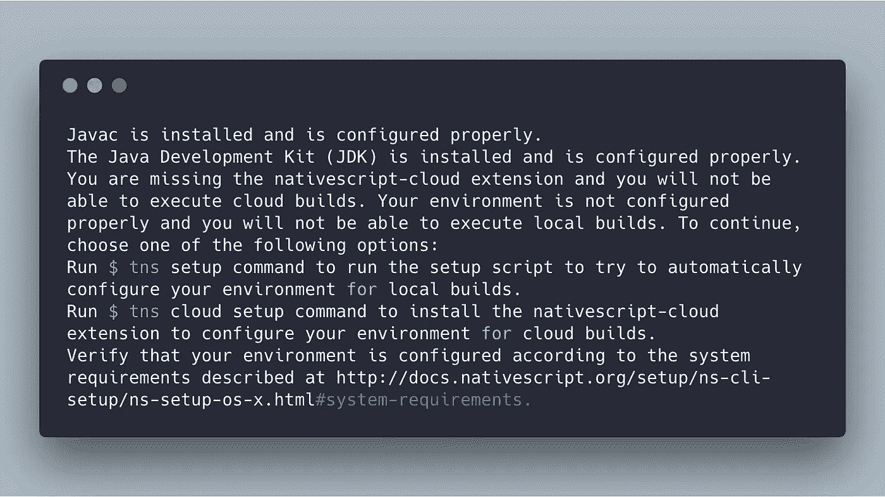
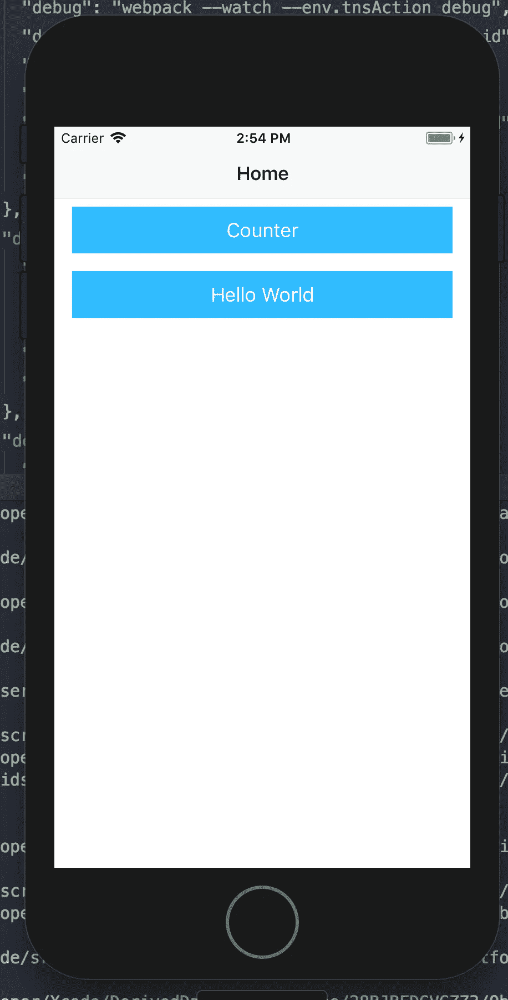
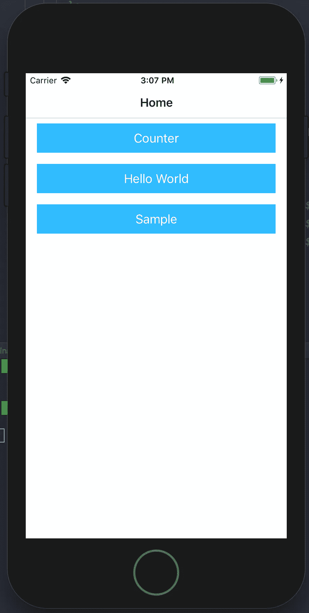
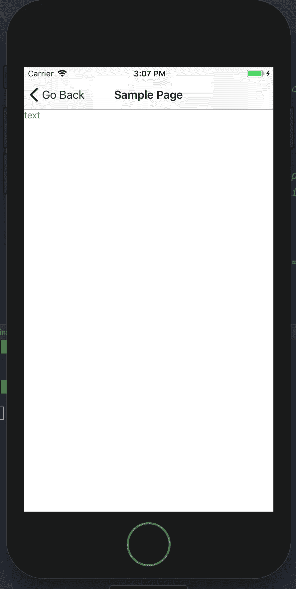

# 开始使用 NativeScript 和 Vue.js 构建移动应用程序

> 原文：<https://itnext.io/getting-started-with-building-mobile-apps-with-nativescript-and-vue-js-59a7dcf24cd?source=collection_archive---------7----------------------->

> *NativeScript 是一个用 JavaScript 构建移动 iOS 和 Android 应用的框架。它是免费使用的，并且有一个 Vue.js 初学者工具包可以让你快速上手。在本教程中，我将使用指南引导您开始使用 NativeScript + Vue，并重点关注使用初学者模板构建一个示例 iOS 应用程序。*

# 为什么是 NativeScript？

NativeScript 是一个用于构建移动应用的开源框架，支持 Vue.js、Angular、TypeScript 和 plain ol JavaScript。它以速度快、具有“原生性能”、易于扩展和学习而自豪。绝对值得一提的是，NativeScript 由 Progress Software 提供支持，该公司收购了 Telerik，并为开发人员提供了许多强大的 UI 工具。对于 Vue Js 开发人员来说，NativeScript 为我们提供了一个工具来构建像移动应用程序一样运行的移动应用程序，并且不需要一直依赖于 WebView(混合应用程序)。虽然有 Weex，但 NativeScript 得到了更好的支持&针对西方英语世界进行了记录。

正如官方[文档](https://nativescript-vue.org/en/docs/getting-started/installation/)指出的，在开始使用 NativeScript 之前，您需要做一些准备工作:

*   Node.js(最新最好)
*   NativeScript CLI
*   使用 NativeScript 设置操作系统

这实际上是本教程中最难的部分，因为您需要将大部分工具更新到最新版本，否则很有可能会导致一些构建过程失败。一旦你通过了设置阶段，开发本身就类似于构建任何普通的 Vue.js 应用程序。

# 更新 Node.js

将 Node.js 版本更新至最新版本。如何做到这一点在很大程度上取决于您的操作系统以及您对管理 NPM 和节点的偏好。大卫·沃什有这篇关于如何更新[的文章。请注意，这是过时的，他在顶部有一个注释，建议使用 NVM 代替。](https://davidwalsh.name/upgrade-nodejs)

# NativeScript CLI

接下来，您需要安装 NativeScript CLI

```
npm install -g nativescript
```

如果一切顺利，您将得到一些提示来完成设置。

# 带本机脚本的操作系统

可能最耗时的任务是在您的特定操作系统上安装 NativeScript 本身。NativeScript Vue 文档有您的操作系统的特定链接[在这里](https://nativescript-vue.org/en/docs/getting-started/installation/)。

在本教程中，我们将假设我们在一台 Mac 电脑上，正在开发一个 iOS 应用程序。因此，为了继续，我们应该确保您的电脑已经安装了 xCode。

# 入门指南

好的，希望你已经走了这么远，并且有了合适的环境设置。

对于本教程，您有两个选择。你可以在这里试用一下[提供的 NativeScript 模板`nativescript-vue/vue-cli-template`。这将带您完成一个设置](https://github.com/nativescript-vue/vue-cli-template)

或者如果你愿意，你可以在这里复制我创建的教程 repo[。](https://github.com/andreliem/vue-nativescript-getting-started)

```
git clone git@github.com:andreliem/vue-nativescript-getting-started.git
```

如果您喜欢从头开始使用 NS 模板，请运行以下命令来设置您的项目:

```
vue init nativescript-vue/vue-cli-template vue-nativescript-getting-started
```

你会被提示一系列关于你的项目的问题。对于本教程，我们选择了`Yes`来安装`vue-router`和`vuex`。另外，我们选择了`light`的配色方案，但是你可以随意使用任何你喜欢的颜色。

安装完成后，您将获得如下所示的目录结构:

这里有很多文件，现在不要担心，我们将在未来的教程中讨论这个问题。

# 建造它

让我们继续构建这个应用程序，看看会发生什么。

首先安装这个项目所需的包。

```
npm install
```

接下来，让我们试着打开调试在本地运行它。

```
npm run watch:ios
```

如果你的设置和我的一样，你可能会收到如下抱怨，因为我们从来没有完全设置好 NativeScript。



如果您没有收到任何错误，那么您可以跳过接下来的 2 节，开始使用 NativeScript 进行设置！

# 安装本地脚本

因为我们安装了 NativeScript CLI，所以我们可以运行以下命令:

```
tns setup
```

它会要求你安装 xCode、HomeBrew、Google Chrome、Java SDK、Android SDK 等等……如果你对安装所有东西都满意，那么输入`A`接受`All`。这是到目前为止最不有趣的部分了！

安装可能需要一段时间，所以在你等待的时候喝杯你最喜欢的饮料吧:)。

# 设置本机脚本云

我们将遵循建议，使用以下命令安装 NativeScript cloud。

```
tns cloud setup
```

这应该不会花太长时间。

现在让我们再次尝试构建步骤:

```
npm run watch:ios
```

如果这样做没有任何重大错误，您应该会看到 xCode 显示一个 iPhone，最终会显示如下屏幕:



如果你看到这个，恭喜你！现在，您已经设置好并准备好构建本机应用程序了！

# 测试这个

让我们从简单的事情开始，在你的项目中，转到`HelloWorld.vue`并更新`template`中的一些文本。一旦你更新它，你会看到应用程序重新载入的变化。

# 扩展演示应用程序

现在我们有了应用程序设置，让我们看看如何在应用程序中添加新的屏幕或部分。

# 路由器

打开`src/router/index.js`，添加一个新路径，如下图所示

# 样本组件

接下来，让我们用一些非常基本的代码创建样本组件`src/components/Sample.vue`。

# 将部分添加到主页

最后，让我们添加一个从主页到这个示例页面的链接，作为堆栈布局中的另一个按钮

如果一切顺利，您的应用程序将如下所示:



# 添加一些元素

使用 NativeScript，很容易添加一些在典型应用程序中需要的常见表单元素。使用我们构建的示例页面，让我们添加一个典型的日期选择器和按钮。现在，页面的主体应该是这样的:

我们添加了 DatePicker 和 Button 元素，并根据特定的操作调用适当的方法。

日期更改后，我们将显示一个基本的`alert`提示窗口，并将呼叫记录回控制台。至于按钮，让它显示通用的动作提示，可以用于各种钩子。在这个场景中，我们将提供两个选项，并通过回调来处理结果。

示例页面现在应该是这样的:


# 包扎

就像这样，我们已经在使用 Vue.js 代码构建一个真正的原生应用了！您可能几乎忘记您正在使用 NativeScript，因为一切都在熟悉的 Vue 世界中。在以后的文章中，我会更详细地介绍如何构建一个真实世界的应用程序，如果你喜欢，请分享，不要忘记订阅时事通讯。别忘了，你可以在 github [这里](https://github.com/andreliem/vue-nativescript-getting-started)获得这个教程的源代码。

【www.vuejsradar.com】最初发表于[](https://www.vuejsradar.com/getting-started-with-building-mobile-apps-with-nativescript-and-vuejs/)**。**