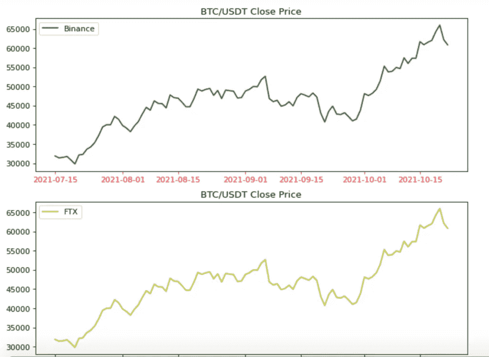
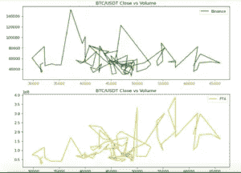
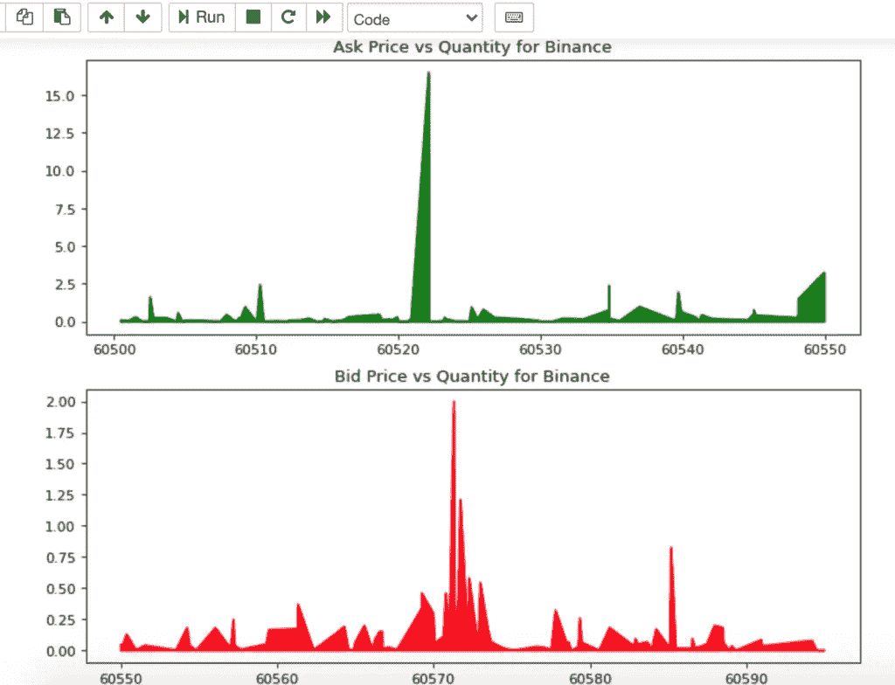

# CCXT 加密交换库和 Python 入门

> 原文：<https://itnext.io/getting-started-with-ccxt-crypto-exchange-library-and-python-93175d5a898d?source=collection_archive---------0----------------------->


我已经在我的气流相关的文章[中使用了 CCXT 库。在这篇文章中，我将专门讨论这个库，以及如何使用它从交易所或交易自动化中提取不同类型的数据。](http://blog.adnansiddiqi.me/using-apache-airflow-etl-to-fetch-and-analyze-btc-data/)

# 什么是 CCXT

**C**rypto**C**currency e**X**change**T**rading Library aka CCXT 是一个用于加密货币交易和电子商务的 JavaScript / Python / PHP 库，支持许多比特币/以太/替代币交易市场和商户 API。它与超过 100 个交换机连接。这个库最好的一个特点就是*交换竞技*，也就是不管你用币安还是 FTX，套路的签名都是一样的。它有 Python、Javascript 和 PHP 版本。它支持不同交易所提供的公共和私有 API，但是我将只讨论几个公共 API 端点。

# 开发设置

安装库非常容易。你所要做的就是在终端中运行`pip install ccxt`。

好了，库安装好了，我们接个交换机吧。我现在正在连接币安交易所。

## 连接到 exchange

第一步也是最明显的一步是首先连接交换机，这相当容易。

```
# Connect binance binance = ccxt.binance()
```

## 装载市场

交易所已连接，现在该加载交易所提供的所有市场了。通常，它不被使用，但是它能给你一个很好的主意某一双是否可用。

## 获取股票

让我们获取与 BTC/USDT 相关的信息。

```
btc_ticker = binance.fetch_ticker('BTC/USDT') btc_ticker
```

它返回:

```
{'symbol': 'BTC/USDT', 'timestamp': 1634909924391, 'datetime': '2021-10-22T13:38:44.391Z', 'high': 65564.0, 'low': 62000.0, 'bid': 63363.89, 'bidVolume': 1.32351, 'ask': 63363.9, 'askVolume': 0.27138, 'vwap': 63105.52714333, 'open': 65470.0, 'close': 63363.9, 'last': 63363.9, 'previousClose': 65469.99, 'change': -2106.1, 'percentage': -3.217, 'average': None, 'baseVolume': 53395.84423, 'quoteVolume': 3369572897.3972454, 'info': {'symbol': 'BTCUSDT', 'priceChange': '-2106.10000000', 'priceChangePercent': '-3.217', 'weightedAvgPrice': '63105.52714333', 'prevClosePrice': '65469.99000000', 'lastPrice': '63363.90000000', 'lastQty': '0.00843000', 'bidPrice': '63363.89000000', 'bidQty': '1.32351000', 'askPrice': '63363.90000000', 'askQty': '0.27138000', 'openPrice': '65470.00000000', 'highPrice': '65564.00000000', 'lowPrice': '62000.00000000', 'volume': '53395.84423000', 'quoteVolume': '3369572897.39724530', 'openTime': 1634823524391, 'closeTime': 1634909924391, 'firstId': 1109039843, 'lastId': 1110609081, 'count': 1569239}}
```

除了股票和时间戳，它还返回开盘价、最高价、最低价、收盘价、成交量、买价和卖价等数据点。

## 获取 OHLCV 数据

获取 OHLCV 数据非常简单，您所要做的就是:

```
btc_usdt_ohlcv = binance.fetch_ohlcv('BTC/USDT','1d',limit=100)
```

这里，第一个参数是交易对，第二个参数是持续时间，它告诉你是否需要一天级别的数据，分钟，或一个月。每个 OHLCV 条目代表一个烛台。由于持续时间的差异是一天，数据将始终处于从 UTC 午夜 12 点开始的 24 小时差异中。最后一个参数`limit`是可选的。打印时，数据以下列格式返回:

```
[[1634774400000, 66001.4, 66639.74, 62000.0, 62193.15, 68538.64537], [1634860800000, 62193.15, 63732.39, 62000.0, 62680.01, 24059.82478]]
```

数据以以下格式返回:时间戳、开盘、盘高、盘低、收盘和成交量。让我们把它变得有趣。我将从币安和 FTX 交易所提取 BTC/USDT 价格，并绘制出*收盘价*的图表。



收盘 vs 成交量怎么样？



很脏，对吧？就好像一个小孩在纸上画了一些东西，但是这叫做*波动*！

## 获取订单簿

现在让我们调出币安和 FTX 的订单簿。

```
orderbook_binance_btc_usdt = binance.fetch_order_book('BTC/USDT') orderbook_ftx_btc_usdt = ftx.fetch_order_book('BTC/USDT') bids_binance = orderbook_binance_btc_usdt['bids'] asks_binanace = orderbook_binance_btc_usdt['asks'] df_bid_binance = pd.DataFrame(bids_binance, columns=['price','qty']) df_ask_binance = pd.DataFrame(asks_binanace, columns=['price','qty'])
```

让我们绘制图表！

```
fig, (ax1, ax2) = plt.subplots(2, figsize=(10, 8), dpi=80) ax1.plot(df_bid_binance['price'], df_bid_binance['qty'],label='Binance',color='g') ax1.fill_between(df_bid_binance['price'], 
df_bid_binance['qty'],color='g') ax2.plot(df_ask_binance['price'], df_ask_binance['qty'],label='FTX',color='r') ax2.fill_between(df_bid_binance['price'], df_bid_binance['qty'],color='r') ax1.set_title('Ask Price vs Quantity for Binance') ax2.set_title('Bid Price vs Quantity for Binance')
plt.show()
```

它会产生…



很酷，不是吗？

# 结论

这是对 *CCXT* 库的简单介绍。我只是触及了表面。如果你感兴趣，你可以基于这个库创建一个交易机器人。有几个以前做过。像往常一样，代码可以在 [Github](https://github.com/kadnan/CCXTPythonTutorial) 上获得。

*原载于 2021 年 10 月 23 日*[*http://blog . adnansiddiqi . me*](http://blog.adnansiddiqi.me/getting-started-with-ccxt-crypto-exchange-library-and-python/)*。*