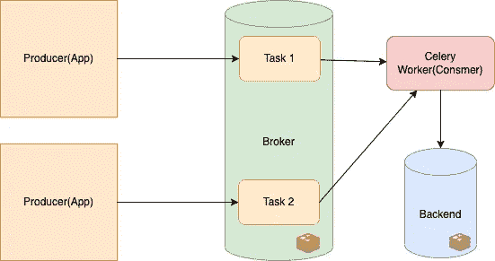
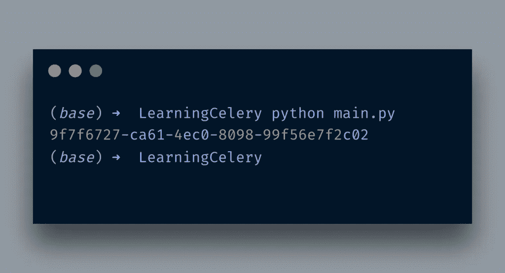
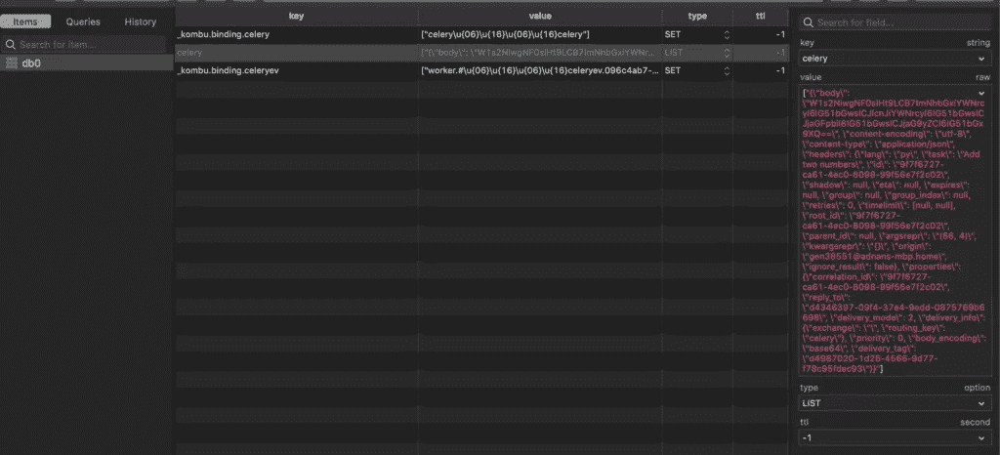
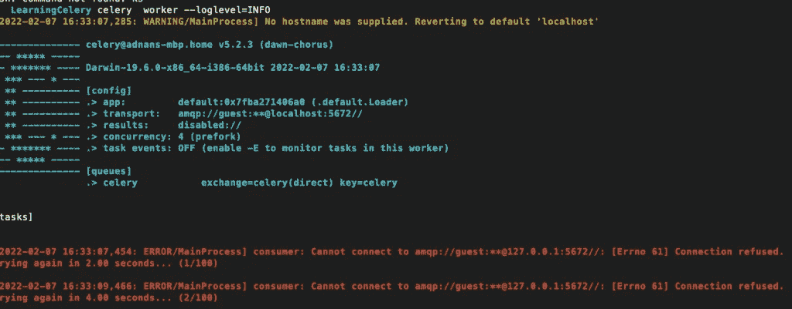
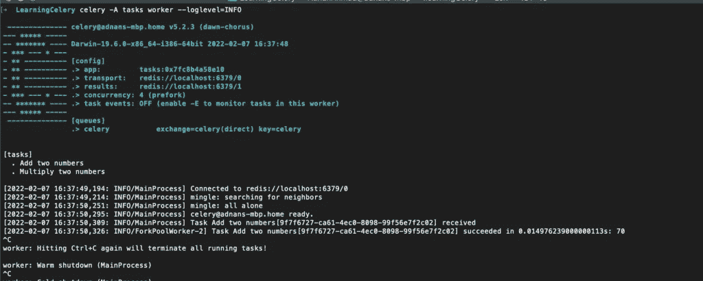

# 芹菜和 Python 入门

> 原文：<https://itnext.io/getting-started-with-celery-and-python-3c5fb2425aa8?source=collection_archive---------3----------------------->


在这篇文章中，我将谈论芹菜，它是什么，以及如何使用它。

# 芹菜是什么

来自官方[网站](https://docs..org/en/stable/):

> Celery 是一个简单、灵活、可靠的分布式系统，用于处理大量的消息，同时提供维护这样一个系统所需的工具。

[维基百科](https://en.wikipedia.org/wiki/Celery_(software))说:

> Celery 是基于分布式消息传递的开源**异步**任务队列或作业队列。虽然它支持调度，但它的重点是实时操作。

简而言之，Celery 非常适合处理可能被延迟且不需要实时交互的异步或长时间运行的任务。它还可以用于运行计划任务。任务*是一段执行特定操作的代码。*

# 芹菜用例

芹菜可能有许多用例，下面给出了其中一些:

*   **发送邮件:-** 你可以把发送邮件的任务交给芹菜，并向用户显示一个*感谢*页面，而不是让用户在填写注册表单后等待。你可能会说，它不需要时间来执行电子邮件发送代码，但如果电子邮件服务器没有响应，如果你让这部分同步，你的网站访问者将不得不等待，直到超时发生。
*   **图片/其他文件上传及相关信息:-** 现在通过网页上传图片或其他类型的文档非常普遍。假设您想要提供一个工具来上传包含产品图片的产品信息。您还想根据自己的要求调整图像的大小，并用您的品牌名称对它们进行水印处理。用户在所有这些操作过程中等待看起来并不好。他想要的只是看到他的过程已经完成的文本，然后继续前进。你可以创建多个芹菜*任务*来实现你的目标。
*   **预定任务:-** Celery 还可以充当调度程序，可以用来执行周期性任务。

# 芹菜概念

芹菜的基本架构如下所示:



*   **生产者:-** 这个应用程序负责推送消息与所有需要的信息。
*   **Broker:-** 这个模块实际上是作为一个消息队列，像 Redis 或者 RabbitMQ 这样的应用程序可以在这里使用。
*   **Task**:-Task 是一个 Python 函数或任务，在序列化之后在代理中排队。然后，任务函数由负责反序列化并执行它的工作人员挑选。默认的序列化格式是 JSON，你可以把它改成`msgpack`、YAML 或者 pickle。
*   **后端:-** 这个组件负责存储函数产生的结果

# 开发设置

使用 pip 安装芹菜:

`pip install celery`

你也需要一个经纪人，所以我用的是 Redis 的 docker 版本。

`docker run -d -p 6379:6379 redis`

现在我们已经安装了芹菜，Redis 已经启动，让我们写一些代码。

如上所述，每个逻辑单元/功能被称为一个*任务。我正在编写一个将两个数相加并返回结果的函数。*

```
from celery import Celery

BROKER_URL = 'redis://localhost:6379/0'
BACKEND_URL = 'redis://localhost:6379/1'
app = Celery('tasks', broker=BROKER_URL, backend=BACKEND_URL, )

@app.task(name='Add two numbers')
def add(x, y):
    return x + y
```

“任务”已经定义，是时候运行它了。函数`add`将在 Redis 中排队，它将在`delay()`函数的帮助下调用`apply_async()`函数，后者将序列化该函数以供进一步处理。现在是时候结束了。在`main.py`我会这样写:

```
from tasks import add
result = add.delay(66, 4)
print(result.id)
```

正如我提到的,`delay`实际上是将函数发送到队列中进行后续处理。它接受与原始函数相同的参数。

`tasks.py`包含主逻辑和配置。`BACKEND_URL`和`BROKER_URL`包含存储相关信息的数据库的路径。任务装饰器负责将一个简单的函数转换成一个任务。您可以设置属性的*名称*来为您的任务命名。

现在，让我们运行`main.py`来对任务进行排队。当我运行时，它会产生如下结果:



如您所见，它返回了一个任务 id。在 Redis 端，它存储如下内容:



如您所见，任务 ID 和其他信息在这里都是可见的。为了更清楚起见，JSON 数据也张贴在下面。

```
["{\"body\": \"W1s2NiwgNF0sIHt9LCB7ImNhbGxiYWNrcyI6IG51bGwsICJlcnJiYWNrcyI6IG51bGwsICJjaGFpbiI6IG51bGwsICJjaG9yZCI6IG51bGx9XQ==\", \"content-encoding\": \"utf-8\", \"content-type\": \"application/json\", \"headers\": {\"lang\": \"py\", \"task\": \"Add two numbers\", \"id\": \"9f7f6727-ca61-4ec0-8098-99f56e7f2c02\", \"shadow\": null, \"eta\": null, \"expires\": null, \"group\": null, \"group_index\": null, \"retries\": 0, \"timelimit\": [null, null], \"root_id\": \"9f7f6727-ca61-4ec0-8098-99f56e7f2c02\", \"parent_id\": null, \"argsrepr\": \"(66, 4)\", \"kwargsrepr\": \"{}\", \"origin\": \"gen38551@adnans-mbp.home\", \"ignore_result\": false}, \"properties\": {\"correlation_id\": \"9f7f6727-ca61-4ec0-8098-99f56e7f2c02\", \"reply_to\": \"d4346397-09f4-37e4-9edd-0875769b6698\", \"delivery_mode\": 2, \"delivery_info\": {\"exchange\": \"\", \"routing_key\": \"celery\"}, \"priority\": 0, \"body_encoding\": \"base64\", \"delivery_tag\": \"d4987020-1d26-4566-9d77-f78c95fdec93\"}}"]
```

你可以看到`body`的值是 base64。如果我解码`W1s2NiwgNF0sIHt9LCB7ImNhbGxiYWNrcyI6IG51bGwsICJlcnJiYWNrcyI6IG51bGwsICJjaGFpbiI6IG51bGwsICJjaG9yZCI6IG51bGx9XQ==`,它会给出以下输出:

`[[66, 4], {}, {"callbacks": null, "errbacks": null, "chain": null, "chord": null}]`

请注意值为 66 和 4 的列表。这些是您在函数中传递的参数。其他信息如任务名称、语言等也可以在上面的 JSON 中看到。

好了，到目前为止，你所做的是，你把数据放入了被序列化的队列中。它还没有被消耗，为此你需要启动工人。您可以像下面这样调用工人:

`celery -A tasks worker --loglevel=INFO`

`-A`切换应用名称，此处为`tassks`。这个名字本身来自于任务文件的名字`tasks.py`。然后您告诉我们您想要调用一个带有日志级别的 worker。但是等等，在我运行这个命令之前，让我运行芹菜工人命令，而不传递工人名称



如您所见，celery worker 尝试连接默认值失败。另外，`[tasks]`部分是空的。现在，让我们运行正确的命令



注意代理、后端和任务名称的 URL。现在你明白为什么需要传递应用程序名了。

您还可以注意到任务**添加了两个数字**以及首先*接收到*然后成功执行的任务 id。注意图中的 **70** 是 **66** 和 **4 的总和。**因此，没有必要立即处理被推入队列的任务。

由于我们也使用后端，任务执行的结果存储如下:

```
{ "status": "SUCCESS", "result": 70, "traceback": null, "children": [ ], "date_done": "2022-02-07T11:37:50.312117", "task_id": "9f7f6727-ca61-4ec0-8098-99f56e7f2c02" }
```

# 结论

芹菜对可以推迟的任务很有帮助。其灵活的架构使其适用于多种用途。我刚刚讨论了它的基本用法。如果您正在寻找其他用途，您可以遵循这些文档。

*原载于 2022 年 2 月 7 日*[*http://blog . adnansiddiqi . me*](http://blog.adnansiddiqi.me/getting-started-with-celery-and-python/)*。*