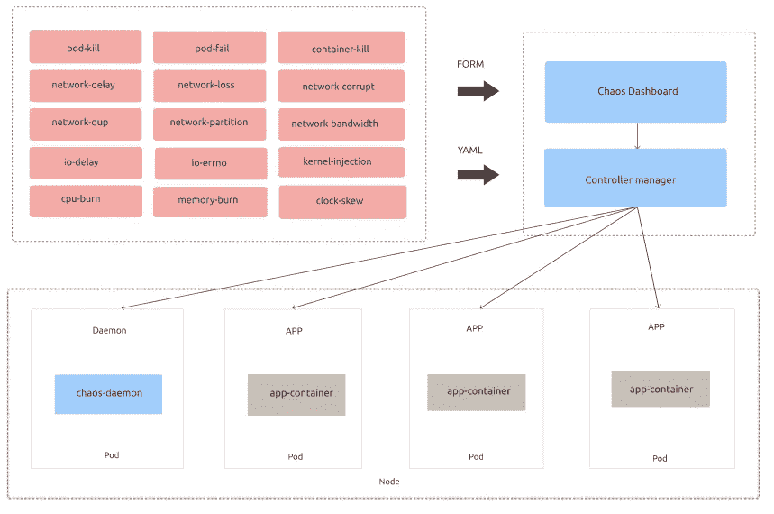
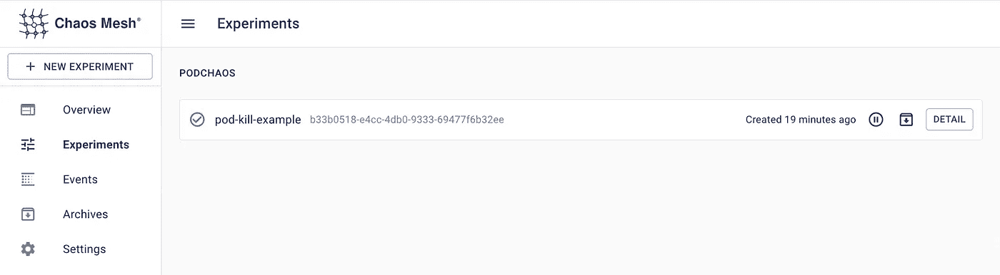
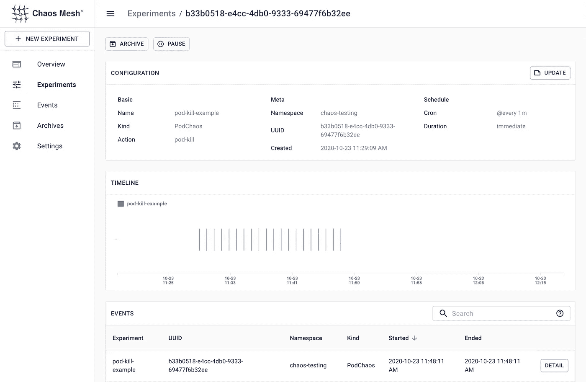
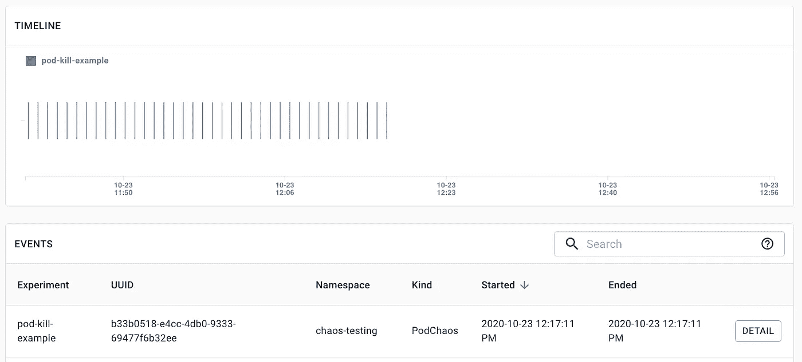

# 混沌网格和 Kubernetes 入门

> 原文：<https://itnext.io/getting-started-with-chaos-mesh-and-kubernetes-bfd98d25d481?source=collection_archive---------0----------------------->


# 什么是混沌工程？

混沌工程是一门在生产中对软件系统进行实验的学科，目的是建立对系统承受动荡和意外情况能力的信心。更多细节请参考[混沌工程](https://en.wikipedia.org/wiki/Chaos_engineering)。

混沌实验在生产环境中执行，这为面向客户的停机留出了空间。虽然必须考虑到短期的负面影响，但爆炸半径或实验产生的辐射必须最小化并得到控制。

# **什么是混沌网？**

混沌网格是[云本地计算基金会(CNCF)](https://landscape.cncf.io/selected=chaos-mesh) 主持的项目。

> 混沌网格是一个云原生的混沌工程平台，在 Kubernetes 环境中编排混沌。

Chaos Mesh 是一个多功能的混沌工程解决方案，其特点是针对 Kubernetes 上的复杂系统提供全方位的故障注入方法，涵盖 Pod、网络、文件系统甚至内核中的故障。

现在让我们看看混沌网格的组成部分:

*   **混沌算子**:混沌编排的核心部件。完全开源。
*   **Chaos Dashboard** :用于管理、设计、监控混沌实验的 Web UI 正在开发中。

# **混沌网格的架构**

在幕后，混沌网格使用[自定义资源定义](https://kubernetes.io/docs/concepts/extend-kubernetes/api-extension/custom-resources/) (CRD)来定义混沌对象。

混沌网格的整体架构非常简单，组件位于 Kubernetes 之上，我们可以使用 YAML 文件或混沌网格仪表板上的表单来指定场景。

有一个混沌守护进程，在网络、Cgroup 等上作为拥有特权系统权限的守护进程运行。对于特定的节点。



# **混沌网格中的故障注入场景**

混沌运算符使用[自定义资源定义(CRD)](https://kubernetes.io/docs/tasks/access-kubernetes-api/custom-resources/custom-resource-definitions/) 来定义混沌对象。当前的实现支持六种类型的用于故障注入的 CRD 对象，即 PodChaos、NetworkChaos、IOChaos、TimeChaos、StressChaos 和 KernelChaos，它们对应于以下主要动作(实验):

*   **pod-kill** :选定的 Pod 被杀死(可能需要 ReplicaSet 或类似的东西来确保 Pod 将被重启)。
*   **Pod-failure** :所选择的 Pod 在指定的时间内不可用。
*   **集装箱-杀死**:在选定的箱中杀死选定的集装箱。
*   **网络混乱**:延迟、复制等网络混乱。
*   **网络分区**:模拟网络分区。
*   **IO 混乱**:模拟 I/O 延迟、读写错误等文件系统故障。
*   **时间混乱**:选中的 pod 会被注入时钟偏移。
*   **CPU-burn** :模拟所选 pod 应力的 CPU。
*   **记忆烧录**:模拟所选 pod 应力的记忆。
*   **内核混乱**:选中的 pod 会被注入(slab，bio 等)错误。

# **在 Kubernetes 上安装**

这个博客将使用本地 Kubernetes 集群，在您的工作站上使用 Kind，所以您可以使用 Kind 或 Minikube 来安装混沌网格。

## 先决条件

在部署之前，确保 [Docker](https://docs.docker.com/install/) 已经安装并运行在您的本地机器上。

## 安装混沌网格

我们将直接使用 Chaos Mesh repo 提供的安装脚本，该脚本将引导 Kind 集群并在其上安装 Chaos Mesh。

```
$ curl -sSL [https://mirrors.chaos-mesh.org/v1.0.1/install.sh](https://mirrors.chaos-mesh.org/v1.0.1/install.sh) | bash -s —-local kind
```

如果您已经安装了大于 0.7 版本的 Kind，那么脚本将继续运行，否则它将安装一个新版本。

脚本运行输出将如下图所示

```
Install kubectl client
kubectl Version 1.18.8 has been installed
Install Kind tool
Kind Version 0.8.1 has been installed
Install local Kubernetes kind
No kind clusters found.
Clean data dir: /Users/rbanka/kind/kind/data
start to create kubernetes cluster kindCreating cluster "kind" ...
DEBUG: docker/images.go:58] Image: kindest/node:v1.17.2 present locally
 ✓ Ensuring node image (kindest/node:v1.17.2) 🖼
 ✓ Preparing nodes 📦 📦 📦 📦
 ✓ Writing configuration 📜
 ✓ Starting control-plane 🕹️
 ✓ Installing CNI 🔌
 ✓ Installing StorageClass 💾
 ✓ Joining worker nodes 🚜
Set kubectl context to "kind-kind"
You can now use your cluster with:kubectl cluster-info --context kind-kindThanks for using kind! 😊
Install Chaos Mesh chaos-mesh
customresourcedefinition.apiextensions.k8s.io/iochaos.chaos-mesh.org created
customresourcedefinition.apiextensions.k8s.io/kernelchaos.chaos-mesh.org created
customresourcedefinition.apiextensions.k8s.io/networkchaos.chaos-mesh.org created
customresourcedefinition.apiextensions.k8s.io/podchaos.chaos-mesh.org created
customresourcedefinition.apiextensions.k8s.io/podiochaos.chaos-mesh.org created
customresourcedefinition.apiextensions.k8s.io/podnetworkchaos.chaos-mesh.org created
customresourcedefinition.apiextensions.k8s.io/stresschaos.chaos-mesh.org created
customresourcedefinition.apiextensions.k8s.io/timechaos.chaos-mesh.org created
namespace/chaos-testing created
serviceaccount/chaos-controller-manager created
secret/chaos-mesh-webhook-certs created
clusterrole.rbac.authorization.k8s.io/chaos-mesh:chaos-controller-manager-target-namespace created
clusterrole.rbac.authorization.k8s.io/chaos-mesh:chaos-controller-manager-cluster-level created
clusterrolebinding.rbac.authorization.k8s.io/chaos-mesh:chaos-controller-manager-cluster-level created
clusterrolebinding.rbac.authorization.k8s.io/chaos-mesh:chaos-controller-manager-target-namespace created
role.rbac.authorization.k8s.io/chaos-mesh:chaos-controller-manager-control-plane created
rolebinding.rbac.authorization.k8s.io/chaos-mesh:chaos-controller-manager-control-plane created
service/chaos-dashboard created
service/chaos-mesh-controller-manager created
daemonset.apps/chaos-daemon created
deployment.apps/chaos-dashboard created
deployment.apps/chaos-controller-manager created
mutatingwebhookconfiguration.admissionregistration.k8s.io/chaos-mesh-mutation created
validatingwebhookconfiguration.admissionregistration.k8s.io/chaos-mesh-validation created
Waiting for pod running
chaos-controller-manager-754d4f7585-h9p4c   0/1   ContainerCreating   0     10s
Waiting for pod running
chaos-controller-manager-754d4f7585-h9p4c   0/1   ContainerCreating   0     21s
Waiting for pod running
chaos-controller-manager-754d4f7585-h9p4c   0/1   ContainerCreating   0     31s
Waiting for pod running
Chaos Mesh chaos-mesh is installed successfully
```

**为了验证**我们的组件是否运行在 Kubernetes 集群上，我们可以使用:

```
$ kubectl get pod -n chaos-testing
```

输出，如果一切顺利，看起来会像

```
$ kubectl get pods -n chaos-testing
NAME                                        READY   STATUS    RESTARTS   AGE
chaos-controller-manager-754d4f7585-h9p4c   1/1     Running   0          7h9m
chaos-daemon-94687                          1/1     Running   0          7h9m
chaos-daemon-k7pnj                          1/1     Running   0          7h9m
chaos-daemon-tfgp6                          1/1     Running   0          7h9m
chaos-dashboard-6fdb79c549-vmvtp            1/1     Running   0          7h9m
```

我们可以看到 3 个组件处于运行状态，控制器、仪表板和混沌守护进程作为守护进程集。

让我们沿着它检查不同的 CRD，哪一个混沌网格在集群上产生

```
$ kubectl get crds
NAME                             CREATED AT
iochaos.chaos-mesh.org           2020-10-22T09:15:05Z
kernelchaos.chaos-mesh.org       2020-10-22T09:15:05Z
networkchaos.chaos-mesh.org      2020-10-22T09:15:05Z
podchaos.chaos-mesh.org          2020-10-22T09:15:05Z
podiochaos.chaos-mesh.org        2020-10-22T09:15:05Z
podnetworkchaos.chaos-mesh.org   2020-10-22T09:15:05Z
stresschaos.chaos-mesh.org       2020-10-22T09:15:05Z
timechaos.chaos-mesh.org         2020-10-22T09:15:05Z
```

这些 CRD 代表了上面详细提到的各种故障注入场景。

## 访问混沌网格仪表板

为了访问仪表板，我们将使用 Kube 代理，或者您甚至可以在 Loadbalancer 上公开它。

让我们使用以下命令在混沌网格仪表板上标识容器端口:

```
$ kubectl get deploy chaos-dashboard -n chaos-testing -o=jsonpath="{.spec.template.spec.containers[0].ports[0].containerPort}{'\n'}"
```

输出显示仪表板正在侦听的端口

```
2333
```

让我们将一个本地端口转发到 pod 上的端口，我们可以从上面的`get pods`输出中获得 Pod 名称。

```
$ kubectl port-forward -n chaos-testing chaos-dashboard-6fdb79c549-vmvtp 8888:2333
```

您可以访问 [**上的仪表板 http://localhost:8888**](http://localhost:8888)


我们可以从仪表板上看到，还没有创建实验。

## 创造第一个混沌实验

对于一个测试场景，我们将使用名称空间选择器来定义创建混乱的范围。

在这个场景中，我们将在一个名称空间中为一个 pod 配置 Chaos，它将被调度为每隔`1 minute`一次杀死一个 Pod。在这个例子中，应用程序没有标签选择器，因此它可以在多次部署的情况下杀死任何 Pod。

在我们的配置中，我们可以有[个不同的范围](https://chaos-mesh.org/docs/user_guides/experiment_scope)。

让我们克隆我们的示例存储库来获得 YAML 文件

```
$ git clone [https://github.com/ronakbanka/chaos-mesh-examples.git](https://github.com/ronakbanka/chaos-mesh-examples.git)$ cd pod-chaos
```

使用 Kubectl `namespace-selector`定义文件应用，这将创建 3 个资源

*   按名称命名空间`appns`
*   使用`nginx`映像部署 3 个副本。
*   使用 podchaos.chaos-mesh.org CRD 的混沌对象

```
$ kubectl apply -f pod-namespace-selector.ymlnamespace/appns created
deployment.apps/nginx created
podchaos.chaos-mesh.org/pod-kill-example created
```

现在让我们在 Chaos Mesh 仪表板上验证这个实验，使用上面的[步骤访问仪表板。](#2aaa)



您可以看到您的实验已经创建并显示在仪表板上。

点击`pod-kill-example`旁边的`DETAIL`按钮，获取我们实验的详细信息。



细节基本上是相同的，在我们的 YAML 文件中有关于 PodChaos 对象的，如果你看一下这个文件

```
apiVersion: chaos-mesh.org/v1alpha1
kind: PodChaos
metadata:
  name: pod-kill-example
  namespace: chaos-testing
spec:
  action: pod-kill
  mode: one
  selector:
    namespaces:
      - appns
  scheduler:
    cron: "[@every](http://twitter.com/every) 1m"
```

## 验证分离舱故障实验

现在让我们在终端上使用`kubectl` CLI 来验证 pod 故障

*   初态

```
$ kubectl get pods -n appns -w
NAME                     READY   STATUS    RESTARTS   AGE
nginx-86c57db685-57l8j   1/1     Running   0          7s
nginx-86c57db685-mf2m9   1/1     Running   0          5m7s
nginx-86c57db685-szvqx   1/1     Running   0          3m7s
```

*   中间状态

```
nginx-86c57db685-mf2m9   1/1     Terminating   0          6m
nginx-86c57db685-26cs9   0/1     Pending       0          0s
nginx-86c57db685-26cs9   0/1     Pending       0          0s
nginx-86c57db685-mf2m9   1/1     Terminating   0          6m
nginx-86c57db685-26cs9   0/1     ContainerCreating   0          0s
nginx-86c57db685-26cs9   1/1     Running             0          4s
```

我们可以清楚的看到 nginx-86c57db685-mf2m9 正在得到`terminated`，nginx-86 c 57 db 685–26cs 9 正在得到`created`。

*   末态

```
$ kubectl get pods -n appns
NAME                     READY   STATUS    RESTARTS   AGE
nginx-86c57db685-skcfv   1/1     Running   0          118s
nginx-86c57db685-szvqx   1/1     Running   0          9m58s
nginx-86c57db685-znk4r   1/1     Running   0          58s
```

我们可以看到此时有两个重新创建的豆荚。此外，我们可以在实验细节下查看混沌网格仪表板上的事件。



## 清理设置

执行以下步骤来清理设置和卸载组件，以及类集群。

```
$ kubectl delete ns chaos-testing$ kind delete cluster --name=kind
```

我们可以使用混沌网格创建各种失败场景，我将在接下来的几篇博客中分享。

更多文档和参考

*   [混沌网文档](https://chaos-mesh.org/docs/)
*   [互动教程尝试混沌网格](https://chaos-mesh.org/interactiveTutorial)
*   [多数据网络延迟场景](https://chaos-mesh.org/docs/use_cases/multi_data_centers)