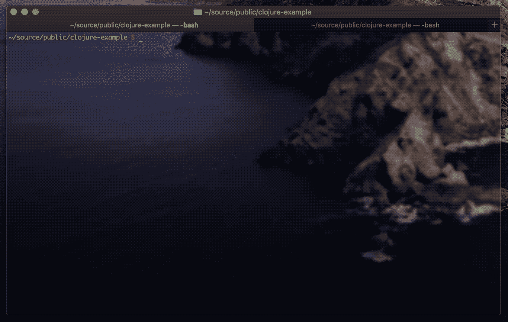

# Clojure 入门

> 原文：<https://itnext.io/getting-started-with-clojure-e8f207ff8eab?source=collection_archive---------1----------------------->

## 如何用 Clojure 构建简单的 REST API


[Clojure](https://clojure.org)

## 介绍

W 今天的电子商务服务范围很广，从一个数据库中有几个表的基本 API，到支持数亿用户的大规模系统，有大量的代码库和毫秒级的响应时间。根据手头的任务，现代开发人员有各种各样的工具可供选择，有几十种流行的语言和框架可供使用，每种语言和框架都有自己独特的解决特定问题的方式。

在这些语言中，Clojure 是一种越来越流行的针对 JVM、微软 CLR、JavaScript 引擎和其他平台的 [Lisp](https://en.wikipedia.org/wiki/Lisp_(programming_language)) 方言。Lisp 已经存在了令人难以置信的 60 年，是在麻省理工学院开发的，用于实现λ演算。Clojure 通过利用预先存在的运行时(如 JVM)和添加优秀的特性(如线程安全的并发数据类型和 [Java VM 互操作](https://clojure.org/reference/java_interop))来构建 Lisp。

在本文中，我们将了解如何使用 Clojure 和 PostgreSQL 实现 JSON REST API，以存储一组名为*名为*、*昵称为*和*职业为*的*朋友*，并从数据库中检索朋友列表。

GitHub 上的[提供了该项目的源代码副本。](https://github.com/kenreilly/clojure-example)

## 概观

Clojure 是一种[函数式编程](https://en.wikipedia.org/wiki/Functional_programming) (FP)语言，它有一种有趣而强大的语法，从过程化或面向对象的思维方式来看，这种语法可能看起来很陌生。FP 是[声明性的](https://en.wikipedia.org/wiki/Declarative_programming)，意味着代码是根据*完成什么*而不是*如何完成来定义的。*

这反映了 FP 是如何直接从数学领域进化而来的，产生了一种高度纯净和强大的语言，它通过阻止状态的改变(可变性)来减少副作用。

本文将关注于启动和运行 API 的实践方面，因此我们将从设置一个环境和用项目配置变量检查默认的`.env.development`文件开始。

## 配置

要运行此项目，需要以下设置:

*   Clojure(带 brew: `brew install clojure`)
*   [雷宁根](https://leiningen.org/#install)(带酿造:`brew install leinengen`)
*   [PostgreSQL](https://www.postgresql.org/download/)

要初始化数据库，运行命令`$ ./db_create.sh`，这将创建数据库`clojure_pg_example`和`friends`表。数据库连接信息以及 API 将服务的端口包含在文件 **.env.development** 中:

该文件将被 [dotenv](https://github.com/LynxEyes/dotenv.clj) 包用来初始化本地开发的环境变量，允许该项目按照 [12 因子 app 原则](https://12factor.net)的[因子 III(配置)](https://12factor.net/config)进行部署。

## 项目定义

项目配置包含在 **project.clj** 中:

除了标准项目名称、描述和其他信息之外，该文件中还定义了项目依赖关系。添加了用于设置 HTTP 服务器、处理 JSON、加载环境变量、连接到数据库和其他日常任务的包。

一个额外的概要文件`:dev {:main clojure-example.core/-dev-main}`被添加到`:profiles`中，这将导致我们的应用程序在开发时运行`-dev-main`功能，而不是`-main`。这在设置像自动热重装这样的特性时会很有用，我们稍后将对此进行研究。

## 应用入口点

程序执行开始于**src/clo jure _ example/core . clj**:

文件的顶部用`ns`定义了名称空间，并通过将库传递给`:require`来导入要使用的库，包括为路由端点设置 HTTP 服务器和处理函数所需的库。

名副其实的`defroutes`宏定义了 API 路由:

*   `GET /`(回显请求)
*   `GET /friends`(从数据库中检索朋友记录列表)
*   `POST /friends`(在数据库中存储朋友记录)

两个函数`-main`和`-dev-main`是应用程序可用的入口点函数，具体取决于应用程序是运行在生产模式还是开发模式。在`-dev-main`中，函数`wrap-reload`用于将 API 函数包装在一个监视处理程序中，该处理程序将热重装对 API 使用的磁盘上的源文件所做的任何更改。这非常有用，在构建和测试应用程序时可以节省大量时间。除此之外，入口点函数是相同的，使用默认的中间件[包装`app-routes`，使用默认的中间件](https://github.com/ring-clojure/ring-defaults)创建 API，然后将这些函数包装在 JSON 包装器中，用于解析请求体和格式化响应输出。接下来，我们将检查路由处理程序。

## 路线处理程序

路由处理函数在**src/clo jure _ example/lib/routes . clj**中:

在这个文件中，有三个函数对应于前一个文件中定义的三个`app-routes`:

*   `echo-route`(逐字回显请求对象)
*   `get-friends-route`(简称`api/get-friends`)
*   `add-friend-route`(用 JSON 请求参数调用`api/add-friend`

从这里很容易看出 Clojure 的干净语法是如何让你的代码整洁易读的*(一旦你(弄清楚(所有括号)))*。

## 内部 API

API 逻辑本身包含在**src/clo jure _ example/lib/API . clj**中:

第一个函数`get-friends`不接受任何参数，只是使用表名`:friends`和关键字数组 *id、姓名、昵称和职业*调用`db/select`作为查询返回的字段。

第二个函数`add-friend`带有朋友`id`和其他数据的结果对象被返回，由路由处理器作为响应发送。

## 数据库层

我们示例项目中的最后一个文件是**src/clo jure _ example/lib/db . clj**:

这个文件导入了 *dotenv* 来访问环境变量以及 *JDBC* ，我们将使用它们与 PostgreSQL 实例进行通信。使用`-db`定义来定义连接，使用连接信息的环境变量。

`concat-fields`实用函数使用`clojure.string/join`将数组中的元素与`,`分隔符连接在一起，用于将参数打包成逗号分隔的字符串，以便在 SQL 查询中使用。

`insert`函数调用`jdbc/insert`，传入目标`:table`和要插入的`record`。result 对象将被包装在一个数组中，因此使用`first`函数从一个项目数组中提取结果，然后将结果返回给路由处理程序，作为 JSON 响应发送回去。

`select`函数调用具有`:table`名称的`jdbc/query`和由 select 语句组成的 SQL 查询，该语句从指定的`:table`请求`fields`(使用上述`concat-fields`函数对其进行 SQL 格式化)并将结果记录列表返回给路由处理器，以便作为 JSON 响应发送回客户端。

## 试车

为了测试 API，使用`lien run server`运行服务器，它将检索所需的依赖项并打印一条消息，说明服务器正在环境文件中指定的端口上运行。为了方便起见，实用程序脚本`./post.sh`已经作为一个简单的 curl 包装器提供:

```
$ ./post.sh '{"name":"Sam","nickname":"X","occupation":"ninja"}'
```

这将返回一个包含所提供数据的结果对象，以及一个`id`和一个创建时间戳，验证我们的 POST 操作成功完成。要检索以前添加的朋友列表:

```
$ curl localhost:3000/friends
```

这将返回一个 JSON 格式的对象数组，其中包含前面描述的数据库查询中请求的三个字段 *name、nickname 和 description，*。

## 结论

Clojure 有一个有点陡峭的学习曲线，因为它在数学中有着不可饶恕的根基，但是如果使用得当，最终的程序是持久的、易于维护的，并且具有难以置信的速度和响应能力。根据堆栈溢出报告的[显示，不重启 JVM 就能动态加载和运行新代码的能力只是这种语言的一个强大功能，这也恰好要求从 2019 年起*比任何其他语言*更高的工资。](https://insights.stackoverflow.com/survey/2019?utm_source=so-owned&utm_medium=announcement-banner&utm_campaign=dev-survey-2019#top-paying-technologies)

本文展示了如何用 Clojure 快速组装一个简单的云就绪 REST API 和 PostgreSQL 数据库，只需几行干净、可靠的代码。

感谢您的阅读，祝您的下一个项目好运！



> 肯尼斯·雷利( [8_bit_hacker](https://twitter.com/8_bit_hacker) )是 [LevelUP](https://lvl-up.tech/) 的 CTO