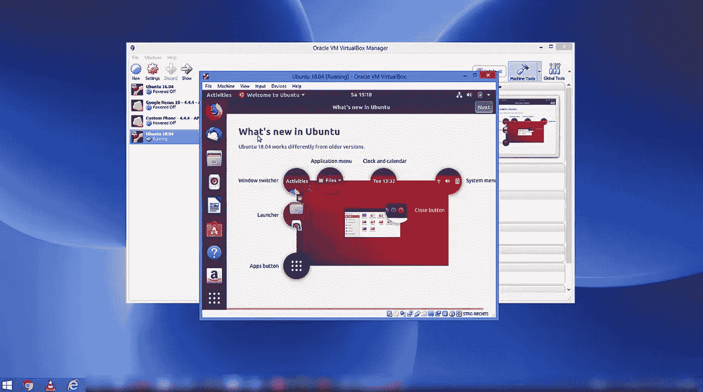
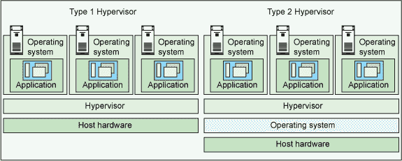
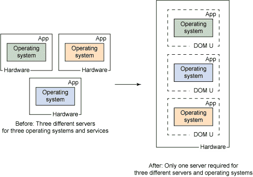
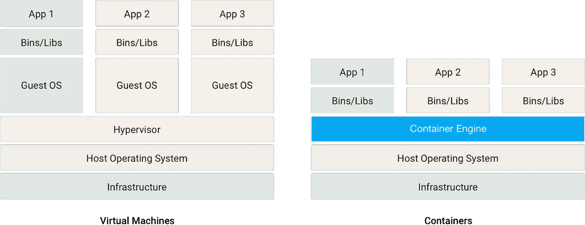
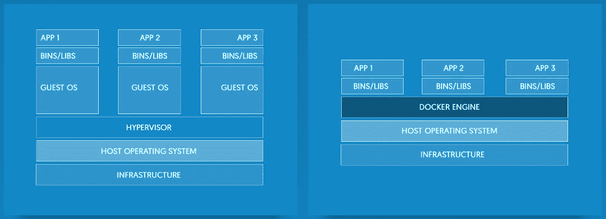

# 码头工人剖析

> 原文：<https://itnext.io/getting-started-with-docker-1-b4dc83e64389?source=collection_archive---------0----------------------->

## 码头集装箱化

## Docker 是一个容器化引擎，它提供了极快的容器创建和管理。在本文中，我们将了解什么是容器以及它们是如何工作的。


在你了解 Docker 到底是什么之前，我认为了解**虚拟化**和**容器化**之间的区别是非常重要的，因为 Docker under-the-hood 实现了这些技术中的一种， ***我们一会儿就会看到哪一种*** 。

当你想要创建一个**虚拟环境**来进行 ***代码测试*** 时，你可以创建一个**虚拟机**。虚拟机只不过是模拟虚拟操作系统的程序；从**主机**借用一些资源如*内存*和*存储*。一个完美的例子就是使用 **VirtualBox** 程序在 **Windows** 平台上启动一个 **Ubuntu** 虚拟机。那个 Ubuntu 虚拟机将在一个提供 **Ubuntu 桌面 GUI** 的窗口内运行。



(来源: [Youtube](https://www.youtube.com/watch?v=QbmRXJJKsvs) )

从上面的截图可以看出，**Oracle VM VirtualBox Manager**创建了一个 **Ubuntu 虚拟机**，它运行在一个正常的窗口内。如果你全屏显示，你会暂时忘记它实际上是在 Windows 主机的一个窗口中运行的。

这听起来很酷，但这怎么可能呢？ **Ubuntu** 是为 **Linux** 内核设计的， **Windows** 运行在 **Windows NT** 内核上。每个操作系统都是不同的，都是为特定的**内核**设计的。内核是介于硬件和操作系统之间的东西，它的工作是将操作系统指令翻译成实际的硬件命令。

**那 Ubuntu 在 NT 内核上是怎么运行的**？为了理解虚拟化是如何工作的，我们需要理解拼图中非常重要的一块，**虚拟机管理程序** *(以及其他一些东西)*。

# 什么是虚拟机管理程序？

一个**虚拟机管理程序** ( *也称为* ***虚拟机监视器*** *或* ***VMM*** )是一个**软件**或**固件**，它管理并分配一台主机的不同硬件资源给客户机。有两种类型的虚拟机管理程序，它们的工作原理差别很大。

## ☛1 型虚拟机管理程序

**1 型虚拟机管理程序**也称为**裸机虚拟机管理程序**是一种直接在系统硬件上运行的固件(*也可以是硬件*)。该管理程序控制在主机硬件上作为来宾机器运行的**操作系统**或**虚拟机**的`n`数量。在这里，虚拟机管理程序的工作是将系统资源分配给虚拟机。类型 1 虚拟机管理程序通常包括硬件支持，这意味着它具有预安装的内核。因此，在这个内核上运行的任何操作系统都可以被创建为来宾机器。

**第 1 类虚拟机管理程序** : *Xen、VMware ESXi 和 Microsoft Hyper-V*

## ☛2 型虚拟机管理程序

第 2 类虚拟机管理程序是在主机操作系统上运行的软件。这个管理程序创建一个**进程**并分配系统资源，如内存、持久存储和其他重要的东西。然后，客户操作系统在该进程中运行，并使用可用的资源。在这里，虚拟机管理程序充当来宾操作系统和主机操作系统之间的中间人，翻译来宾操作系统指令，以便主机操作系统能够理解。

**第 2 类虚拟机管理程序** : *VMware Workstation、VMware Player、Oracle VirtualBox*



(来源: [IBM](https://developer.ibm.com/articles/cl-hypervisorcompare/) )

第 1 类和第 2 类虚拟机管理程序各有优缺点，但由于第 2 类虚拟机管理程序运行在主机操作系统上，因此主机操作系统中的任何问题都可能会削弱其上运行的任何来宾机器。此外，第 2 类虚拟机管理程序不能完全控制主机的硬件，因此我们可能会面临一些扩展限制。

如果相同的虚拟机运行在两个不同的主机上，这两个主机具有相同的硬件配置，但一个通过第 1 类虚拟机管理程序运行，另一个通过第 2 类虚拟机管理程序运行，那么从技术上讲，具有第 1 类虚拟机管理程序的机器将运行得更快。这是因为只有一层是虚拟机管理程序本身，虚拟机通过它与硬件进行通信。而在类型 2 虚拟机管理程序机器中，有两个层(*参考上图*)。

回到现实，现在，当你想要托管一个网站或创建一个测试环境时，你通常会选择像 Amazons EC2 这样的云服务，在那里你可以创建一个虚拟机( *EC2 服务器实例*),使用你最喜欢的操作系统、所需的内存和磁盘存储。当您创建一个实例时，Amazon 不会为您购买具有您想要的配置的机器硬件。

相反，他们使用类型 1 或类型 2 虚拟机管理程序在其大型基础架构上创建虚拟机，如下图所示。你得到的机器是一个虚拟机( ***虚拟*** *)，因为看起来你的机器有 4GB RAM，但实际上，它是一个更大的 RAM 硬件上的共享内存空间*)。



来源: [IBM](https://developer.ibm.com/articles/cl-hypervisorcompare/)

这种动态创建虚拟机并在隔离环境中运行的过程被称为**虚拟化**，它明显降低了托管成本。但是对于大规模应用程序，建议使用虚拟化。如果您有许多需要虚拟隔离环境的小型应用程序，那么在云上购买 100 台虚拟机是非常愚蠢的。

另一方面，在主机操作系统上启动客户操作系统(*使用类型 2 管理程序*)也是不可行的。如果您的客户操作系统需要 1GB 的 RAM 和 50GB 的存储，那么在客户操作系统实例很少的情况下，您可能会消耗大量系统硬件，并且扩展是不可能的。

这就是集装箱化的用武之地。

# 简而言之，集装箱化

一个**容器**是一个独立的执行环境，其中一个或多个进程可以独立运行。创建容器并在其中作为**进程**运行应用程序的动作；被称为**集装箱化**。Linux 内核提供了这样一种容器化机制，你可以在一台 Linux 主机上创建许多容器，称为基于 Linux 的容器或 LXC 容器

如上所述，容器内的进程有一个隔离的环境。这包括网络接口(*获取 IP 地址*)、进程 id(PID)、挂载点等。开箱即用的 Linux 内核提供了一些特性，如**名称空间**和**控制组**来实现这一点。

名称空间是 Linux 内核对内核资源进行分区的特性，比如**网络接口** ( *net* )、**挂载点** ( *mnt* )、**进程 id**(*PID*)等。因此，我们可以创建具有相同资源标识符的进程集，*例如*， **IP 地址**，因为它们共享不同的名称空间。**控制组**也是命名空间，它们控制多少系统资源，如 **CPU** 和**内存**分配给进程组。

总的来说( ***且不专指 Linux*** )，容器无非就是我们刚刚说的一组进程。一个容器有一个唯一的命名空间，所有在其中运行的进程都将共享由容器的控制组分配的资源。容器内的任何进程都无法看到分配给其他容器的资源，也无法与之交互。所有容器共享相同的内核(主机操作系统的*)，当容器需要不同的内核时，则必须提供虚拟化。*

一般来说( ***与 Linux*** )一个管理容器的程序叫做**容器引擎**。它还负责**通过使用** [**系统调用**](https://en.wikipedia.org/wiki/System_call) **s** 与内核通信，将系统资源分配给正在运行的容器。它作为一个**守护进程**在主机操作系统上运行。简而言之，容器引擎类似于第二类管理程序，其中容器类似于虚拟机。

由于没有管理程序用于直接在主机操作系统上创建不同的隔离环境(*这些是容器*)，容器化有时被称为 **OS 级虚拟化**。

## ☛容器与虚拟机

我确信你可能会对一个容器如何与一个完全成熟的虚拟机相关联感到困惑，那么让我告诉你，它不是。容器和 VM 都提供不同程度的隔离，但是它们以不同的方式工作，尽管在隔离方面你可以用它们来实现相同的事情。

无论是第 1 类虚拟机管理程序还是第 2 类虚拟机管理程序，虚拟机都会引导整个操作系统。它在创建时锁定系统资源。虚拟机需要有一个操作系统映像、库、二进制文件和其他依赖于它将要运行的特定硬件的文件。因此，虚拟机快照(*映像*)在空间方面携带起来非常沉重。

容器是包含程序、应用程序级二进制文件、库、环境变量等的包。因为它利用了主机的操作系统，所以操作系统级的库、二进制文件和驱动程序由容器引擎共享。容器不需要锁定系统资源，相反，它可以根据需要从容器引擎要求更多的资源。

容器感觉像是在运行自己的操作系统副本(*因此感觉像是虚拟机或本机*)，因为它有自己的文件系统、IP 地址池、注册表等。这是一种谎言。



(来源:[谷歌云](https://cloud.google.com/containers/))

因为与虚拟机相比，容器是轻量级的，所以它们可以在大约**毫秒**内产生(*创建*),并且可以同时运行 1000 个这样的容器。相比之下，虚拟机可能需要几分钟才能启动，而你只能拥有其中的几个。

但是由于容器共享相同的内核，你可以说它们不像虚拟机那样被隔离(同样的情况是类型 2 和类型 1 管理程序隔离)。

# Docker 是如何工作的？

既然我们已经了解了集装箱化和集装箱是如何工作的，是时候面对终极真相了。Docker 只不过是一个容器化软件，Docker 引擎只不过是一个容器引擎。



([来源](https://www.smarthomebeginner.com/what-is-docker-docker-vs-virtualbox/))

docker 引擎由 Docker 守护进程和其他工具组成，用于创建、销毁和管理容器。Docker 守护进程是一个在后台运行的进程，它接收来自 ***本地*** 或 ***远程*** **Docker 客户端** (CLI)的命令，使用 **HTTP REST** 协议管理容器。因此，据说 Docker 遵循**客户端-服务器**架构，其中**服务器**是 Docker 守护进程。

当您在系统上安装 Docker 时，您会得到 Docker 引擎、Docker 命令行界面(Docker 客户端)和其他 GUI 实用程序。当你启动你的 Docker，它将启动 Docker 守护进程。

## ☛什么是码头集装箱？

到目前为止，我们讨论的容器是对什么是容器以及它如何工作的一般解释。Docker 容器要复杂得多。

docker 容器包含**应用程序代码**和**其他依赖关系**。这些**其他依赖**使得一个容器成为一个**容器**。这些**其他依赖项**包括必要的(*特定于应用程序的*)库、二进制文件和我们的应用程序运行所需的其他资源。

容器的一个例子是一个 **node.js** 服务器。所以我们的应用程序代码将由包含应用程序代码的`server.js`和`node_module`库组成。但是要运行它，我们需要在容器中安装`node`，因此我们需要一个`**node**`二进制文件。node.js 可能依赖于其他二进制文件和库，因此我们也需要它们。然后`node.js`需要一个操作系统来运行，例如 **CentOS** ，因此我们也需要一个定制的二进制文件，Docker 引擎可以利用它来与客户操作系统和内核对话。

## ☛什么是码头工人形象？

我们刚刚谈到的**节点服务器**例子包含许多需要存在于容器中的部分，这样我们的应用程序才能工作。Docker 图像是一个包含所有这些部分的压缩盒子。

我们指示 Docker 客户机从这个映像创建一个容器。Docker 客户机指示 Docker 守护进程解压缩映像，读取内容并启动容器，同时将`server.js`作为一个进程执行。根据映像中的其他指令，Docker 守护进程可能会从容器中公开一些端口，我们可以监听和/或安装卷以及做其他事情。

为了创建 Docker 图像，我们需要一个`Dockerfile`。`Dockerfile`是一个配置文件，包含告诉 Docker 引擎如何构建映像的指令。这些指令可以是什么是**基础映像**，什么是在容器内运行的操作系统内的工作目录，什么应用程序特定的文件需要从系统中复制，什么端口需要在容器中暴露，以及其他无数的事情。

一个**基础映像**是 Docker 提供的官方映像，我们将在其中添加我们的应用程序特定代码和指令。基本映像可以包含与 **Apache** 服务器一起安装的 **CentOS** 操作系统。

docker 映像遵循修改后的**联合文件系统**，例如 [**AuFS**](https://en.wikipedia.org/wiki/Aufs) 。`Dockerfile`中的每个指令创建一个**只读** AuFS 层。如`Dockerfile`中所述，这些层相互堆叠。每一层都只是与前一层的一组差异。

当我们从这个图像创建一个容器时，我们复制所有这些只读层，并在其上添加一个新的**读写**层。只读层称为**图像层**，而容器中的薄读写层称为**容器层**。

典型的`Dockerfile`会是下面这个样子(*跟着这个* [***链接***](https://docs.docker.com/engine/reference/builder/) *关于* `*Dockerfile*` *的其他细节不过下面是一个示例*)。

```
FROM ubuntu:15.04
COPY . /app
RUN make /app
CMD python /app/app.py
```

在上面的`Dockerfile`中，我们正在从创建第一层的`15.04` ( *由 Docker Hub* 提供)版本的 **Ubuntu** 基础映像创建我们的映像。然后，我们将当前目录中的所有内容复制到 Ubuntu OS 中的`/app`位置，这将创建一个新层并堆叠在前一层上。然后，我们使用`make`命令构建应用程序，该命令将输出写入新层并堆叠在前一层之上。然后我们使用`python`命令运行 python 程序。最后一条指令不占用层中的任何空间，因为它是一个 bash 命令。


(来源: [**Docker**](https://docs.docker.com/storage/storagedriver/#images-and-layers) )

从上图可以看出，当我们运行一个容器时，它会在图像层的顶部创建一个读写层。对正在运行的容器所做的所有更改，如写入新文件、修改现有文件和删除文件，都被写入这个可写的瘦容器层。

当容器运行时，容器层需要与它下面的层进行通信，以合并每个层中的差异，并生成实际的文件系统。这是使用 Docker 引擎提供的存储驱动程序来完成的。

当一个层(*包括容器层*)需要读取下一层的文件时，它直接从该层读取文件。在构建图像时，当一个层需要从它下面的层写入文件时，该文件被复制到当前层并在那里进行更改( ***diff*** *保存在层*)。

在容器中，当容器层想要从它下面的层写入文件时，该文件被复制到容器层，并且对该文件进行改变。当我们想写时复制文件的策略(*修改它*)称为**写时复制** (CoW)策略。

这使得可写层变得轻量级，因此我们称之为**薄层**。因此，对图像层的所有修改都存在于可写容器层中。当容器被破坏时，容器层也被破坏，但是图像层保持原样。如果我们想的话，我们仍然可以保存一个容器的可写层，它被称为持久 Docker 容器。

多个容器可以共享一个或多个映像中的一些或所有文件系统层。因为每一层都标有 UUID，这是该层内容的校验和，所以它们非常可重用。如果两个容器由同一个图像制成，它们共享 100%的图像层，并有自己唯一的可写层(如下图所示*)。*


(来源: [**Docker**](https://docs.docker.com/storage/storagedriver/#images-and-layers) )

使用**写时复制** (CoW)策略分层文件系统以及层可用性是 Docker 容器创建速度如此之快的原因。因此，容器是轻量级的，并且在磁盘上具有小的尺寸(仅*可写层的尺寸*)。

# Docker 在非 Linux 平台上是如何工作的？

如果你能活到现在，我有一个问题要问你。如果 docker 基于 Linux Containers (LXC ),那么 Docker 如何在其他内核上工作，比如 MacOs 的 Darwin 和 Windows 的 Windows NT？

Docker 最初使用 Linux 容器(LXC ),并且只为 Linux 内核设计。因此任何基于 Linux 的操作系统都可以使用它。对于 Windows 和 macOS，Docker 将使用 [**虚拟盒**](https://www.virtualbox.org/) 在 Linux 虚拟机内运行 Docker 引擎。对于 Windows 和 macOS，您必须安装 [**Docker 工具箱**](https://docs.docker.com/toolbox/toolbox_install_windows/) ，它将负责虚拟化。

但是最新版本的 Docker，针对 Linux，使用了遵循 OCI ( [***开放容器倡议***](https://www.opencontainers.org/about) )规范的 [runC](https://github.com/opencontainers/runc) ( *原名* ***libcontainer*** )。runC 是一个 CLI 工具，用于生成和运行容器，它运行在与其主机相同的操作系统中。在 Windows 的情况下，Docker 使用的是 Windows 提供的内置虚拟化技术 [**Hyper-V**](https://en.wikipedia.org/wiki/Hyper-V) 。Docker 在 MacOs 的情况下使用 [**Hypervisor 框架**](https://developer.apple.com/documentation/hypervisor) 进行虚拟化。

Docker 是用 Go ( **GoLang** )写的，这是我最喜欢的语言之一，你可以在这里 找到我的教程。这是一个相当于**去神秘化 Docker** 的教程，但却是一个重要的教程，如果事情没有得到适当的澄清，我道歉(*建议总是受欢迎的*)。


([**thatisuday.com**](http://thatisuday.com)/[/**GitHub**](https://github.com/thatisuday)/[**Twitter**/](https://twitter.com/thatisuday)[**stack overflow**](https://stackoverflow.com/users/2790983/uday-hiwarale)**/[/**insta gram**](https://www.instagram.com/thatisuday/))**

