# Docker 入门:你应该知道的事实

> 原文：<https://itnext.io/getting-started-with-docker-facts-you-should-know-d000e5815598?source=collection_archive---------4----------------------->

Docker 架构和开发者指南

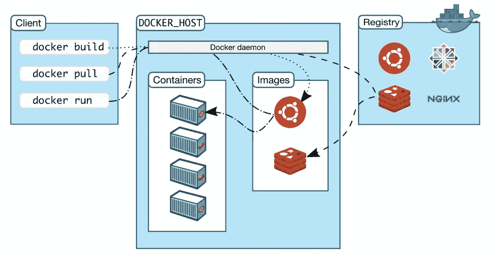

***图片来源演职员表*** : [Docker](http://www.docker.com)

# **Docker 简介**

在当今的 IT 世界中，我们大多数人肯定听说过或面临过这样的问题，比如代码在开发环境中工作良好，但在测试或生产环境中却不行。因此，运营团队面临着一个非常棘手的问题，即如何在不停机或不影响最终用户的情况下将系统维持在正常状态。这变成了开发人员和运营人员之间的蛇梯游戏，造成了大量的混乱，导致了无效的发布、停机和信任问题。当开发人员的代码在一台机器上有效，而在另一台机器上无效时，开发人员会花费大量时间来查找导致这个问题的确切错误。

docker 是解决这一难题的工具，通过 Docker，我们可以打包代码及其所有配置和依赖关系，以便它可以在任何环境中无缝工作，无论是开发、运营还是测试。

# **为什么是 Docker？**

Docker 改变了应用程序构建和发布的方式。它彻底改变了集装箱化的世界。有了 Docker，部署您的软件变得容易多了，您不必考虑缺少系统配置、底层基础设施或先决条件。Docker 使我们能够创建、部署和管理轻量级的独立包，其中包含运行应用程序所需的一切。具体来说，它包含代码、库、运行时、系统设置和依赖项。每个这样的包裹被称为容器。每个容器都部署有自己的 CPU、网络资源、内存和一切，而不必依赖任何单独的外部内核和操作系统。

假设您有数千个连接到数据库的测试用例要运行，并且它们都按顺序通过。你认为那需要多长时间？但是在 Docker 中，容器化方法会很快实现这一点，在容器化方法中，所有这些测试用例可以同时在同一台主机上并行运行。

## **使用 Docker 的好处**

*   实现一致的环境
*   易于使用和维护
*   系统资源的有效利用
*   软件交付率的增加
*   提高运营效率
*   提高开发人员的工作效率

## **Docker 架构**

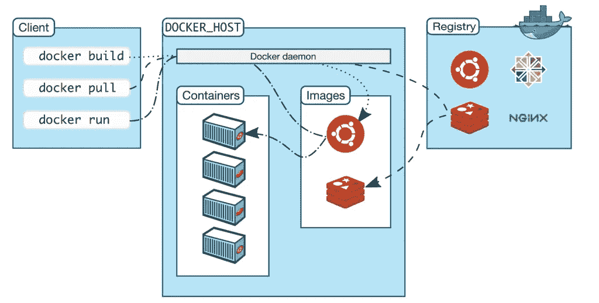

***图像演职员表*** : [Docker](http://www.docker.com)

Docker 基于客户机-服务器架构工作。有一种叫做 Docker client 的东西与 Docker 守护进程对话，后者负责构建、运行和分发 Docker 容器。Docker 客户端和 Docker 守护进程*可以*在同一个系统上运行，或者另一种方式是，你可以将一个 Docker 客户端连接到一个远程 Docker 守护进程。Docker 客户机和守护程序使用 REST API 通过 UNIX 套接字或网络接口进行通信。

## **码头系统中的主要部件**

*   ***Docker 图像***

Docker 镜像由多层只读文件系统组成，这些文件系统被称为 Docker 文件，它们只是带有一组预写命令的文本文件。

对于 docker 文件中写入的每个文本或给出的每个指令，创建一个层，并将其放置在另一个层的顶部，形成 docker 图像，该图像将来用于创建 docker 容器。

Docker 创建了 hub.docker.com，人们在那里存储他们创建的 docker 图像，它就像是 docker 图像的存储区域，也可以存储在本地注册表中。

*   ***码头集装箱***

容器是一个独立的应用程序，它由一个或多个映像构建而成，充当一个完整的包系统，其中包括运行应用程序所需的所有库和依赖项。Docker 容器没有操作系统，它们使用主机操作系统来实现功能，因此它是一个更加便携、高效和轻量级的系统，并保证软件可以在任何环境中运行。

*   ***Docker 引擎***

它是 Docker 系统的核心，Docker 系统是一个安装在主机上的应用程序，遵循客户机-服务器体系结构。

Docker 引擎中主要有 3 个组件:

**服务器**是名为 dockerd 的 docker 守护进程。创建和管理 docker 映像、容器、网络等。

**Rest API** 指示 docker 守护进程做什么。

命令行界面 (CLI)是用来输入 docker 命令的客户端。

*   ***Docker 客户端***

Docker 客户端是 Docker 系统中用户用来与 Docker 交互的关键组件，它提供了一个命令行界面(CLI)。当我们运行 docker 命令时，客户端将这些命令发送到守护进程的 docker，以发布构建、运行和停止应用程序的命令。

*   ***Docker 注册表***

这是存放 Docker 图像的地方。Docker Hub 和 Docker Cloud 是公共注册中心，任何人都可以访问，而另一种选择是拥有自己的私有注册中心。默认情况下，Docker 被配置为在 Docker Hub 上查找图像。你也可以有一个 Artifactory Docker 注册表来获得更多的安全性并优化你的构建。

# **让我们进入 Docker** 的实际问题

**安装 Docker 的步骤:**

下面是 docker 安装的链接，由 Docker 提供，我们有安装 Docker 的清晰文档。

[https://docs.docker.com/engine/install/ubuntu/](https://docs.docker.com/engine/install/ubuntu/)

一旦安装了 docker，请检查 docker 的版本

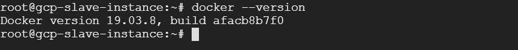

**一些基本的 Docker 命令**

*   **docker ps**

为您提供计算机上活动容器的列表

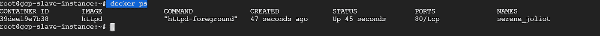

在输出中，我们可以看到它显示了一些关于容器的细节

**集装箱 ID** :每个集装箱将被分配一个唯一的 ID

**图片:**每张图片都有一个附加标签

**命令**:每张图像都会被分配一个唯一的 ID

**创建**:显示创建时的详细信息

**状态**:显示集装箱是否活动的详细信息

**端口**:外露端口

**名称:**码头工人为创建的集装箱分配随机名称

*   **docker ps -a**

给你一个完整的集装箱列表，包括曾经被停止或崩溃

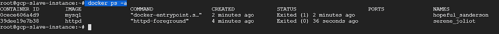

*   **docker 图片**

为您提供系统中的图像列表

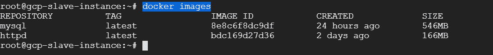

*   **docker 运行参数图像名称**

它将使用图像名称创建一个容器

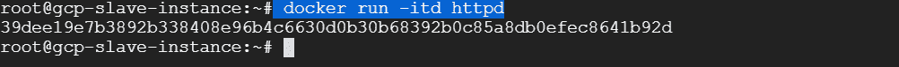

这里的论点——itd 的意思是

一、互动

t-连接到端子

d —分离模式

根据需要，我们可以以分离模式(-itd)或根模式(-td)运行容器。

*   **码头工人停止集装箱-ID/名称**

要停止容器

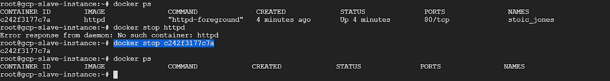

*   **码头工人集装箱编号/名称**

要移除容器

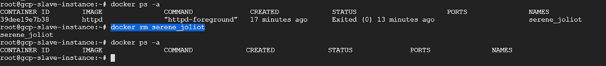

*   **docker rmi IMAGE-ID**

要删除 docker 图像

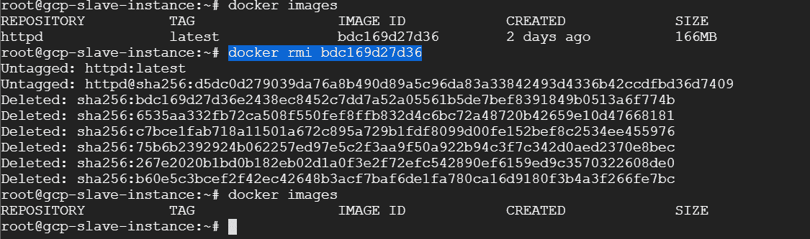

*   **docker exec -it 容器名称/bin/bash/**

接触容器的外壳

使用这个命令，我们可以在容器中运行我们需要的代码。

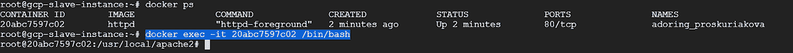

## **容器中的体积**

容器在本质上是动态的，它们经常移动，今天一个容器可能在服务器 A 上，明天它可能在服务器 B 上，所以它们会被打乱，根据需要重新定位

卷充当数据仓库，或从外部附加到容器的数据存储。

例如，在数据目录(data)中，我们将数据 1 和数据 2 作为文件，它们是我们的应用程序要处理的相关数据的一部分。

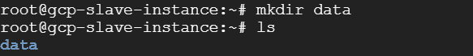

但是我们不希望这些数据真正存储在容器中，相反，我们希望它被装载，因此实际的读取和写入将发生在数据 1 和数据 2 中，它看起来像是容器的一部分。因此，这些装载的数据称为卷。

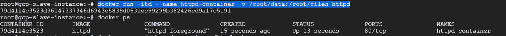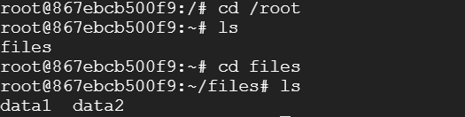

现在我们有了一个关于创建、删除和启动容器的基本概念，接下来将看到如何创建您自己的映像。

在我们的服务器上，我们需要通过运行下面提到的命令来安装 Apache2:

sudo apt-get 更新

sudo apt-get 安装 apache2

**创建 Dockerfiles**

在创建 docker 文件和 index.html 文件中创建一个目录作为示例代码

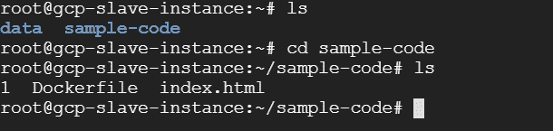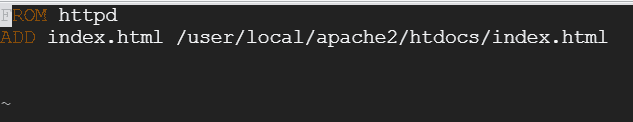

每个 docker 文件都以 FROM 命令开始，它告诉我们基本映像来自哪里，这里我们告诉使用 httpd 作为我们的基本映像，然后我们想添加一个文件 index.html，它将作为我们的源，我们的目的地将是/usr/local/Apache 2/htdocs/index . html，当我们运行这个文件时，docker 将创建一个临时容器，它将从中创建一个映像，一旦创建了映像，我们就可以使用这个映像来创建一个容器。

**码头工人建造。-t first-image** :该命令将构建一个图像，其中 first-image 是图像的名称

**docker run-itd—name first-container-p 8090:80 first-image:**该命令将构建容器，其中 first-container 是映射到端口 80 的容器的名称

我们可以看到输出: [http://server_IP:port](http://server_IP:port)

## **结论**

Docker 容器比虚拟机更好，因为它们确保我们的应用程序运行时没有任何错误。容器化为软件驱动型组织的数字化转型铺平了道路。Docker 容器可以用你选择的任何框架和语言来构建，只要在社区中已经有它们的图片。许多 CI/CD 工具，如 Jenkins、CircleCI、TravisCI 等。现在完全支持 Docker 并与 Docker 集成，这使得将您更改从一个环境传播到另一个环境变得轻而易举。Docker 使应用程序的部署变得非常容易，因为容器是轻量级的，所以它有助于扩展和自动化。