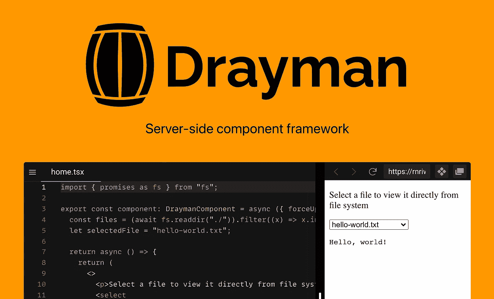
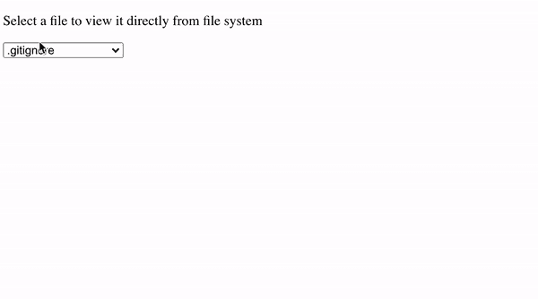

# Drayman 入门

> 原文：<https://itnext.io/getting-started-with-drayman-ce355ecfe22a?source=collection_archive---------1----------------------->

[Drayman](http://www.drayman.io/) 是一个服务器端组件框架，允许你在一个脚本中使用任何可用的 HTML 元素、web 组件或自定义 Drayman 第三方组件以及服务器端代码。

使用 Drayman，浏览器只呈现用户应该看到的内容——所有的逻辑和计算都发生在服务器端，UI 使用 JSX 语法编写。

展示 Drayman 能力的最好方式是用它创造一些东西。所以让我们开始吧。

# 文件查看器组件

让我们构建一个允许用户从文件系统中选择一个文件并查看其内容的组件。

首先，你需要安装 Drayman。这可以通过运行以下命令来完成:

该网站将在 [http://localhost:3033](http://localhost:3033/) 上提供。

如果你不想安装任何东西，你可以通过访问 [new.drayman.io](http://new.drayman.io/) 来尝试 CodeSandbox 中的 Drayman。

## 初始组件模板

转到`src/components/home.tsx`并用以下代码替换其内容:

您将看到我们组件的初始框架。此外,`<select>`将用于显示可用文件,`<pre>`将显示所选文件的内容。

## 用选项填充选择

因为 Drayman 运行的是组件服务器端，所以我们可以使用任何 Node.js 库。在我们的例子中，我们将使用`fs`模块。

让我们从项目根目录读取文件名，并用它们填充`<select>`选项:

现在，我们的组件只显示一些没有任何交互性的元素。我们下一步将添加它。

## 对用户操作做出反应

我们需要记住用户选择了哪个文件来显示其内容。这可以通过使用`onchange`事件属性并附加一个将在服务器端执行的[函数来完成。我们还需要给每个`option`添加`value`属性，这样`select`就会知道选择了哪个选项。](http://www.drayman.io/docs/components-in-depth/handling-events)

让我们在`<pre>`标签中添加`fs.readFile`函数，这样 Drayman 将在重新渲染时读取文件内容。我们不会显示`pre`直到一个文件被实际选中:

如果您从下拉列表中进行选择，您将会看到页面上什么也没有发生——文件内容不会出现。这是因为使用 Drayman 时，您必须严格告知组件何时需要重新渲染。可以通过使用特殊的[辅助函数](http://www.drayman.io/docs/components-in-depth/helpers/introduction) `forceUpdate`来完成。

保存所选文件后，导入并添加到`onchange`事件中:

现在我们的组件完成了，文件内容显示在 select:

# 结论

我们构建了一个组件，它在一个脚本中结合了服务器端逻辑和客户端视图。

如果您对此感兴趣，请访问[官方文档](http://www.drayman.io/)深入了解 Drayman 框架！