# Python 中的 Elasticsearch 7 入门

> 原文：<https://itnext.io/getting-started-with-elasticsearch-7-in-python-520ddc8d2d8d?source=collection_archive---------3----------------------->


大约 3 年前，也就是 2018 年 6 月，我曾[写过关于 Elasticsearch 的](http://blog.adnansiddiqi.me/getting-started-with-elasticsearch-in-python/)。在此期间，一个新的 Elasticsearch 版本推出，其中有一些新的功能和变化。我会在这篇文章中重复一些概念，所以人们不必去旧的文章中了解它。那么，让我们开始吧！

# 什么是 ElasticSearch？

ElasticSearch (ES)是一个分布式的、高度可用的开源搜索引擎，构建于 Apache Lucene 之上。它是用 Java 构建的开源软件，因此适用于许多平台。你以 JSON 格式存储非结构化数据，这也使它成为一个 NoSQL 数据库。因此，与其他 NoSQL 数据库不同，es 还提供搜索引擎功能和其他相关功能。

# 弹性搜索用例

您可以将 ES 用于多种目的，下面给出了其中的几种:

*   你正在运营一个提供大量动态内容的网站；无论是电子商务网站还是博客。通过实现 ES，你不仅可以为你的 web 应用提供一个强大的搜索引擎，还可以在你的应用中提供原生的自动完成功能。
*   您可以接收不同种类的日志数据，然后使用来查找趋势和统计数据。
*   全文搜索。
*   事件数据和指标

# 设置和运行

安装 ElasticSearch 最简单的方法就是[下载](https://www.elastic.co/downloads/elasticsearch)并运行可执行文件。您必须确保您使用的是 Java 7 或更高版本。

下载后，解压并运行它的二进制文件。

`elasticsearch-7.11.1/bin/elasticsearch`

滚动窗口中会有很多文本。如果你看到下面这样的东西，那么它似乎是向上的。

`publish_address {127.0.0.1:9200}, bound_addresses {[::1]:9200}, {127.0.0.1:9200}`

但是，既然，眼见为实，在你的浏览器中或者通过 cURL 访问 URL `http://localhost:9200`，下面这样的东西应该会欢迎你:

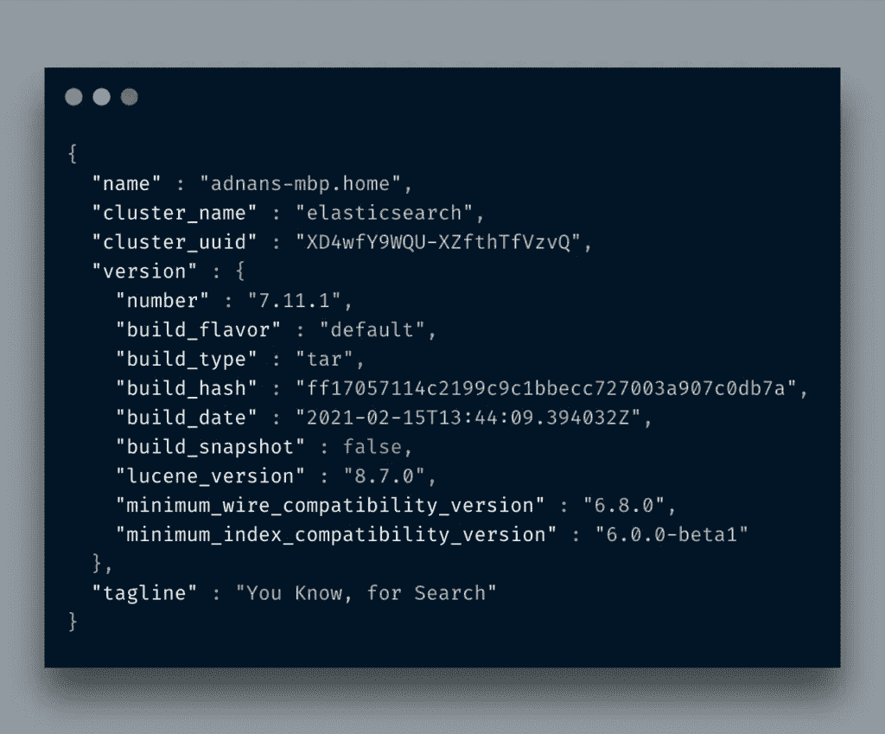

版本号为`7.11.1`，是 ES 版本。

现在，在我继续使用 Python 访问弹性搜索之前，让我们做一些基本的事情。正如我提到的，ES 提供了一个 [REST API](https://www.elastic.co/guide/en/elasticsearch/reference/current/docs.html) 接口，我们将使用它来执行不同的任务。我将使用 [Postman 应用](https://www.postman.com/downloads/)来执行 REST APIs。

# 基本示例

# 创建索引

您要做的第一件事就是创建一个索引*。一切都存储在索引中。与*索引*相对应的 RDBMS 是一个*数据库*,所以不要将它与您在 RDBMS 中学习的典型索引概念相混淆。请注意 PUT 是用来代替 POST 的。*

*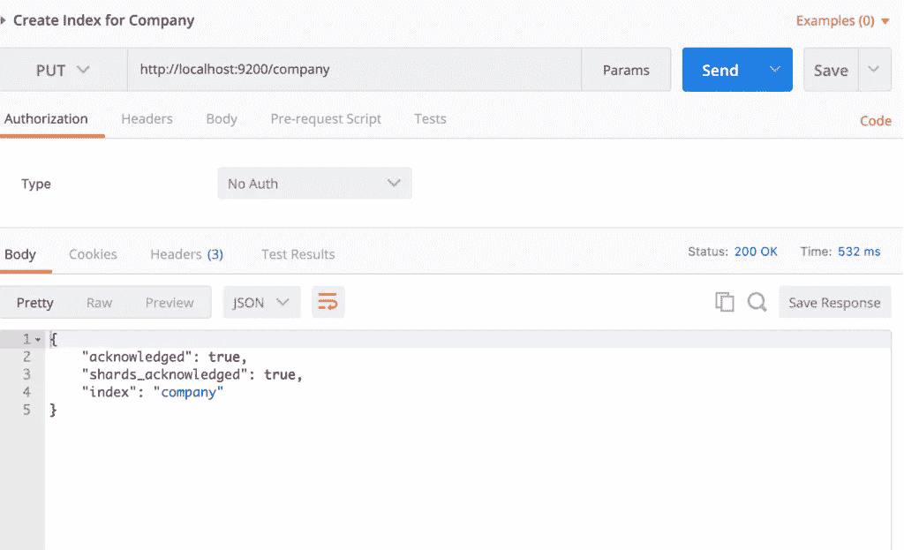*

*如果我再跑，它会拼命尖叫。*

*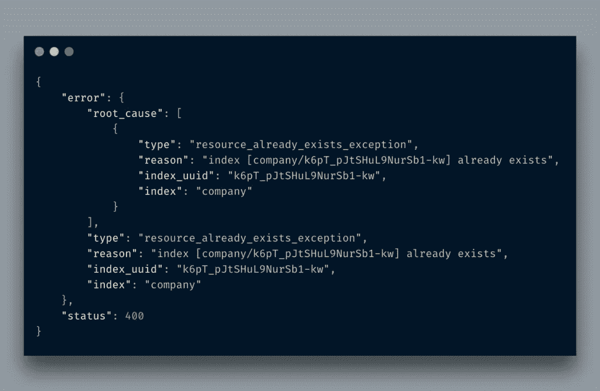*

*因此，我们创建了一个名为 *company* 的数据库。换句话说，我们创建了一个名为*公司*的*指数*。如果您从浏览器访问`http://localhost:9200/company`,您会看到如下内容:*

*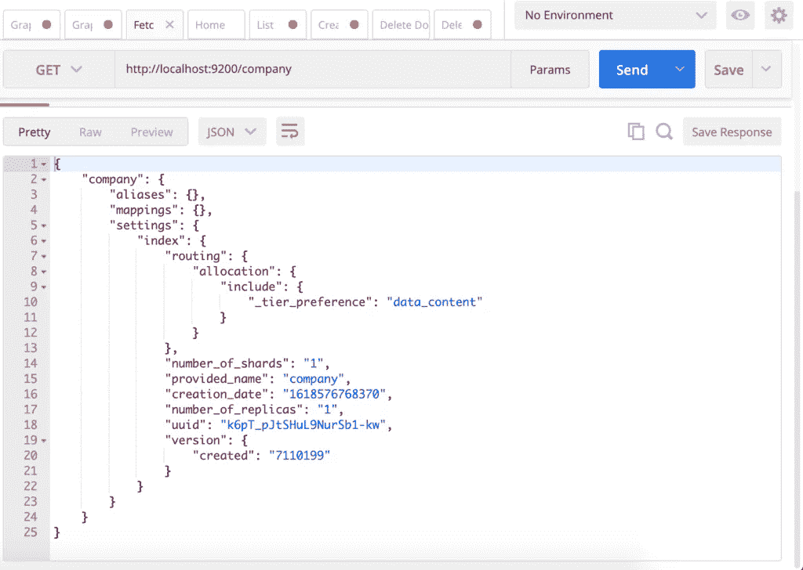*

*暂时忽略`mappings`,我们稍后会讨论它。它实际上只是为你的文档创建一个模式。`creation_date`不言自明。`number_of_shards`告知将保存该*索引*的数据的分区数量。将全部数据保存在一个磁盘上毫无意义。如果您正在运行一个由多个弹性节点组成的集群，那么整个数据将在这些节点之间进行分割。简而言之，如果有 5 个分片，那么整个数据在 5 个分片上都是可用的，ElasticSearch 集群可以为来自任何节点的请求提供服务。*

*复制品谈论镜像你的数据。如果你熟悉*主从*概念，那么这对你来说应该不陌生。你可以在这里了解更多基本的 ES 概念。*

*您还可以一次完成索引创建和记录插入。你所要做的就是以 JSON 格式传递你的记录。你可以在*邮差*里看到如下内容:*

*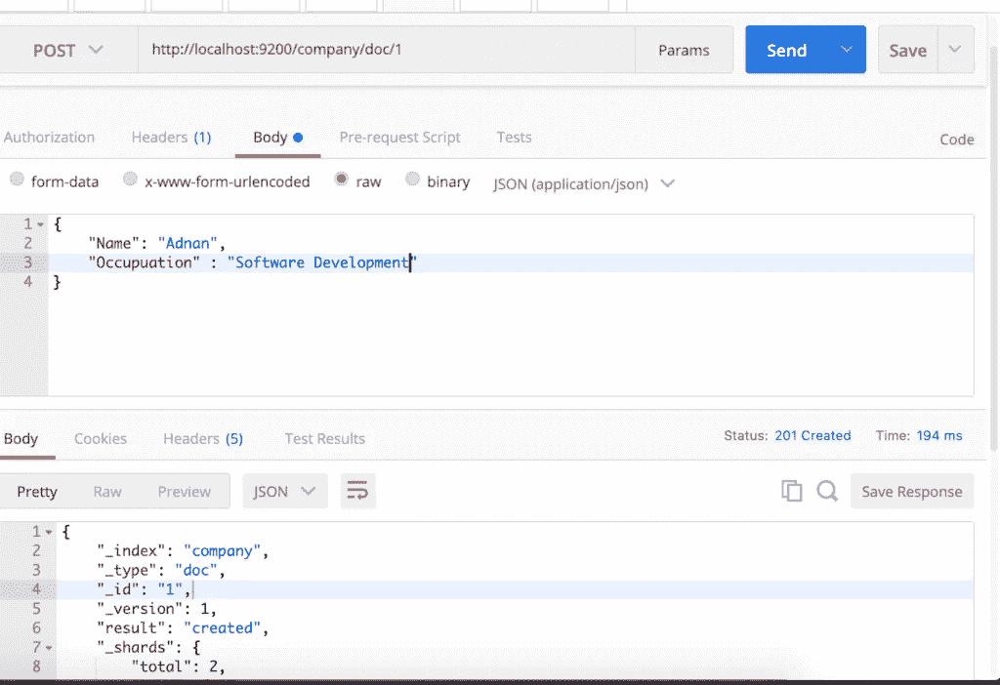*

*如果你读过我之前的版本，你会注意到我提到了`/employees`而不是`doc`*

*这是因为从 ES7+文档类型已经被[移除](https://www.elastic.co/guide/en/elasticsearch/reference/7.x/removal-of-types.html)，因此也不能用于映射。现在建议为每种文档类型创建一个索引，因此现在将使用通用的`doc`。您仍然可以创建旧的方式，但会面临的问题，而创建映射。*

# *创建/更新文档*

*之前我同时创建了索引和文档，但并不总是这样。如果您必须创建更多的文档，该怎么办？*

*我正在删除之前创建的索引和文档，并重新创建没有文档信息的*公司*索引。顺便说一下，如果你只是删除索引，它会删除所有相关的文件。*

*现在，我将在现有索引中创建一个文档。*

*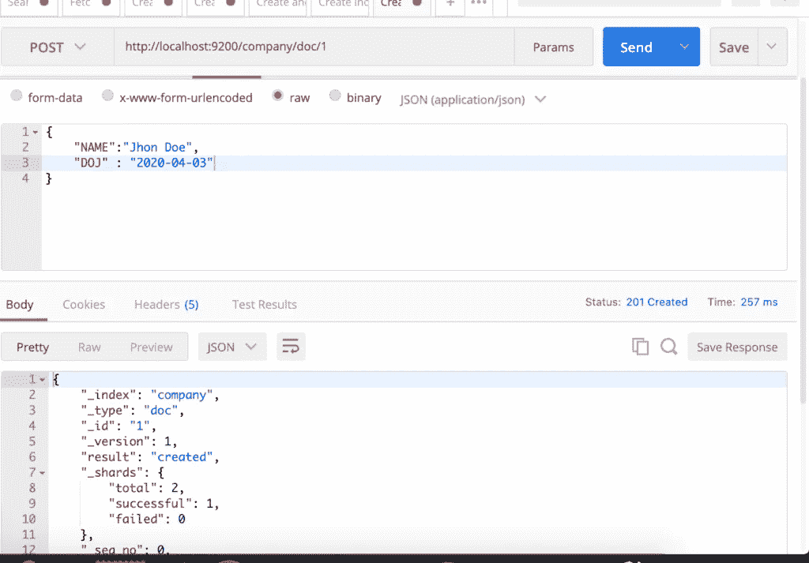*

*如您所见，我传递了一个 JSON 结构，它返回了一个 JSON 响应。注意设置为`created`的字段`result`。如果我再次发出同样的请求，它会被改成`updated`。*

*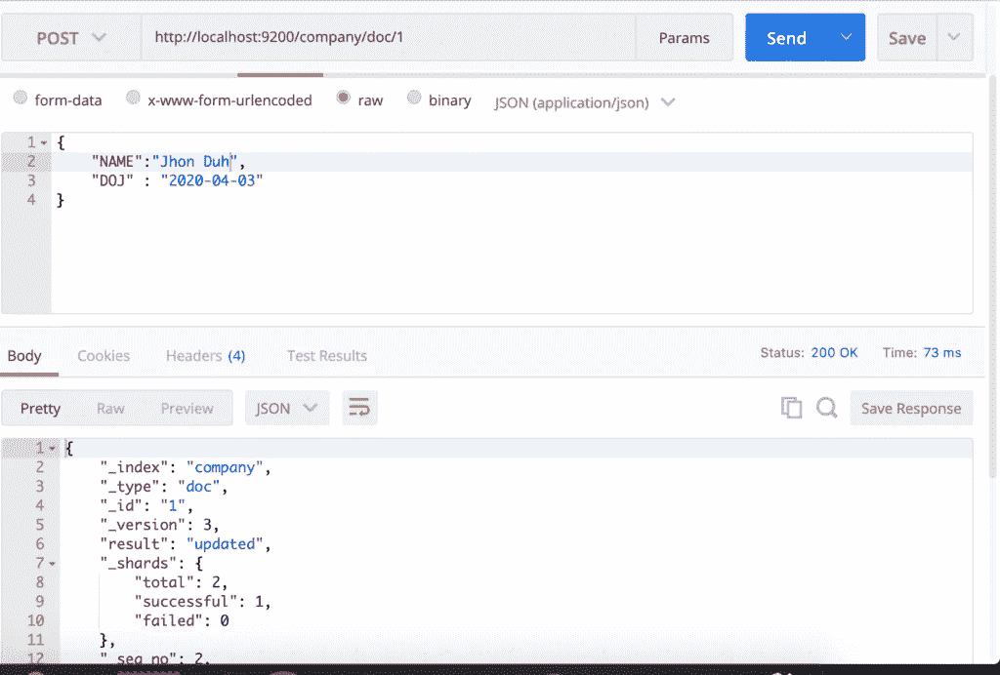*

*以下是一些需要注意的事项:`result`改为`updated`。虽然我把`NAME`改成了`Jhon Duh`。即使我不修改它，它仍然会被认为是 Elasticsearch 的更新文档。注意`version`字段，它现在变成了`3`，因为第一个版本是`1`(检查上面的图片)，然后我就把它和现在这个。每次你点击请求，它就会更新版本。请记住这种版本控制是为了内部目的，您不能通过提及版本号来检索文档的以前版本。您必须自己实现该机制。*

*在上面的 URL 中，我将`1`作为 ID 传递。Elasticsearch 将文档类型和`/`后的任何内容设置到`ID`中。*

*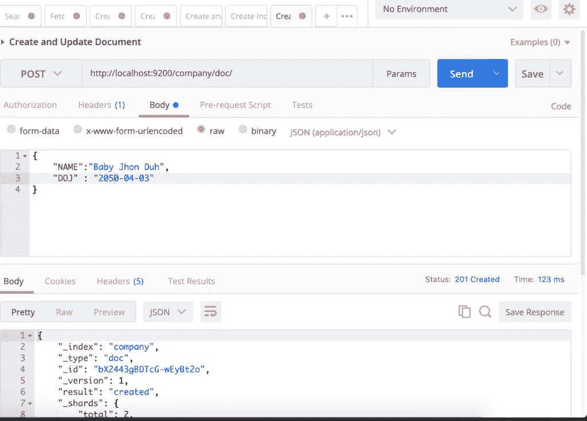*

*注意这里的`_id`字段。它是一串随机的字母数字字符。IMO 不提及 ID 更好，因为它不是 RDBMS，提供随机 ID 有助于避免猜测 ID，因此不能运行自动过程来获取所有文档。*

# *取一份文件*

*获取一份文件不是火箭科学。您所要做的就是通过传递 ID 向您的文档发出一个`GET`请求。*

*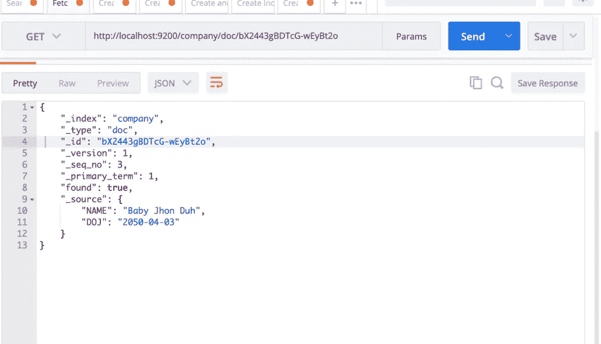*

*通过提及 ID，您可以检索文档*

# *获取索引中的所有文档*

*通过访问 URL `http://localhost:9200/company/doc/_search`，您可以获取索引中的所有文档。*

*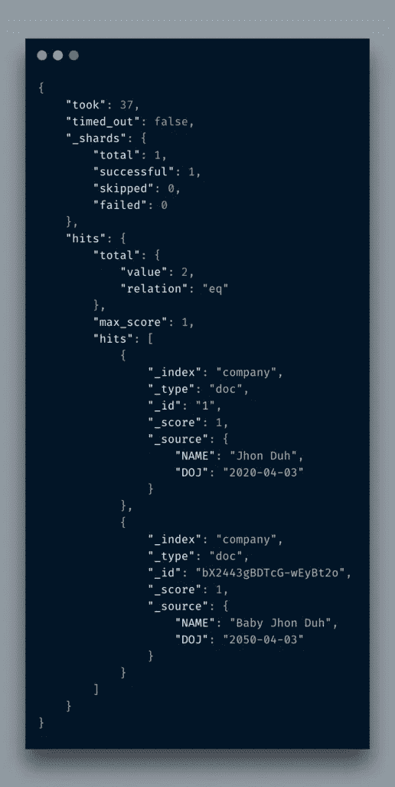*

*你只需在`/doc`后提到`_search`，它就会返回所有。类似于`SELECT * FROm TABLE`。*

# *删除索引/文档*

*删除索引或文档是一件非常简单的事情。你所要做的就是发送一个**删除**请求。*

*   ****删除文档:-*** `curl -X DELETE \ http://localhost:9200/company/_doc/1 \ -H 'cache-control: no-cache' \ -H 'content-type: application/json' \ -H 'postman-token: 92e4cbf1-0019-16ec-bc1c-4ed8ffa16e99'`*
*   ****删除一个指标:-*** `*curl -X DELETE \ http://localhost:9200/company/ \ -H 'cache-control: no-cache' \ -H 'content-type: application/json' \ -H 'postman-token: c67845af-5c96-a6ce-06dd-50ad3d8070b0'*`*

# *创建映射*

*如上所述，映射实际上是定义文档的模式。当您在索引中创建一个文档时，Elasticsearch 通过推断文档字段来定义它自己的映射，并且您可以在单个索引中存储灵活的文档。如果您想严格控制应该存储哪些字段和哪种数据，该怎么办？映射是答案。*

*我将删除旧的索引，并使用适当的映射重新创建它。*

*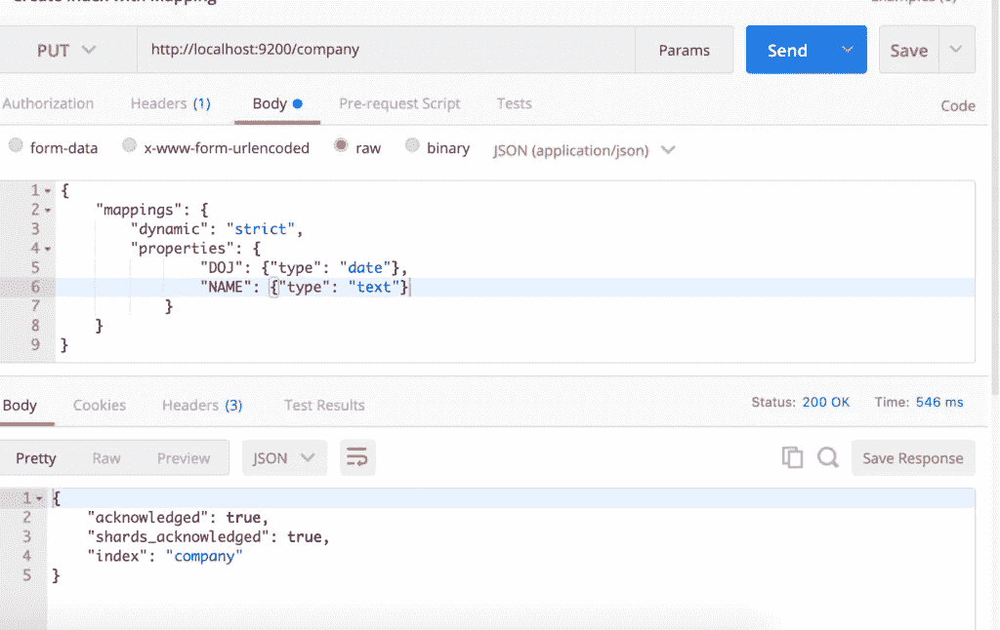*

*这里我定义了两个字段的映射。也就是说，文档必须包含这些字段以及这些特定的类型。*

*好的，让我们试着添加错误的文档。*

*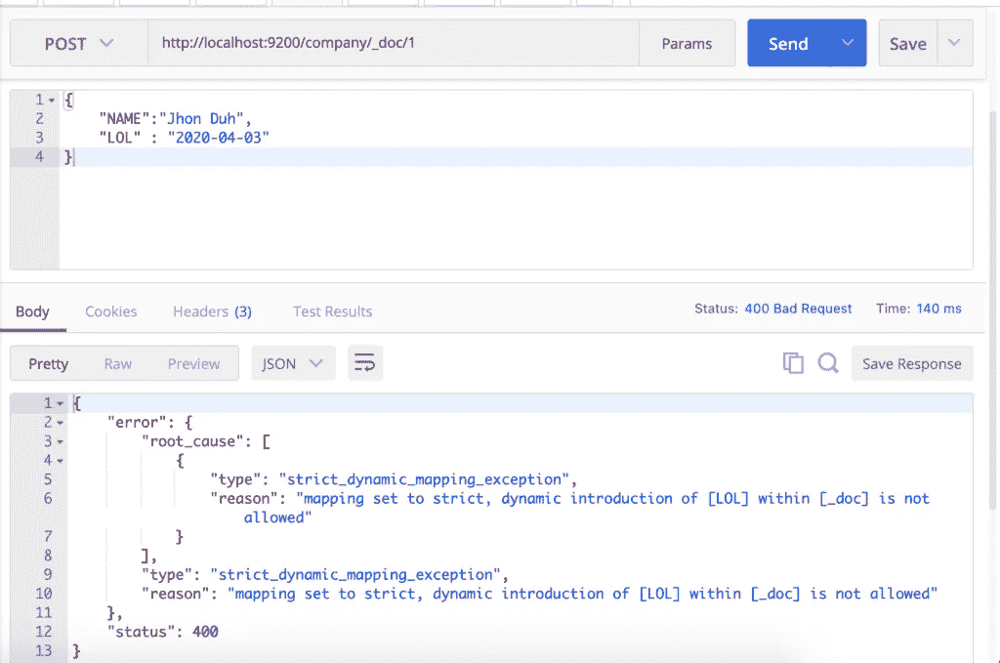*

*Kewl！我把`DOJ`换成了`LOL`，它立刻抱怨起来。现在我传递以下信息。字段名相同，但数据错误。*

**

*现在它给出了错误:*

*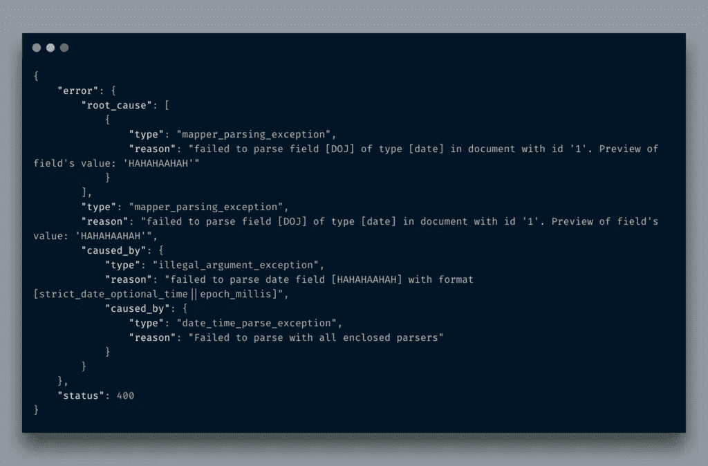*

*厉害！正如你所看到的，它立刻抱怨说我发送的是`text`而不是`date`类型的数据。在非常早的阶段定义模式可以省去很多麻烦。*

# *用 Python 访问 ElasticSearch*

*说实话，ES 的 REST APIs 已经足够好了，你可以用`requests`库来执行你所有的任务。尽管如此，你可以使用一个 [Python 库](https://elasticsearch-py.readthedocs.io/en/master/)进行 ElasticSearch 来专注于你的主要任务，而不是担心如何创建请求。*

*通过 pip 安装它，然后你可以在你的 Python 程序中访问它。*

*`pip install elasticsearch`*

*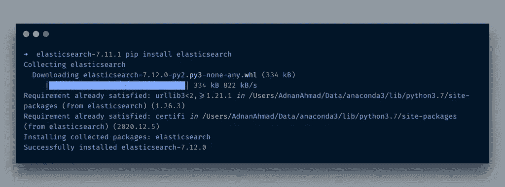*

*好了，lib 已经安装好了，现在让我们连接 ES 并在 Python 应用程序的`company`索引中插入一个文档。*

```
*import jsonfrom elasticsearch import Elasticsearchdef connect_elasticsearch():
    _es = None
    _es = Elasticsearch([{'host': 'localhost', 'port': 9200}])
    if _es.ping():
        print('Yay Connected')
    else:
        print('Awww it could not connect!')
    return _esdef store_record(es_object, index, data):
    is_stored = Truetry:
        outcome = es_object.index(index=index, doc_type='_doc', body=json.dumps(data))
        print(outcome)
    except Exception as ex:
        print('Error in indexing data')
        print(str(ex))
        is_stored = False
    finally:
        return is_storedif __name__ == '__main__':
    data = {
        "NAME": "ES",
        "DOJ": "2012-04-02"
    }
    es = connect_elasticsearch()
    r = store_record(es, 'company', data)
    print(r)*
```

*代码是不言自明的。在连接到 ES 的实例后，我发送一个 JSON 有效负载进行存储。当它运行时，它生成以下输出。*

*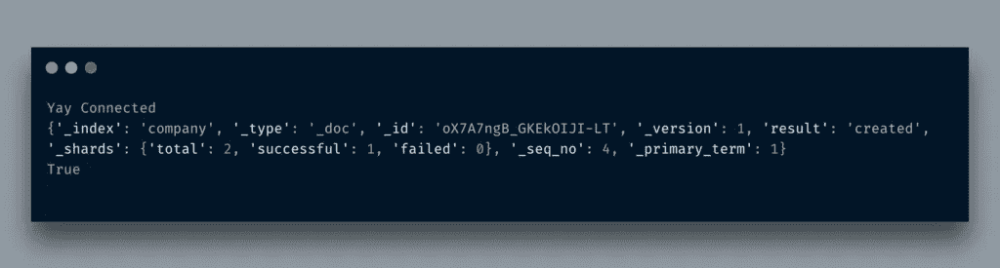*

*生成一个新文档，其 id 在此处，您可以在`_id`字段中看到。您也可以传递`id`参数，但是我依赖内部生成的 id。为了验证文档是否真的生成了，我只是提出了一个我们之前讨论过的搜索请求。*

*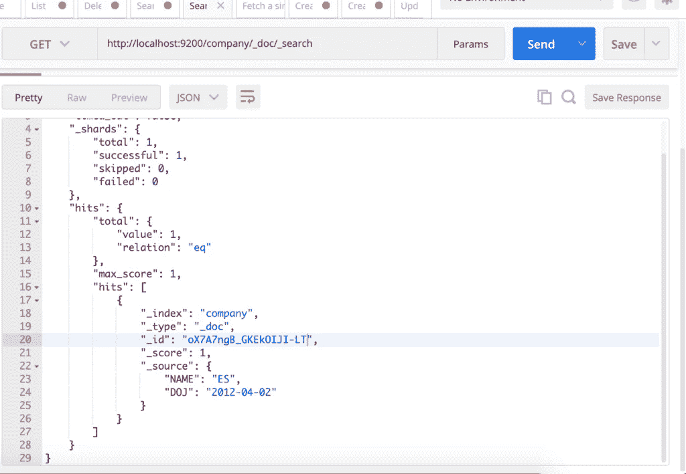*

# *结论*

*Elasticsearch 是一款功能强大的工具，通过提供强大的功能来返回最准确的结果集，可以帮助您搜索现有或新的应用程序。我刚刚谈到了它的要点。一定要阅读文档，熟悉这个强大的工具。*

**原载于 2021 年 4 月 21 日*[*http://blog . adnansiddiqi . me*](http://blog.adnansiddiqi.me/getting-started-with-elasticsearch-7-in-python/)*。**