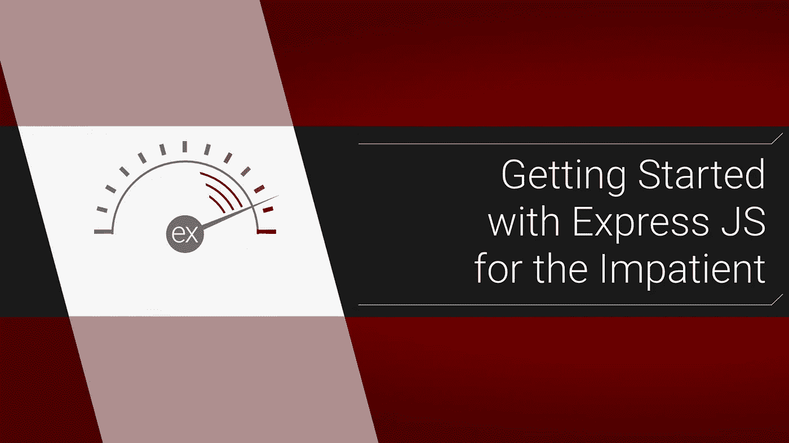

# 为不耐烦的人开始使用 Express JS

> 原文：<https://itnext.io/getting-started-with-express-js-for-the-impatient-9177fc0e1b49?source=collection_archive---------3----------------------->

## 一个快速代码和许多链接



你是否知道另一个框架，比如 Rails 或 Django，但是想看看在 Express 中使用 fullstack js 是什么感觉？太好了，你就是目标观众。我们将涉及很多内容，但请不要着急，请*边走边查看链接。*

## 概观

1.  最简单的应用程序
2.  解释中间件
3.  服务静态资产
4.  使用路由器和路由

目标是有一个静态的主页和一个 API 对话。我假设你有[节点安装](https://nodejs.org/en/download/)和 JS 经验，所以我们不会处理那个。

# 0.文件结构和安装

制作这些文件:

```
***public/***
 └ index.html
 └ styles.css
***src/***
 └ index.js
 └ ***routes/***
   └ index.js
   └ ***users/***
     └ get.js
     └ list.js
     └ index.js
package.json
```

将它们留空，但将它复制到您的`package.json`:

```
{
  "name": "express-practice",
  "version": "0.0.0",
  "private": true,
  "scripts": {
    "start": "nodemon src/server.js"
  },
  "dependencies": {
    "express": "~4.16.1"
  },
  "devDependencies": {
    "nodemon": "^1.19.4"
  }
}
```

运行`npm install`就大功告成了！( [nodemon 文档](https://nodemon.io))。

# 1.最简单的应用程序

想在 3 秒钟内编写一个 express 应用程序吗？复制这个:

```
***/* src/server.js */*** const **express** = require('*express*');const **app** = **express**();*/* home route */*
**app.**get('/', (**req**, **res**, **next**) => {
  **res**.send('*hello there*');
});*/* start the app */*
const **port** = **process**.env.**PORT** || 4321;
const **host** = '*0.0.0.0*';
app.listen(**port**, **host**, () => {
  **console**.log(`[*http://localhost:*${**port**}*`*);](http://localhost:${port}`);)
});
```

运行`npm start`，你应该会在主页面上看到文本。现在它运行了，我们来解释一下:

## 快递和 app

我们需要`express`，它返回一个对象。如果我们调用它，一个顶层函数返回一个`express`应用程序的实例。99%的时间它被称为`app`，所以叫它，除非你想变得困难。这个`app`是我们放所有东西的地方，比如我们的(临时)回家路线。

## 。获取和路由处理程序

我们使用`app.get`方法，它采用一个路径和一个中间件函数。[有所有的 http 动词](http://expressjs.com/en/4x/api.html#app.METHOD)，所以`.post`、`.delete`等等，但是我们会保持简单，只使用`.get`。我们也只使用了一个中间件回调，但是有可能使用多个。这又是我们的:

```
(**request, response, next**) => { **response.**send('*hello there*');});
```

它总是接受这三个参数，即`request`对象、`response`对象和`next`函数(稍后会详细介绍)。[请求对象](https://expressjs.com/en/4x/api.html#req)保存有用的东西，比如你的参数；您的[响应对象](https://expressjs.com/en/4x/api.html#res)包含了[响应方法](http://expressjs.com/en/guide/routing.html#response-methods)。您将使用最多的是`res.send()`，因为它可以发送 JSON。这里我们只是向客户端发送文本。

## 启动应用程序

最后，我们通过告诉我们的应用程序在主机`‘0.0.0.0’`上监听[端口环境变量](https://stackoverflow.com/questions/18864677/what-is-process-env-port-in-node-js)来结束它。你不必包括主机，它默认为`localhost`但是`‘0.0.0.0’` [防止 Docker 问题](https://stackoverflow.com/questions/20778771/what-is-the-difference-between-0-0-0-0-127-0-0-1-and-localhost)。您还可以在它启动时给它一个回调来运行。我写下了网址，这样我就可以从 [iterm](https://iterm2.com/) 用 cmd+点击它。

你有它！那是你的第一个快递应用。但是你不了解中间件就不能使用 Express，所以我们就多谈谈这个吧。

# 2.解释中间件

中间件是模块化的答案。你实际上是告诉你的应用程序使用一系列的函数来做一些事情，比如记录或者修改请求。在每个函数结束时，它调用下一个函数， ***总是*** 调用`next`。最终，请求将前进到实际的路由(它本身是一个中间件功能)并向客户端发送响应。*中间件* ***必须*** *通过调用* `*next*` *回调或者向客户端发送响应来结束。*

## 添加一些中间件:

我们打算这样做，以便每次我们找到一个路由时，我们将记录到节点控制台的路径。为了演示，我将向`request`对象添加一个属性，我们稍后可以访问:

```
***/* src/server.js */***
const **express** = require('*express*');const **app** = **express**();*/* new logging middleware */*
**app**.use((**req**, **res**, **next**) => {
  **console.**log(`*hit:* ${**req**.originalUrl}`);
  **req**.test = '*wow*';
  **next**();
});*/* home route */*
**app.**get('/', (**req**, **res**, **next**) => {
  **console**.log('*req.test*: ', **req.**test);
  res.send('*hello there*');
});// ...rest of app...
```

通过调用`[app.use](https://stackoverflow.com/questions/11321635/nodejs-express-what-is-app-use)`,我们向应用程序注册了中间件。我们调用了`next`函数，这样请求将在我们登录后继续它们的路由。请注意，我们没有给出路线参数，这意味着这个中间件将应用于应用程序上的每一条路线。但这并不总是需要的，所以有时您需要一个路由参数:

```
**app**.use('/*specific*', (**req**, **res**, **next**) => {
```

要记住的最重要的事情是顺序很重要。**中间件按顺序处理**。如果你把它写在回家的路线下面，`res.send`将结束这个链，我们的伐木工将永远不会被调用。

## app。 <httpmethod>vs app.use</httpmethod>

你会注意到`app.use`的行为很像`app.get`，那么有什么不同呢？阅读这个 [stackoverflow 问题可以得到一个很好的解释](https://stackoverflow.com/questions/15601703/difference-between-app-use-and-app-get-in-express-js)，但是 TL；博士，不同的方法让事情有条理，意图清晰。

# 3.服务静态资产

在我们添加一些真正的中间件之前，请将它复制到您的`/public/index.html`:

```
<!DOCTYPE html>
<head>
  <link 
    rel="stylesheet" 
    type="text/css" 
    href="styles.css"
  >
  <title>Hi</title>
</head><body>
  <h1>Hello world</h1>
</body>
</html>
```

然后把这个加到`/public/styles.css`:

```
h1 {
 color: red;
}
```

简单得令人惊叹。好了，现在我们要用一些静态中间件来替换我们原来的本地路由:

```
***// src/server.js
const path = require('path');***
const **express** = require('*express*');
const **app** = **express**();/* 
  *unchanged logger* 
*/**/* set up static files router 
 *** [***path***](https://stackoverflow.com/questions/39110801/path-join-vs-path-resolve-with-dirname) ***and*** [***dirname***](https://stackoverflow.com/questions/8131344/what-is-the-difference-between-dirname-and-in-node-js) ***links*
 */
app.**use**(
  express.**static**(
    path.**join**(
      __dirname,
     '..',
     '***public***',
    )
  )
);**/* 
  *unchanged start app* 
*/
```

原谅不可靠的间距，我试图使这个工作在移动，但在全屏静态功能看起来像:

```
**app**.use(**express**.static(**path**.join(**__dirname**, '..', '*public*')));
```

这里的关键[是](https://expressjs.com/en/starter/static-files.html) `[express.static](https://expressjs.com/en/starter/static-files.html)`，一个内置的中间件功能，让我们托管资产。它只需要一个可选的挂载路径、一个要检查的目录字符串和一个[选项对象](https://expressjs.com/en/4x/api.html#express.static)。通常，默认选项就可以了。我们没有提供挂载路径，所以这将在根目录`‘/public’`下托管我们的静态文件，但是您不必这样做。你可以有不止一个，[查看码头了解更多信息](https://expressjs.com/en/starter/static-files.html)。

## 对…的简要解释。静电

对`‘/’` 的客户端请求将在`public`文件夹中查找默认文件并服务于`‘/public/index.html’` ( `index`是默认文件名，`.html`是默认扩展名)。然后 html 页面对`‘styles.css’`的请求会在公共文件夹中找到`/public/styles.css`。

然而，类似`‘/users’`的请求是 api 路由，而不在`public`中。所以，static 会首先检查`‘/public/users.html’`，什么也没找到，然后继续检查常规的 api 路由。

# 4.使用路由器和路由

对于本项目的最后一部分，我们将使用带有`[express.Router](https://expressjs.com/en/api.html#router)`的[路由器](https://expressjs.com/en/api.html#router)来设置 API。虽然我们已经看到了如何使用`app.get`向我们的主应用程序中添加路由，但是还有另一种方法可以让事情更有条理。

这个想法是，每个子路由，像`/users`一样，都将托管在自己的`router`上。我们会将所有相关的路线添加到其中，然后调用`app.use`:

```
app.use('/users', userRouter);
```

现在，当请求 url 符合基本情况时，我们的主应用程序切换到路由器的子路由。抛开理论不谈，让我们来看看路由器的现实世界模式。我们将从上到下，从单个路由到服务器文件。

## src/routes/user/get . js 和 list.js

这两条是实际的`user`路线。这两个文件都导出以路由器为参数的函数。所有的功能都是将其路线添加到给定的`router`中。我们本质上是在做`app.get`，但是用`router`代替`app`。

注意路径是`/:id`和`/`，而不是`/users/:id`和`/users`。在 Express 中，基本路由`/users`是在应用层添加的，因此可以在路由器上的路由之间共享。还要注意在`get.js`中有一个[动态路由:id' param](https://expressjs.com/en/guide/routing.html#route-parameters) 和一个[查询参数](https://expressjs.com/en/5x/api.html#req.query)。

```
***/* /src/routes/users/get.js */***
*// get a single user***module**.exports = (**router**) => {
  **router**.get('*/:id*', (**req**, **res**) => {
    **res**.send({
      **id**: **req**.params.id,
      **name**: **req**.query.name,
    });
  });
}; ---------------------------------
***/* src/routes/users/list.js */***
*// list all users* **module**.exports = (**router**) => {
  **router**.get('/', (**req**, **res**) => {
    **res.**send([
      {
        **id**: 1,
        **name**: '*tom*',
      },
    ]);
  });
};
```

## src/routes/users/index.js

为了保持整洁，我们将在我们的`/users/index.js`文件中创建用户路由器，然后将其导出:

```
***/* src/routes/users/index.js */***
*// add the routes to the router*const **express** = require('*express*');
const **router** = **express**.Router();/* user only middleware */ **router.**use((**req**, **res**, **next**) => {
  **console**.log('*User middleware*');
  **next**();
});**require**('*./list*')(**router**);
**require**('*./get*')(**router**);**module.**exports = **router**;
```

`**require**(x)(y)`看起来很奇怪，但是在现实世界中你会添加很多文件，像这样的请求和调用是很庞大的:

```
const **route** = require(‘./*route*’); 
**route**(**router**)**;**
```

这也是您使用`router.use`添加路由器特定中间件的文件。只要记住在添加路线之前放置中间件，顺序很重要！

## src/路线/索引

在`routes`文件夹的`index.js`中，我们将导出一个采用 app 的函数，然后将所有路由器添加到其中。在这种情况下，我们只有一个路由器，但是随着应用程序的增长，您会列出每个额外的路由器。这是*最后*我们添加基本路线`/users`的地方:

```
/* src/routes/index.js */
// add the routers to an app const **addAllRoutes** = (app) => {
  **app**.use(
    '*/users*', 
    **require**('./users')
  );
};module.exports = addAllRoutes;
```

最后，我们将函数添加到我们的`src/server.js`:

```
const path = require('path');
const express = require('express');
**const addAllRoutes = require('./routes');**
// ...unchanged app**/* register all routes */
addAllRoutes(app);**/* start the app */
const **port** = **process**.env.**PORT** || 4321;
// ......unchanged app
```

哒哒！那是我们完成的项目！我希望这能给你一个好的起点。一些直接的下一步将是引入一个创建-反应-应用程序而不是 index.html，并查看 [passport.js 的 auth](http://www.passportjs.org) ！

大家编码快乐，

麦克风