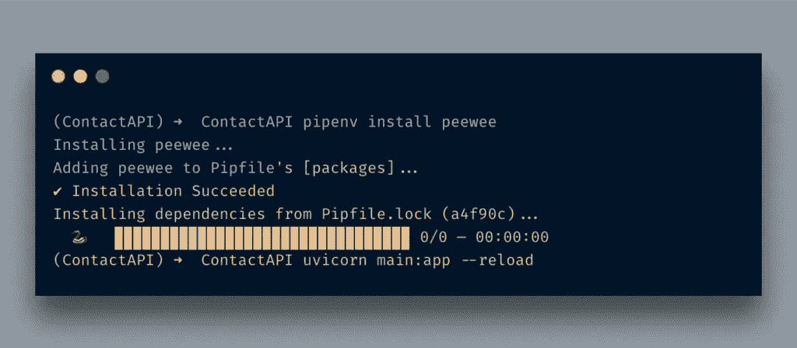
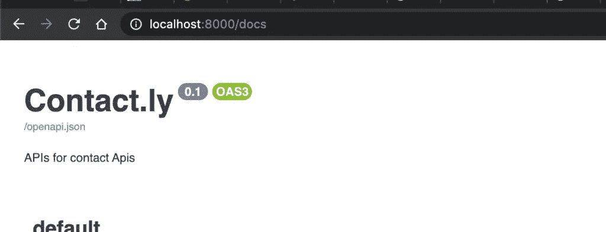
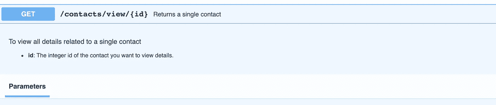
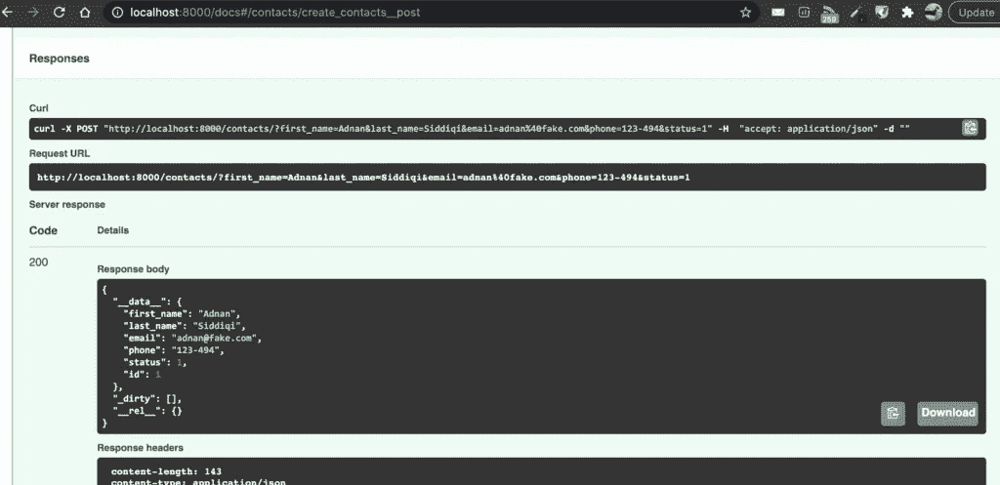
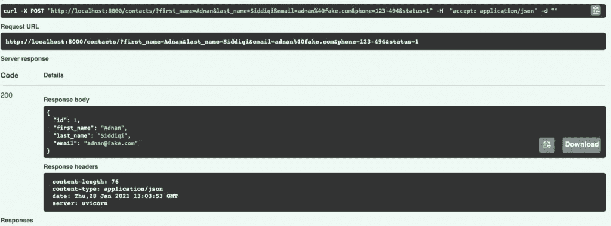
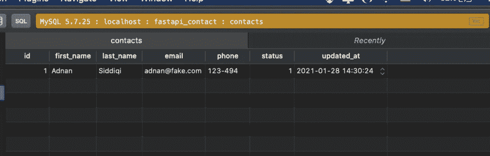
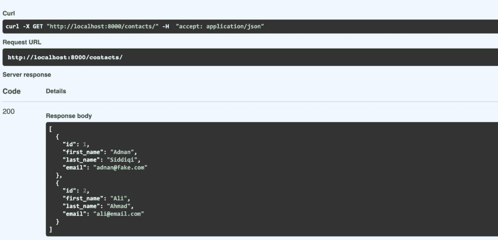
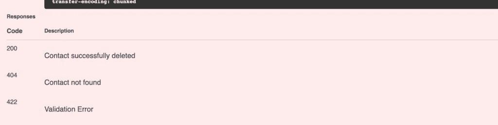
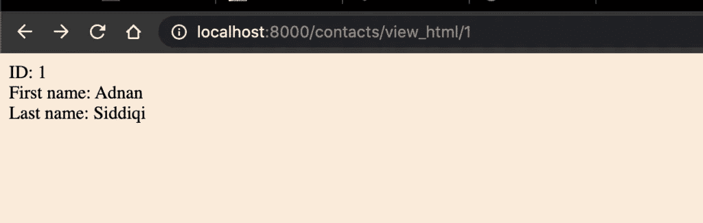

# FastAPI 和 MySQL 入门

> 原文：<https://itnext.io/getting-started-with-fastapi-and-mysql-96e720cc761a?source=collection_archive---------2----------------------->


尼古拉斯·霍伊泽在 [Unsplash](https://unsplash.com/s/photos/fast?utm_source=unsplash&utm_medium=referral&utm_content=creditCopyText) 上拍摄的照片

这篇文章是 FastAPI 系列的一部分。

在第一篇[帖子](http://blog.adnansiddiqi.me/create-your-first-rest-api-in-fastapi/)中，我向您介绍了 FastAPI 以及如何在其中创建高性能的基于 Python 的应用程序。在本文中，我们将研究与 MySQL 数据库交互的 Rest APIs。我们还将探讨如何在多个文件中组织路由器和模型，使它们更易于维护和阅读。

FastAPI 并不要求您使用特定的数据库框架。您可以使用 SQLAlchemy 或任何其他您想要的。我更喜欢用 [peewee](http://blog.adnansiddiqi.me/develop-database-driven-applications-in-python-with-peewee/) ，因为它更有表现力，也更容易使用。

# 安装 Peewee 和 MySQL 驱动程序

在开始在我们的应用程序中使用 MySQL 之前，我们必须准备好所有的东西。为此，我们将首先安装`peewee` ORM。



我将创建一个名为`database.py`的单独文件，并向其中添加以下代码。

```
from peewee import *user = 'root'
password = 'root'
db_name = 'fastapi_contact'conn = MySQLDatabase(
    db_name, user=user,
    password=password,
    host='localhost'
)class BaseModel(Model):
    class Meta:
        database = conn
```

我导入了框架并创建了一个`MySQLDatabase`对象。我正在传递所有必需的凭证，以确保连接成功。

但是等等…在我们运行服务器之前，我们还需要安装 MySQL 驱动程序。我将使用 PyMySQL 来连接 MySQL 数据库，否则您将会看到以下错误:

```
self._state.set_connection(self._connect())
  File "/Users/AdnanAhmad/.local/share/virtualenvs/ContactAPI-Ycq5CXn7/lib/python3.9/site-packages/peewee.py", line 3964, in _connect
    raise ImproperlyConfigured('MySQL driver not installed!')
peewee.ImproperlyConfigured: MySQL driver not installed!<a href="[http://blog.adnansiddiqi.me/wp-content/uploads/2021/01/fastapi_install_pymysql.png](http://blog.adnansiddiqi.me/wp-content/uploads/2021/01/fastapi_install_pymysql.png)"></a>
```

到目前为止一切顺利。现在我将更改`main.py`来导入`database.py`文件内容。

```
app = FastAPI(title='Contact.ly', description='APIs for contact Apis', version='0.1')[@app](http://twitter.com/app).on_event("startup")
async def startup():
    print("Connecting...")[@app](http://twitter.com/app).get("/")
async def root():
    return {"message": "Contact Applications!"}
```

发生了几件事，但让我先讨论其中重要的一件: [FastAPI 事件](https://fastapi.tiangolo.com/advanced/events/)。

# FastAPI 事件

FastAPI 提供了几个可以在应用程序中使用的事件:启动和关闭。

**启动事件**:该事件负责在启动应用程序时执行某些任务。启动应用程序意味着当你到达某个 API 端点时，它首先被执行。像连接数据库这样的任务是在做任何事情之前必须执行的任务之一。

**关机事件:**该事件在 app 退出或关机时触发。在离开应用程序之前，您可能希望使用此事件来存储所有信息。

这些事件的优点是，您不必在每个 API 端点中调用代码。

正如您现在所理解的，我正在连接启动事件的数据库。

另一件事你可能已经注意到了，我在`FastAPI`构造函数中传递了一些命名参数。当我这样做时，它会产生如下所示的内容:



看起来好多了，不是吗？

现在我必须创建路由器、模型、数据库连接等。这些都在一个文件中会使应用程序变得臃肿。我现在将创建两个文件夹，分别名为`models`和`routers`。我还在根文件夹中创建了一个文件`database.py`，它将实例化`MySQLDatabase`类对象。

# 什么是 APIRouter

如果你有一个小的应用程序，把你所有的路线放在一个单独的`main.py`文件中是可以的，但是如果你在一个大的系统上工作，那么把所有的路线放在一个单独的文件中会使它变得笨拙和臃肿。如果我们可以按照实体或应用程序组织一组路由器，那该有多好？像姜戈提供的东西。

FastAPI 的 [APIRouter](https://fastapi.tiangolo.com/tutorial/bigger-applications/?h=+apirouter#apirouter) 可以帮助你在多个文件中组织你的路由和逻辑。

在根文件夹中，我创建了一个名为`routers`的文件夹，我将在其中添加我的联系 API 相关的路由器。我在里面加了一个`__init.py__`把它变成一个包。你可以不做这件事。我正在添加我的路线文件，`contact.py`，其内容如下:

```
from fastapi import APIRouterrouter_contacts = APIRouter(
    prefix="/contacts",
    tags=["contacts"]
)[@router_contacts](http://twitter.com/router_contacts).get("/",summary="List of contacts", description="Returns all contacts" )
async def get_contacts():
    #create(first_name='Addu', last_name='Pagal', [email='addu@gmail.com](mailto:email='addu@gmail.com)', phone='123-494', status=1)
    return [{'status': 'OK'}]
```

我通过传递两个参数创建了一个`APIRouter`对象:*前缀*和*标签。这让我们可以在每个端点添加`/contacts/`。*

我还添加了在文档中渲染的`summary`和`description`参数。

FastAPI 还允许您使用 *docstring* 来记录您的 API 端点。例如:

```
[@router_contacts](http://twitter.com/router_contacts).get("/view/{id}", summary="Returns a single contact")
async def view(id: int):
    """
        To view all details related to a single contact- **id**: The integer id of the contact you want to view details.
    """
    return [{'status': 'OK'}]
```

这里我使用了带有 markdown 的 *docstring* 。渲染时，它显示为:



很酷，不是吗？在如何显示 API 端点文档方面，Docstring 为您提供了更多的灵活性。

*标签*有助于将应用相关的 API 组织在文档中的一个位置。它们也在 OpenAPI 中使用。例如，当我访问`http://localhost:8080/openapi.json`时，它会显示以下内容，您可以在其中看到给出的标签。

```
{"openapi":"3.0.2","info":{"title":"Contact.ly","description":"APIs for contact Apis","version":"0.1"},"paths":{"/":{"get":{"summary":"Root","operationId":"root__get","responses":{"200":{"description":"Successful Response","content":{"application/json":{"schema":{}}}}}}},"/contacts/":{"get":{"tags":["contacts"],"summary":"List of contacts","description":"Returns all contacts","operationId":"get_contacts_contacts__get","responses":{"200":{"description":"Successful Response","content":{"application/json":{"schema":{}}}}}}},"/contacts/view/{id}":{"get":{"tags":["contacts"],"summary":"View","description":"Returns a single contact","operationId":"view_contacts_view__id__get","parameters":[{"required":true,"schema":{"title":"Id","type":"integer"},"name":"id","in":"path"}],"responses":{"200":{"description":"Successful Response","content":{"application/json":{"schema":{}}}},"422":{"description":"Validation Error","content":{"application/json":{"schema":{"$ref":"#/components/schemas/HTTPValidationError"}}}}}}}},"components":{"schemas":{"HTTPValidationError":{"title":"HTTPValidationError","type":"object","properties":{"detail":{"title":"Detail","type":"array","items":{"$ref":"#/components/schemas/ValidationError"}}}},"ValidationError":{"title":"ValidationError","required":["loc","msg","type"],"type":"object","properties":{"loc":{"title":"Location","type":"array","items":{"type":"string"}},"msg":{"title":"Message","type":"string"},"type":{"title":"Error Type","type":"string"}}}}}}
```

我们已经创建了我们的路线文件，但事情还没有完成。我们必须在`main.py`文件中调用它们。在主文件中，我将进行以下更改。

```
from routers import contactapp = FastAPI(title='Contact.ly', description='APIs for contact Apis', version='0.1')
app.include_router(contact.router_contacts)
```

由于`routers`文件夹现在是一个包，所以我可以调用`router_contacts`变量并将其传递给`include_router`函数。

完成新的联系后，相关路线将出现在文档页面上。

# Peewee 模型

正如我提到的，我将使用 *peewee* ORM 而不是 SqlAlchemy，我将为此创建相关的模型。在此之前，让我们看看`database.py`文件会是什么样子。这个文件将包含`MySQLDatabase`类的类对象，所有需要的参数都传递给它。

下面的`database.py`将会是这样的:

```
from peewee import *user = 'root'
password = 'root'
db_name = 'fastapi_contact'conn = MySQLDatabase(
    db_name, user=user,
    password=password,
    host='localhost'
)
```

后来，在`main.py`文件中，我打算这样称呼它:

```
from database import *[@app](http://twitter.com/app).on_event("startup")
async def startup():
    if conn.is_closed():
        conn.connect()[@app](http://twitter.com/app).on_event("shutdown")
async def shutdown():
    print("Closing...")
    if not conn.is_closed():
        conn.close()
```

因此，无论何时访问任何 API 端点，它都会创建一个连接，然后在所有执行完成后关闭它。

现在模型…我将创建几个模型:一个`BaseModel`负责将模型与 MySQL 数据库关联起来，一个`Contact`负责处理`contacts`表。我假设已经创建了该表，因此没有覆盖它。要了解更多，你可以在这里查看我的文章。

```
from peewee import *
from database import connclass BaseModel(Model):
    class Meta:
        database = conn
```

和`contact.py`

```
from peewee import *from .Base import BaseModelclass Contact(BaseModel):
    first_name = CharField(max_length=30)
    last_name = CharField(max_length=30)
    email = CharField(max_length=40)
    phone = CharField(max_length=25)
    status = SmallIntegerField()
    updated_at = DateTimeField()class Meta:
        db_table = 'contacts'
```

我们将创建 **CRUD** 端点来管理整个应用程序，即用于创建记录、更新、删除和检索的 API 端点。

我将创建我们的第一个联系人 API 端点，它将在数据库中添加一个联系人。在`models/contact.py`中，我将创建一个数据插入方法:

```
async def create_contact(first_name: str, last_name: str, email: str, phone: str, status: int):
    contact_object = Contact(
        first_name=first_name,
        last_name=last_name,
        email=email,
        phone=phone,
        status=status
    )
    contact_object.save()
    return contact_object
```

相当直接。我创建了一个`Contact`对象，并在其中传递了所需的参数。现在注意了。`create_contact`模型方法正在返回一个`ModelSelect`对象，这个对象对我们没有用，因为它包含了一些与 peewee 相关的信息，因此我们需要一个 Pydantic 模型来处理它。这并不简单，所以让我们开始吧！

首先，我将创建一个将 peewee 模型映射到 Pydantic 模型的类。代码[取自](https://fastapi.tiangolo.com/advanced/sql-databases-peewee/?h=+sql)FastAPI 官网:

```
class PeeweeGetterDict(GetterDict):
    def get(self, key: Any, default: Any = None):
        res = getattr(self._obj, key, default)
        if isinstance(res, peewee.ModelSelect):
            return list(res)
        return res
```

接下来，我们将创建联系人的 Pydantic 模型:

```
class ContactModel(BaseModel):
    id:int
    first_name:str
    last_name:str
    email:strclass Config:
        orm_mode = True
        getter_dict = PeeweeGetterDict
```

添加了我们想要显示的字段后，我将`orm_mode`设置为`True`，然后将`getter_dict`参数设置为我们刚刚创建的类`PeeweeGetterDict`，这是 Pydantic 提供的。欲了解更多信息，您可以访问[这里](https://pydantic-docs.helpmanual.io/usage/model_config/)。 **orm_mode** 实际上将 orm 模型对象映射到 Pydantic 对象，因此我们不需要手动构造一个返回对象。

接下来，我将创建一个用于创建新联系人的 POST 端点。

```
from models.contact import create_contact[@router_contacts](http://twitter.com/router_contacts).post("/", summary="Create a new contact")
async def create(first_name: str, last_name: str, email: str, phone: str, status: int):
    return await create_contact(first_name=first_name, last_name=last_name, email=email, phone=phone, status=status)
```

你不必让一个函数成为`async`函数。FastAPI 两者都支持。总之，我正在创建一个`POST`端点，它接受一个 JSON 对象作为输入并创建一条记录。为了简单起见，我在这里只是返回一个 OK，但是在现实世界的应用程序中，您将负责所有的异常和其他东西。

让我们点击`/doc`来创造我们的第一个记录。当它被创建时，它返回如下:



嗯，它确实成功返回了，但是你喜欢返回的 JSON 响应吗？我不知道。它只是返回由 peewee 对象抛出的任何东西。如何让它变得更好，是的，你答对了！通过使用`response_model`参数。API 例程现在将如下所示:

```
[@router_contacts](http://twitter.com/router_contacts).post("/", response_model=ContactModel, summary="Create a new contact")
async def create(first_name: str, last_name: str, email: str, phone: str, status: int):
    return await create_contact(first_name=first_name, last_name=last_name, email=email, phone=phone, status=status)
```

现在让我们再创造一次。太棒了。如您所见，输出看起来不再令人讨厌。它展示了我们想要展示的东西。



我的 MYSQL 客户端显示新插入的数据。



我将在这里创建几个端点，一个用于列表，另一个用于删除。更新是你自己要做的事情😉

在`models/contact.py`中，我添加了一个例程来列出所有联系人，默认情况下最多 100 个条目。

```
def list_contacts(skip: int = 0, limit: int = 100):
    return list(Contact.select().offset(skip).limit(limit))
```

然后在`routers/contact.py`中，我会这样做:

```
[@router_contacts](http://twitter.com/router_contacts).get("/", response_model=List[ContactModel], summary="List of contacts", description="Returns all contacts")
def get_contacts():
    return list_contacts()
```

这与个人接触是一样的。唯一的区别是`response_model`是类型`List`，这样做的原因是模型返回一个列表，所以我们的模型也应该是一个列表。在执行时，它显示如下:



为了删除记录，我将在模型文件中添加以下内容:

```
def delete_contact(id: int):
    return Contact.delete().where(Contact.id == id).execute()
```

并且在`routers/contact.py`

```
[@router_contacts](http://twitter.com/router_contacts).delete(
    "/remove/{id}",
    summary="Delete an individual contact",
    response_class=Response,
    responses={
        200: {"description": "Contact successfully deleted"},
        404: {"description": "Contact not found"},
    },
)
def remove_contact(id: int):
    del_contact = delete_contact(id)
    if del_contact is None:
        return Response(status_code=404)
    return Response(status_code=200)
```

在`delete`装饰器中，我添加了另一个参数`responses`,并为每个 HTTP 状态消息添加了应该在文档中显示的消息。



看起来好多了，不是吗？

在我结束这篇文章之前，我想谈谈另一件事:模板！！！！

# FastAPI 模板

就像 Flask 一样，你也可以在 FastAPI 中使用 [Jinja2 或任何其他模板](https://fastapi.tiangolo.com/advanced/templates/?h=+templ)。您可能不需要这个特性，但是如果您需要提供简单的 HTML，例如一个登录表单，那么可以使用这个特性。

我将首先安装 **Jinja2** :

`pipenv install jinja2`

为了提供静态文件，您还需要`pipenv install aiofiles`。

为了举例，我将创建查看联系人详细信息的 HTML 版本。

我创建了两个文件夹:*静态*和*模板*。静态的将包含所有的资产，而 HTML 文件和模板模板。我只是创建了一个简单的 HTML 文件的演示目的和一个简单的 CSS 文件。

在`main.py`,我做了以下改变:

```
from fastapi.staticfiles import StaticFiles
app.mount("/static", StaticFiles(directory="static"), name="static")
```

请记住，您在这里使用的是`mount`，因为它不是基于 API 的主应用程序的一部分，因此不能成为`APIRouter`的一部分，如果您试图这样做，您会得到一个异常`starlette.routing.NoMatchFound`异常。

在`routers/contact.py`中，我是这样做的:

```
from fastapi.responses import HTMLResponse
from fastapi.templating import Jinja2Templates
....[@router_contacts](http://twitter.com/router_contacts).get("/view_html/{id}", response_class=HTMLResponse, summary="Returns a single contact in HTML")
async def view_html(request: Request, id: int):
    contact = get_contact(id=id)
    if contact is None:
        raise HTTPException(status_code=404, detail="Contact not found")return templates.TemplateResponse("view.html", {"request": request, "contact": contact})
```

注意，我使用的是`response_class`而不是`response_model`参数。当我访问`http://localhost:8000/contacts/view_html/1`时，它呈现为:



# 结论

在这篇文章中，我讨论了如何在 FastAPI 中集成像 MySQL 这样的数据库引擎。我还讨论了如何使用 Jinja2 模板创建 API 的 frontpage。这篇文章的代码可以在 [Github](https://github.com/kadnan/FastAPIMySQLTutorial) 上找到。

*原载于 2021 年 1 月 30 日*[*http://blog . adnansiddiqi . me*](http://blog.adnansiddiqi.me/getting-started-with-fastapi-and-mysql/)*。*