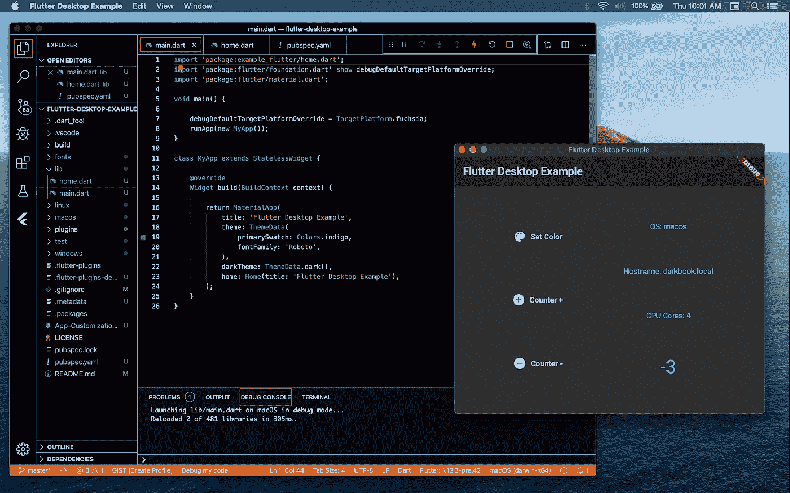

# 开始使用 Flutter Desktop

> 原文：<https://itnext.io/getting-started-with-flutter-desktop-91e8293bafcf?source=collection_archive---------0----------------------->

## 用 Dart 和 Flutter 构建桌面应用程序

在 macos 上运行的示例项目的屏幕截图

## 介绍

自 2018 年 12 月发布 Flutter 以来，它获得了很大的发展势头，并迅速成为当今世界许多专业移动开发者的首选。

基于 Dart 语言和 Flutter 生态系统的成功，桌面目标支持为创建具有清晰可读的代码库和高性能二进制文件的优秀桌面应用程序提供了新的机会。

在本文中，我们将研究使用 Flutter 创建简单桌面应用程序的过程，并探索使用这些工具构建完整桌面应用程序的可能性和挑战。

## 要求

要使用 Flutter 构建桌面应用，需要一个启用桌面支持的最新 Flutter SDK 环境:

*   如果你还没有的话，可以从他们的网站为你的操作系统下载 Flutter
*   用`$ flutter channel master`切换到*主*通道
*   你可以用`$ flutter upgrade`升级 Flutter(如果需要)

要支持您的目标环境，请执行以下操作:

*   Linux: `$ flutter config --enable-linux-desktop`
*   苹果电脑:`$ flutter config --enable-macos-desktop`
*   视窗:`$ flutter config --enable-windows-desktop`

`flutter create`命令目前尚不支持所有主要的 OS 目标，目前(截至 2019 年 12 月)仅支持针对 macOS。有关桌面支持的当前和未来状态的更多信息，请查看 GitHub wiki 页面。

## 项目设置

要创建一个 macOS 应用程序，只需运行`$flutter create`就会创建一个项目。为了创建一个同时支持 Linux 和 Windows 的应用程序，Flutter 团队提供了一个支持所有三种环境的初始项目，即[Flutter-desktop-embedding](https://github.com/google/flutter-desktop-embedding)项目。

这可以被克隆或下载，作为新项目的起点。

本文中使用的示例项目是通过克隆嵌入 repo 的 flutter desktop 并将`example/`的内容复制到一个新项目中而创建的。要获得本文示例项目代码的副本，请查看[这个 repo](https://github.com/kenreilly/flutter-desktop-example) 。

让我们来看看项目定义文件， **pubspec.yaml** :

对于这个和其他桌面嵌入式项目，需要一个最新版本的 Flutter。除了一些示例字体之外，还包括了一个简单桌面插件的依赖项——一个原生颜色选择器。接下来，我们将检查这个简单的单屏幕演示应用程序的 Dart 代码。

## 应用程序入口点

这个应用程序的主文件是标准发布的 **lib/main.dart** :

`main()`函数引导应用程序，并将默认调试目标平台设置为 *fuchsia，*这是 Google 正在开发的一个[操作系统，包括一个用 Dart 和 Flutter 构建的 UI。类`MyApp`是](https://fuchsia.dev) [StatelessWidget](https://api.flutter.dev/flutter/widgets/StatelessWidget-class.html) 的基本实现，它返回应用程序本身的主容器，带有任何 Flutter 应用程序的标题、主题和主窗口小部件标准。

请注意属性`darkTheme`和它的值`ThemeData.dark()`，当操作系统请求时，它提供一个黑暗主题，就像在启用了系统范围黑暗主题的 macOS 中一样。接下来，我们将看看示例页面的内容及其功能。

## 主屏幕

这个简单演示的大部分应用程序内容位于 **lib/home.dart** 中:

`Home`类导入了几个包(包括`*color_panel*`插件)并实现了一个带有后台[状态](https://api.flutter.dev/flutter/widgets/State-class.html)的 [StatefulWidget](https://api.flutter.dev/flutter/widgets/StatefulWidget-class.html) ，以允许这个屏幕存储和更新应用程序状态。Dart 和 Flutter 提供了使用各种工具和模式管理状态的强大功能，其中最简单的是一个有状态的小部件，如本文件所示。

在这个小部件的状态上管理的属性包括一个*颜色*和*计数器。*方法`_increment`和`_decrement`利用`setState`方法来递增或递减*计数器*。`_showPanel`方法从导入的插件中请求一个 ColorPanel 实例，然后对其调用`show`，这将从操作系统请求一个本机颜色选择器。当选择一种颜色时，`setState`被用来用一种新颜色更新小部件的状态，这将使它排队等待由 Flutter 引擎重画。

这个小部件的`build`方法设置主题和样式数据，并从平台类请求操作系统名称、本地主机名和处理器内核数量。这些可以直接在指定为 final 的属性上初始化，甚至可以放入外部文件中作为服务使用，但是为了简单起见，对于这个演示应用程序，它们是放在小部件的`build`方法中的局部变量。

由`build`方法返回的小部件是一个[脚手架](https://api.flutter.dev/flutter/material/Scaffold-class.html)，带有一个 [AppBar](https://api.flutter.dev/flutter/material/AppBar-class.html) 和一个由两列水平行组成的主体。第一列(左侧)包含一些按钮，这些按钮映射到上面描述的增量、减量和颜色选择方法。第二列显示先前收集的本地机器信息以及计数器，颜色由用户选择(如果尚未选择，则为默认颜色)。

## 结论

Flutter 桌面嵌入正在积极开发中，并将在未来几个月和几年内继续改进，为那些想要构建桌面应用程序的人提供移动开发人员所享受的同样优秀的 UI 开发体验。在不久的将来，更多的插件将会出现，随着时间的推移，更深层次的操作系统集成也将会出现。

感谢您的阅读，祝您的下一个颤振项目好运！

> 肯尼斯·雷利( [8_bit_hacker](https://twitter.com/8_bit_hacker) )是 [LevelUP](https://lvl-up.tech) 的 CTO