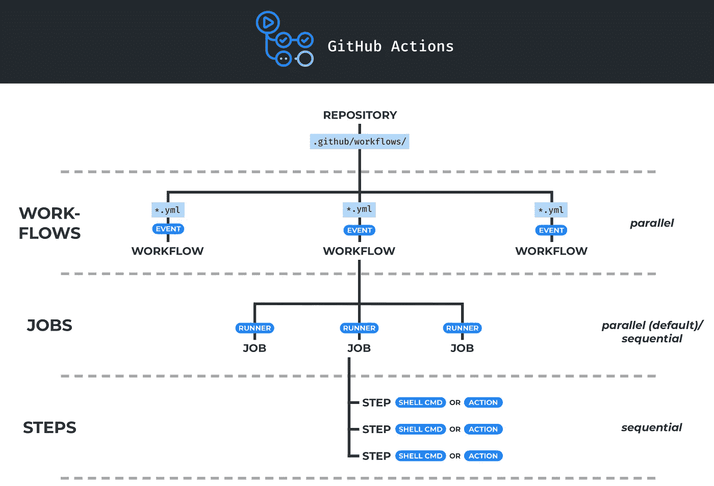
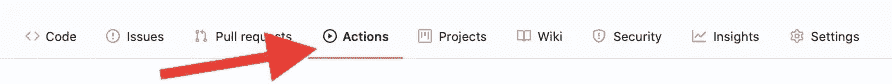
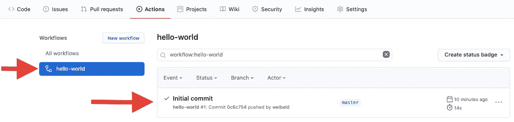
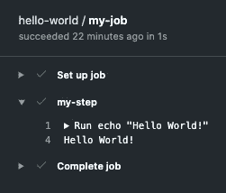
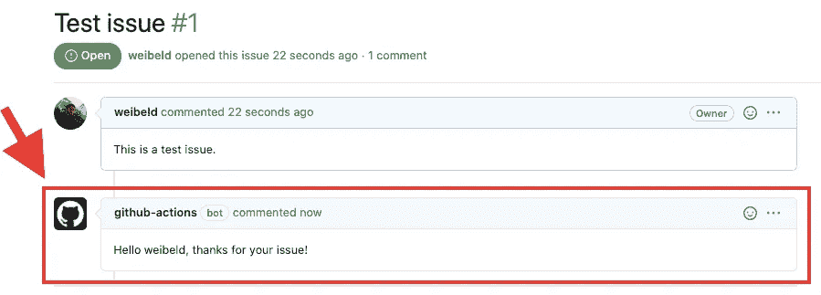
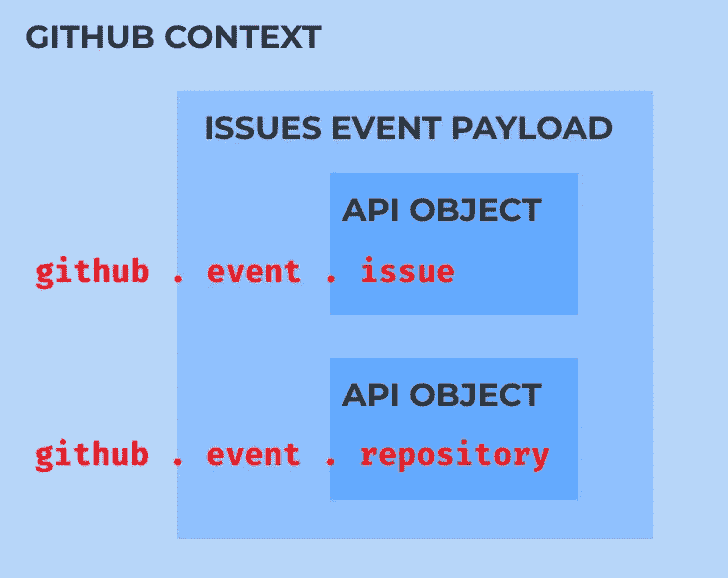
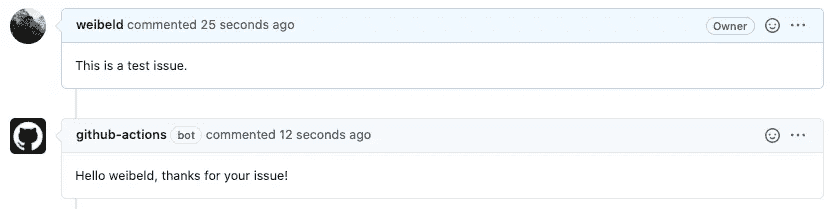
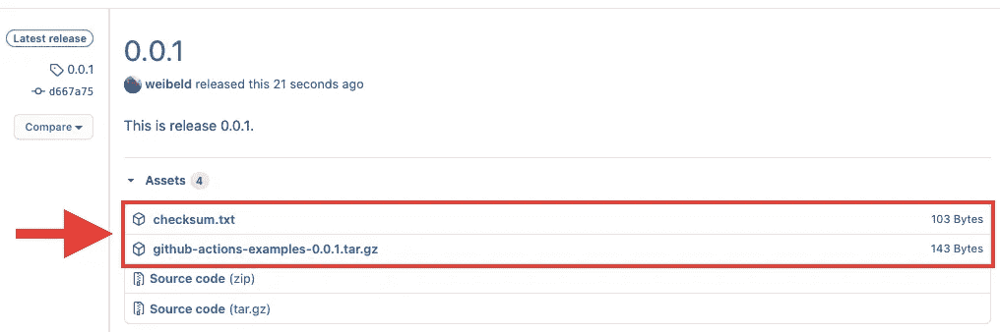
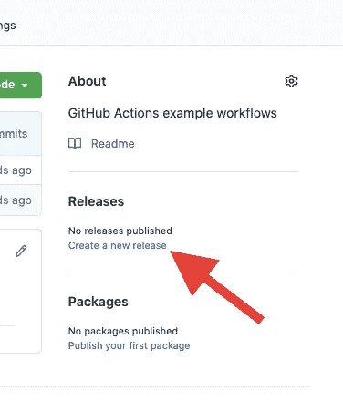

# GitHub 操作入门

> 原文：<https://itnext.io/getting-started-with-github-actions-fe94167dbc6d?source=collection_archive---------1----------------------->

本文提供了对 [GitHub Actions](https://github.com/features/actions) 的介绍，它是 GitHub 的原生 CI/CD 和自动化系统。

本文首先解释了 GitHub 操作的基本概念，比如工作流、作业和步骤，然后给出了几个简单的示例工作流来帮助您快速入门。您可以在自己的存储库中运行所有这些工作流。

# 内容

*   [**什么是 GitHub 动作？**](#a1b5)
*   [**基本概念**](#1e27)
*   [**重要参考文献**](#d5a2)
*   [**示例工作流 1 — Hello World！**](#7e36)
*   [**示例工作流 2 —问题迎宾**](#7061)
*   [**示例工作流 3 —发布资产创建者**](#8640)
*   [**结论**](#8815)

# 什么是 GitHub Actions？

[GitHub Actions](https://github.com/features/actions) 是 GitHub 在 2018 年推出的 CI/CD 和通用自动化系统。它被集成到 GitHub 中，并在每个 GitHub 库中默认启用。GitHub Actions 是完全免费的。

使用 GitHub Actions，您可以做与使用工具类似的事情，例如 [Jenkins](https://www.jenkins.io/) 、 [Travis CI](https://travis-ci.org/) 、 [Circle CI](https://circleci.com/) 、 [Drone CI](https://drone.io/) 、 [Bamboo](https://www.atlassian.com/software/bamboo) 、 [TeamCity](https://www.jetbrains.com/teamcity/) 或 [AppVeyor](https://www.appveyor.com/) 。然而，与这些工具相反，GitHub Actions 直接在 GitHub 上运行，这意味着您的 CI/CD 和自动化逻辑与您的代码位于同一位置。这有几个优点:

*   您不需要注册单独的 CI/CD 服务(例如 Travis CI、Circle CI、Drone CI、AppVeyor)。
*   您不需要安装和管理自己的 CI/CD 服务(例如 Jenkins、Bamboo、TeamCity)。
*   您不需要设置 webhooks 和访问令牌来将 CI/CD 服务连接到 GitHub——因为 GitHub Actions 已经在 GitHub 中了！

所有这些优势使得我们有必要看看 GitHub Actions 提供了什么以及如何使用它。这就是这篇文章要讲的！

# 基本概念

让我们从基础开始。以下是 GitHub 动作最重要概念的概述:



## 工作流程

每个 GitHub 库可以包含一个或多个**工作流**。每个工作流都在 repo 的`.github/workflows`目录中的一个单独的 YAML 中定义。多个工作流可以同时并行运行。

## 事件

工作流由一个或多个**事件**触发。事件可以是内部 GitHub 事件(如推送、发布或拉取请求)、预定事件(在特定时间触发，如 cron 作业)或任意外部事件(由对 GitHub API 的 webhook 调用触发)。

## 乔布斯

一个工作流由一个或多个**任务**组成。一个作业包含一组命令，这些命令将在触发工作流时运行(参见下面的[步骤](#e4c4))。默认情况下，当触发工作流时，其所有作业并行运行。但是，您可以定义选定作业之间的依赖关系，使它们按顺序运行。

## 滑行装置

每个作业在特定的**转轮**上运行。runner 是一个由 GitHub 托管的虚拟机，带有您选择的操作系统(Linux、macOS 或 Windows)。您也可以使用[自托管跑步者](https://docs.github.com/en/actions/hosting-your-own-runners)，在这种情况下，您可以完全控制跑步者的硬件和软件。

## 步伐

一个作业由一系列**步骤**组成。一个步骤可以是一个外壳命令，也可以是一个动作(见下面的[动作](#6fe1))。一个作业的所有步骤在与该作业相关联的运行器上按顺序运行。默认情况下，如果某个步骤失败，将跳过作业的后续步骤。

## 行动

一个 [**动作**](https://docs.github.com/en/actions/creating-actions/about-actions) 是一个可重复使用的代码单元，可以作为一个作业的一个步骤。动作可以有输入和输出。你可以[创建自己的动作](https://docs.github.com/en/actions/creating-actions)或者使用 GitHub 社区共享的动作。共享操作分布在 GitHub 市场上，有几千个。

# 重要参考

现在您已经了解了 GitHub 动作的基本概念，让我们来看看一些您在使用 GitHub 动作时会经常用到的文档:

*   [**工作流语法参考**](https://docs.github.com/en/actions/reference/workflow-syntax-for-github-actions) —包含工作流文件的完整语法规范。
*   [**触发工作流的事件**](https://docs.github.com/en/actions/reference/events-that-trigger-workflows) —包含可用作工作流触发器的事件的完整列表。
*   [**安装在 GitHub 托管的运行程序上的软件**](https://docs.github.com/en/actions/reference/software-installed-on-github-hosted-runners) —包含安装在 GitHub 提供的各种运行程序上的工具的完整列表。
*   [**上下文和表达式语法**](https://docs.github.com/en/actions/reference/context-and-expression-syntax-for-github-actions) —包含可用于每个工作流运行的所谓[上下文](https://docs.github.com/en/actions/reference/context-and-expression-syntax-for-github-actions#contexts)的规范。上下文包括各种上下文信息，如先前步骤的输出、机密和触发工作流的事件的有效负载。
*   [**Webhook 事件和有效负载**](https://docs.github.com/en/developers/webhooks-and-events/webhook-events-and-payloads) —包含可以触发您的工作流的事件的有效负载的规范。事件有效负载包含在工作流可用的[上下文](https://docs.github.com/en/actions/reference/context-and-expression-syntax-for-github-actions#contexts)中。
*   [**GitHub REST API 参考**](https://docs.github.com/en/rest/reference) —事件有效载荷可能包含一个或多个 GitHub API 对象。例如，`[pull_request](https://docs.github.com/en/developers/webhooks-and-events/webhook-events-and-payloads#pull_request)`事件的有效载荷包含一个 [*拉请求*](https://docs.github.com/en/rest/reference/pulls#get-a-pull-request) API 对象。GitHub REST API 参考包含了这些 API 对象的规范。

有了这些参考，您就可以开始使用 GitHub 操作了！

下面，您将创建三个 GitHub 动作工作流示例，您可以立即在自己的 GitHub 存储库中试用。

# 示例工作流 1 — Hello World！

这个工作流除了打印“Hello World！”每当发生对存储库的推送时，都被转换为运行程序的标准输出。以下是此工作流程的完整代码:

让我们看一下这个工作流的定义:

*   工作流的名称是`**hello-world**`(由`[name](https://docs.github.com/en/actions/reference/workflow-syntax-for-github-actions#name)`字段定义)。
*   工作流由`[push](https://docs.github.com/en/actions/reference/events-that-trigger-workflows#push)`事件触发(由`[on](https://docs.github.com/en/actions/reference/workflow-syntax-for-github-actions#on)`字段定义)。
*   工作流包含一个 ID 为`**my-job**`的单一作业(这也是作业的名称)。
*   `my-job`作业使用`**ubuntu-latest**` GitHub 托管的运行程序(由`[runs-on](https://docs.github.com/en/actions/reference/workflow-syntax-for-github-actions#jobsjob_idruns-on)`字段定义)。在撰写本文时，`ubuntu-latest` runner [对应的是 Ubuntu 18.04 LTS](https://docs.github.com/en/actions/reference/virtual-environments-for-github-hosted-runners#supported-runners-and-hardware-resources) 。
*   `my-job`作业包含一个名为`**my-step**`的步骤。这一步执行外壳命令`**echo "Hello World!"**`。

> 请记住，您可以在 GitHub Actions 文档的 [**工作流语法参考**](https://docs.github.com/en/actions/reference/workflow-syntax-for-github-actions) 页面上查找工作流定义的所有语法元素。

要将这个工作流添加到您的 GitHub 存储库中，首先在您的存储库中创建一个名为`.github/workflows`的目录(您可以使用现有的 GitHub 存储库或者创建一个新的)。然后把上面的工作流文件保存在这个目录下，把修改推送到 GitHub。

现在，在 GitHub 上，点击 ***动作*** 标签:



在左侧，您应该会看到您的`hello-world`工作流。而且由于这个工作流是由推送触发的，而你刚推了 GitHub，工作流就已经被触发并运行了。您可以在屏幕右侧看到此工作流的运行:



从现在开始，每当有人推送到你的 GitHub 库，这个工作流就会被触发，上面屏幕的右侧会增加一个新的运行。

要检查工作流的现有运行，请单击它。这会将您带到一个新的屏幕，您可以在左侧看到工作流的所有作业。点击`my-job`作业，您应该会看到作业的所有步骤:


你可以看到三个步骤，`Set up job`、`my-step`和`Complete job`。第一步和最后一步是由 GitHub Actions 自动添加的。`my-step`步骤是您在工作流程文件中定义的步骤。

你可以点击每一步来显示更多的信息。继续点击`my-step`步骤:



这就是你的“你好，世界！”留言！

**祝贺您，您刚刚创建并运行了 GitHub Actions 工作流！**

> 该工作流将在每次推送至存储库时运行。因此，如果您决定将这个工作流留在您的存储库中，预计会看到它的许多运行。

显然，这个工作流不是很有用——它所做的只是将消息打印到运行程序的标准输出中，没有人会看到它。

所以，接下来让我们创建一个更有用的工作流！

# 示例工作流 2 —问题欢迎

此工作流将向新问题添加评论，并向创建问题的用户致以友好的问候。这看起来是这样的:



这是这个工作流程的完整代码:

这个工作流引入了几个新概念——特别是，[事件活动类型](https://docs.github.com/en/actions/reference/events-that-trigger-workflows#example-using-multiple-events-with-activity-types-or-configuration)、[环境变量](https://docs.github.com/en/actions/configuring-and-managing-workflows/using-environment-variables)、[上下文](https://docs.github.com/en/actions/reference/context-and-expression-syntax-for-github-actions)和`[GITHUB_TOKEN](https://docs.github.com/en/actions/configuring-and-managing-workflows/authenticating-with-the-github_token)`。

我们来深究一下吧！

首先，您可以在`[on](https://docs.github.com/en/actions/reference/workflow-syntax-for-github-actions#on)`字段中看到，工作流是由`[issues](https://docs.github.com/en/actions/reference/events-that-trigger-workflows#issues)`事件触发的。`issues`事件是由 GitHub 上的多个活动引起的，比如当一个问题*打开*、*编辑*、*删除*、*关闭*等等。这些被称为`issues`事件的**活动类型**。

> 在 GitHub Actions 文档的 [**事件触发工作流**](https://docs.github.com/en/actions/reference/events-that-trigger-workflows#issues) 页面可以看到`issues`事件的所有活动类型。

`[types](http://wo)`关键字允许将事件的触发器缩小到一个或多个活动类型。在您的情况下，您只希望在打开新问题时运行工作流程(而不是在编辑或删除问题时)。因此，`opened`活动类型用于`types`字段。

接下来，工作流由一个名为`my-job`的作业组成，该作业由一个名为`my-step`的步骤组成。该步骤包含一个`[env](https://docs.github.com/en/actions/reference/workflow-syntax-for-github-actions#jobsjob_idstepsenv)`字段，该字段定义了三个**环境变量**、`REPO`、`OWNER`和`ISSUE_NUMBER`。这些环境变量将由步骤的 shell 命令使用。

> T 在[步骤级](https://docs.github.com/en/actions/reference/workflow-syntax-for-github-actions#jobsjob_idstepsenv)、[作业级](https://docs.github.com/en/actions/reference/workflow-syntax-for-github-actions#jobsjob_idenv)和[工作流级](https://docs.github.com/en/actions/reference/workflow-syntax-for-github-actions#env)上有一个`env`字段。定义环境变量的级别决定了变量的范围。

环境变量的值从 [**上下文**](https://docs.github.com/en/actions/reference/context-and-expression-syntax-for-github-actions) 中检索(特别是`[github](https://docs.github.com/en/actions/reference/context-and-expression-syntax-for-github-actions#github-context)`上下文)。上下文是类似 JSON 的结构，可自动用于工作流的所有步骤。它们包含不同类型的上下文信息，可以用`${{...}}`符号来访问。

> 在 GitHub Action docs 的 [**上下文和表达式语法**](https://docs.github.com/en/actions/reference/context-and-expression-syntax-for-github-actions#contexts) 页面可以找到所有上下文类型的列表。

在上面的工作流中，使用了`[github](https://docs.github.com/en/actions/reference/context-and-expression-syntax-for-github-actions#github-context)`上下文。`github`上下文包含一些关于当前工作流运行的信息(比如运行的 ID)，以及触发工作流的事件的有效负载。事件有效载荷包含在`github`上下文的`**github.event**`字段中。

上述工作流是由`issues`事件触发的，也就是说`github.event`字段的内容就是`[issues](https://docs.github.com/en/developers/webhooks-and-events/webhook-events-and-payloads#issues)`事件的有效载荷。

> 在 GitHub 文档的 [**webhook 事件和有效载荷**](https://docs.github.com/en/developers/webhooks-and-events/webhook-events-and-payloads#issues) 页面可以找到`issues`事件有效载荷的说明。

如果您查看`issues`事件有效负载的[规范](https://docs.github.com/en/developers/webhooks-and-events/webhook-events-and-payloads#issues)，您可以看到它包含一个`issue`字段和一个`repository`字段:

*   `issue`字段的值是 [***问题***](https://docs.github.com/en/rest/reference/issues#get-an-issue) API 对象(描述事件关于的问题)。
*   `repository`字段的值是 [***仓库***](https://docs.github.com/en/rest/reference/repos#get-a-repository) API 对象(描述事件发生的 GitHub 仓库)。

> 你可以在 [**GitHub REST API 参考**](https://docs.github.com/en/rest/reference) 中找到各种 GitHub API 对象的规范。

您可以通过`github`上下文访问这些 API 对象的所有字段，这就是上面的工作流所做的:

*   `**${{ github.event.repository.name }}**`:这是运行工作流的存储库的名称。
*   `**${{ github.event.respository.owner.login }}**`:这是存储库所有者的用户名。
*   `**${{ github.event.issue.number }}**`:这是事件所涉及的问题的编号。

这意味着，为了找出可以通过`github`上下文访问的信息，您可能需要挖掘三个嵌套层次的数据结构:`github`上下文、事件负载和 API 对象。以下是对`issues`活动的总结:



这些不同数据结构的文档位于不同的位置。这里有一个总结:

1.  `github`上下文: [**上下文和表达式语法**](https://docs.github.com/en/actions/reference/context-and-expression-syntax-for-github-actions#contexts)
2.  事件负载: [**webhook 事件和负载**](https://docs.github.com/en/developers/webhooks-and-events/webhook-events-and-payloads)
3.  API 对象: [**GitHub REST API 引用**](https://docs.github.com/en/rest/reference)

牢记这些参考文档对于充分利用工作流中的可用上下文信息至关重要！

在评估上下文表达式之后，三个环境变量将包含以下值:

*   `**REPO**`:运行工作流的存储库的名称。
*   `**OWNER**`:存储库所有者的用户名。
*   `**ISSUE_NUMBER**`:已创建的问题编号。

现在让我们来看看步骤的 shell 命令。

该工作流程的目的是为现有的 GitHub 问题添加评论。这可以通过 **GitHub API** 来完成，特别是调用 [***创建问题注释***](https://docs.github.com/en/rest/reference/issues#create-an-issue-comment) API 端点。

该 API 端点具有以下[规范](https://docs.github.com/en/rest/reference/issues#create-an-issue-comment):

```
POST /repos/{owner}/{repo}/issues/{issue_number}/comments
```

需要一个名为`body`的主体参数，其中包含注释文本。

> 你可以在 [**GitHub REST API 参考**](https://docs.github.com/en/rest/reference) 中找到所有 GitHub API 端点的规范。

工作流使用`[curl](https://curl.haxx.se/)`来发出这个 POST 请求。URL 由三个环境变量`REPO`、`OWNER`和`ISSUE_NUMBER`构成，这三个变量之前已经设置好了。

`body`参数的内容——将是注释的文本——指定如下:

```
"Hello ${{ github.event.issue.user.login }}, thanks for your issue!"
```

请注意，这包括对`github`上下文的另一个访问:创建事件的用户的用户名是从➡️ [***发布***](https://docs.github.com/en/rest/reference/issues#get-an-issue) API 对象、➡️ `[issues](https://docs.github.com/en/developers/webhooks-and-events/webhook-events-and-payloads#issues)`事件有效载荷、➡️ `[github](https://docs.github.com/en/actions/reference/context-and-expression-syntax-for-github-actions#github-context)`上下文中检索的。

👉记住嵌套数据结构的三个层次！

> 您可以在工作流文件中的任何地方使用`${{ }}`表达式，甚至在单引号字符串中。

现在只差一块:**认证**。对 GitHub API 的每个调用都必须经过身份验证，所以您的请求必须包含一些凭证！

在这里，GitHub Actions 提供了一个非常有价值的特性——`GITHUB_TOKEN`。`[GITHUB_TOKEN](https://docs.github.com/en/actions/configuring-and-managing-workflows/authenticating-with-the-github_token)`是一个 GitHub 认证令牌，在每个工作流中都自动可用。它包含在`[secrets](https://docs.github.com/en/actions/reference/context-and-expression-syntax-for-github-actions#contexts)`上下文中，可以通过`**${{ secrets.GITHUB_TOKEN }}**`访问。

您可以使用`GITHUB_TOKEN`对 GitHub API 进行经过认证的 API 调用。为此，您必须将它作为一个 [HTTP 承载令牌](https://swagger.io/docs/specification/authentication/bearer-authentication/)包含在 API 请求中。这就是工作流中的`curl`命令的作用。

> `*GITHUB_TOKEN*`与一个名为`*github-actions*`的特殊 GitHub bot 帐户相关联。这意味着你用`GITHUB_TOKEN`执行的任何 GitHub 操作都将在`github-actions`前正式完成。这就是工作流创建的问题评论将来自`github-actions`的原因。

**代码说明到此结束！**

要将这个工作流添加到您的存储库中，请将其保存在`.github/workflows`目录中，并将更改推送到 GitHub。

现在，继续在您的存储库中创建一个问题。

这应该会触发工作流程，几秒钟后，您应该会在您的问题下看到一条带有来自`github-actions`的问候的评论:



**您刚刚为您的存储库实现了问题处理自动化！**

除了问候用户，您还可以在工作流中实现任何其他逻辑。例如，您可以解析问题的文本以确保某种格式，[将标签](https://docs.github.com/en/github/managing-your-work-on-github/applying-labels-to-issues-and-pull-requests)应用于问题，通知用户，在外部问题跟踪系统中创建票据，等等。

您完成这些任务所需的所有信息都可以在工作流中找到，并且您可以用它做的事情是无限的！

现在，让我们转到另一个在现实生活中有用的工作流程。

# 示例工作流 3-发布资产创建者

该工作流将为新的 [GitHub 版本](https://docs.github.com/en/github/administering-a-repository/about-releases)创建发布资产。特别是，它将创建一个包含要分发的文件的归档文件，以及一个包含归档文件的 SHA256 哈希的校验和文件。这看起来是这样的:



这是这个工作流程的完整代码:

该工作流使用与`[issue-greeter](#7061)`工作流相似的概念，但是增加了[动作](https://docs.github.com/en/actions/creating-actions/about-actions)的用法。

所以，让我们浏览一下代码！

首先，工作流由`[release](https://docs.github.com/en/actions/reference/events-that-trigger-workflows#release)`事件触发，特别是由`**published**`活动类型触发。也就是说，无论何时发布版本，工作流程都会运行(但不会在起草、编辑或删除版本时运行)。

该工作流包含一个名为`my-job`的作业，该作业包含一个定义名为`**ARCHIVE_NAME**`的环境变量的`[env](https://docs.github.com/en/actions/reference/workflow-syntax-for-github-actions#jobsjob_idenv)`字段。这是将要创建的归档的名称。

档案名称的形式是`**<repo>-<tag>**`，其中`<repo>`是存储库的名称，`<tag>`是发布版本的标签名称。按照惯例，一个版本的标签名称对应于该版本的版本，因此归档资产将具有类似于`abc-v0.1.0.tar.gz`或`xyz-2.4.2.tar.gz`的名称。

存储库名称和发布标签名称是以与`[issue-greeter](#7061)`工作流相似的方式从`github`上下文中提取的。特别是:

*   `**${{ github.event.repository.name }}**`是存储库的名称。
*   `**${{ github.event.release.tag_name }}**`是发布的标签名。

> 参见`[issue-greeter](#7061)`工作流的说明，查找被访问的三个嵌套数据结构的文档。

现在，让我们继续工作的步骤:

*   `**download-source**`步骤下载存储库的源代码档案(由 GitHub 自动添加到每个版本中)。源代码档案的 URL 是从`github`上下文中提取的。
*   `**unzip-source**`步骤将下载的源代码文件解压到一个以`ARCHIVE_NAME`环境变量命名的目录中。
*   `**clean-source**`步骤从解压缩的目录中删除任何不需要的文件。这个工作流只删除了`.github`目录，但是您可以删除任何其他您不想分发的文件。
*   `**create-archive**`步骤将清理后的目录压缩到`.tar.gz`档案中。归档文件以`ARCHIVE_NAME`环境变量命名。
*   `**create-checksum**`步骤计算归档文件的 SHA256 散列，并将其保存在名为`checksum.txt`的文件中。

此时，您在运行程序上本地拥有了两个资产:归档文件和校验和文件。唯一缺少的是将它们上传到发布版。

为此，工作流使用了一个 [**动作**](https://docs.github.com/en/actions/creating-actions/about-actions) 。动作是可重复使用的代码单元，可以作为一个步骤包含在工作流中(代替 shell 命令)。

特别是，工作流使用了分布在 [GitHub Marketplace](https://github.com/marketplace?type=actions) 上的`[upload-release-asset](https://github.com/marketplace/actions/upload-a-release-asset)`动作。`upload-release-asset`动作允许将资产上传到现有的 GitHub 版本——这正是您想要做的！

通过在步骤中使用`[uses](https://docs.github.com/en/actions/reference/workflow-syntax-for-github-actions#jobsjob_idstepsuses)`关键字(而不是`[run](https://docs.github.com/en/actions/reference/workflow-syntax-for-github-actions#jobsjob_idstepsrun)`关键字)来使用动作。大多数动作需要输入，这些输入可以通过`[with](https://docs.github.com/en/actions/reference/workflow-syntax-for-github-actions#jobsjob_idstepswith)`关键字提供。有些动作还需要设置某些环境变量，这可以通过关键字`[env](https://docs.github.com/en/actions/reference/workflow-syntax-for-github-actions#jobsjob_idstepsenv)`来完成。

GitHub Marketplace 上的操作页面或 GitHub 存储库中记录了操作所需的输入。例如，`upload-release-asset`动作被记录在 GitHub Marketplace 上的 [**“上传发布资产”**](http://Upload a Release Asset) 下。

`upload-release-asset`动作需要以下**输入**:

*   `**upload_url**`:GitHub API URL，用于将资产上传到发行版。
*   `**asset_path**`:资产在滑道上的位置。
*   `**asset_name**`:GitHub 上资产的期望名称。
*   `**asset_content_type**`:资产的 MIME 内容类型。

该操作还需要一个名为`**GITHUB_TOKEN**`的环境变量，其中包含一个有效的 GitHub 认证令牌(比如`[GITHUB_TOKEN](https://docs.github.com/en/actions/configuring-and-managing-workflows/authenticating-with-the-github_token)`)。

总之，这会导致下面的`upload-release-asset`动作调用(以`upload-archive`步骤为例):

```
**-** **name:** upload-archive
  **uses:** actions/upload-release-asset@v1
  **with:**
    **upload_url:** ${{ github.event.release.upload_url }}
    **asset_path:** ${{ env.ARCHIVE_NAME }}.tar.gz
    **asset_name:** ${{ env.ARCHIVE_NAME }}.tar.gz
    **asset_content_type:** application/gzip
  **env:**
    **GITHUB_TOKEN:** ${{ secrets.GITHUB_TOKEN }}
```

从`github`上下文中检索到`upload_url`输入的 URL，从`ARCHIVE_NAME`环境变量中构造出`asset_path`和`asset_name`输入的文件名。`GITHUB_TOKEN`环境变量被设置为`secrets.GITHUB_TOKEN`中的`[GITHUB_TOKEN](https://docs.github.com/en/actions/configuring-and-managing-workflows/authenticating-with-the-github_token)`。

这里的一个特点是通过`env`上下文访问`ARCHIVE_NAME`环境变量。`[env](https://docs.github.com/en/actions/reference/context-and-expression-syntax-for-github-actions#env-context)`上下文保存当前步骤可访问的所有环境变量的值。注意，用`$`符号访问环境变量在这里不起作用，因为这是一个特定于 shell 的符号，上面的表达式不在 shell 中执行。

**代码说明到此结束！**

像往常一样，要将这个工作流添加到您的存储库中，请将工作流文件保存在`.github/workflows`目录中，并将其推送到 GitHub。

然后，继续在您的存储库中创建一个新的版本:



为发布选择一个合适的标签名称、标题和描述，并发布它。发布应该会触发您的工作流，几秒钟后，您应该会看到两个所需的资产被自动添加到您的发布中:


**您刚刚为您的存储库自动创建了发布资产！**

但你不必就此止步。您可以根据自己的具体情况轻松调整此工作流。例如，如果您开发一个 Go 应用程序，您可以包含从源代码为多个平台构建二进制文件的步骤，并将它们作为附加资产上传。您可以上传任意多的资产，并且可以任意命名它们。

# 结论

本文介绍了 [GitHub Actions](https://github.com/features/actions) — GitHub 的原生 CI/CD 和自动化系统。GitHub 动作的基本概念有 [**工作流**](https://docs.github.com/en/actions/getting-started-with-github-actions/core-concepts-for-github-actions#workflow) ， [**事件**](https://docs.github.com/en/actions/getting-started-with-github-actions/core-concepts-for-github-actions#event) ， [**作业**](https://docs.github.com/en/actions/getting-started-with-github-actions/core-concepts-for-github-actions#job) ， [**跑者**](https://docs.github.com/en/actions/getting-started-with-github-actions/core-concepts-for-github-actions#runner) ， [**步骤**](https://docs.github.com/en/actions/getting-started-with-github-actions/core-concepts-for-github-actions#step) ，以及 [**动作**](https://docs.github.com/en/actions/getting-started-with-github-actions/core-concepts-for-github-actions#action) 。

工作流在`.github/workflows`目录下的 YAML 文件中定义。当一个工作流文件被推送到 GitHub 时，它会被 GitHub 动作自动拾取，并在触发它的事件发生时运行。

本文还展示了三个示例工作流:

1.  `[**hello-world**](#7e36)`:打印“Hello World！”。
2.  `[**issue-greeter**](#7061)` : 给新问题添加评论。
3.  `[**release-asset-creator**](#8640)`:将发布资产添加到新的发布中。

这些工作流引入了基本的 GitHub 动作特性，例如[](https://docs.github.com/en/actions/reference/context-and-expression-syntax-for-github-actions)**[**环境变量**](https://docs.github.com/en/actions/configuring-and-managing-workflows/using-environment-variables)[**活动类型**](https://docs.github.com/en/actions/reference/events-that-trigger-workflows#webhook-events)[**动作**](https://docs.github.com/en/actions/creating-actions/about-actions) ，以及`[GITHUB_TOKEN](https://docs.github.com/en/actions/configuring-and-managing-workflows/authenticating-with-the-github_token)`。**

**然而，还有更多 GitHub 动作没有在本文中讨论，包括:**

*   ***手动和通过外部事件触发工作流。***
*   ***在工作流程中安全使用机密数据。***
*   ***顺序执行作业。***
*   ***有条件地执行作业和步骤。***
*   ***动态设置环境变量和输出。***

**所有这些概念将在以后的文章中讨论。所以，敬请期待！**