# 图形数据库入门:Azure CosmosDB 与 Gremlin API 和 Python

> 原文：<https://itnext.io/getting-started-with-graph-databases-azure-cosmosdb-with-gremlin-api-and-python-80e57cbd1c5e?source=collection_archive---------1----------------------->


照片由 [JJ 英](https://unsplash.com/@jjying?utm_source=medium&utm_medium=referral)在 [Unsplash](https://unsplash.com?utm_source=medium&utm_medium=referral)

# 介绍

在这篇文章中，我将使用 [**Azure 云平台**](https://azure.microsoft.com/en-us/) **对 [**图形数据库**](https://en.wikipedia.org/wiki/Graph_database) 进行简单介绍。**

我将从快速介绍图形数据库开始，解释它们的用例以及优缺点。

然后，我们将使用[**Azure CosmosDB**](https://azure.microsoft.com/en-us/services/cosmos-db/)和[**Apache tinker pop Gremlin API**](https://tinkerpop.apache.org/)来看一个**实用** **示例**。目标是展示在 **Azure** 中创建一个**无服务器**图形数据库来将数据建模为图形是多么容易。


[Apache TinkerPop](https://tinkerpop.apache.org/) 标志

# 图形数据库

数据库世界分为两种类型:

*   传统的**关系数据库**保存类似**表**的结构化数据，
*   [**NoSQL**](https://en.wikipedia.org/wiki/NoSQL) 或者非关系数据库，这是一个用于定义任何非关系的类别。有许多类型的数据库旨在更好地模拟某些类型的数据。在这个类别中，我们有键值数据库、文档数据库，当然还有**图数据库**。

我**已经谈过** [**关于 NoSQL vs SQL 的困境，但是让我们快速回顾一下…**](/massive-scale-databases-5b5917ed94e5)

## NoSQL vs SQL

这个话题在很多[篇](https://www.geeksforgeeks.org/difference-between-sql-and-nosql/)里都有涉及。NoSQL 的出现是为了克服关系数据库面临的**可伸缩性**问题以及正在开发的应用程序类型的转变。SQL 是一种强大的通用查询语言，但是它需要一个定义好的**模式**。另一方面，NoSQL 并不强制执行模式，它更加具体，这意味着**您需要提前考虑并优化查询**。这是非常重要的，如果你知道你的数据将如何被访问，你希望大量的查询和强烈的一致性不是一个问题，那么 NoSQL 是一个伟大的选择；这是许多应用的情况。

**NoSQL 类型**

NoSQL 是一个广泛的主题，它由多种类型的数据库组成，这些数据库使用不同的方法来存储和访问数据。最重要的一点是理解**根据您的使用情况，有些数据库会比其他数据库更适合您**，此外，您可能希望组合几个数据库来满足不同的需求。我的建议是分析你的数据是如何被使用的，并选择最好的模型来解决你的特定需求；而不是选择技术，然后尝试将您的需求融入数据库模型。

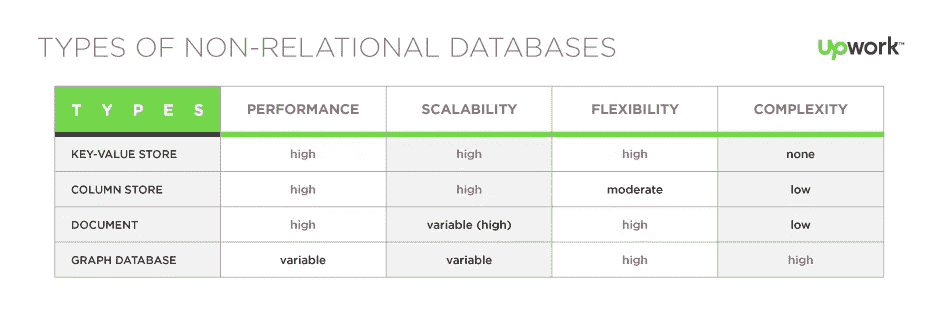

其中一些类型包括**文档、时间序列、键值、图表** …您需要**选择能够更好地处理应用程序使用类型的数据库**。在许多情况下，您需要运行多个数据库，每个数据库都针对特定的查询或访问模式进行了优化。

例如，如果您正在使用 SQL，并且发现自己在做大量的连接，因为您关心**关系**，那么**图形数据库**可能是一个更合适的解决方案。

**图**在处理**复杂关系、非固定模式**和大型数据集时极其有用。

## 什么是图形数据库？

图形数据库基于一种叫做[图论](https://en.wikipedia.org/wiki/Graph_theory)的数学模型。图形数据库代表一个数学[图](https://en.wikipedia.org/wiki/Graph_(discrete_mathematics%29)，它只是由边连接在一起的对象的集合。这些对象被称为节点或顶点，它们有属性和边(关系)来表示、存储和搜索数据的关系。理解**图数据库对待节点间的** **关系与数据本身**同等重要是很重要的。

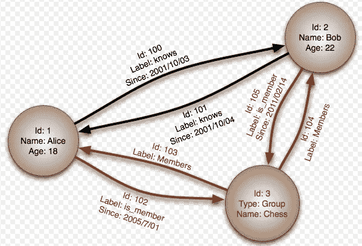

来源:[维基百科](https://en.wikipedia.org/wiki/Graph_database#/media/File:GraphDatabase_PropertyGraph.png)

正如我们所看到的，我们有两个主要对象:**节点**和**顶点**，它们中的每一个都**同等重要**并且可以有多个键值对**属性**。重要的是要理解**没有模式**，即使一个节点被定义了一个给定的“类型”，称为**标签**，也并不意味着具有该标签的所有节点都需要遵循相同的模式，所以图中的每个节点可以有不同的属性。

让我们总结一下图形数据库的不同元素:

*   顶点/节点:顶点表示离散的实体，比如一个人、一个地方或一个事件。
*   **边/关系**:边表示顶点之间的关系。例如，一个人可能认识另一个人，参与一个事件，并且最近去过一个地方。
*   属性:属性表达了顶点和边的信息。顶点或边中可以有任意数量的属性，它们可用于描述和过滤查询中的对象。示例属性包括具有名称和年龄的顶点，或者可以具有时间戳和/或权重的边。
*   标签:标签是顶点或边的名称或标识符。标签可以对多个顶点或边进行分组，使得一个组中的所有顶点/边都具有某个标签。例如，一个图可以有多个标签类型为“人”的顶点。

## 何时应该使用图形数据库

简而言之，你需要理解数据，如果数据符合图表，那么很可能图表数据库是最好的选择。此外，图形数据库非常擅长对**层次结构**进行建模，但请注意，其他 NoSQL 数据库也可以对树状层次结构进行建模，如果关系数量较少，则效率会更高。例如，一个层次结构可以被建模成一个单个“大表”，其中每个数据库都有一个键值，例如 [**【卡珊德拉】**](https://cassandra.apache.org/) 。

其他需要考虑的事项包括:

*   **模式**:如果你需要一个固定的模式，那么图形数据库可能不是你的最佳选择，如果没有固定的模式，那么它可能是一个好的选择。如果您的数据结构是固定和一致的，那么就没有必要使用图形数据库，因为图形数据库最适合存储所有类型的数据和不断变化的业务需求。
*   **缩放**:图形数据库可以很好地缩放，它们非常好，在水平缩放方面明显超过关系数据库，特别是当关系数量增加时。
*   如果您的需求只是存储数据，并且只使用简单的查询，那么可能不需要图形数据库。
*   如果数据是高度不连续的，并且数据之间的关系无关紧要(例如，客户交易数据)，您可能不需要图形数据库。
*   如果您正在查询批量数据扫描，图形数据库并不适合，因为它们并未针对此类操作进行优化，这通常适用于大多数 NoSQL 数据库。
*   如果需求是存储和检索包含非常大的值的实体属性(比如 BLOBs、CLOBs 等)，那么图数据库就不是理想的解决方案。其他数据库如 **BigTable** 更适合存储大数据。图形数据库可以存储大量的数据和规模，但项目必须很小，不要让节点太大，否则图形会很慢。欲了解更多信息，请查看本文。

## 用例

*   欺诈或异常检测
*   实时推荐
*   基于图形的搜索
*   地理空间的
*   物联网
*   社交网络
*   机器学习
*   身份和访问管理

# Azure Cosmos DB 图形数据库

市场上有许多图形数据库，既有开源的，也有商业的。其中最早也是最著名的图形数据库是 [**Neo4j**](https://neo4j.com/) **。**也有开放的替代方案如 [**JanusGraph**](https://janusgraph.org/) 或 [**ArangoDB**](https://www.arangodb.com/) 可以运行在云上或本地，非常灵活。JanusGraph 可以在现有的 NoSQL 数据库上运行。我真的建议检查这些数据库，并尝试他们的能力。

为了更快地移动，让我们使用**云**功能，特别是[**Azure cosmos db**](https://azure.microsoft.com/en-us/services/cosmos-db/)**使用 [**CosmosDB 图形 API**](https://docs.microsoft.com/en-us/azure/cosmos-db/graph-introduction) 。我喜欢 CosmosDB 的一点是，它使用相同的服务和后端提供了几个[API](https://docs.microsoft.com/en-us/learn/modules/choose-api-for-cosmos-db/)，因此您可以尝试不同的模型并选择更适合您的数据的模型，可用的一些模型有 **SQL** (关系型)、**文档**(使用 **MongoDB** API)、键值(使用 **Cassandra** 等等！**

**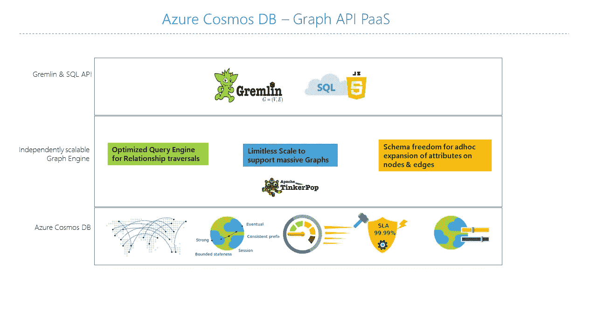**

**Azure CosmoDB 架构。[https://docs . Microsoft . com/en-us/azure/cosmos-db/graph-introduction](https://docs.microsoft.com/en-us/azure/cosmos-db/graph-introduction)**

**[Azure Cosmos DB](https://docs.microsoft.com/en-us/azure/cosmos-db/introduction) 是全球分布式、多模式的数据库服务，由**完全管理**，并且还支持**无服务**即付即用模式。你可以在这里阅读更多信息[。](https://docs.microsoft.com/en-us/azure/cosmos-db/graph-introduction)**

# **在 Azure Cosmos DB 中创建图形数据库**

**现在我们知道了什么是图形数据库，什么是 CosmosDB，让我们创建一个新的数据库。我假设你已经有了一个**蔚蓝** **账号**，如果没有，你可以在这里 唱一首**免费试用** [**。**](https://azure.microsoft.com/en-us/free/)**

**在您的仪表板中，单击“创建资源”。**

**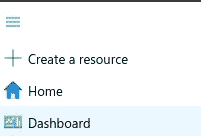**

**在 CosmosDB 门户中，单击“添加”。选择您的订阅和资源组，您可以为 CosmosDB 创建新的订阅和资源组。在帐户名中，您需要创建一个全局唯一的名称。我用的是 *gdemo* 。在 API 中，选择 **Gremlin** (图形)，启用笔记本以便您可以轻松浏览您的数据。选择位置，为了简化部署，选择**无服务器**模式。这是一种随用随付的模式，由于您不需要提前提供吞吐量，因此设置更加简单。**

**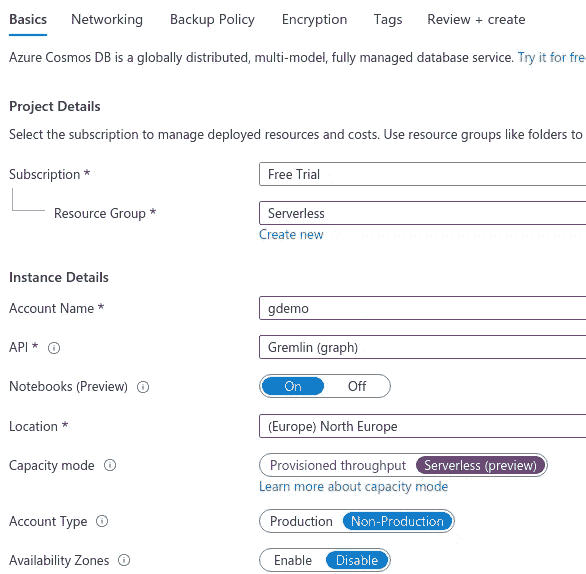**

**点击“审核并创建”。在最后一个屏幕中，选择创建。**

**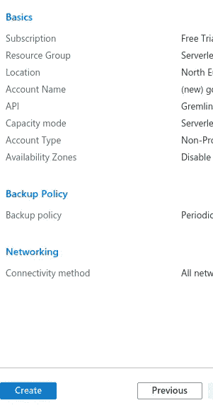**

**这可能需要几分钟，但就是这样，您现在已经运行了图形数据库！**

**部署完成后，单击“转到资源”。接下来，在主菜单中，点击**数据浏览器**。**

**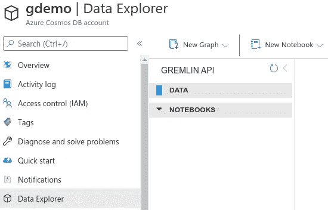**

****数据浏览器**是创建、修改和可视化图表的绝佳工具。我们稍后将使用它来查询和导航图表。**

**下一步是创建数据库。请记住，您可以有几个数据库帐户，每个帐户包含几个数据库。让我们创建我们的数据库，并添加一个图表。当在我们的第一个数据库中创建我们的第一个图表时，这可以在一个单一的步骤中完成。点击数据浏览器顶部菜单中的“**新图表**”。**

**第一个字段是数据库创建字段，选择一个**数据库 Id** ，在我们的例子中我们将其命名为“ ***demodb*** ”。**

**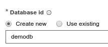**

**接下来的两个字段用于创建一个**新图形**。图是共享同一**分区键**的节点和边的容器。这一点很重要，分区键用于将数据分割成分区，以允许 CosmosDB 扩展。您需要选择一个粒度足够大的键，以便能够正确地分割数据，但是粒度又不能太大，这样数据就会分散到各处。像任何其他 NoSQL 数据库一样，它将取决于您的查询，但由于图论，在图数据库中，您不需要根据您的查询来设计您的模型，只需要分区键。**

**例如，如果您有许多客户，您可以使用 *customer_id* ，这将允许您随着客户群的增加而扩展，并将确保一个客户查询不会影响另一个客户的性能。**

**在下一节中，我们将介绍我们的数据模型，所以现在介绍这些值:**

*   ****图形 Id** : *图形***
*   ****分区键** : *pk_id***

**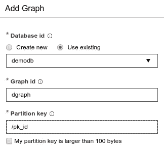**

**单击“OK ”,您应该会看到您的数据库和您的第一个图形创建！！！**

**如您所见，**我们不需要事先定义任何模式**。**

**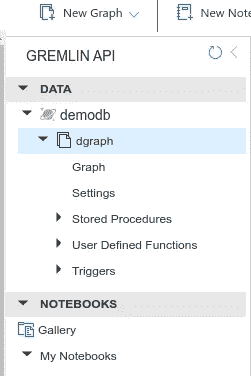**

**CosmosDB 支持**存储过程**、**用户定义函数**(您可以创建自己的函数)、**触发器**(在事件发生后执行某项操作)等等。**笔记本**的功能也很棒，它允许数据科学家直接从浏览器进行数据探索！**

**我们还可以将 CosmosDB 与其他服务如 [**事件网格**](https://docs.microsoft.com/en-us/azure/event-grid/overview) 或 [**Azure 功能**](https://docs.microsoft.com/en-us/azure/azure-functions/functions-overview) 集成，实现 [**反应式**](https://www.reactivemanifesto.org/) 架构。**

**现在是时候开始添加一些数据了！**

# **使用 Azure Cosmos DB**

**NoSQL 的一个优点，特别是图形数据库，是你不需要遵循瀑布方法和预先设计你的模式。此外，与其他 NoSQL 数据库相比，图形数据库不需要预先考虑查询。**这使您能够探索和迭代优化您的模型和查询，并快速适应业务变化。****

## **我们的使用案例**

**此时，您可能急于开始创建节点和边。作为一个例子，我们打算尝试模型和非常简化版的*！***

***目标是**展示如何创建节点和几个关系**。这就是我们要建模的。请注意，这不是 Medium.com 的正确型号，只是一个近似值。***

***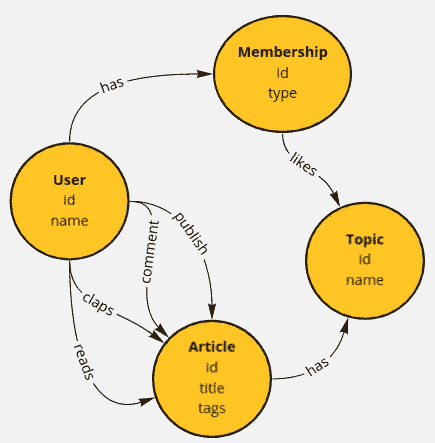***

***我们有用户，他们可能有会员资格。如果他们拥有会员资格，他们可能对某些话题感兴趣。用户可以阅读文章并鼓掌。它也可以给一篇文章添加评论或者发表一篇新文章。一篇文章有一个 id，标题，正文和标签。用户、文章、主题是节点的标签。***

***请注意**关系是如何成为一等公民**的，它们也有属性，并且是图表中的关键元素。新手用户可能会认为节点类似于关系世界中的表，但事实并非如此，关系也非常重要，这就是为什么我们将“comment”建模为边而不是节点，尽管这通常是 SQL 数据库中的表。***

***你可能会问的另一个问题是**如何识别节点**。属性就像关系数据库中的列，可以包含任何类型的数据，那么我如何**决定某样东西本身是属性还是节点呢？**。例如，您可能想知道为什么我们决定将标签作为属性而不是节点。答案是"*视情况而定*"，这就是为什么你需要知道数据以及如何被查询。如果您想在表单中使用自动完成功能，并且需要快速搜索所有标签，那么您可能希望有一个节点和关系，以便快速遍历图形。另一方面，如果使用单独的倒排索引来执行自动完成，那么只需将标签存储为节点的属性。在我们的例子中，为了简化，我们把它们作为属性。这个问题类似于在 NoSQL 世界中决定是要一个大桌子还是多个桌子。***

## ***数据浏览器***

***在 CosmosDB 中，我们使用**Gremlin**[**API**](https://tinkerpop.apache.org/gremlin.html)，它是[**Apache tinker pop**](https://tinkerpop.apache.org/gremlin.html)**项目**的一部分。它有自己的领域语言,允许你创建和操作图形，所以你不需要学习特定语言的 API。***

***Gremlin API 非常直观且易于使用。在 **Azure** 中，你可以直接从**数据浏览器**中运行和执行查询。这非常方便，因为您可以检查不同格式的结果，并将其可视化。这在您对数据建模时非常有用。***

***在 Azure 浏览器的数据浏览器中，选择“图形”。***

***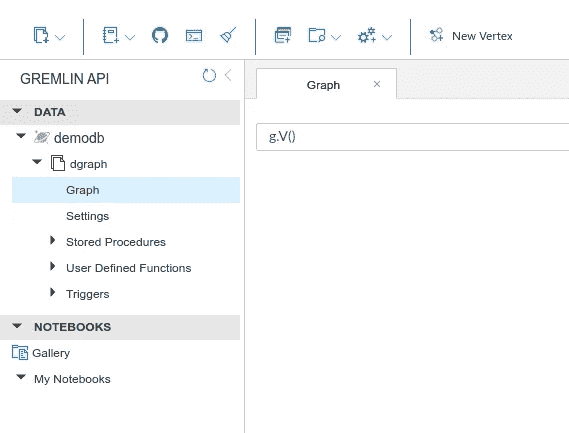***

***你可以输入任何 Gremlin **DSL** 语言，直接从浏览器执行。你也可以点击“新建顶点”来添加一个新的节点。您还可以直接从 UI 添加存储过程或触发器。***

***除了笔记本之外，另一个很酷的功能是能够使用 **SQL** 运行查询，只需点击图表中的图表汉堡菜单，然后选择“新 SQL 查询”。***

***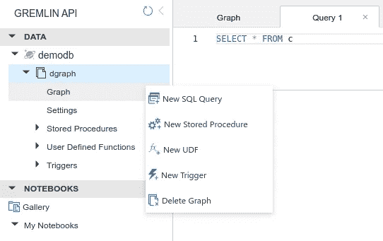***

***现在您可以运行任何 SQL 查询，注意只允许读操作。你需要使用 Gremlin DSL 来创建节点和边。我个人更喜欢 Gremlin API，因为它比 SQL 更接近模型。***

## ***添加数据***

***好了，是时候添加一些数据了…***

***虽然，我们可以使用数据浏览器来添加数据，但由于图表通常是由数据科学家和工程师操作的，所以让我们使用 **Python** ！。我们将返回浏览器运行查询。***

***你可以在这个 [**资源库**](https://github.com/javiramos1/cosmosdb_gremlin_demo) 中找到**代码**。***

***首先你需要安装 ***gremlinpython*** 库:***

```
*pip install gremlinpython*
```

***然后导入客户端:***

```
*from gremlin_python.driver import client, serializer*
```

***然后您需要初始化客户端，为此您需要:***

*   ***GREMLIN 端点:数据库连接 URL***
*   ***机密:主键***
*   ***用户名***

***在左侧菜单中点击**键**以获取该信息:***

***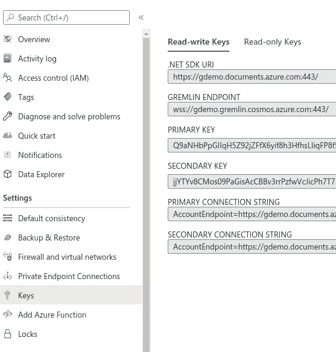***

***现在输入如下详细信息:***

```
*client = client.Client('wss://<YOUR_ENDPOINT>.gremlin.cosmosdb.azure.com:443/','g',      username="/dbs/<YOUR_DATABASE>/colls/<YOUR_COLLECTION_OR_GRAPH>",      password="<YOUR_PASSWORD>")*
```

***用户名是这样的格式:/dbs/{ *数据库* }/colls/{ *图形* }***

***密码是主要密钥。***

***在我们的例子中，应该是这样的:***

```
*client = client.Client('wss://gdemo.gremlin.cosmos.azure.com:443/', 'g', username="/dbs/demodb/colls/dgraph",
password="Q9aNH...",                       message_serializer=serializer.GraphSONSerializersV2d0()
)*
```

***Python API 使用**异步**调用 CosmosDB，这提高了性能和吞吐量。记住 CosmosDB 在默认情况下是最终一致的。建议添加回调来检查结果。在我们的例子中，为了简单起见，我们将阻塞这个调用。***

***让我们创建一个函数来执行 Gremlin 查询列表，这将非常方便:***

```
*def run(queries):
    for query in queries:
        print("\tRunning: {0}".format(
            query))
        try:
            callback = client.submitAsync(query)
            if callback.result() is not None:
                results = callback.result()
                if results is not None:
                    print("\tSuccess!")
            else:
                print("Something went wrong with this query: {0}".format(query))
        except Exception as e:
            print('There was an exception: {0}'.format(e))*
```

***好了，是时候使用 **Gremlin** API 添加数据了。首先，我们定义查询。让我们添加几个用户…***

```
*init_user = [
    "g.addV('User').property('id', 'user1').property('name','User 1').property('pk_id', '1')",
    "g.addV('User').property('id', 'user2').property('name','User 2').property('pk_id', '2').property('location','EU')"
]*
```

***如你所见，API 非常简单。 ***g*** 是指我们作为用户名选择的图形。然后我们使用标签 User 添加一个顶点/注释( *addV* )。之后，我们链接不同的属性。注意**属性是任意的**，第二个用户有一个额外的“*位置*属性。***

***请注意，我们添加了一个 ID 来方便地引用数据，否则将生成难以解释的 UUID。**分区键**也是**所需要的**。***

***让我们运行查询:***

```
*run(init_user)*
```

***现在，如果您转到数据浏览器，选择“Graph”并运行 *g.V()* 来查看图表，您应该会看到创建的用户:***

***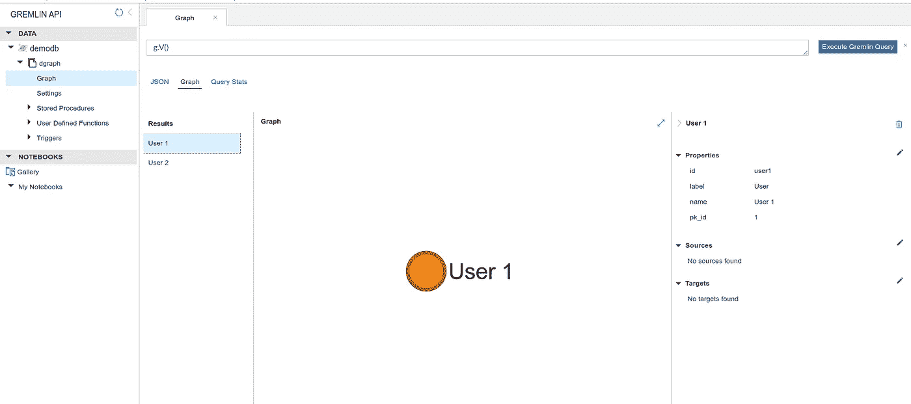***

***返回两个用户，您可以选择左边的结果并检查右边的属性。您也可以选择 **JSON** 视图来查看原始数据。***

***接下来，让我们为用户 1 添加一个成员资格:***

```
*run(
["g.addV('Membership')
.property('id', 'mem1')
.property('name','Membership 1')
.property('pk_id', '3').property('type','premium')"])*
```

***让我们添加用户 1 和成员 1 之间的第一个关系:***

```
*run(["g.V('user1').addE('has').to(g.V('mem1'))"])*
```

***您可以返回到数据浏览器并刷新图表来查看新的关系。***

***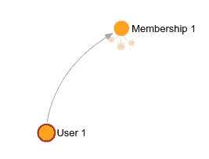***

***我们首先使用 *g.V()* 方法通过 id 选择一个节点，然后使用*add*()方法从具有关系名称的给定节点中创建一个新的边。我们用 *to()* 的方法将其链接到另一个节点。请注意，如果我们愿意，我们可以向关系中添加属性。***

***接下来，我们添加一些主题:***

```
*init_topics = [
"g.addV('Topic').property('id', 'topic1').property('name','Machine Learning').property('pk_id', '4')",
"g.addV('Topic').property('id', 'topic2').property('name','Big Data').property('pk_id', '5')",
"g.addV('Topic').property('id', 'topic3').property('name','Scala').property('pk_id', '6')"
]
run(init_topics)*
```

***还有一些文章:***

```
*init_articles = [
    "g.addV('Article').property('id', 'article1').property('name','The Secrets of NLP').property('pk_id', '7').property('body', 'blah').property('tags','nlp,ml,python')",
    "g.addV('Article').property('id', 'article2').property('name','Apache Spark Optimizations').property('pk_id', '8').property('body', 'blah').property('tags','none')",
    "g.addV('Article').property('id', 'article3').property('name','Introduction to Scala').property('pk_id', '9').property('body', 'blah')"
]
run(init_articles)*
```

***让我们将关系添加到主题，让我们将一些文章与主题和一些成员资格相关联:***

```
*add_topic_relations = [
    "g.V('mem1').addE('likes').to(g.V('topic1'))",
    "g.V('mem1').addE('likes').to(g.V('topic2'))",
    "g.V('article1').addE('has').to(g.V('topic1'))",
    "g.V('article2').addE('has').to(g.V('topic2'))",
    "g.V('article2').addE('has').to(g.V('topic1'))",
    "g.V('article3').addE('has').to(g.V('topic3'))",
]
run(add_topic_relations)*
```

***接下来，让我们添加阅读和发布关系:***

```
*read_pub_relations = [
    "g.V('user1').addE('reads').to(g.V('article1'))",
    "g.V('user1').addE('reads').to(g.V('article3'))",
    "g.V('user2').addE('reads').to(g.V('article2'))",
    "g.V('user2').addE('publish').to(g.V('article1')).property('date', '2020-11-11')",
    "g.V('user2').addE('publish').to(g.V('article3')).property('date', '2019-11-11')",
    "g.V('user1').addE('publish').to(g.V('article2')).property('date', '2020-11-12')"
]
run(read_pub_relations)*
```

***如您所见，我们正在将 **属性**添加到发布关系中。***

***最后，再补充一句评论:***

```
*run(["g.V('user1').addE('comment').to(g.V('article1')).property('comment', 'Great Job!')"])*
```

***太棒了，现在您的图形数据库中有一些数据了！***

***如果您转到数据浏览器，您应该能够看到它:***

***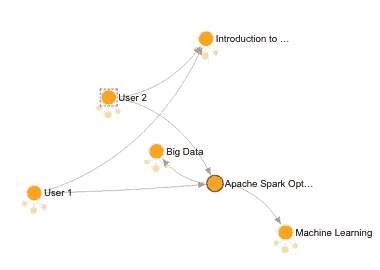***

## ***查询数据***

***正如我们之前提到的，您可以使用 **SQL** 或 **Gremlin** **DSL** 来执行查询。数据浏览器是测试数据模型的一个很好的工具。对于真实世界的应用程序，你将使用像 Python 这样的编程语言，我们也展示了如何简单易用。***

***参考 [**文档**](https://tinkerpop.apache.org/docs/3.4.9/reference/) 了解关于这个强大 API 的更多信息。***

***一般来说，这些查询很容易理解，也很容易推理。例如，如果我们想找出对机器学习感兴趣的用户，我们将执行:***

```
*g.V().hasLabel('Topic')
.has('name','Machine Learning')
.in('likes').in('has')*
```

***在这里，我们寻找“主题”类型的节点，并通过“机器学习”进行过滤，然后我们使用 ***in()*** 导航到源，使用 ***out()*** 导航到目标。***

***结果是:***

***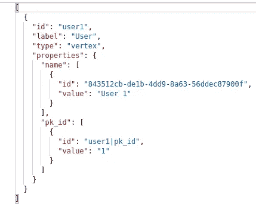***

***你可以继续玩。尝试更多的查询，添加更多的数据，不断尝试！***

# ***结论***

***我希望你喜欢这篇文章。我真的鼓励你继续摆弄数据，并尝试模拟其他问题。还有，试试其他数据库比如 **Neo4j** 。***

***图形数据库变得越来越受欢迎，这种类型的专业知识目前需求量很大。越来越多的公司已经意识到图形数据库的潜力，以及如何利用图形数据库解决大规模的复杂商业问题。***

***图形数据库极其**灵活**，**强大**，易于使用**简单**；现在，由于**云**易于设置和扩展；但是请注意，它们只适用于特定类型的数据。如果你的数据没有复杂的关系，或者太小或者太死板，那么这种类型的 NoSQL 数据库可能不适合你。尝试 CosmosDB 中的其他 API，以决定哪一个更适合您的数据和查询。***

***你可以在这个 [**库**](https://github.com/javiramos1/cosmosdb_gremlin_demo) 中找到**代码**。***

****如果你喜欢这篇文章，记得鼓掌，并关注我的更多更新！****

***我希望你喜欢这篇文章。欢迎发表评论或分享这篇文章。跟随 [***我***](https://twitter.com/JavierRamosRod)**作未来的职务。*****