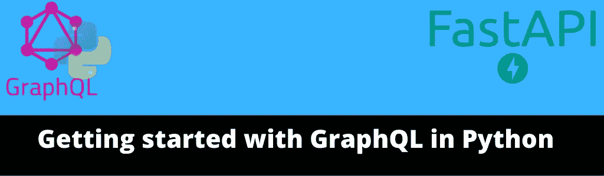
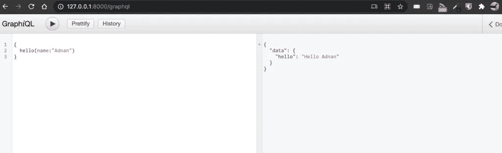
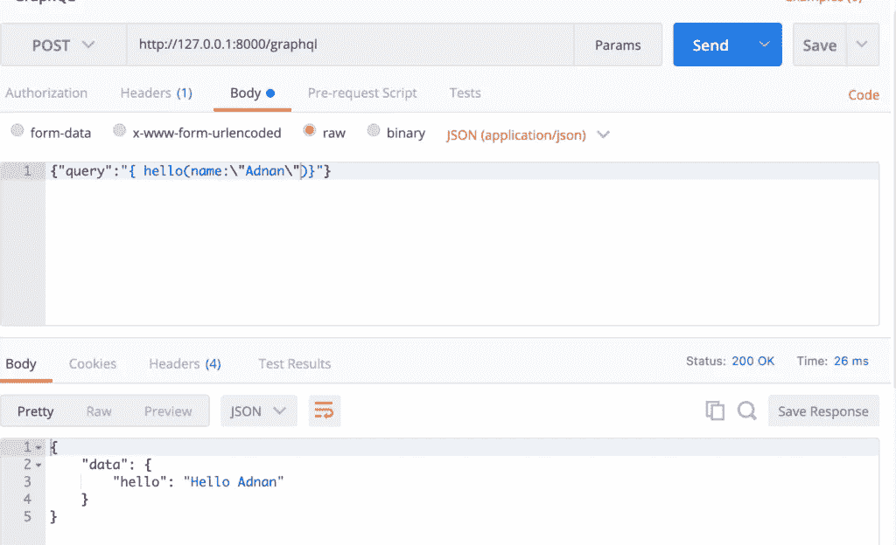
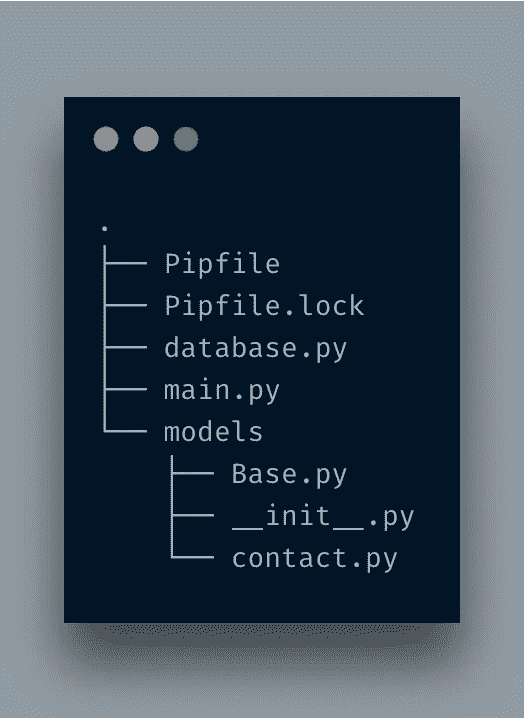
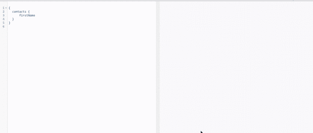
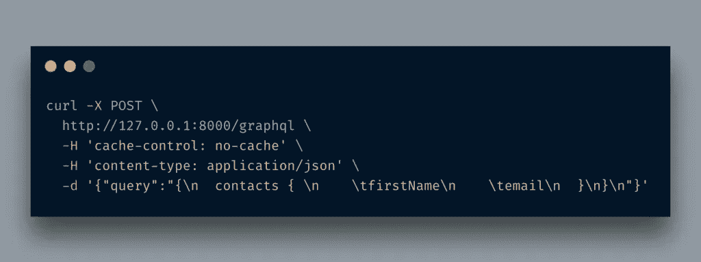
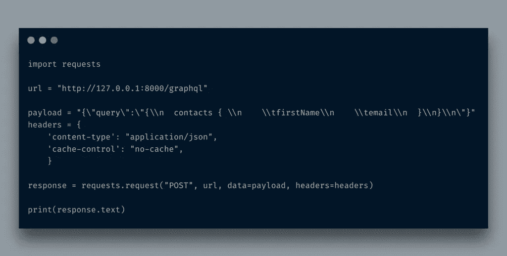
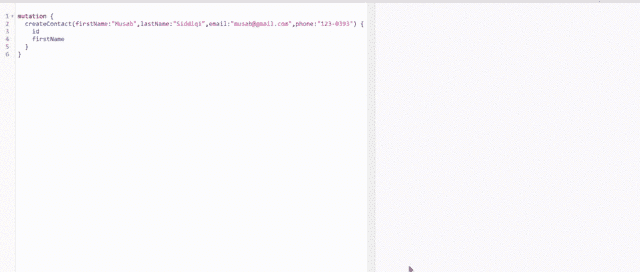

# 使用 FastAPI 和 Graphene 开始使用 Python 中的 GraphQL

> 原文：<https://itnext.io/getting-started-with-graphql-in-python-with-fastapi-and-graphene-abb4f3eb04f4?source=collection_archive---------0----------------------->



这篇文章是 [FastAPI 系列](http://blog.adnansiddiqi.me/tag/fastapi/)的一部分。

这是另一篇与 FastAPI(间接)相关的帖子，我将在其中讨论如何使用基于 GraphQL 的 API 来访问和操作数据。在之前的[帖子](http://blog.adnansiddiqi.me/create-your-first-rest-api-in-fastapi/)中，我已经讨论过如何在 FastAPI 框架中创建 Rest API。我们将学习 GraphQL 的一些基础知识，以及 graphene 如何帮助我们使用 Python 编写基于 GraphQL 的应用程序。所以，让我们开始吧！

# 什么是 GraphQL

来自官网:

> GraphQL 是一种 API 查询语言，也是一种用现有数据完成这些查询的运行时语言。GraphQL 为 API 中的数据提供了完整且易于理解的描述，使客户能够准确地要求他们需要的东西，使 API 更容易随时间发展，并支持强大的开发工具

GraphQL 是由 Lee Byron 和他的团队在 2012 年内部开发的，用于许多内部项目，包括脸书移动应用程序，后来在 2015 年公开发布。

官网提供了一个[学习 GraphQL 不同部分的优秀资源](https://graphql.org/learn/)，具体可以参考。在这里，我将更多地讨论 Python 中的实现。不要担心，我会分享一些基本的东西。

在继续之前，让我们设置一下本地开发环境。像以前的 [FastAPI 帖子](http://blog.adnansiddiqi.me/tag/fastapi)一样，我也将在这里使用`Pipenv`。除了安装[石墨烯](https://graphene-python.org/)之外，我不打算重复所有步骤。

# 石墨烯是什么

来自官方[网站](https://graphene-python.org/):

> Graphene-Python 是一个用于在 Python 中轻松构建 GraphQL APIs 的库，其主要目标是提供一个简单但可扩展的 API，使开发人员的生活更加轻松。

简而言之，它可以帮助您轻松设置 GraphQL 特性。

GraphQL 提供了一个测试 GraphQL 查询的平台。它输入 GraphQL 服务器的 URL 并让您测试查询。我将首先设置操场，然后我们将开始编码我们的应用程序。应用程序是一样的:联系人管理系统。

```
import graphene
from fastapi import FastAPI
from starlette.graphql import GraphQLAppclass Query(graphene.ObjectType):
    hello = graphene.String(name=graphene.String(default_value="stranger"))def resolve_hello(self,info,name):
        return "Hello " + nameapp = FastAPI(title='ContactQL', description='GraphQL Contact APIs', version='0.1')
[@app](http://twitter.com/app).get("/")
async def root():
    return {"message": "Contact Applications!"}app.add_route("/graphql", GraphQLApp(schema=graphene.Schema(query=Query)))
```

导入`graphene`后我是导入`GraphQLApp`。GraphQL 工具实际上是由 *Starlette* 提供的。由于 FastAPI 正在使用 Starlette，因此它对我们来说是自动可用的。

当我进入`http://localhost:8080/grapgql`时，显示如下界面:



不要对这里写的东西感到恐慌。我想透露的是，你在上面看到的花哨界面之所以可用，只是因为有了这条线`app.add_route("/graphql", GraphQLApp(schema=graphene.Schema(query=Query)))`

好了，现在我们已经为运行不同的查询准备好了场地。是时候学习 GraphQL 查询的基础知识了。

# 问题

关于 GraphQL，您需要知道的第一件事是查询 graphql 服务器。您遵循特定的语法:

```
{
  hello
}
```

你在上面看到的东西实际上是在调用一个对象，在这里，`hello`是一个对象。您向 graphql 服务器传递一个 JSONish like 查询，它返回:

```
{
  "data": {
    "hello": "Hello stranger"
  }
}
```

如您所见，graphql 查询非常类似于返回的 JSON。

```
query {
 hello 
}
```

为了更好地理解，您可以在查询中显式传递`query`关键字。

好吧，上面的查询是在一个奇特的 GraphQL 交互界面中执行的，但是现实生活并不那么奇特。为了让前端应用程序与您的 graphql 服务器交互，您必须像访问典型的 REST API 一样访问它。下面是上面的 cURL 版本:

```
curl '[http://127.0.0.1:8000/graphql'](http://127.0.0.1:8000/graphql') \
  -H 'Content-Type: application/json' \
  --data-raw '{"query":"{hello}"}' \
  --compressed
```

在《邮差》中，它看起来像是:



听起来很酷，不是吗？`GET`版本打开交互式客户端，而`POST`调用实际上用于执行 GraphQL 查询。在生产代码中，您可能不喜欢向您的用户提供 ***graphiql*** 接口。您可以简单地通过在`GraphQLApp`构造函数中传递`graphiql=False`来禁用它。但我保留它是为了测试的目的。

让我们开始真正的应用程序。在[之前的帖子](http://blog.adnansiddiqi.me/getting-started-with-fastapi-and-mysql/)中，我制作了必要的 DB 和模型相关文件，所以我在这里只是使用它们。我在这里复制了`models`文件夹和`database.py`文件。当前文件夹结构如下所示:



好了，现在我要对`main.py`文件做一些修改。

```
import graphene
from fastapi import FastAPI
from starlette.graphql import GraphQLAppfrom models.contact import list_contactsclass Contact(graphene.ObjectType):
    first_name = graphene.String()
    last_name = graphene.String()
    email = graphene.String()class QueryContact(graphene.ObjectType):
    contacts = graphene.List(Contact)[@staticmethod](http://twitter.com/staticmethod)
    def resolve_contacts(self, info):
        records = []
        contacts = list_contacts()
        for c in contacts:
            records.append({'first_name': c.first_name, 'last_name': c.last_name, 'email': c.email})return records
```

导入所有必要的东西后，我正在创建一个类型为`graphene.ObjectType`的类`Contact`。这样做的原因是我们必须暴露某些领域的联系。因为目的是显示联系人列表，然后我们将它传递给接受类类型的`graphene.List`。你可以在这里了解更多。

创建完类后，我在`QueryContact`类中创建了一个字段`contacts`，它的类型是`List`。您可以在其中传递任何类型。在我们的例子中，它属于`Contact`类型。

resolver 方法中的代码是不言自明的。它从`contacts`表中取出记录并追加到`records`列表中



这里，根对象是`contacts`。如果你想知道为什么它会显示联系人。这是因为我们在类型为`List`的`QueryContact`类中定义了一个名为的字段。所有的子字段都是从类型为`Contact`的类中获取的，该类本身也属于`ObjectType`。

所以无论你传递什么字段(确保它们是系统的一部分)，它们在这里都是可见的。下面是执行上述操作的 cURL 和 Python 请求版本，以防需要在系统中集成 graphql。



上面的例子返回了所有的项目，但是如果我想返回一个或多个符合特定条件的项目呢？Graphql 为您提供了在查询中传递参数[的选项。这就是你要做的:](https://graphql.org/learn/queries/#arguments)

```
{
  contacts(id:1) { 
     firstName
     email
  }
}
```

正如你看到的，我正在传递一个参数，`id`来过滤结果。代码现在将如下所示:

```
class QueryContact(graphene.ObjectType):
    contacts = graphene.List(Contact, id=graphene.Int())[@staticmethod](http://twitter.com/staticmethod)
    def resolve_contacts(self, info, id=0):
        records = []
        result = Noneif id == 0:
            contacts = list_contacts()
            for c in contacts:
                records.append({'first_name': c.first_name, 'last_name': c.last_name, 'email': c.email})
            result = records
        elif id > 0:
            contact = get_contact(id)
            if contact is not None:
                result = [{'first_name': contact.first_name, 'last_name': contact.last_name, 'email': contact.email}]
            else:
                result = []
        return result
```

`contacts`字段传递了一个类型为`graphene,Int()`的参数`id`。一旦完成，我们将在`resolve_contacts`方法中传递一个默认的`id`参数。代码的其余部分应该是清楚的。我正在检查一个`id`是否被传递，然后调用`get_contact`，否则调用`list_contacts()`。因为我们已经在使用 list 类型的`contacts`，所以即使只有一条记录返回，它也会被包装在`list`中。

很酷，不是吗？如果您想将这些查询与 RDBMS 的 SQL 查询进行映射，那么应该是:`SELECT first_name,email from contacts`，对于单个查询，应该是`SELECT first_name,email from contacts where id = 2`。

# 变化

到目前为止，我们正在拉数据，如果我们想改变它，[突变](https://graphql.org/learn/queries/#mutations)允许您操纵数据。突变查询语法如下所示:

```
mutation {
  createContact(firstName:"Musab",lastName:"Siddiqi",email:"[musab@gmail.com](mailto:musab@gmail.com)",phone:"123-0393") {
    id
    firstName
  }    
}
```

让我们写代码吧！

```
from models.contact import list_contacts, get_contact, create_contactclass CreateContact(graphene.Mutation):
    # These fields will be displayed after successful insert
    id = graphene.Int()
    first_name = graphene.String()class Arguments:
        first_name = graphene.String()
        last_name = graphene.String()
        email = graphene.String()
        phone = graphene.String()def mutate(self, info, first_name, last_name, email, phone):
        new_contact = create_contact(first_name=first_name, last_name=last_name, email=email, phone=phone, status=1)if new_contact is None:
            raise Exception('Contact with the given email already exists')return CreateContact(id=new_contact.id, first_name=new_contact.first_name)class Mutation(graphene.ObjectType):
    create_contact = CreateContact.Field()app.add_route("/graphql", GraphQLApp(graphiql=True, schema=graphene.Schema(query=QueryContact, mutation=Mutation)))
```

所以我创建了一个继承了类`Mutation`的`CreateContact`类。

首先，我定义了几个字段。这些字段实际上显示了数据插入或删除/更新后的数据(*是的，变异可用于任何类型的数据操作*)。然后，`Arguments`类用于传递参数，这些参数包含将要插入的信息。`mutate`方法实际上类似于 *resolve_* 方法。这个方法的返回是类`CreateContact`的对象。我们这样做是因为我们必须显示这些字段作为回报。然后，我正在创建一个继承了`ObjectType`的类。该类包含类型为`CreateContact`的字段`create_contact`。最后，`graphene.Schema`将被传递另一个设置`Mutation`类的参数。代码的结果如下所示:



首先，它创建了一个新记录。当你试图插入相同的记录 w.r.t 电子邮件它提出了一个异常，酷，不是吗？

# 结论

在这篇文章中，您了解了如何为您的应用程序创建基于 graphql 的查询。我只讨论了它的基础。万一你有兴趣深入学习，你可以去探索一下 [GraphQL](https://graphql.org/learn/) 和石墨烯的文档。像往常一样，这些代码可以在 Github 上获得。

*原载于 2021 年 2 月 14 日*[*http://blog . adnansiddiqi . me*](http://blog.adnansiddiqi.me/getting-started-with-graphql-in-python-with-fastapi-and-graphene/)*。*