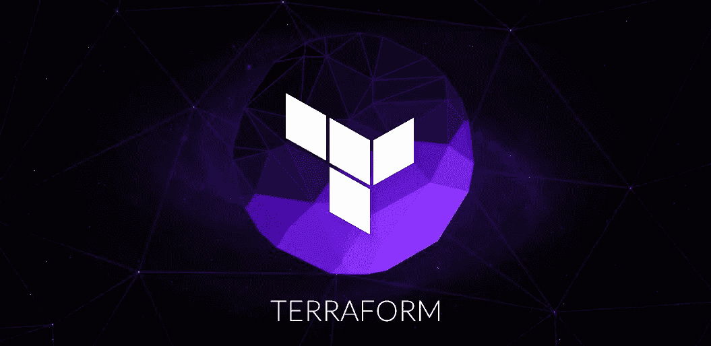
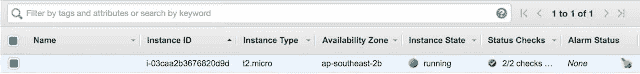
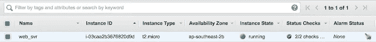
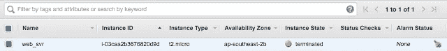

# 使用 Terraform 开始使用基础设施即代码(IaC)

> 原文：<https://itnext.io/getting-started-with-infrastructure-as-code-iac-using-terraform-84f15fb72ae6?source=collection_archive---------1----------------------->

> 基础设施作为代码的思想是，用来运行软件的系统和设备可以被视为软件本身。基夫·莫里斯的基础设施代码

我在 YouTube 上制作了两个视频:

*   [基础设施代码简介(IaC)](https://www.youtube.com/watch?v=53X-HAw7BbA&t=61s)
*   [地形介绍](https://www.youtube.com/watch?v=cpxKbf51ccU&t=225s)



在本文中，我们将在 Mac OSX 上安装 Terraform，并使用 Terraform 在 AWS 上部署 EC2 实例，而不是通过单击 AWS EC2 Web 控制台进行手动部署。

*   在$HOME 下创建一个目录，下载并解压 [Terraform](https://www.terraform.io/downloads.html) 。

```
$ mkdir terraform
$ cd $HOME/terraform

$ curl -O https://releases.hashicorp.com/terraform/0.11.7/terraform_0.11.7_darwin_amd64.zip

  % Total    % Received % Xferd  Average Speed   Time    Time     Time  Current

                                 Dload  Upload   Total   Spent    Left  Speed

100 16.9M  100 16.9M    0     0  18.7M      0 --:--:-- --:--:-- --:--:-- 18.7M

$ unzip terraform_0.11.7_darwin_amd64.zip

Archive:  terraform_0.11.7_darwin_amd64.zip

  inflating: terraform
```

*   在~/下设置路径。bash_profile

```
*# Setting PATH for Terraform*

TERRAFORM=~/terraform/

PATH=$PATH:$TERRAFORM
```

*   打开一个新的终端并验证。

```
*$* *terraform* --*version*

*Terraform* *v0*.*11*.*7*$ terraform

Usage: terraform [*--version] [--help] <command> [args]*
The available commands for execution are listed below.
The most common, useful commands are shown first, followed by
less common or more advanced commands. If you're just getting
started with Terraform, stick with the common commands. For the
other commands, please read the help and docs before usage.
Common commands:

    apply              Builds or changes infrastructure

    console            Interactive console for Terraform interpolations

    destroy            Destroy Terraform-managed infrastructure

    env                Workspace management

    fmt                Rewrites config files to canonical format

    get                Download and install modules for the configuration

    graph              Create a visual graph of Terraform resources

    import             Import existing infrastructure into Terraform

    init               Initialize a Terraform working directory

    output             Read an output from a state file

    plan               Generate and show an execution plan

    providers          Prints a tree of the providers used in the configuration

    push               Upload this Terraform module to Atlas to run

    refresh            Update local state file against real resources

    show               Inspect Terraform state or plan

    taint              Manually mark a resource for recreation

    untaint            Manually unmark a resource as tainted

    validate           Validates the Terraform files

    version            Prints the Terraform version

    workspace          Workspace management

All other commands:

    debug              Debug output management (experimental)

    force-unlock       Manually unlock the terraform state

    state              Advanced state management
```

恭喜你！！！Terraform 已经启动并运行。

*   让我们使用 Terraform 在 AWS 中启动一个虚拟机。我们必须已经有 AWS 帐户，否则我们可以[在这里](https://aws.amazon.com/free/)创建一个。
*   我们将在~HOME/下创建一个名为“terraform”的配置文件。存储我们的 aws 配置和凭证的 AWS。

```
$ cd .aws
$ more credentials 

[terraform]
aws_access_key_id= [paste-access-key-here]
aws_secret_access_key= [paste-secret-access-key-here]

$ more config
[profile terraform]
region = us-east-1
output = json
```

*   在$HOME/terraform 下创建一个名为“webserver.tf”的 terraform 配置。

```
$ more webserver.tf
provider "aws" {
  region                   = "us-east-1"
  shared_credentials_file  = "/Users/hellocloud/.aws/credentials"
  profile                  = "terraform"
}

resource "aws_instance" "web_svr" {
    ami = "ami-1c47407f"
    instance_type = "t2.micro"
    key_name      = "helloterraform"
}
```

*   运行命令$ terraform plan，并观察输出。

```
$ terraform plan
Refreshing Terraform state in-memory prior to plan...
The refreshed state will be used to calculate this plan, but
will not be persisted to local or remote state storage.

The Terraform execution plan has been generated and is shown below.
Resources are shown in alphabetical order for quick scanning. Green resources
will be created (or destroyed and then created if an existing resource
exists), yellow resources are being changed in-place, and red resources
will be destroyed. Cyan entries are data sources to be read.

Note: You didn't specify an "-out" parameter to save this plan, so when
"apply" is called, Terraform can't guarantee this is what will execute.

+ aws_instance.web_svr
    ami:                         "ami-1c47407f"
    associate_public_ip_address: "<computed>"
    availability_zone:           "<computed>"
    ebs_block_device.*#:          "<computed>"*
    ephemeral_block_device.*#:    "<computed>"*
    instance_state:              "<computed>"
    instance_type:               "t2.micro"
    ipv6_addresses.*#:            "<computed>"*
    key_name:                    "helloterraform"
    network_interface_id:        "<computed>"
    placement_group:             "<computed>"
    private_dns:                 "<computed>"
    private_ip:                  "<computed>"
    public_dns:                  "<computed>"
    public_ip:                   "<computed>"
    root_block_device.*#:         "<computed>"*
    security_groups.*#:           "<computed>"*
    source_dest_check:           "true"
    subnet_id:                   "<computed>"
    tenancy:                     "<computed>"
    vpc_security_group_ids.*#:    "<computed>"*

Plan: 1 to add, 0 to change, 0 to destroy.
```

*   运行命令 terraform apply，并观察输出。

```
$ terraform apply
aws_instance.web_svr: Creating...
  ami:                         "" => "ami-1c47407f"
  associate_public_ip_address: "" => "<computed>"
  availability_zone:           "" => "<computed>"
  ebs_block_device.*#:          "" => "<computed>"*
  ephemeral_block_device.*#:    "" => "<computed>"*
  instance_state:              "" => "<computed>"
  instance_type:               "" => "t2.micro"
  ipv6_addresses.*#:            "" => "<computed>"*
  key_name:                    "" => "helloterraform"
  network_interface_id:        "" => "<computed>"
  placement_group:             "" => "<computed>"
  private_dns:                 "" => "<computed>"
  private_ip:                  "" => "<computed>"
  public_dns:                  "" => "<computed>"
  public_ip:                   "" => "<computed>"
  root_block_device.*#:         "" => "<computed>"*
  security_groups.*#:           "" => "<computed>"*
  source_dest_check:           "" => "true"
  subnet_id:                   "" => "<computed>"
  tenancy:                     "" => "<computed>"
  vpc_security_group_ids.*#:    "" => "<computed>"*
aws_instance.web_svr: Still creating... (10s elapsed)
aws_instance.web_svr: Creation complete

Apply complete! Resources: 1 added, 0 changed, 0 destroyed.

The state of your infrastructure has been saved to the path
below. This state is required to modify and destroy your
infrastructure, so keep it safe. To inspect the complete state
use the `terraform show` command.

State path: terraform.tfstate
```

将有一个名为“terraform.tfstate”的文件被创建。该状态文件非常重要，因为它将各种资源元数据映射到实际的资源 id，以便 Terraform 知道它正在管理什么。该文件必须保存并分发给任何可能运行 Terraform 的人。[摘自:[https://www.terraform.io/](https://www.terraform.io/)]

*   运行命令$ terraform show 进行验证。

```
$ terraform show
aws_instance.web_svr:
  id = i-03caa2b3676820d9d
  ami = ami-1c47407f
  associate_public_ip_address = true
  availability_zone = ap-southeast-2b
  disable_api_termination = false
  ebs_block_device.*# = 0*
  ebs_optimized = false
  ephemeral_block_device.*# = 0*
  iam_instance_profile = 
  instance_state = running
  instance_type = t2.micro
  ipv6_address_count = 0
  ipv6_addresses.*# = 0*
  key_name = helloterraform
  monitoring = false
  network_interface_id = eni-f80d9c83
  private_dns = ip-172-31-14-81.ap-southeast-2.compute.internal
  private_ip = 172.31.14.81
  public_dns = ec2-13-55-176-59.ap-southeast-2.compute.amazonaws.com
  public_ip = 13.55.176.59
  root_block_device.*# = 1*
  root_block_device.0.delete_on_termination = true
  root_block_device.0.iops = 100
  root_block_device.0.volume_size = 8
  root_block_device.0.volume_type = gp2
  security_groups.*# = 0*
  source_dest_check = true
  subnet_id = subnet-ea4f928e
  tags.% = 0
  tenancy = default
  vpc_security_group_ids.*# = 1*
  vpc_security_group_ids.2657148695 = sg-1e683a7a
```

*   让我们登录 AWS 控制台并进行验证。



酷！！！

但是，我们忘了标记实例。所以我们编辑一下 webserver.tf 如下。

```
provider "aws" {
  region                   = "ap-southeast-2"
  shared_credentials_file  = "/Users/hellocloud/.aws/credentials"
  profile                  = "terraform"
}

resource "aws_instance" "web_svr" {
    ami = "ami-1c47407f"
    instance_type = "t2.micro"
    key_name      = "helloterraform"
    **tags = { Name = "web_svr"}**
}
```

*   现在我们要重复同样的地形改造过程。

```
$ terraform plan
$ terraform apply
$ terraform show
```

*   登录 AWS 控制台并验证名称列。



*   让我们通过键入$ terraform plan -destroy 进行清理。

```
$ terraform plan -destroy
Refreshing Terraform state in-memory prior to plan...
The refreshed state will be used to calculate this plan, but
will not be persisted to local or remote state storage.

aws_instance.web_svr: Refreshing state... (ID: i-03caa2b3676820d9d)

The Terraform execution plan has been generated and is shown below.
Resources are shown in alphabetical order for quick scanning. Green resources
will be created (or destroyed and then created if an existing resource
exists), yellow resources are being changed in-place, and red resources
will be destroyed. Cyan entries are data sources to be read.

Note: You didn't specify an "-out" parameter to save this plan, so when
"apply" is called, Terraform can't guarantee this is what will execute.

- aws_instance.web_svr

Plan: 0 to add, 0 to change, 1 to destroy.
```

*   让我们现在就毁灭吧。$ terraform 毁灭。

```
$ terraform destroy
Do you really want to destroy?
  Terraform will delete all your managed infrastructure.
  There is no undo. Only 'yes' will be accepted to confirm.

  Enter a value: yes

aws_instance.web_svr: Refreshing state... (ID: i-03caa2b3676820d9d)
aws_instance.web_svr: Destroying...
aws_instance.web_svr: Still destroying... (10s elapsed)
aws_instance.web_svr: Still destroying... (20s elapsed)
aws_instance.web_svr: Still destroying... (30s elapsed)
aws_instance.web_svr: Still destroying... (40s elapsed)
aws_instance.web_svr: Still destroying... (50s elapsed)
aws_instance.web_svr: Still destroying... (1m0s elapsed)
aws_instance.web_svr: Destruction complete

Destroy complete! Resources: 1 destroyed.
```

*   在 AWS 控制台上验证。



终止！！！

现在我们有了使用 Terraform 将基础设施作为代码的想法。

我们想要自动化或定义资源，如虚拟机、网络、存储和容器，如 Google Cloud、Azure、Docker、Kubernetes 等的 IaC。查看一下 [Terraform 提供商。](https://www.terraform.io/docs/providers/)