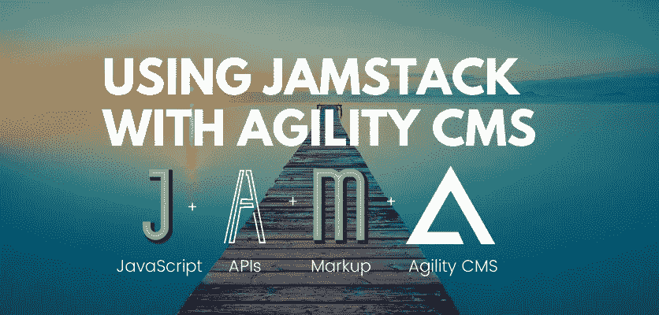
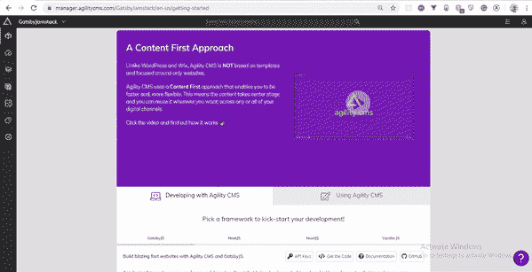
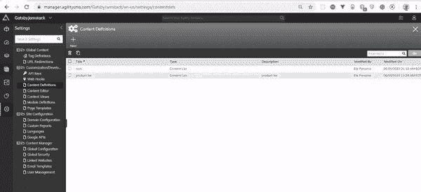
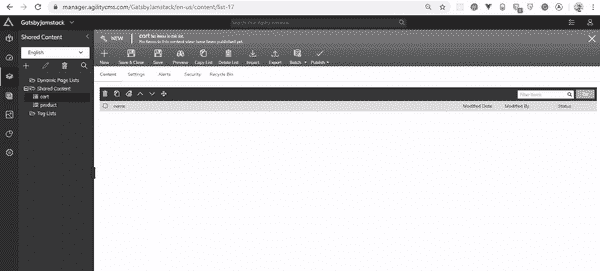
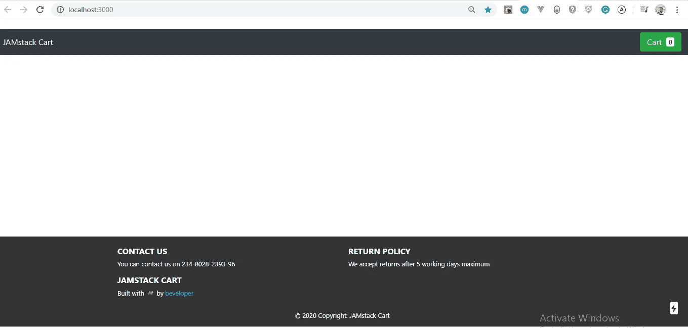
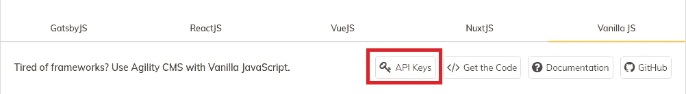
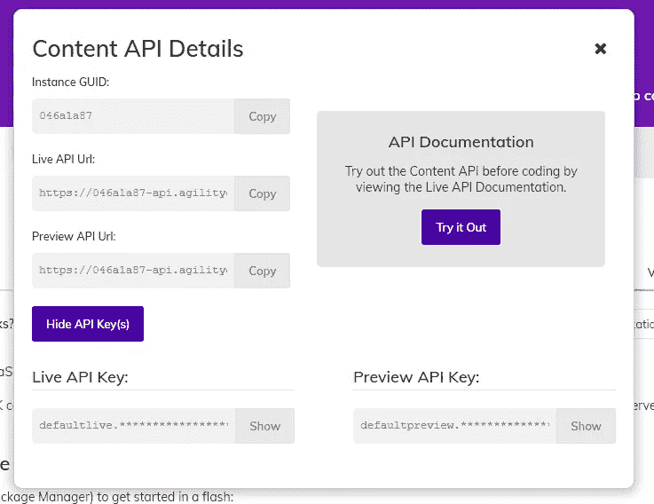
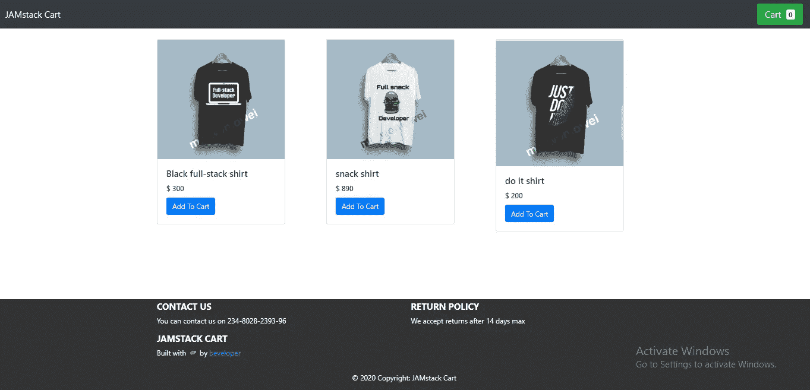
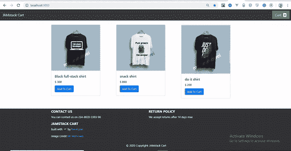

# JAMstack 和 Agility CMS 入门

> 原文：<https://itnext.io/getting-started-with-jamstack-and-agility-cms-da43a9245b10?source=collection_archive---------5----------------------->

封面图像

# 快速总结:

本文介绍了 JAMstack，这是一种构建 web 应用程序的现代方法，它将前端页面(静态资产)从后端逻辑或数据库中分离出来，并通过内容交付网络(CDN)部署前端页面。在本文中，我们将利用 JAMstack 的概念用 Next 构建一个购物车。JS 和 AgilityCMS。

# 介绍

最近，我们看到静态网站越来越受欢迎，功能也越来越多。静态网站只是一些没有巨大交互性的 HTML 和 CSS 的日子已经一去不复返了。今天，我们有静态网站做令人兴奋的事情，如认证，结帐，支付系统和媒体管理。

因此，继续称这些网站为“静态网站”会低估这些网站的功能。因此，出现了术语 **JAMstack** 。

JAMstack 中的 **JAM，**代表 JavaScript、API 和标记，它是一种架构模式，使 web 应用程序更便宜，构建起来更简单，性能和可伸缩性更好。

JAMstack 不要求您切换到任何特定的技术，您可以使用任何最适合您的技能的 JavaScript 库或框架。

在本教程中，您将了解什么是 JAMstack，为什么应该使用 JAMstack，JAMstack 的好处。最后，您已经获得了足够的关于 JAMstack 的知识，可以用 React 和 NextJS 构建一个购物车。之后，您可以继续使用 JAMstack 方法进行构建。

本教程假设您熟悉 Javascript 和 React JS，但是，您不必精通这些。

# 什么是 JAMstack？

据[Mathias biil Mann](https://twitter.com/biilmann)(Netlify 的首席执行官&联合创始人)，他将 [JAMstack](https://jamstack.wtf/) 描述为基于客户端 JavaScript、可重用 API 和预建标记的现代 web 开发架构。

根据上面的定义，我们可以将 JAMstack 视为一种方法，它使用 **J** avaScript 或其任何框架，如 VueJs、Angular、Svelte 或 React 来构建可重用的组件，然后与其他中的**A**pi 进行交互，以从各种不同的来源获取数据。arkup 表示如何使用静态站点生成器生成页面，静态站点生成器定义了每个页面应该如何显示。

另一方面，堆栈是用于创建 web 或移动应用程序的几种技术的组合。所以 JAMstack 是 JavaScript、API 和标记的结合。

重要的是要知道 JAMstack 不是一种编程语言，它是一种用于构建安全、廉价、可伸缩的 web 应用程序的 web 开发方法。

此外，通过 JAMstack，我们不再使用 monolith 应用程序，而是开发更小的组件，并将它们部署到全球 CDN ( [边缘服务器](https://www.cloudflare.com/learning/cdn/glossary/edge-server/))。开发人员可以利用 SSG(静态站点生成器)，并使用客户端 JavaScript 和 API 来增强他们的站点，这意味着可以将重点放在开发上，而不是 DevOps 相关的活动上。

有趣的是，您可能一直在使用 JAMstack，甚至没有意识到这一点。

# JAMstack 术语

我将在本文中经常使用这些术语，我想你应该知道它们的意思；

*   **API** 是 Application Programming Interface 的首字母缩写，它是一个软件中介，允许两个应用程序相互对话。
*   **CDN** (内容交付网络)是一个分布式服务器(网络)系统，根据用户的地理位置、网页的来源和内容交付服务器，向用户交付页面和其他 Web 内容。
*   服务器是一台被设计用来处理请求并通过互联网或本地网络向另一台计算机传送数据的计算机。
*   **数据库**是组织起来的信息集合，以便于访问、管理和更新
*   **SSG** —静态站点生成器(SSG)是一套工具，它接收数据、内容和模板，对它们进行处理，然后输出一个包含所有结果页面和资产的文件夹。*当前 SSG 趋势的例子包括:*
*   [**Gatsby**](https://www.gatsbyjs.org/)**:**Gatsby 是一个基于 React 的免费开源框架，帮助开发者构建超快的**网站和** **应用**
*   [**NuxtJS**](https://nuxtjs.org/)**:**NuxtJS 是通用应用、静态生成的应用、单页应用、渐进式 web 应用和桌面应用的 Vue.js 框架
*   [**Hugo**](http://gohugo.io/)**:**Hugo 是世界上最快的构建网站的框架。它是最流行的开源静态站点生成器之一。凭借其惊人的速度和灵活性，Hugo 让网站建设再次充满乐趣。
*   [**grid some**](https://gridsome.org/):grid some 是 VueJs 的 JAMstack 框架。Gridsome 使用极快的静态站点生成、JavaScript 和 API 来创建令人惊叹的现代 web 体验。
*   [**Vue press**](https://vuepress.vuejs.org/):Vue press 是一款极简的 Vue 供电的静态站点生成器。VuePress 由 Vue、Vue 路由器和 Webpack 提供支持。
*   [**【Jekyll**](https://jekyllrb.com/):Jekyll 是一个解析引擎，捆绑成一个 ruby gem，用于从动态组件如模板、片段、液体代码、markdown 构建静态网站。
*   [**next js**](https://nextjs.org/):next . js 是由 [Vercel](https://vercel.com/) (原 Zeit)构建的 React 框架。Next.js 允许您使用 React 轻松构建服务器端渲染和静态 web 应用程序。

# JAMstack 的工作原理

JAMstack 的与众不同之处在于，所有复杂的逻辑都发生在用户访问网站之前，因此沉重的负担完全被忽略了。在部署站点之前，您不必担心编写任何服务器代码、管理容器或编写一些 Kubernetes 代码。

每个 JAMstack 实现都有一些共同发挥作用的标志性品质:

*   组件:把一个组件想象成一块乐高积木。组件是 JAMstack 框架的构建块。它们是可以被创建的可重用的 UI 元素，有趣的是你可以使用你选择的任何 JavaScript 框架，比如 VueJS，Angular，Svelte，或者 React，就像本教程中的例子一样。
*   **布局:**如果成分是化学元素，那么布局就是分子。有道理是吗？布局是组件的排列，充当将通过 API 获取的数据的模板。
*   页面:有些独立的布局不打算被重用。想想主页或联系页面。这些仍然是用组件构建的。
*   插件:基本框架的扩展，插件可以让你在不增加核心框架的情况下为你的站点增加功能。一些框架考虑主题插件。
*   每个框架都会有一个某种类型的配置文件。这个文件将包含高级信息，比如站点名称、API 密钥和插件设置。

JAMstack 工作流程如下:

*   构建和托管静态文件是分开的(解耦的)。
*   文件通常被编译并从 CDN 提供给浏览器
*   静态文件的更新或更改是通过 Git 推送的，因此文件是通过 SSG 的重新构建的

# 为什么是 JAMstack？

也许你是 LAMP、MEAN、MERN 或 MEVN 栈的开发人员，你想知道为什么你需要使用另一个栈。我有几个理由让你应该使用 JAMstack:

*   **降低复杂性:在构建 JAMstack 应用程序时几乎不涉及复杂的过程，因为您只需担心创建静态站点，而无需考虑开发运维或管理后端基础设施。**
*   **更好的性能**:使用 JAMstack 构建有助于获得部署时生成的页面，因为它们主要存储为标记，可以通过 CDN 交付。
*   **高安全性**:静态网站存在漏洞的可能性非常低，因为它由 HTML 文件和通过 CDN 提供的外部 API 处理组成。这降低了网站遭受攻击的风险。将 SSL 证书与[集成很容易，让我们加密](https://letsencrypt.org/)。此外，它利用服务器端微服务 API 来保护网站。
*   **便宜而快速的部署** : JAMstack 网站可以轻松部署，无需经历配置数据库和保护数据库的麻烦。我们只处理易于安装和运行的静态文件。
*   **牛逼的开发者体验**:使用 JAMstack 最重要的一个好处就是学习起来并不困难。仅仅凭借 HTML、CSS 和 Javascript 经验，开发者就可以构建复杂的网站。站点生成器的使用消除了为内容和营销维护单独堆栈的需要。
*   **伟大的社区**:jam stack 社区正在不断发展壮大。对各种功能的新支持每天都在涌现。更令人兴奋的是[当地社区聚会](https://jamstack.org/community/)正在创建中。这个[网络社区](https://gitter.im/jamstack/community)也很神奇

# 带有无头 CMS 的 JAMstack

JAMstack web 应用程序与 Headless CMS 方法配合得非常好。Headless CMS 通过向静态站点提供仅后端服务，消除了对核心后端基础设施和数据库建模的依赖，使得构建 JAMstack 应用程序变得容易得多。

当你决定在你的下一个 JAMstack 应用中使用它时，这里有一个无头 CMS 的列表，你可能要考虑一下；

*   [心满意足](https://www.contentful.com/)
*   [敏捷 CMS](https://agilitycms.com/)
*   [图形 CMS](https://graphcms.com/)
*   [黄油 CMS](https://buttercms.com/)
*   [Directus](http://directus.io/)
*   [理智](http://sanity.io/)

# 构建我们的购物车。

现在我们知道了 JAMstack 是什么，让我们使用 JAMstack 方法构建一个购物车。

在构建我们的应用程序时，我们将利用 JAMstack with Agility CMS(一个 HeadlessCMS)来创建我们的产品项目(数据)。我们还将利用 NextJS 作为我们的静态站点生成器。

# 为什么选择 AgilityCMS？

AgilityCMS 是少数几个内置页面管理的专注于 JAMstack 的无头 CMS 之一。更快地构建、管理和部署。Agility CMS 是一个内容优先的无头 CMS，允许您选择任何编程语言，同时还可以获得来自轻量级 API 的灵活性、速度和能力。敏捷 CMS 与 SSG 的 Gatsby 和 NextJS 有一个简单的设置。

Agility CMS 的 JAMstack 方法及其与 NextJS 的无缝设置被认为是最适合本教程的原因。

# 入门指南

要开始使用 AgilityCMS，请遵循以下步骤。

*   在 [AGILITYCMS](https://agilitycms.com/) 上创建账户。你可以使用免费层。

*   注册过程有两个简单的步骤。
*   创建您的详细信息
*   下一步涉及创建项目细节

完成这一步后，您肯定会开始为我们的购物车创建一些内容。

接下来，我们将快速创建我们的数据。

在 AgilityCMS 中创建数据时，需要考虑几个步骤。

*   步骤 1 —创建我们的模式(字段属性)。

我们导航到**侧栏**的**设置**，然后导航到**内容定义**部分，以创建我们的字段(产品)属性，其中包括；名称、id、价格、图像和描述。

请注意，所有字段的属性都设置为必填。

*   步骤 2——创建我们的实际数据。

另外，为了创建实际数据，我们需要创建一个共享内容列表，它将成为我们实际产品数据的基础。

从侧边栏，我们导航到 S **共享内容**部分。我们点击加号图标创建一个新的。我们选择了最近创建的**内容定义**(产品字段)也就是**购物车。为了简单起见，我们将共享内容设置为 cart 的显示名称。**

这是你期待已久的一步。创建我们的共享内容(购物车)后，我们单击**新图标**来创建我们的实际数据。

简单不是吗？

现在我们已经有了数据，让我们构建我们的静态站点，这样我们就可以通过 API 使用我们的数据。

# 使用 Next。作为静态站点生成器的 Js

Next.js 是由 [Vercel(原 Zeit)](https://vercel.com/) 根据[nextjs.org](https://nextjs.org/)打造的 React 框架

使用 Next.js，您可以使用 React 构建服务器端呈现和静态 web 应用程序。

以下是 Next.js 带来的其他一些很酷的功能:

*   服务器端呈现具有分块数据要求的页面
*   自动代码分割加快页面加载速度
*   直观的基于页面的路由系统(支持动态路由)
*   尽可能自动静态优化页面
*   具有优化页面预取的客户端路由
*   API routes 使用无服务器功能构建您的 API，使用与页面相同的简单路由器

说到这里，让我们开始构建我们的静态站点。

首先，克隆回购，确保克隆的是 [starter](https://github.com/krofax/JAMstack-Cart) 分支。

# 入门指南

*   使用您的终端，导航到克隆的 repo 的目录，并在您的终端 npm 安装上运行命令以获取所有依赖项。
*   运行命令 npm run dev 来启动应用程序。

该应用程序将在 http://localhost:3000/打开。

如果一切正常，你的应用应该是这样的

你会发现我们只有一个简单的页眉和页脚，没有产品显示，这是因为我们没有创建这样的功能。

# 通过 API 获取产品

为了展示我们的产品，我们需要通过 API 从 Agility CMS 获取产品。

在入门页面上，您可以通过单击 **API Keys** 按钮来检索或查看实例 **GUID** 和**API URL**的值。您可以点击*显示 API 键*来查看这些值。

现在我们有了 API 密匙，让我们在项目中使用它。

在 pages 文件夹内的 index.js 中，添加以下突出显示的代码。

Products.js 文件

Next.js 使用 getInitialProps 从服务器异步获取数据，然后由服务器填充 Props。

# 了解 URL 变量

在继续之前，URL 变量包含一些值得讨论的内容；

`[https://{**guid**}-api.agilitycms.cloud/{**apitype**}/{**lang**}/{**requestType**}/{**requestParams**}](https://{guid}-api.agilitycms.cloud/{apitype}/{lang}/{requestType}/{requestParams})`

*   **guid** —您的实例的唯一 id。
*   **API 类型**——“预览”或“获取”。
*   **lang** —您所请求内容的语言代码。
*   **requestType** —表示您想要发出的请求的具体类型(即“项目”、“列表”、“页面”、“站点地图/平面”或“站点地图/嵌套”)，我们的请求类型是列表。
*   **requestParams** —特定于此请求类型的参数，这通常是您想要检索的内容类型的标识符。通常是你的**共享内容**的名称，也就是 **productlist** 在我这里，你的**共享内容**的名称很可能是不同的。

在上面的代码中，我们从 API 接收产品列表，并将其设置为产品属性。然后，我们通过将产品列表作为道具传递给产品组件来填充它。

接下来，让我们跳到 components 文件夹，将下面突出显示的代码添加到 Products.js 中。

产品. js

我们简单地映射我们的产品，返回产品组件，并将产品作为道具传递。

最后，让我们展示我们的产品。在 components 文件夹的 Product.js 中，添加突出显示的代码。

展示我们产品的代码

在我们的代码中，我们将要显示的产品项目传递给产品组件。

产品项目包括图像、名称和价格。

现在让我们看看展示的产品。

我们展示的产品

# 购物车功能

现在，我们已经从 API 中显示了我们的产品项目，让我们创建一个功能，使项目能够被添加到购物车中。我们将使用 [React 上下文 API](https://reactjs.org/docs/context.html) 和 [LocalStorage](https://developer.mozilla.org/en-US/docs/Web/API/Window/localStorage) 在浏览器中持久化购物车。

上下文使得通过组件树传递数据成为可能，而不必在每一层手动向下传递属性。

为了能够通过上下文全局共享状态，整个应用程序需要包装在上下文提供者中。Next.js 允许我们使用名为 _app.js 的特殊文件来覆盖应用程序的默认包装器。

在我们的 pages 文件夹中创建一个 _app.js 文件，并将下面的代码粘贴到其中。

与其他功能组件不同，我们将使 _app.js 组件成为一个类组件。如果你也关心的话，你可能更喜欢使用钩子。

我们的包装组件

在上面的代码中，我们用新创建的上下文提供者包装了整个应用程序。这使得我们所有的组件都可以访问存储在上下文中的值。

与上下文提供者一起，我们发送了一个值(cart)来保存购物车中的商品。

我们还传递了一个方法(addToCart)来支持添加到购物车

当我们的组件通过 componentDidMount()装载时，我们检索存储在本地存储中的值，并设置购物车的状态。

每当 addToCart 函数被触发时，我们还更新存储在本地存储中的记录。

为了在应用程序的不同部分使用数据，我们可以使用一行代码将 CartContext 组件导入到任何其他需要它的组件中:
创建一个名为 contextCart.js 的文件，并添加以下代码

我们的 contextCart 文件，它保存了购物车的上下文

我们创建了一个 contextCart 组件并实例化了 createContext()，然后导出了它。

最后，我们将在 pages 文件夹中创建一个 cart.js 文件。

该组件仅显示购物车商品。

将以下代码复制到文件中。

显示产品页面中购物车的 carts.js 文件。

这几行代码非常具有解释性，我们从 cartContext 中析构 cart 作为道具，以获得我们使用的每辆 cart 的长度。Javascript 提供的长度函数。最后，我们来看看 App 的结果。

这个项目的配套回购可以在[这里](https://github.com/krofax/JAMstack-Cart)找到。

# 结论

在本文中，我们使用 JAMstack 方法构建了一个简单的购物车，当然这并不适合生产。

虽然我们使用 Next.js 作为我们的静态站点生成器和 Agility CMS(来创建我们的数据)，但是您可以使用任何其他最适合您的 SSG 或 Headless CMS。

我们只是触及了表面，你可以通过计算项目的总价格或使用 Stripe 或 Paypal 添加结账功能来改进这个应用程序。

欢迎来到干扰器的世界。

请在下面的评论区分享您对 JAMstack 的反馈和体验，我们还可以在 [twitter](https://twitter.com/beveloper) 上讨论您的进展。啦啦队的✌✌

# 参考

*   [JAMstack](https://snipcart.com/blog/jamstack) — SnipCart
*   [什么是 JAMstack，为什么您应该关注它](https://agilitycms.com/resources/posts/what-is-jamstack-and-why-should-you-care-as-an-editor) — AgilityCMS
*   JAMstack 基本原理:什么、什么和如何