# 卡夫卡与鲁斯特入门:第 1 部分

> 原文：<https://itnext.io/getting-started-with-kafka-and-rust-part-1-e0074961ec6b?source=collection_archive---------4----------------------->

## 一个实践指南，教你如何使用 Rust 编程语言与 Kafka 进行交互

这是一个由两部分组成的系列，帮助您开始了解 Rust 和 Kafka。我们将使用 [rust-rdkafka](https://github.com/fede1024/rust-rdkafka/) 机箱，它本身基于 [librdkafka](https://github.com/edenhill/librdkafka) ( `C`库)。

在本帖中，我们将介绍 Kafka 生产者 API。

> 更新:零件 2 在 [*这里有*](https://abhishek1987.medium.com/getting-started-with-kafka-and-rust-part-2-129c372dc1ad)

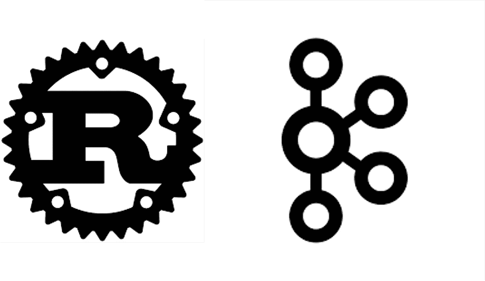

# 初始设置

确保你安装了一个 Kafka 代理——本地安装就足够了。当然，你也需要安装[Rust](https://www.rust-lang.org/tools/install)——你需要[1.45 或更高版本](https://github.com/fede1024/rust-rdkafka#minimum-supported-rust-version-msrv)

在开始之前，克隆 GitHub repo:

```
git clone https://github.com/abhirockzz/rust-kafka-101
cd part1
```

检查`Cargo.toml`文件:

```
...
[dependencies]
rdkafka = { version = "0.25", features = ["cmake-build"] }
...
```

**上注** `**cmake-build**` **特征**

`rust-rdkafka`提供了几种解决`librdkafka`依赖的方法。我选择了`static`链接，其中`librdkafka`是编译的。您可以选择`dynamic`链接来引用本地安装的版本。

> *更多请参考此链接*[](https://github.com/fede1024/rust-rdkafka/blob/master/rdkafka-sys/README.md#features)

*好的，让我们从基础开始。*

# *简单生产者*

*下面是一个基于 [BaseProducer](https://docs.rs/rdkafka/0.26.0/rdkafka/producer/struct.BaseProducer.html) 的简单生成器:*

*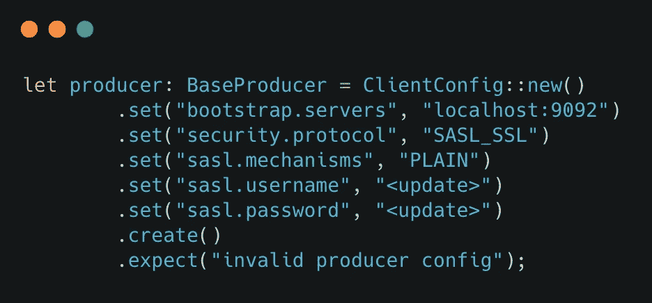*

*开始生成消息的`send`方法——它是在紧密的`loop`中完成的，中间有一个`thread::sleep`(*而不是*您在生产中会做的事情)以便更容易跟踪/遵循结果。键、值(`payload`)和目的地 Kafka 主题以 [BaseRecord](https://docs.rs/rdkafka/0.26.0/rdkafka/producer/struct.BaseRecord.html) 的形式表示*

*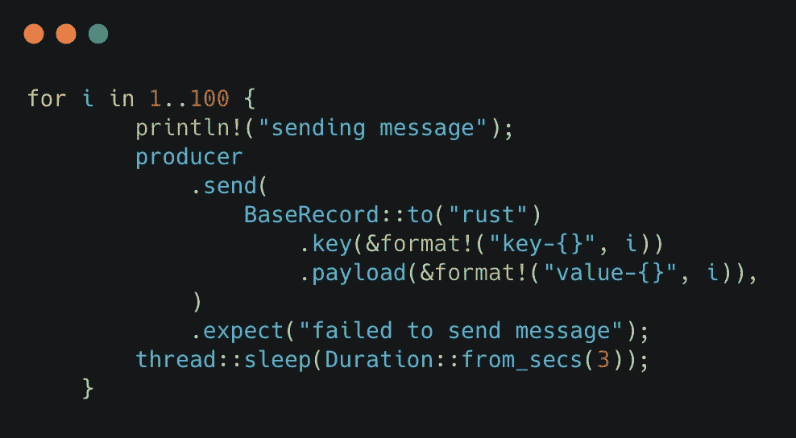*

> **你可以在*文件中查看整个代码`*src/1_producer_simple.rs*`*

## *要测试生产者是否在工作…*

*运行程序:*

*   *只需将文件`src/1_producer_simple.rs`重命名为`main.rs`*
*   *执行`cargo run`*

*您应该会看到以下输出:*

```
*sending message
sending message
sending message
...*
```

***到底怎么回事？**要解决这个问题——使用 Kafka CLI 消费者(或任何其他消费者客户端，例如`kafkacat`)连接到您的 Kafka 主题(在上面的示例中，我使用`rust`作为 Kafka 主题的名称)。您应该会看到消息不断流入。*

*例如:*

```
*&KAFKA_HOME/bin/kafka-console-consumer.sh --bootstrap-server localhost:9092 --topic rust --from-beginning*
```

# *生产者回拨*

*我们现在是盲目飞行！除非我们明确地创建一个消费者来查看我们的消息，否则我们不知道它们是否被发送到卡夫卡那里。让我们通过实现一个 [ProducerContext](https://docs.rs/rdkafka/0.26.0/rdkafka/producer/trait.ProducerContext.html) (trait)来挂钩到生产事件来解决这个问题——这就像一个回调。*

*首先为 [ClientContext](https://docs.rs/rdkafka/0.26.0/rdkafka/client/trait.ClientContext.html) 特征创建一个`struct`和一个空实现(这是强制性的)。*

*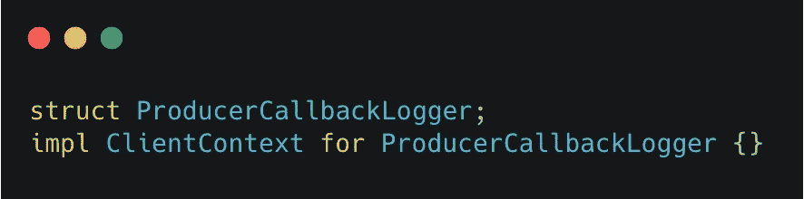*

*现在到了主要部分，我们在`ProducerContext`特征中实现了`delivery`功能。*

*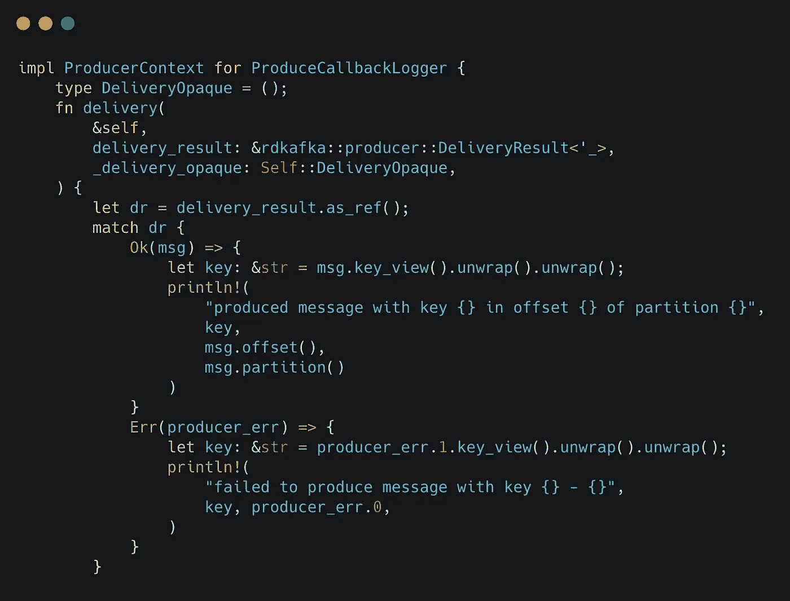*

*我们对照 [DeliveryResult](https://docs.rs/rdkafka/0.26.0/rdkafka/producer/type.DeliveryResult.html) (毕竟是一个`Result`)来说明成功(`Ok`)和失败(`Err`)场景。我们所做的只是简单地记录这两种情况下的消息，因为这只是一个例子。在这里你可以做任何你想做的事情(但是不要发疯！)*

> **我们忽略了*[*delivery opaque*](https://docs.rs/rdkafka/0.26.0/rdkafka/producer/trait.ProducerContext.html#associatedtype.DeliveryOpaque)*，它是* `*ProducerContext*` *trait* 的关联类型*

*我们需要确保插入我们的`ProducerContext`实现。我们通过使用 [create_with_context](https://docs.rs/rdkafka/0.26.0/rdkafka/config/struct.ClientConfig.html#method.create_with_context) 方法(而不是 [create](https://docs.rs/rdkafka/0.26.0/rdkafka/config/struct.ClientConfig.html#method.create) )来做到这一点，并确保为`BaseProducer`提供正确的类型。*

```
*let producer: BaseProducer<ProduceCallbackLogger> = ClientConfig::new().set(....)
...
.create_with_context(ProduceCallbackLogger {})
...*
```

## *“回调如何被调用”？*

*好了，我们已经实现了，但是我们需要一种方法来*触发*它！方法之一是在生产者上调用 [flush](https://docs.rs/rdkafka/0.26.0/rdkafka/producer/struct.BaseProducer.html#method.flush) 。所以，我们可以这样写我们的生产者:*

*   *添加`producer.flush(Duration::from_secs(3));`，以及*
*   *评论`sleep`(只是暂时的)*

*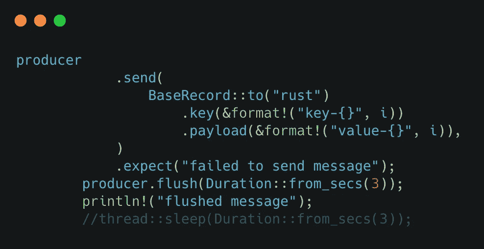*

## *坚持住，我们可以做得更好！*

*`send`方法是非阻塞的(默认)，但是通过在每个`send`之后调用`flush`，我们现在已经将它转换为同步调用- *，而不是从性能角度推荐的*。*

*我们可以通过使用[螺纹加工器](https://docs.rs/rdkafka/0.26.0/rdkafka/producer/struct.ThreadedProducer.html)来改善这种情况。它负责在后台线程中调用 [poll](https://docs.rs/rdkafka/0.26.0/rdkafka/producer/base_producer/struct.BaseProducer.html#method.poll) 方法，以确保交付回调通知被交付。这样做非常简单——只需将类型从`BaseProducer`改为`ThreadedProducer`！*

```
*# before: BaseProducer<ProduceCallbackLogger>
# after: ThreadedProducer<ProduceCallbackLogger>*
```

*同样，我们不再需要调用`flush`。*

```
*...
//producer.flush(Duration::from_secs(3));
//println!("flushed message");
thread::sleep(Duration::from_secs(3));
...*
```

> **该代码在* `*src/2_threaded_producer.rs*`中可用*

## *再次运行程序*

*   *将文件`src/2_threaded_producer.rs`重命名为`main.rs`并*
*   *执行`cargo run`*

*输出:*

```
*sending message
sending message
produced message with key key-1 in offset 6 of partition 2
produced message with key key-2 in offset 3 of partition 0
sending message
produced message with key key-3 in offset 7 of partition* 
```

*正如预期的那样，您应该能够看到生产者事件回调，这表明消息确实被发送到了 Kafka 主题。当然，你可以直接连接到主题并仔细检查，就像之前一样:*

```
*&KAFKA_HOME/bin/kafka-console-consumer.sh --bootstrap-server localhost:9092 --topic rust --from-beginning*
```

> **为了尝试一个失败场景，尝试使用一个不正确的主题名，并注意* `*delivery*` *实现的* `*Err*` *变体是如何被调用的。**

# *发送 JSON 消息*

*到目前为止，我们只是发送`String`作为键和值。JSON 是一种常用的消息格式，让我们看看如何使用它。*

*假设我们想要发送将使用这个`struct`表示的`User`信息:*

*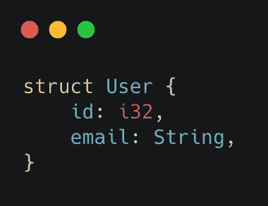*

*然后我们可以使用 [serde_json](https://docs.serde.rs/serde_json/) 库将其序列化为 json。我们所需要的就是使用 serde — `Deserialize`和`Serialize`中的[自定义派生](https://serde.rs/derive.html)*

*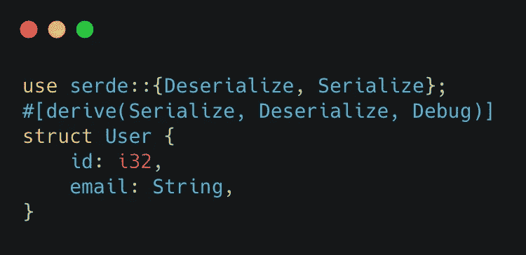*

*更改生产者循环:*

*   *创建一个`User`实例*
*   *使用 [to_string_pretty](https://docs.serde.rs/serde_json/fn.to_string_pretty.html) 将其序列化为 JSON 字符串*
*   *包括在有效载荷中*

*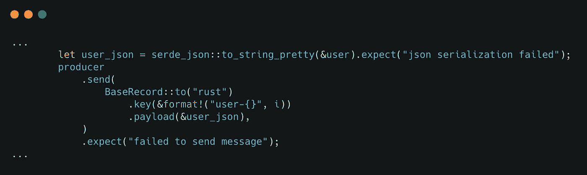*

> **你也可以用*[*to _ vec*](https://docs.serde.rs/serde_json/fn.to_vec.html)*(而不是* `*to_string()*` *)将其转换成一个* `*Vec*` *的字节(* `*Vec<u8>*` *)**

## *要运行该程序…*

*   *将文件`src/3_JSON_payload.rs`重命名为`main.rs`，并且*
*   *执行`cargo run`*

*从话题消费:*

```
*&KAFKA_HOME/bin/kafka-console-consumer.sh --bootstrap-server localhost:9092 --topic rust --from-beginning*
```

*您应该看到带有`String`键(例如`user-34`)和 JSON 值的消息:*

```
*{
  "id": 34,
  "email": "user-34@foobar.com"
}*
```

## *有没有更好的办法？*

*是啊！如果您习惯于 Kafka Java 客户端中的声明式序列化/反序列化方法(可能其他客户端也是如此)，您可能不喜欢这种“显式”方法。为了客观地看待问题，在 Java 中应该这样做:*

*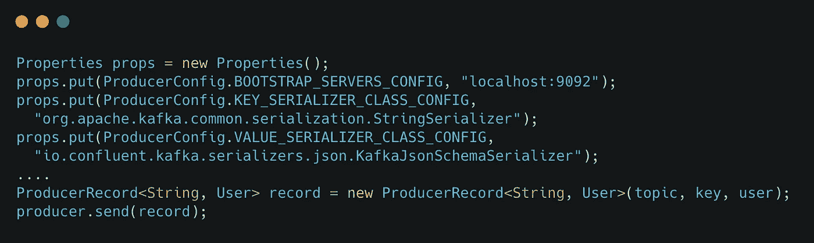*

> **请注意，您只需配置* `*Producer*` *来使用* `*KafkaJsonSchemaSerializer*` *并且* `*User*` *类被序列化为 JSON**

*`rust-rdkafka`提供了与 [ToBytes](https://docs.rs/rdkafka/0.26.0/rdkafka/message/trait.ToBytes.html) 特征相似的东西。它看起来是这样的:*

*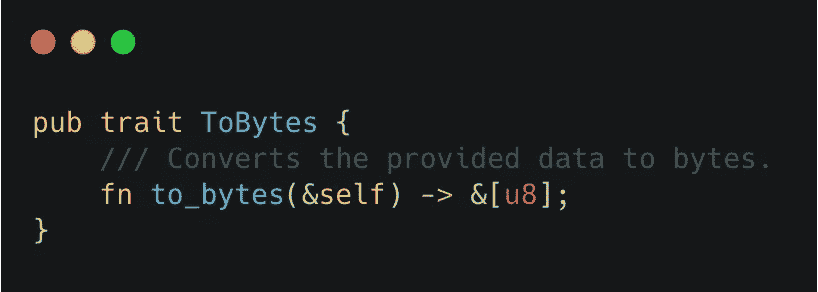*

*不言自明，对吗？`String`、`Vec<u8>`等已有实现。因此，您可以使用这些类型作为键或值，而无需任何额外的工作——这正是我们刚才所做的。但问题是我们使用的*方式*是“显式的”,即我们将`User`结构转换成 JSON 字符串并传递它。*

***如果我们能将** `**ToBytes**` **实现为** `**User**` **会怎么样？***

*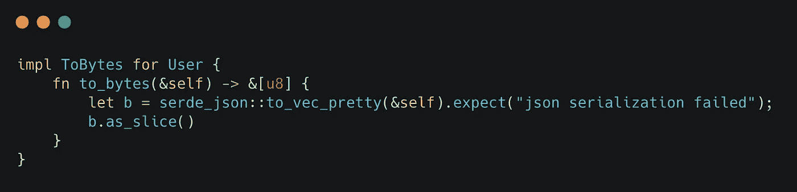*

*您将看到一个编译器错误:*

```
*cannot return value referencing local variable `b`
returns a value referencing data owned by the current function*
```

> **其他背景请参考本【GitHub 问题】(*[*https://github.com/fede1024/rust-rdkafka/issues/128*](https://github.com/fede1024/rust-rdkafka/issues/128)*)。我很乐意看到一个可以与* `*ToBytes*` *一起工作的例子——如果你对此有意见，请留言！**

*TL；DR 就是最好坚持“显式”的做事方式，除非你有一个“不涉及分配并且不会失败”的`ToBytes`实现。*

# *包裹*

*第一部分到此为止！第 2 部分将涵盖围绕卡夫卡消费者的主题。*