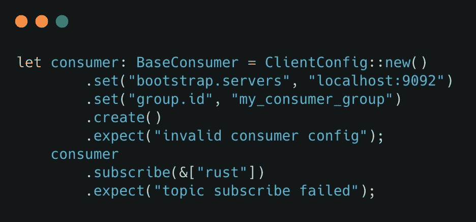
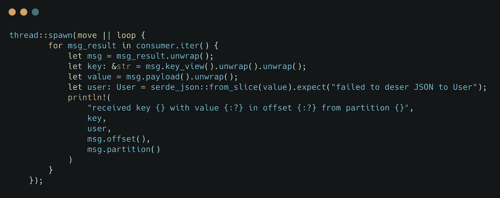
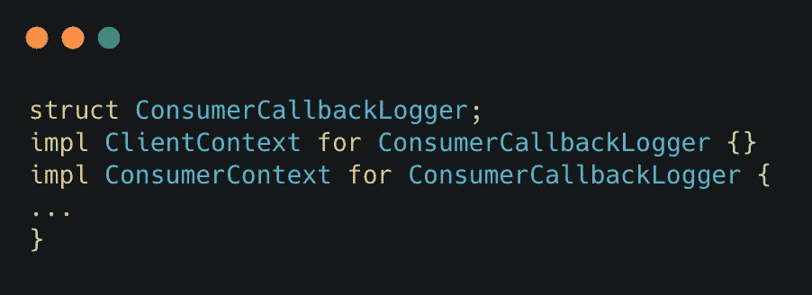
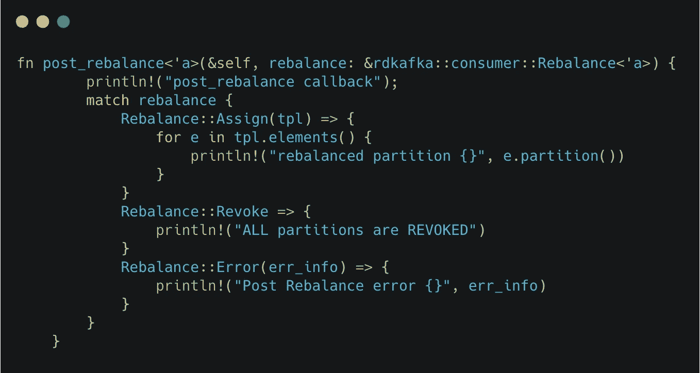
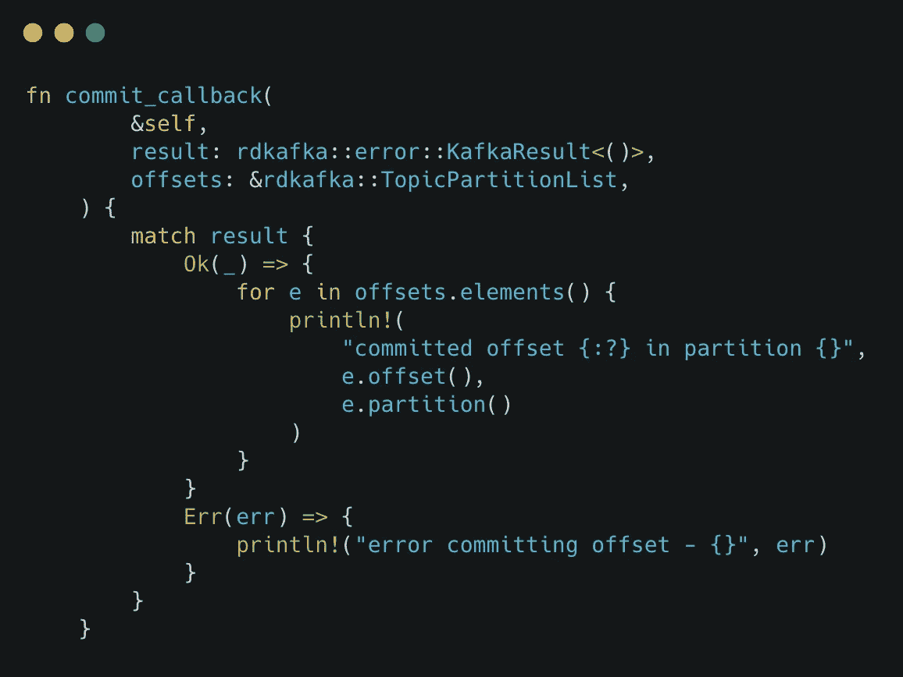
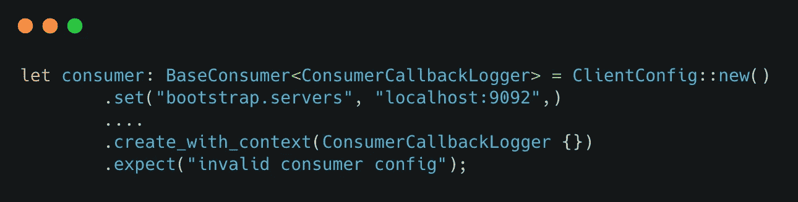
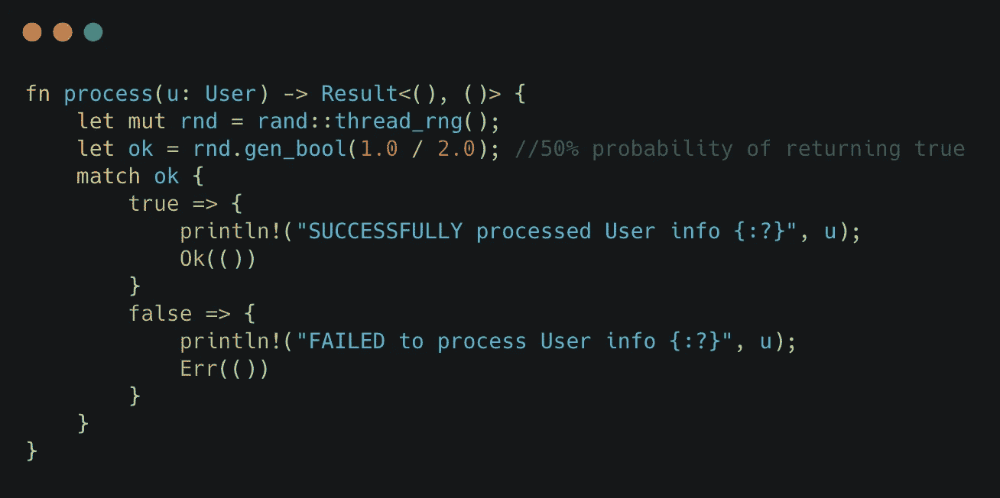
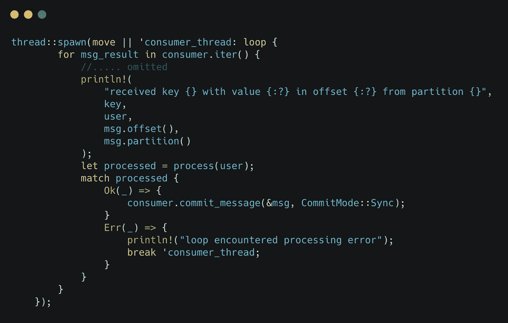

# 卡夫卡与鲁斯特入门:第 2 部分

> 原文：<https://itnext.io/getting-started-with-kafka-and-rust-part-2-129c372dc1ad?source=collection_archive---------2----------------------->

## 一个实践指南，教你如何使用 Rust 编程语言与 Kafka 进行交互

这是一个由两部分组成的系列，帮助您开始了解 Rust 和 Kafka。我们将使用 [rust-rdkafka](https://github.com/fede1024/rust-rdkafka/) 机箱，它本身基于 [librdkafka](https://github.com/edenhill/librdkafka) ( `C`库)。

在本帖中，我们将介绍 Kafka 消费者 API。

这是第一部分:

[](https://abhishek1987.medium.com/getting-started-with-kafka-and-rust-part-1-e0074961ec6b) [## 卡夫卡与鲁斯特入门:第 1 部分

### 一个实践指南，教你如何使用 Rust 编程语言与 Kafka 进行交互

abhishek1987.medium.com](https://abhishek1987.medium.com/getting-started-with-kafka-and-rust-part-1-e0074961ec6b) 

# 初始设置

确保你安装了一个 Kafka 代理——本地安装就足够了。当然，你也需要安装[Rust](https://www.rust-lang.org/tools/install)——你需要[1.45 或更高版本](https://github.com/fede1024/rust-rdkafka#minimum-supported-rust-version-msrv)

在开始之前，克隆 GitHub repo:

```
git clone https://github.com/abhirockzz/rust-kafka-101
cd part2
```

# 简单消费者

创建一个低级消费者( [BaseConsumer](https://docs.rs/rdkafka/0.26.0/rdkafka/consumer/struct.BaseConsumer.html) )与创建它的对应者——[base producer](https://docs.rs/rdkafka/0.26.0/rdkafka/producer/struct.BaseProducer.html)惊人地相似。唯一的区别是，您必须将输出转换为正确的类型(在本例中是`BaseConsumer`)



> *注意，* `*group.id*` *config 也被*`*.set("group.id", "my_consumer_group")*`*——其强制。*

一旦创建了一个`BaseConsumer`，用户就可以订阅一个或多个主题(在本例中，只有一个名为`rust`的主题)。

为了从主题中获取消息，我们启动( [spawn](https://doc.rust-lang.org/std/thread/fn.spawn.html) )一个新的`thread`:



它接受一个`closure`，在这种情况下恰好是一个无限的`loop`:

*   接收消息，
*   打印出键、值以及偏移量和分区信息

在消费者上调用 [iter](https://docs.rs/rdkafka/0.26.0/rdkafka/consumer/base_consumer/struct.BaseConsumer.html#method.iter) 只是调用`poll`的一种捷径，没有任何超时。

其他变化也是可能的。可以直接用`poll`:

```
loop {
  let message = consumer.poll(Duration::from_secs(2));
    ...
}
```

或者，使用以下格式:

```
for message in &consumer {
...
}
```

## 运行程序

*   将文件`src/1_consumer_simple.rs`重命名为`main.rs`，并且
*   执行`cargo run`

输出:

```
sending message
sending message
produced message with key user-1 in offset 25 of partition 2
produced message with key user-2 in offset 12 of partition 4
sending message
produced message with key user-3 in offset 20 of partition 0
received key user-3 with value User { id: 3, email: "user-3@foobar.com" } in offset 20 from partition 0
sending message
produced message with key user-4 in offset 24 of partition 3
received key user-4 with value User { id: 4, email: "user-4@foobar.com" } in offset 24 from partition 3
sending message
produced message with key user-5 in offset 25 of partition 3
received key user-5 with value User { id: 5, email: "user-5@foobar.com" } in offset 25 from partition 3
sending message
produced message with key user-6 in offset 26 of partition 3
received key user-6 with value User { id: 6, email: "user-6@foobar.com" } in offset 26 from partition 3
sending message
produced message with key user-7 in offset 27 of partition 3
received key user-7 with value User { id: 7, email: "user-7@foobar.com" } in offset 27 from partition 3
```

不出所料:

*   你会看到制作人的回电——确认信息被发送给了卡夫卡
*   消费者也收到了该消息，日志对此进行了确认

# 消费者回访怎么办？

是的，就像生产者一样，消费者 API 也有回调函数:

*   重新平衡
*   偏移提交

为此，我们需要实现 [ConsumerContext](https://docs.rs/rdkafka/0.26.0/rdkafka/consumer/trait.ConsumerContext.html) 特征。我们将:

*   定义一个`struct`
*   为`ClientContext`提供一个空的实现
*   从`ConsumerContext`trait-[pre _ rebalance](https://docs.rs/rdkafka/0.26.0/rdkafka/consumer/trait.ConsumerContext.html#method.pre_rebalance)， [post_rebalance](https://docs.rs/rdkafka/0.26.0/rdkafka/consumer/trait.ConsumerContext.html#method.post_rebalance) ， [commit_callback](https://docs.rs/rdkafka/0.26.0/rdkafka/consumer/trait.ConsumerContext.html#method.commit_callback) 中覆盖以下方法



> *我们将跳过* `*pre_rebalance*` *方法，重点关注本例中的*`*post_rebalance*`*:*



[再平衡](https://docs.rs/rdkafka/0.26.0/rdkafka/consumer/enum.Rebalance.html)是一个`enum`。作为实现的一部分，我们将它与所有可能的选项(分配的分区、撤销的分区、重新平衡错误)进行匹配，并简单地记录它。



对于提交回调事件，我们在 [KafkaResult](https://docs.rs/rdkafka/0.26.0/rdkafka/error/type.KafkaResult.html) (在`commit_callback`参数中可用)上进行匹配，以检查提交是否成功。如果是，我们只需打印出分区中提交的偏移量，或者记录提交过程中发生的错误。

完成后，我们只需插入新的实现:



为此，我们做了一些改变:

*   使用`create_with_context`(而不是`create`)
*   使用`BaseConsumer<ConsumerCallbackLogger>`

## 运行程序

*   将文件`src/2_consumer_callback.rs`重命名为`main.rs`，并且
*   执行`cargo run`

```
sending message
sending message
produced message with key user-1 in offset 0 of partition 2
post_rebalance callback
rebalanced partition 0
rebalanced partition 1
rebalanced partition 2
rebalanced partition 3
rebalanced partition 4
rebalanced partition 5
produced message with key user-2 in offset 0 of partition 4
sending message
produced message with key user-3 in offset 0 of partition 0
received key user-3 with value User { id: 3, email: "user-3@foobar.com" } in offset 0 from partition 0
sending message
committed offset Offset(1) in partition 0
committed offset Offset(1) in partition 4
produced message with key user-4 in offset 0 of partition 3
received key user-4 with value User { id: 4, email: "user-4@foobar.com" } in offset 0 from partition 3
```

正如所料，重新平衡事件与成功的提交一起被记录。

## 引发重新平衡

由于我们的`ConsumerContext`实现，当您启动应用程序时，分区分配第一次发生，您能够见证这一点。您也可以通过启动应用程序的新实例来再次触发重新平衡。由于在同一个使用者组中有两个实例，主题分区将被重新平衡。例如，如果主题中有`6`分区，它们将在这两个实例中平均分配。

您应该会看到类似以下内容的日志消息:

```
....
# instance 1
post_rebalance callback
rebalanced partition 0
rebalanced partition 1
rebalanced partition 2
...# instance 2
post_rebalance callback
rebalanced partition 3
rebalanced partition 4
rebalanced partition 5
```

# 切换到手动提交

默认情况下，偏移量提交过程由库本身负责。但是我们可以通过切换到手动模式对它进行更多的控制。

首先要做的是将`enable.auto.commit`设置为`false` - `set("enable.auto.commit", "false");`

## 至少一次交货

为了实现这一点，我们需要确保在提交偏移量之前*我们确实成功地处理了消息。为了模拟这一点，让我们编写一个可以随机失败的函数(名为`process`)。然后，我们将在我们的消费者循环中使用这个函数，当这个函数成功返回时，只提交*。**

**

*我们需要改变我们的消费圈*

*   *基于来自`process`功能的响应添加手动偏移提交*
*   *给我们的线程循环添加一个标签(`'consumer_thread`)*

**

*我们称之为`process`——这是为了模拟消费者收到的每个记录的处理。如果处理成功(返回`Ok`，我们使用 [commit_message](https://docs.rs/rdkafka/0.26.0/rdkafka/consumer/struct.BaseConsumer.html#method.commit_message) 提交记录。*

> *请注意，提交本身可能会失败。这最好在 `*ConsumerContext*`的 `*commit_callback*` *实现中处理**

## *运行程序*

*   *将文件`src/3_manual_commit.rs`重命名为`main.rs`，并且*
*   *执行`cargo run`*

*程序输出冗长，请多包涵。*

*输出:*

```
*produced message with key user-1 in offset 22 of partition 2
produced message with key user-2 in offset 28 of partition 4
post_rebalance callback
rebalanced partition 0
rebalanced partition 1
rebalanced partition 2
rebalanced partition 3
rebalanced partition 4
rebalanced partition 5
received key user-5 with value User { id: 5, email: "user-5@foobar.com" } in offset 52 from partition 3
SUCCESSFULLY processed User info User { id: 5, email: "user-5@foobar.com" }
committed offset Offset(53) in partition 3
received key user-2 with value User { id: 2, email: "user-2@foobar.com" } in offset 28 from partition 4
SUCCESSFULLY processed User info User { id: 2, email: "user-2@foobar.com" }
produced message with key user-3 in offset 35 of partition 0
committed offset Offset(29) in partition 4
received key user-1 with value User { id: 1, email: "user-1@foobar.com" } in offset 22 from partition 2
FAILED to process User info User { id: 1, email: "user-1@foobar.com" }
loop encountered processing error. closing consumer...
post_rebalance callback
ALL partitions have been REVOKED*
```

*注意`process`成功返回时的日志信息:*

1.  *从分区 3 的偏移量 52 中接收到值为用户{ id: 5，电子邮件:"[user-5@foobar.com](mailto:user-5@foobar.com)" }的密钥用户-5*
2.  *已成功处理用户信息用户{ id: 5，电子邮件:"[user-5@foobar.com](mailto:user-5@foobar.com)" }*
3.  *分区 3 中的提交偏移量 Offset(52)*

*对于故障场景:*

1.  *从分区 2 的偏移量 22 接收到值为 User { id: 1，email:"[user-1@foobar.com](mailto:user-1@foobar.com)" }的密钥 user-1*
2.  *无法处理用户{ id: 1，电子邮件:"[user-1@foobar.com](mailto:user-1@foobar.com)" }的用户信息*
3.  *循环遇到处理错误。关闭消费者…*

*当处理失败时，我们最终停止了消费者？这里的问题是:*

## *如何处理未被处理的消息？*

*请注意，失败可能由多种原因造成。其中一些是:*

*   *处理失败(这就是我们在本例中模拟的情况)，或者，*
*   *处理成功，但提交失败*

*如果我们在失败的消息后继续我们的消费者循环，我们可能会丢失消息(数据丢失)。**为什么？**这是因为`commit_message`方法也将较小的偏移量(小于正在处理的偏移量)标记为已提交。例如，如果您有一个场景，其中来自分区`5`的偏移量`20`未能被处理(和提交)，您继续处理并且来自分区`5`的偏移量`21`被成功处理和提交，您将最终丢失来自偏移量`20`的数据——这是因为提交偏移量`21`也将提交偏移量`20`和更低的偏移量。即使在您重新启动应用程序后，这也不会被检测到。*

## *为了防止这种情况…*

*您可以:*

*   *在检测到第一个故障后，暂停消费者进程。在本例中，我们通过退出消费者线程本身来实现这一点(尽管这对于现实世界的应用程序来说是不可接受的)。当您重新启动应用程序时，处理将从最后提交的偏移量开始，失败的消息将被拾取并重新处理。*
*   *更好的是——您可以在`commit_callback`中通过将这些数据发送到另一个可以单独处理的 Kafka 主题(也称为“死信主题”)来处理这个问题。*

# *其他考虑*

*这绝不是所有交付语义的详尽列表或覆盖范围:*

*   *我们没有报道`at-most once`和`exactly once`。*
*   *你可能想选择使用[异步](https://docs.rs/rdkafka/0.26.0/rdkafka/consumer/enum.CommitMode.html#variant.Async)提交模式——这有它自己的一套警告。*
*   *提交每一条消息(即使是异步的)都会带来开销。您可能希望成批提交消息/偏移量。和往常一样，您还需要处理许多棘手的问题。*

# *包裹*

*这就是关于使用`rust-rdkafka`库开始使用 Rust 和 Kafka 的两部分系列的全部内容！在这一部分中，我们讨论了:*

*   *简单的生产者*
*   *具有交付回调的生产者*
*   *如何发送 JSON 有效负载*
*   *基本消费者*
*   *处理重新平衡和偏移提交回调*
*   *探索手动提交和至少一次交付语义*