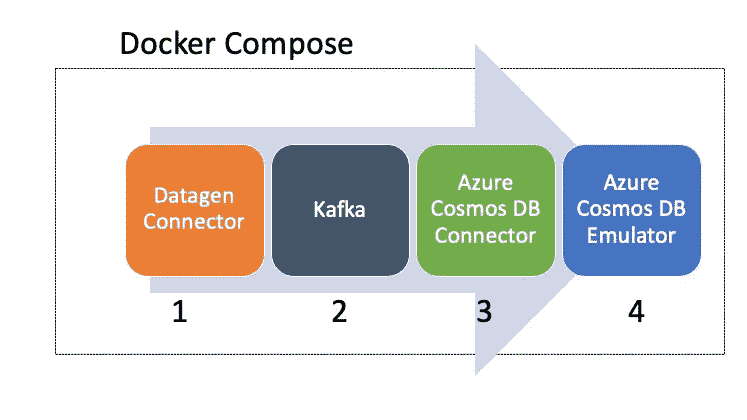
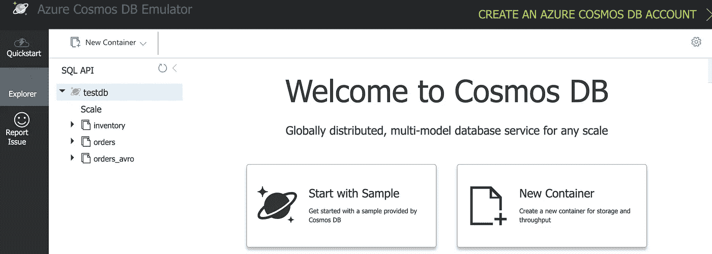
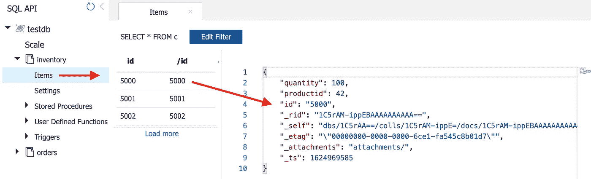
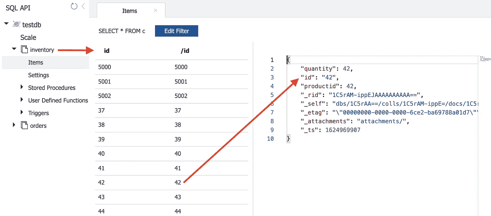
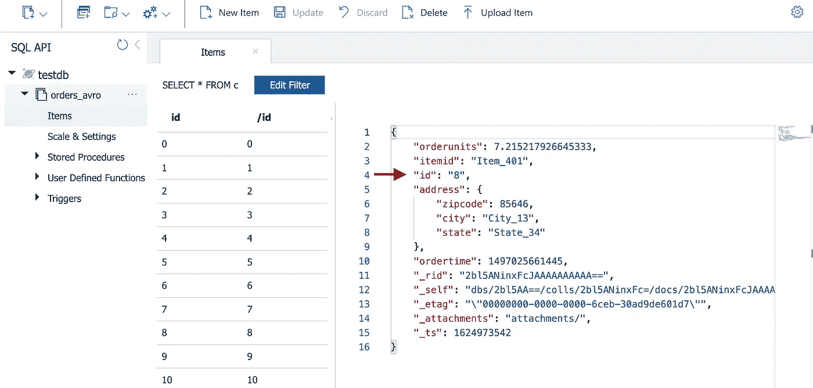

# 使用 Docker 开始使用 Kafka Connector for Azure Cosmos DB

> 原文：<https://itnext.io/getting-started-with-kafka-connector-for-azure-cosmos-db-using-docker-fc3e16936c58?source=collection_archive---------2----------------------->

## 学习 Kafka 和 Cosmos DB 的本地开发环境——不涉及任何成本！

在尝试一项新的服务或技术时，拥有一个本地开发环境是非常方便的。在这种情况下，码头工人已经成为事实上的选择。在您试图集成多个服务的场景中，它特别有用，并让您能够在每次运行之前从头开始。

这篇博客文章是 Kafka Connector for Azure Cosmos DB 的入门指南。所有组件(包括 Azure Cosmos DB)都将在您的本地机器上运行，这得益于:

*   Azure Cosmos DB Linux 模拟器，可以用于本地开发和测试目的，无需创建 Azure 订阅或产生任何成本。
*   并且， [Docker Compose](https://docs.docker.com/compose/) 是一个用于定义和运行多容器 Docker 应用的工具。它将编排我们的设置所需的所有组件，包括 Azure Cosmos DB 模拟器、Kafka、Zookeeper、Kafka 连接器等。



端到端工作流

为了使事情变得简单，我们将选择单一的重点场景，并逐步进行:

*   步骤 0 —检查我们的设置是否正常的简单场景。
*   如何处理流 JSON 数据
*   如何处理与 Azure Cosmos DB 不兼容的流 JSON 数据
*   如何使用模式注册表处理 Avro 数据

> 假设您对 Kafka 很熟悉，并且对 Kafka Connect 有所了解

# 首先要做的是…

…这里是 Azure Cosmos DB 模拟器和 Kafka 连接器的快速概述。

Azure Cosmos DB 连接器允许您在 Azure Cosmos DB 和 Kafka 之间移动数据。它既可以作为源，也可以作为汇。Azure Cosmos DB 接收器连接器将数据从 Kafka 主题写入 Azure Cosmos DB 容器，源连接器将更改从 Azure Cosmos DB 容器写入 Kafka 主题。在写入时，连接器处于`pre-production`模式。你可以在 [GitHub repo](https://github.com/microsoft/kafka-connect-cosmosdb) 上了解更多信息，或者从[汇流中心](https://www.confluent.io/hub/microsoftcorporation/kafka-connect-cosmos)安装/下载。

[Azure Cosmos DB Linux 模拟器](https://docs.microsoft.com/azure/cosmos-db/linux-emulator?tabs=ssl-netstd21&WT.mc_id=data-30458-abhishgu)提供了一个本地环境，它模拟 Azure Cosmos DB 服务用于开发目的(目前，它只支持 SQL API)。它提供了 Azure Cosmos DB 服务的高保真仿真，并支持创建数据、查询数据、提供和扩展容器以及执行存储过程和触发器等功能。

> 在撰写本文时，Azure Cosmos DB Linux 模拟器处于预览阶段。

你可以深入了解如何在 [macOS](https://docs.microsoft.com/azure/cosmos-db/linux-emulator?tabs=ssl-netstd21&WT.mc_id=data-30458-abhishgu#run-on-macos) 或 [Linux](https://docs.microsoft.com/azure/cosmos-db/linux-emulator?tabs=ssl-netstd21&WT.mc_id=data-30458-abhishgu#run-on-linux) 、[上使用模拟器](https://docs.microsoft.com/azure/cosmos-db/linux-emulator?tabs=ssl-netstd21&WT.mc_id=data-30458-abhishgu#differences-between-the-linux-emulator-and-the-cloud-service)与 Azure Cosmos DB 云服务有什么不同[解决问题](https://docs.microsoft.com/azure/cosmos-db/linux-emulator?tabs=ssl-netstd21&WT.mc_id=data-30458-abhishgu#troubleshoot-issues)等等。

# 开始之前…

确保您已经安装了[对接器](https://docs.docker.com/engine/install/)和[对接器组合](https://docs.docker.com/compose/install/)。

另外，从 GitHub 克隆项目:

```
git clone [https://github.com/Azure-Samples/cosmosdb-kafka-connect-docker](https://github.com/Azure-Samples/cosmosdb-kafka-connect-docker)
cd cosmosdb-kafka-connect-docker
```

# 启动所有服务

所有组件都在 [docker-compose](https://github.com/Azure-Samples/cosmosdb-kafka-connect-docker) 文件中定义:

*   Azure Cosmos DB 模拟器
*   卡夫卡和动物园管理员
*   Azure Cosmos DB 和 Datagen 连接器(作为单独的 Kafka Connect workers 运行)
*   融合模式注册表

多亏了 Docker Compose，只需一个命令就可以启动环境。第一次运行时，下载容器可能需要一段时间(后续执行会更快)。或者，您也可以在启动 Docker Compose 之前单独下载图像:

```
(optional)
docker pull confluentinc/cp-zookeeper:latest
docker pull confluentinc/cp-kafka:latest
docker pull confluentinc/cp-schema-registry:latest
```

要启动所有服务:

```
docker-compose -p cosmosdb-kafka-docker up --build
```

几分钟后，检查容器:

```
docker-compose -p cosmosdb-kafka-docker ps
```

一旦所有的服务都启动并运行，下一个合乎逻辑的步骤就是安装连接器，对吗？嗯，有几件事我们需要处理。对于连接到 Azure Cosmos DB 模拟器的 Java 应用程序，您需要在 Java 证书存储库中安装[证书。在这种情况下，我们将把证书从 Azure Cosmos DB 模拟器容器植入 Cosmos DB Kafka Connect 容器。](https://docs.microsoft.com/azure/cosmos-db/local-emulator-export-ssl-certificates?WT.mc_id=data-30458-abhishgu#use-the-certificate-with-java-apps)

> 虽然这个过程可以自动化，但我是手动完成的，以便把事情搞清楚。

# 配置 Azure Cosmos DB 模拟器证书

执行此命令将证书存储在 Java 证书存储中(使用`docker exec`):

```
docker exec --user root -it cosmosdb-kafka-docker_cosmosdb-connector_1 /bin/bash# execute the below command inside the container
curl -k [https://cosmosdb:8081/_explorer/emulator.pem](https://cosmosdb:8081/_explorer/emulator.pem) > ~/emulatorcert.crt && keytool -noprompt -storepass changeit -keypass changeit -keystore /usr/lib/jvm/zulu11-ca/lib/security/cacerts -importcert -alias emulator_cert -file ~/emulatorcert.crt
```

> 您应该会看到以下输出——证书被添加到密钥库

在我们继续之前，还有最后一件事…

# 创建 Azure Cosmos DB 数据库和容器

访问位于[https://localhost:8081/_ explorer/index . html](https://localhost:8081/_explorer/index.html)的 Azure Cosmos DB 模拟器门户，并创建以下资源:

*   名为`testdb`的数据库
*   集装箱— `inventory`、`orders`、`orders_avro`(确保所有集装箱的分区键都是`/id`)



Azure Comos DB 本地仿真器

# 让我们探索所有的场景

首先，让我们看一下基本场景。在尝试其他东西之前，我们想确保一切都正常。

## 1.你好世界！

启动 Cosmos DB 的库存数据连接器:

```
curl -X POST -H "Content-Type: application/json" -d @cosmosdb-inventory-connector_1.json [http://localhost:8083/connectors](http://localhost:8083/connectors)# to check the connector status
curl [http://localhost:8083/connectors/inventory-sink/status](http://localhost:8083/connectors/inventory-sink/status)
```

为了测试端到端流，向 Kafka 中的`inventory_topic`主题发送几条记录:

```
docker exec -it kafka bash -c 'cd /usr/bin && kafka-console-producer --topic inventory_topic --bootstrap-server kafka:29092'
```

一旦提示准备就绪，就逐个发送 JSON 记录:

```
{"id": "5000","quantity": 100,"productid": 42}
{"id": "5001","quantity": 99,"productid": 43}
{"id": "5002","quantity": 98,"productid": 44}
```

检查 Cosmos DB 容器，确认记录是否已保存。导航到门户[https://localhost:8081/_ explorer/index . html](https://localhost:8081/_explorer/index.html)并检查`inventory`容器:



好了，成功了！让我们继续做一些稍微有用的事情。在继续之前，删除`inventory`连接器。

```
curl -X DELETE [http://localhost:8083/connectors/inventory-sink/](http://localhost:8083/connectors/inventory-sink/)
```

## 2.将流数据(JSON 格式)从 Kafka 同步到 Azure Cosmos DB

对于剩余的场景，我们将使用一个生产者组件来生成记录。这个 [Kafka Connect Datagen 连接器](https://github.com/confluentinc/kafka-connect-datagen)是我们的朋友。它是用来生成模拟数据进行测试的，所以让我们好好利用它吧！

启动 Azure Cosmos DB 连接器的一个实例:

```
curl -X POST -H "Content-Type: application/json" -d @cosmosdb-inventory-connector_2.json [http://localhost:8083/connectors](http://localhost:8083/connectors)# to check the connector status
curl [http://localhost:8083/connectors/inventory-sink/status](http://localhost:8083/connectors/inventory-sink/status)
```

准备就绪后，继续启动 Datagen 连接器，它将生成 JSON 格式的模拟库存数据:

```
curl -X POST -H "Content-Type: application/json" -d @datagen-inventory-connector.json [http://localhost:8080/connectors](http://localhost:8080/connectors)# to check the connector status
curl [http://localhost:8080/connectors/datagen-inventory/status](http://localhost:8080/connectors/datagen-inventory/status)
```

> 注意，我们对 Datagen 连接器使用端口 8080，因为它运行在一个单独的 Kafka Connect 容器中

要查看 Datagen 连接器产生的数据，请查看`inventory_topic1` Kafka 主题:

```
docker exec -it kafka bash -c 'cd /usr/bin && kafka-console-consumer --topic inventory_topic1 --bootstrap-server kafka:29092'
```

请注意数据(在您的案例中可能有所不同):

```
{"id":5,"quantity":5,"productid":5}
{"id":6,"quantity":6,"productid":6}
{"id":7,"quantity":7,"productid":7}
...
```

请注意，id 是一个整数值

检查 Azure Cosmos DB 容器以确认记录是否已保存。导航到门户[https://localhost:8081/_ explorer/index . html](https://localhost:8081/_explorer/index.html)并检查`inventory`容器:



库存容器中的数据

Cosmos DB 中的记录有一个数据类型为`String`的`id`属性。Kafka 主题中的原始数据有一个类型为`Integer`的`id`属性——但这不会起作用，因为 [Azure Cosmos DB 要求](https://docs.microsoft.com/rest/api/cosmos-db/documents?WT.mc_id=data-30458-abhishgu) `[id](https://docs.microsoft.com/rest/api/cosmos-db/documents?WT.mc_id=data-30458-abhishgu)` [是唯一的用户定义字符串](https://docs.microsoft.com/rest/api/cosmos-db/documents?WT.mc_id=data-30458-abhishgu)。这种转换是通过 [Kafka Connect 转换](https://docs.confluent.io/platform/current/connect/transforms/cast.html)–`Cast`将字段(或整个键或值)更新为特定的类型，更新模式(如果存在的话)来实现的。

以下是[连接器配置](https://github.com/Azure-Samples/cosmosdb-kafka-connect-docker/blob/master/cosmosdb-inventory-connector_2.json#L15)中实现这一功能的部分:

```
"transforms": "Cast",
"transforms.Cast.type": "org.apache.kafka.connect.transforms.Cast$Value",
"transforms.Cast.spec": "id:string"
```

在继续之前，删除 Cosmos DB 和 Datagen `inventory`连接器。

```
curl -X DELETE [http://localhost:8080/connectors/datagen-inventory](http://localhost:8080/connectors/datagen-inventory)
curl -X DELETE [http://localhost:8083/connectors/inventory-sink/](http://localhost:8083/connectors/inventory-sink/)
```

## 3.将流订单数据(JSON 格式)从 Kafka 推送到 Azure Cosmos DB

现在，让我们换一种方式，使用相同的数据(JSON 格式的)数据，但是稍加改动。我们将使用 Datagen 连接器的变体来生成模拟订单数据，并调整 Cosmos DB 连接器。

要安装 Azure Cosmos DB 连接器的不同实例:

```
curl -X POST -H "Content-Type: application/json" -d @cosmosdb-orders-connector_1.json [http://localhost:8083/connectors](http://localhost:8083/connectors)# to check the connector status
curl [http://localhost:8083/connectors/orders-sink/status](http://localhost:8083/connectors/orders-sink/status)
```

安装 Datagen 订单连接器:

```
curl -X POST -H "Content-Type: application/json" -d @datagen-orders-connector.json [http://localhost:8080/connectors](http://localhost:8080/connectors)# to check the connector status
curl [http://localhost:8080/connectors/datagen-orders/status](http://localhost:8080/connectors/datagen-orders/status)
```

要查看 Datagen 连接器产生的数据，请查看`orders` Kafka 主题:

```
docker exec -it kafka bash -c 'cd /usr/bin && kafka-console-consumer --topic orders_topic --bootstrap-server kafka:29092'
```

请注意数据(在您的案例中可能有所不同):

```
{"ordertime":1496251410176,"orderid":3,"itemid":"Item_869","orderunits":3.2897805449886226,"address":{"city":"City_99","state":"State_46","zipcode":50570}}{"ordertime":1500129505219,"orderid":4,"itemid":"Item_339","orderunits":3.6719921257659918,"address":{"city":"City_84","state":"State_55","zipcode":88573}}{"ordertime":1498873571020,"orderid":5,"itemid":"Item_922","orderunits":8.4506812669258,"address":{"city":"City_48","state":"State_66","zipcode":55218}}{"ordertime":1513855504436,"orderid":6,"itemid":"Item_545","orderunits":7.82561522361042,"address":{"city":"City_44","state":"State_71","zipcode":87868}}
...
```

我故意选择订单数据，因为它与库存数据不同。注意，Datagen 连接器生成的 JSON 记录有一个`orderid`属性(整数数据类型)，但是没有`id`属性——但是我们知道 Azure Cosmos DB 没有属性就无法工作。

检查 Cosmos DB 容器，确认记录是否已保存。导航到门户[https://localhost:8081/_ explorer/index . html](https://localhost:8081/_explorer/index.html)并检查`orders`容器:


注意，Azure Cosmos DB 中存储的记录中没有`orderid`属性。事实上，它已经被替换为`id`属性(带有一个`String`值)。这是通过[更换现场变压器](https://docs.confluent.io/platform/current/connect/transforms/replacefield.html)实现的。

以下是使这成为可能的[连接器配置](https://github.com/Azure-Samples/cosmosdb-kafka-connect-docker/blob/master/cosmosdb-orders-connector_1.json#L16)中的部件:

```
"transforms": "RenameField,Cast",
"transforms.RenameField.type": "org.apache.kafka.connect.transforms.ReplaceField$Value",
"transforms.RenameField.renames": "orderid:id",
"transforms.Cast.type": "org.apache.kafka.connect.transforms.Cast$Value",
"transforms.Cast.spec": "id:string"
```

> 根据您的使用情况，完全删除/重命名字段可能不是理想的解决方案。然而，知道有选择是好的。此外，请记住 Kafka topics 中的原始数据仍然在那里，没有被触动。其他下游应用程序仍然可以利用它。

在继续之前，删除 Cosmos DB 和 Datagen `inventory`连接器。

```
curl -X DELETE [http://localhost:8080/connectors/datagen-orders](http://localhost:8080/connectors/datagen-orders)
curl -X DELETE [http://localhost:8083/connectors/orders-sink/](http://localhost:8083/connectors/orders-sink/)
```

## 4.将流订单数据(AVRO 格式)从 Kafka 推送到 Azure Cosmos DB

到目前为止，我们讨论了 JSON，一种常用的数据格式。但是， [Avro](https://avro.apache.org/) 由于其紧凑的格式导致更好的性能和成本节约，在生产中被大量使用。为了更容易处理`Avro`数据模式，有[汇合模式注册表](https://docs.confluent.io/platform/current/schema-registry/index.html)，它为元数据提供了一个服务层，并提供了一个 RESTful 接口来存储和检索 Avro(以及 JSON 和 Protobuf 模式)。为了这篇博文的目的，我们将使用 Docker 版本。

安装一个可以处理`Avro`数据的 Azure Cosmos DB 连接器的新实例:

```
curl -X POST -H "Content-Type: application/json" -d @cosmosdb-orders-connector_2.json [http://localhost:8083/connectors](http://localhost:8083/connectors)# to check the connector status
curl [http://localhost:8083/connectors/orders-sink/status](http://localhost:8083/connectors/orders-sink/status)
```

安装 Datagen 连接器，该连接器将生成`Avro`格式的模拟订单数据:

```
curl -X POST -H "Content-Type: application/json" -d @datagen-orders-connector-avro.json [http://localhost:8080/connectors](http://localhost:8080/connectors)# to check the connector status
curl [http://localhost:8080/connectors/datagen-orders/status](http://localhost:8080/connectors/datagen-orders/status)
```

要查看 Datagen 连接器生成的`Avro`数据，请查看`orders_avro_topic` Kafka 主题:

```
docker exec -it kafka bash -c 'cd /usr/bin && kafka-console-consumer --topic orders_avro_topic --bootstrap-server kafka:29092'
```

由于`Avro`的数据是二进制格式，它不是人类可读的:

```
�����VItem_185lqf�@City_61State_73��
����WItem_219[�C��@City_74State_77��
�����VItem_7167Ix�dF�?City_53State_53��
���֩WItem_126*���?@City_58State_21��
�����VItem_329X�2,@City_49State_79��
�����XItem_886��>�|�@City_88State_27��
��V Item_956�r#�!@City_45State_96��
�ѼҕW"Item_157E�)$���?City_96State_63��
...
```

检查 Cosmos DB 容器，确认记录是否已保存。导航到门户[https://localhost:8081/_ explorer/index . html](https://localhost:8081/_explorer/index.html)并检查`orders_avro`容器:



*订单 _avro* 容器中的数据

太好了，事情按预期进行！[连接器配置](https://github.com/Azure-Samples/cosmosdb-kafka-connect-docker/blob/master/cosmosdb-orders-connector_2.json)已更新以处理此问题:

```
"value.converter": "io.confluent.connect.avro.AvroConverter",
"value.converter.schemas.enable": "true",
"value.converter.schema.registry.url": "http://schema-registry:8081",
...
```

变化包括选择`AvroConverter`，启用模式并指向模式注册中心(在我们的例子中，在 Docker 中本地运行)。

这就是这篇博文中涵盖的所有用例。我们只讨论了 Sink 连接器，但是可以自由地进一步探索和实验！例如，您可以扩展当前的设置以包含源连接器，并将其配置为将记录从 Azure Cosmos DB 容器发送到 Kafka。

# 打扫

完成后，您可以删除连接器:

```
curl -X DELETE [http://localhost:8080/connectors/datagen-orders](http://localhost:8080/connectors/datagen-orders)
curl -X DELETE [http://localhost:8083/connectors/orders-sink/](http://localhost:8083/connectors/orders-sink/)
```

要停止所有 Docker 组件:

```
docker-compose -p cosmosdb-kafka-docker down -v
```

# 结论

尽管我们出于演示的目的讨论了简单的场景，但是它将展示如何利用现成的解决方案(连接器、转换器、模式注册中心等)。)并专注于基于 Azure Cosmos DB 的应用程序或数据管道所需的繁重工作。由于这个例子采用了基于 Docker 的方法进行本地开发，所以它是有成本效益的(嗯，免费！)并可根据您的需求轻松定制。

对于生产场景，您需要设置、配置和操作这些连接器。Kafka Connect workers 只是简单的 JVM 进程，因此本质上是无状态的(所有的状态处理都被卸载给 Kafka)。在整体架构和编排方面有很大的灵活性——例如，您可以在 Kubernetes 中运行它们以实现容错和可伸缩性。