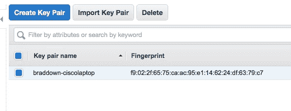
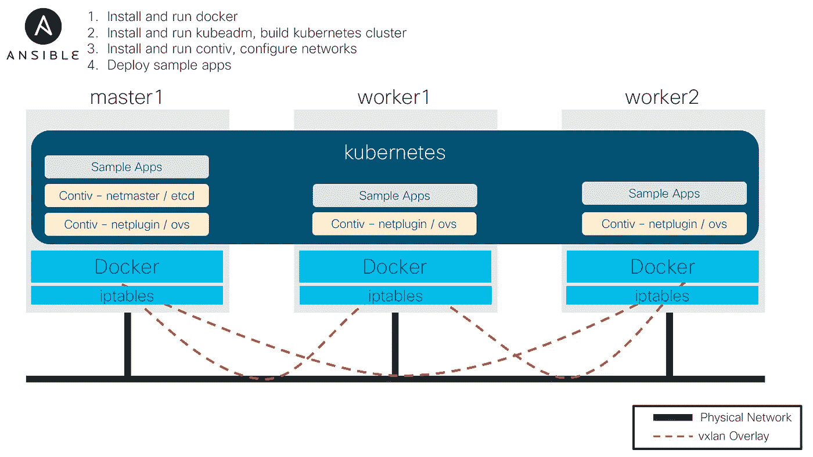

# 使用 Ansible 和 Terraform 开始使用 kubernetes

> 原文：<https://itnext.io/getting-started-with-kubernetes-using-ansible-and-terraform-741e6bb6ad7a?source=collection_archive---------0----------------------->

[*点击这里在 LinkedIn* 上分享这篇文章](https://www.linkedin.com/cws/share?url=https%3A%2F%2Fitnext.io%2Fgetting-started-with-kubernetes-using-ansible-and-terraform-741e6bb6ad7a)

所以，你想开始玩 kubernetes，因为*嘿，为什么不*。您总是可以在您的桌面上本地运行 [Minikube](https://kubernetes.io/docs/getting-started-guides/minikube/) ，但是这只是一个单节点集群。我想运行一个多节点集群，对我来说，这就是看到它，感受它；这样我学得更好。构建和运行 kubernetes 集群不是我的日常工作，所以我需要一种方法来理解所有宣传的内容。

***警告*** *:这不是一个生产部署。与完整的生产部署相比，这种安装有许多缺点。*

***提示*** *:大部分都是基于从我的 Mac 上运行。下面使用的一切都是独立于平台的，但是可能需要对本地运行的脚本进行一些调整。*

下面是基本流程:(我将在下面详细介绍所有这些步骤。)

1.  注册一个 AWS 账户，然后[创建一个访问密钥。](https://docs.aws.amazon.com/general/latest/gr/managing-aws-access-keys.html)
2.  下载 Terraform 并克隆[我的 git repo](https://github.com/magic7s/terraform_aws_spot_instance) 。运行此命令以调配 3 台主机。
3.  对于一个非常基本的安装，使用这个 [ansible 脚本](https://github.com/ben-st/ansible-kubeadm)。我有一个更复杂的应用程序，它安装了一些示例应用程序，并使用 Contiv 进行容器分段。我的可回答的脚本在这里，我将浏览它们。

TL；这个职位的博士在这里。

```
git clone [https://github.com/magic7s/terraform_aws_spot_instance.git](https://github.com/magic7s/terraform_aws_spot_instance.git)
cd terraform_aws_spot_instance
terraform init
terraform apply
cd ..
git clone [https://github.com/magic7s/ansible-kubeadm-contiv.git](https://github.com/magic7s/ansible-kubeadm-contiv.git)
cd ansible-kubeadm-contiv
# Edit inventory file with public ip addresses from terraform output
ansible-playbook -i inventory site.yml
```


要调配的 AWS 环境的基本示意图

# 使用 Terraform 提供基础设施

做同样的事情可能有十几种方法。我选择 Terraform 在 AWS 中配置我的虚拟机。为什么？我很懒，不想一直点击 AWS 控制台来启动三个干净的虚拟机。我不得不这样做大约 100 次，因为在部署我的集群时，我总是想从头开始。此外，我想在不使用虚拟机时销毁(删除)它们，这样我就不用付费了。

我使用[现货实例](https://aws.amazon.com/ec2/spot/)，因为它们比正常价格低 90%。我可以花 0.0067 美元/小时得到一个 m3.medium (3.75G RAM)，有一些缺点；如果亚马逊想把价格提高到高于你的出价，他们会终止你的实例。此外，你不能关闭它，你只能重新启动它。

安装 Terraform 非常简单。它是为您的平台编译的二进制文件。从[https://www.terraform.io/downloads.html](https://www.terraform.io/downloads.html)下载并按照说明操作。我将文件复制到`/usr/local/bin/terraform` 中，这样我就可以从命令行的任何目录中运行它。

下载我的 git repo 和 terraform 脚本，在一个安全组中配置三台主机。[https://github.com/magic7s/terraform_aws_spot_instance](https://github.com/magic7s/terraform_aws_spot_instance)

查看[自述文件。MD](https://github.com/magic7s/terraform_aws_spot_instance/blob/master/README.md) 文件，了解如何为您定制脚本的更多信息。

您需要准备好您的 [AWS 访问密钥和秘密密钥](https://docs.aws.amazon.com/general/latest/gr/managing-aws-access-keys.html)。我建议您将它放在`~/.aws/credentials`中，它应该是这样的:

```
[default]aws_access_key_id = AAABBBBCCCDDDEEEFFFaws_secret_access_key = ABC123456%$^&*WWWMMMCCC33658
```

如果您安装了 [AWS CLI](https://docs.aws.amazon.com/cli/latest/userguide/installing.html) ，您可能已经完成了此操作。

一旦完成，你就可以运行`terraform init`。

```
macbook:terraform_aws_spot_instance brad$ terraform initInitializing provider plugins...
.... [lots of output omitted]Terraform has been successfully initialized!.... [lots of output omitted]
macbook:terraform_aws_spot_instance brad$
```

检查 k8s.tf 中的 aws 区域是否正确

```
variable "aws_region_name" { default = "us-west-2" }
```

您需要将您的 SSH 公钥预先上传或创建到您正在工作的 AWS 区域。下面是这样做的说明。您将需要 AWS 控制台上列出的密钥对的**名称**。



```
variable "ssh_key_name" {default = "braddown-csicolaptop"}
```

检查 k8s.tf 文件的其余部分，查看是否需要进行任何更改。

运行`terraform plan`

```
macbook:terraform_aws_spot_instance brad$ terraform plan
Refreshing Terraform state in-memory prior to plan...
The refreshed state will be used to calculate this plan, but will not be
persisted to local or remote state storage.data.external.myipaddr: Refreshing state...
data.aws_ami.ubuntu: Refreshing state...------------------------------------------------------------------------
.... [lots of output omitted]Plan: 7 to add, 0 to change, 0 to destroy.------------------------------------------------------------------------Note: You didn't specify an "-out" parameter to save this plan, so Terraform
can't guarantee that exactly these actions will be performed if
"terraform apply" is subsequently run.macbook:terraform_aws_spot_instance brad$
```

如果你得到任何关于`data.external.myipaddr`的错误，检查`./myipaddr.sh`是否在你的本地目录中运行。它应该产生类似于{"ip" : "68.231.198.92" }的结果，并且没有错误。如果这不起作用，尝试将其注释掉，并取消对另一行的注释。

```
data "external" "myipaddr" {# Pick one or the other. The second one requires an external script but uses DNS instead of https.#program = ["bash", "-c", "curl -s 'https://api.ipify.org?format=json'"]program = ["bash", "${path.module}/myipaddr.sh"]}
```

如果一切成功，运行`terraform apply`并在提示时回答是。

```
macbook:terraform_aws_spot_instance brad$ terraform apply
data.external.myipaddr: Refreshing state...
aws_security_group.k8s_sg: Refreshing state... (ID: sg-00dfd8ca76fe4e4f3)
data.aws_ami.ubuntu: Refreshing state...
aws_security_group_rule.allow_all_myip: Refreshing state... (ID: sgrule-2156153638)
aws_security_group_rule.allow_SG_any: Refreshing state... (ID: sgrule-104774467)
aws_security_group_rule.allow_all_egress: Refreshing state... (ID: sgrule-1753581355).... [lots of output omitted]Apply complete! Resources: 3 added, 0 changed, 0 destroyed.Outputs:master_ip = 54.218.25.205
worker_ips = [
    54.202.109.45,
    34.211.115.248
]
macbook:terraform_aws_spot_instance brad$
```

恭喜你现在有三个 spot 实例，运行最新的 ubuntu 16.04 ami。公共 IP 地址应该在底部输出。当我们转移到 Ansible 并安装 kubernetes 时，我们将需要这些。



通过 Ansible 部署配置

# 用 Ansible 安装 kubernetes

假设你已经安装了 [python](https://www.python.org/downloads/release/python-364/) ，可以用`pip`[安装 ansible。您应该至少安装 ansible 2.4。检查以确保您运行的是最新版本`ansible --version`](http://docs.ansible.com/ansible/latest/intro_installation.html#latest-releases-via-pip)

如果你还没有用所有的 ansible 脚本克隆我的 git repo，现在就从[https://github.com/magic7s/ansible-kubeadm-contiv](https://github.com/magic7s/ansible-kubeadm-contiv)开始克隆吧

现在，您应该在本地拥有以下文件。

```
.
├── deploy_contiv_network_config.yml
├── deploy_istio.yml
├── deploy_sample_apps.yml
├── group_vars
│   └── all
├── inventory
├── LICENSE
├── README.md
├── roles
│   ├── common
│   │   └── tasks
│   │       └── main.yml
│   ├── contiv
│   │   └── tasks
│   │       └── main.yml
│   ├── contiv_network_cfg
│   │   └── tasks
│   │       └── main.yml
│   ├── docker
│   │   └── tasks
│   │       └── main.yml
│   ├── istio
│   │   └── tasks
│   │       └── main.yml
│   ├── kubeadm
│   │   └── tasks
│   │       └── main.yml
│   ├── master
│   │   └── tasks
│   │       └── main.yml
│   ├── sample_apps
│   │   ├── tasks
│   │   │   ├── main.yml
│   │   │   ├── PHPGuestbook.yml
│   │   │   └── WordPressSQL.yml
│   │   ├── templates
│   │   │   ├── guestbook.yaml
│   │   │   └── wordpresssql.yaml
│   │   └── vars
│   │       └── main.yml
│   └── worker
│       └── tasks
│           └── main.yml
└── site.yml22 directories, 22 files
```

`site.yml`是主文件，我们将运行它来安装所有东西。但是，主安装后(docker、kubernetes、contiv 等。)你可以运行`deploy_contiv_network_config.yml`或者`deploy_sample_apps.yml`或者`deploy_istio.yml`作为一个单独的脚本。默认情况下，所有东西都将在一次运行中安装。

您需要更新和检查两个文件`group_vars/all`和`inventory`。

1.  `kubeadm_token`是一个随机生成的令牌，用于认证进入集群的工作节点。
2.  如果由于某种原因，您的网络接口不是`eth0`，您将需要更新`master_ip`变量。
3.  如果您不想安装示例应用程序或 [istio 服务网格](https://istio.io/)(这只是另一个示例应用程序)，请将 vars 文件中的值更改为`false`。
4.  `contiv_nets`所有子网都在集群内使用，它们不需要可路由到外部。将通过主机的 IP 地址(入站)或 NAT(出站)经由端口转换来访问 pod(集装箱组)。

```
## group_vars/all
kubeadm_token: db85f7.cff657b31b20eed5master_ip: "{{ hostvars['master1']['ansible_eth0']['ipv4']['address'] }}"ansible_remote_user: ubuntukubeadm_reset_before_init: truedelete_kube_dns: falsedeploy_sample_apps: truedeploy_istio: truecontiv_nets:
  # This network name is required for host to access pods.
  contivh1:
    net_type: -n infra
    net_sub:  -s 192.0.2.0/24
    net_gw:   -g 192.0.2.1
  # This is used for pods that do not have a io.contiv.network label
  default-net:
    net_type: -n data
    net_sub:  -s 172.16.10.10-172.16.10.250/24
    net_gw:   -g 172.16.10.1
  blue:
    net_type: -n data
    net_sub:  -s 172.17.0.5-172.17.15.250/20
    net_gw:   -g 172.17.0.1
  green:
    net_type: -n data
    net_sub:  -s 172.18.0.5-172.18.15.250/20
    net_gw:   -g 172.18.0.1
```

如果您有来自`terraform apply`命令的输出，公共 IP 地址被输出在底部或运行`terraform output`

```
macbook:terraform_aws_spot_instance brad$ terraform output
master_ip = 54.218.113.71
worker_ips = [
    54.190.7.158,
    34.211.12.22
]
```

1.  将 ip 地址更改为主机的公共 IP 地址。**注意不要复制粘贴上面工人 IP 地址之间的逗号。**

```
# inventory
[master]
master1 ansible_ssh_host=54.218.113.71[worker]
54.190.7.158
34.211.12.22[master:vars]
ansible_ssh_common_args='-o StrictHostKeyChecking=no'[worker:vars]
ansible_ssh_common_args='-o StrictHostKeyChecking=no'
```

在此之后，您应该能够运行 ansible 行动手册。

```
macbook:ansible-kubeadm-contiv brad$ansible-playbook -i inventory site.yml.... [lots of output omitted]PLAY RECAP *********************************************************************************************************************************************************
34.217.135.160             : ok=16   changed=13   unreachable=0    failed=0
54.213.221.194             : ok=16   changed=13   unreachable=0    failed=0
master1                    : ok=51   changed=41   unreachable=0    failed=0
```

有些任务会失败(并被配置为忽略)，但可以安全地忽略它们。如果播放停止，并且任何主机都有 failed=1，则需要进行调查。

在大多数情况下，您可以再次运行行动手册，它只会根据需要进行更新，或者在重新应用之前删除旧配置。这并不是 100%万无一失的，在某些情况下，运行`terraform destroy`和`terraform apply`来删除和启动新主机更容易。[记得更新清单文件中的 IP 地址]。

# 访问和测试 kubernetes 集群

如果一切顺利，您应该能够访问新构建的集群。

SSH 进入主节点。如果你的笔记本电脑的 IP 地址已经改变，运行`terraform apply`，它会检查你的 IP 地址并更新 aws 安全组。

检查集群是否处于就绪状态:

```
ubuntu@ip-172-31-9-150:~$ kubectl get nodes
NAME               STATUS    ROLES     AGE       VERSION
ip-172-31-13-102   Ready     <none>    9m        v1.9.3
ip-172-31-8-222    Ready     <none>    9m        v1.9.3
ip-172-31-9-150    Ready     master    17m       v1.9.3
```

检查所有 pod 是否都在运行:

```
ubuntu@ip-172-31-9-150:~$ kubectl get pods --all-namespaces
NAMESPACE     NAME                                      READY     STATUS    RESTARTS   AGE
default       frontend-5b697d64fb-bvl6l                 1/1       Running   0          9m
default       frontend-5b697d64fb-jck77                 1/1       Running   0          9m
default       frontend-5b697d64fb-zfr56                 1/1       Running   0          9m
default       redis-master-54c674b96-kn76j              1/1       Running   0          9m
default       redis-slave-58d5cbd65d-9msk6              1/1       Running   0          9m
default       redis-slave-58d5cbd65d-dj2tn              1/1       Running   0          9m
default       wordpress-77d578745-7w8lv                 1/1       Running   0          8m
default       wordpress-mysql-5fbdd6545b-qqb8t          1/1       Running   0          8m
kube-system   contiv-etcd-wzckp                         1/1       Running   0          14m
kube-system   contiv-netmaster-cwv2k                    1/1       Running   0          14m
kube-system   contiv-netplugin-6wk6j                    1/1       Running   0          10m
kube-system   contiv-netplugin-9s7kj                    1/1       Running   0          9m
kube-system   contiv-netplugin-pjcc2                    1/1       Running   0          14m
kube-system   contiv-ovs-cq29l                          2/2       Running   0          10m
kube-system   contiv-ovs-hmgw8                          2/2       Running   0          9m
kube-system   contiv-ovs-knl6h                          2/2       Running   0          14m
kube-system   etcd-ip-172-31-9-150                      1/1       Running   0          17m
kube-system   kube-apiserver-ip-172-31-9-150            1/1       Running   0          17m
kube-system   kube-controller-manager-ip-172-31-9-150   1/1       Running   0          17m
kube-system   kube-proxy-fhr4z                          1/1       Running   0          10m
kube-system   kube-proxy-kdk6g                          1/1       Running   0          17m
kube-system   kube-proxy-kz6rj                          1/1       Running   0          9m
kube-system   kube-scheduler-ip-172-31-9-150            1/1       Running   0          17m
```

检查示例应用程序正在运行的服务 IP 地址和端口:

```
ubuntu@ip-172-31-9-150:~$ kubectl get svc
NAME              TYPE           CLUSTER-IP       EXTERNAL-IP   PORT(S)        AGE
frontend          NodePort       10.96.175.217    <none>        80:31887/TCP   12m
kubernetes        ClusterIP      10.96.0.1        <none>        443/TCP        21m
redis-master      ClusterIP      10.107.116.88    <none>        6379/TCP       12m
redis-slave       ClusterIP      10.105.113.208   <none>        6379/TCP       12m
wordpress         LoadBalancer   10.104.186.47    <pending>     80:30606/TCP   12m
wordpress-mysql   ClusterIP      10.108.198.177   <none>        3306/TCP       12m
```

现在，您可以通过[节点端口](https://kubernetes.io/docs/concepts/services-networking/service/#type-nodeport)访问示例应用程序。群集中的所有主机都将公开一个随机高端口，该端口将被映射到应用程序中。

示例:

*   http://54.213.139.136:31887 会进入留言簿应用程序
*   http://54.213.139.136:30606 会访问 Wordpress 应用程序

# Contiv 网络配置

Contiv 是容器网络插件(CNI ),我们已经部署了三个网络，外加一个基础网络。

```
ubuntu@ip-172-31-9-150:~$ netctl net ls
Tenant   Network      Nw Type  Encap type  Packet tag  Subnet                         Gateway      IPv6Subnet  IPv6Gateway  Cfgd Tag
------   -------      -------  ----------  ----------  -------                        ------       ----------  -----------  ---------
default  blue         data     vxlan       0           172.17.0.5-172.17.15.250/20    172.17.0.1
default  contivh1     infra    vxlan       0           192.0.2.0/24                   192.0.2.1
default  default-net  data     vxlan       0           172.16.10.10-172.16.10.250/24  172.16.10.1
default  green        data     vxlan       0           172.18.0.5-172.18.15.250/20    172.18.0.1
```

我们所有的吊舱都部署在“蓝色”网络中。我们可以从豆荚的 IP 地址看出这一点。

```
ubuntu@ip-172-31-9-150:~$ kubectl get pods -o wide
NAME                               READY     STATUS    RESTARTS   AGE       IP            NODE
frontend-5b697d64fb-c9bzn          1/1       Running   0          2m        172.17.0.6    ip-172-31-8-222
frontend-5b697d64fb-ddlc5          1/1       Running   0          2m        172.17.0.5    ip-172-31-13-102
frontend-5b697d64fb-xmwfd          1/1       Running   0          2m        172.17.0.7    ip-172-31-9-150
redis-master-54c674b96-zz6nn       1/1       Running   0          2m        172.17.0.8    ip-172-31-13-102
redis-slave-58d5cbd65d-46gq2       1/1       Running   0          2m        172.17.0.9    ip-172-31-8-222
redis-slave-58d5cbd65d-qpd8h       1/1       Running   0          2m        172.17.0.10   ip-172-31-13-102
wordpress-75d9d5f86b-f7d8r         1/1       Running   0          1m        172.17.0.12   ip-172-31-13-102
wordpress-mysql-5fbdd6545b-xfcgq   1/1       Running   0          1m        172.17.0.11   ip-172-31-8-222
```

让我们看看 Contiv 中的一些组策略命令。这是一个单一端点组(留言簿 web 层)。我们可以看到它包含 3 个端点，已经用标签`io.contiv.net-group = epg-blue-guestbook-web`进行了标记

```
ubuntu@ip-172-31-9-150:~$ netctl group inspect epg-blue-guestbook-web
{
  "Config": {
    "key": "default:epg-blue-guestbook-web",
    "groupName": "epg-blue-guestbook-web",
    "networkName": "blue",
    "policies": [
      "policy-blue-guestbook-web"
    ],
    "tenantName": "default",
    "link-sets": {
      "MatchRules": {
        "default:policy-blue-guestbook-db:10": {
          "type": "rule",
          "key": "default:policy-blue-guestbook-db:10"
        }
      },
      "Policies": {
        "default:policy-blue-guestbook-web": {
          "type": "policy",
          "key": "default:policy-blue-guestbook-web"
        }
      }
    },
    "links": {
      "AppProfile": {},
      "NetProfile": {},
      "Network": {
        "type": "network",
        "key": "default:blue"
      },
      "Tenant": {
        "type": "tenant",
        "key": "default"
      }
    }
  },
  "Oper": {
    "endpoints": [
      {
        "containerName": "frontend-5b697d64fb-ddlc5",
        "endpointGroupId": 6,
        "endpointGroupKey": "epg-blue-guestbook-web:default",
        "endpointID": "0268f0a30adbf76b30c6b0d5910f1f78d5719afd9761507f57a455813a827604",
        "homingHost": "ip-172-31-13-102",
        "ipAddress": [
          "172.17.0.5",
          ""
        ],
        "labels": "map[]",
        "macAddress": "02:02:ac:11:00:05",
        "network": "blue.default",
        "serviceName": "epg-blue-guestbook-web"
      },
      {
        "containerName": "frontend-5b697d64fb-c9bzn",
        "endpointGroupId": 6,
        "endpointGroupKey": "epg-blue-guestbook-web:default",
        "endpointID": "24764b44e343c9352d96da863d2f9a788060487707c13a6a7093e5fb609a5261",
        "homingHost": "ip-172-31-8-222",
        "ipAddress": [
          "172.17.0.6",
          ""
        ],
        "labels": "map[]",
        "macAddress": "02:02:ac:11:00:06",
        "network": "blue.default",
        "serviceName": "epg-blue-guestbook-web"
      },
      {
        "containerName": "frontend-5b697d64fb-xmwfd",
        "endpointGroupId": 6,
        "endpointGroupKey": "epg-blue-guestbook-web:default",
        "endpointID": "2ec34a609b8819553f714c3cf348d96910053a9deee51b6b577a95a691a2cf6c",
        "homingHost": "ip-172-31-9-150",
        "ipAddress": [
          "172.17.0.7",
          ""
        ],
        "labels": "map[]",
        "macAddress": "02:02:ac:11:00:07",
        "network": "blue.default",
        "serviceName": "epg-blue-guestbook-web"
      }
    ],
    "externalPktTag": 1,
    "groupTag": "epg-blue-guestbook-web.default",
    "numEndpoints": 3,
    "pktTag": 1
  }
}
ubuntu@ip-172-31-9-150:~$
```

我们可以看到所有已配置的组及其与每个组相关联的策略。然后我们显示所有的政策。然后每个规则集关联到每个策略。

```
ubuntu@ip-172-31-9-150:~$ netctl group ls
Tenant   Group                   Network  IP Pool  CfgdTag  Policies                   Network profile
------   -----                   -------  -------  -------  --------                   ---------------
default  epg-blue-guestbook-web  blue                       policy-blue-guestbook-web
default  epg-blue-guestbook-db   blue                       policy-blue-guestbook-db
default  epg-blue-wordpress-web  blue                       policy-blue-wordpress-web
default  epg-blue-wordpress-db   blue                       policy-blue-wordpress-dbubuntu@ip-172-31-9-150:~$ netctl policy ls
Tenant   Policy
------   ------
default  policy-blue-guestbook-web
default  policy-blue-guestbook-db
default  policy-blue-wordpress-web
default  policy-blue-wordpress-dbubuntu@ip-172-31-9-150:~$ netctl policy rule-ls policy-blue-guestbook-web
Incoming Rules:
Rule  Priority  From EndpointGroup  From Network  From IpAddress  To IpAddress  Protocol  Port  Action
----  --------  ------------------  ------------  ---------       ------------  --------  ----  ------
10    1                                                                         tcp       80    allow
Outgoing Rules:
Rule  Priority  To EndpointGroup  To Network  To IpAddress  Protocol  Port  Action
----  --------  ----------------  ----------  ---------     --------  ----  ------
ubuntu@ip-172-31-9-150:~$ netctl policy rule-ls policy-blue-guestbook-db
Incoming Rules:
Rule  Priority  From EndpointGroup      From Network  From IpAddress  To IpAddress  Protocol  Port  Action
----  --------  ------------------      ------------  ---------       ------------  --------  ----  ------
20    1                                                                             icmp      0     allow
10    1         epg-blue-guestbook-web                                                        0     allow
Outgoing Rules:
Rule  Priority  To EndpointGroup  To Network  To IpAddress  Protocol  Port  Action
----  --------  ----------------  ----------  ---------     --------  ----  ------
ubuntu@ip-172-31-9-150:~$
```

这些组和策略都是通过`roles/sample_apps/vars/main.yml`中的 Ansible 配置的

# Istio 服务网格

如果您在`group_vars/all`文件中有`deploy_istio: true`，那么您应该已经安装了 [istio](https://istio.io/) 和一个示例应用程序 [Bookinfo](https://istio.io/docs/guides/bookinfo.html) 。

您应该可以通过`istio-ingress`服务访问 Bookinfo 应用程序。

```
ubuntu@ip-172-31-9-150:~$ kubectl get service -n istio-system
NAME            TYPE           CLUSTER-IP       EXTERNAL-IP   PORT(S)                                                            AGE
istio-ingress   LoadBalancer   10.110.99.208    <pending>     80:32398/TCP,443:31125/TCP                                         26m
istio-mixer     ClusterIP      10.105.165.158   <none>        9091/TCP,15004/TCP,9093/TCP,9094/TCP,9102/TCP,9125/UDP,42422/TCP   26m
istio-pilot     ClusterIP      10.100.147.149   <none>        15003/TCP,8080/TCP,9093/TCP,443/TCP                                26m
```

因为端口分配是随机的，所以您的端口号会有所不同。我的答案是:`[http://54.213.139.136:32398/productpage](http://54.213.139.136:32398/productpage)`

请按照[https://istio . io/docs/tasks/traffic-management/request-routing . html](https://istio.io/docs/tasks/traffic-management/request-routing.html)上的示例指南获取更多示例配置任务。所有 istio 文件都位于`/tmp/istio-0.6.0/`

尽情享受吧！

请提供反馈和/或建议。我用这个过程来学习(和排除故障)各种新技术。我很乐意通过 github 接受任何代码的拉取请求。如果您注意到本指南中没有解释的任何错误或事情，请让我知道，我会更新它。