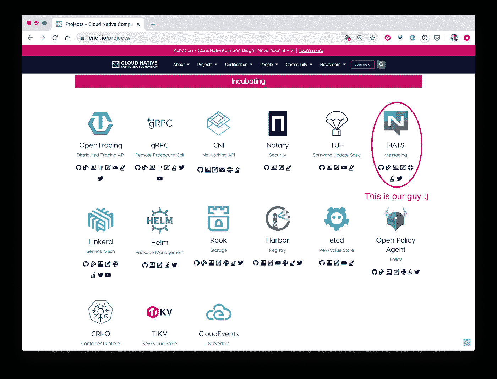
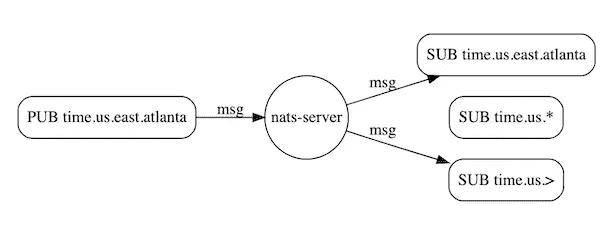
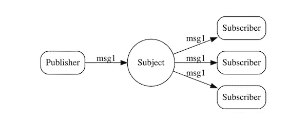
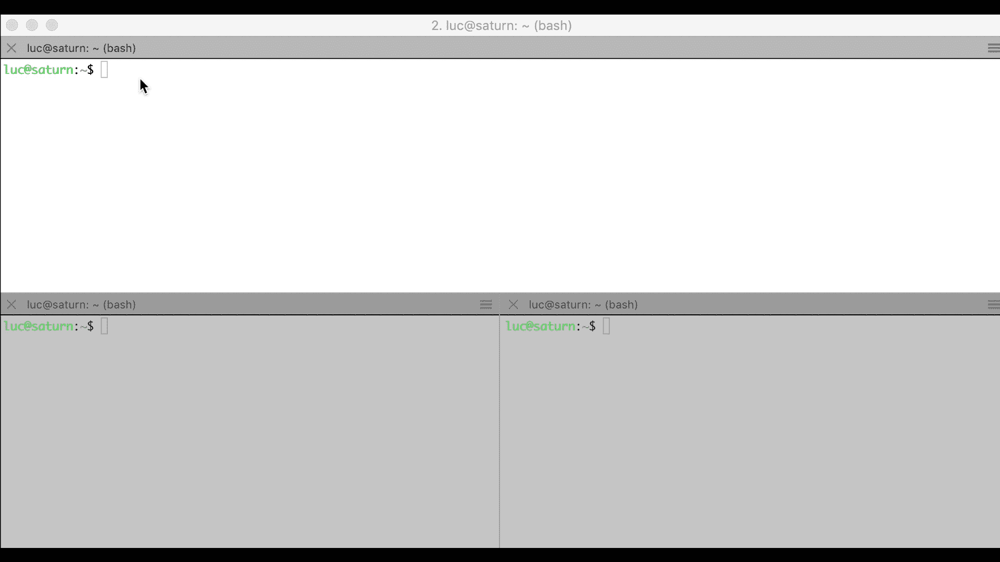
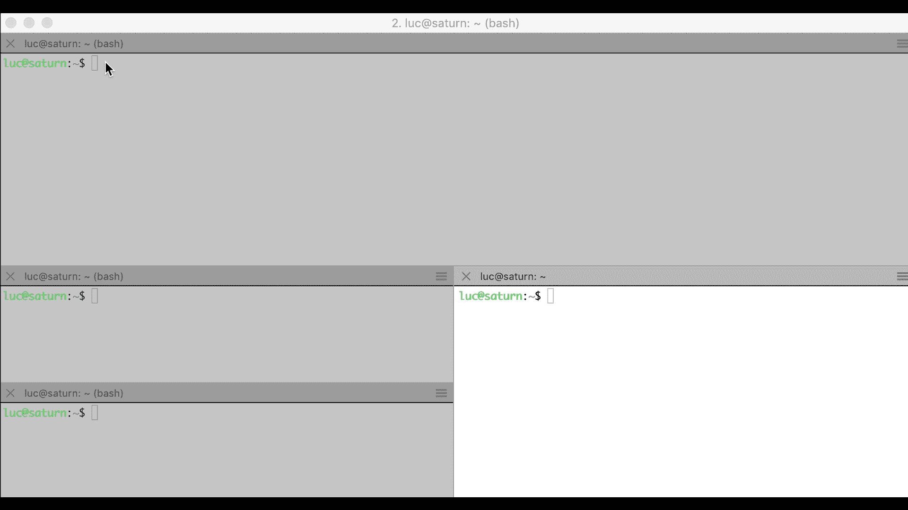
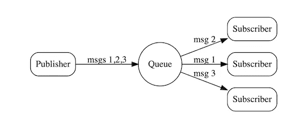
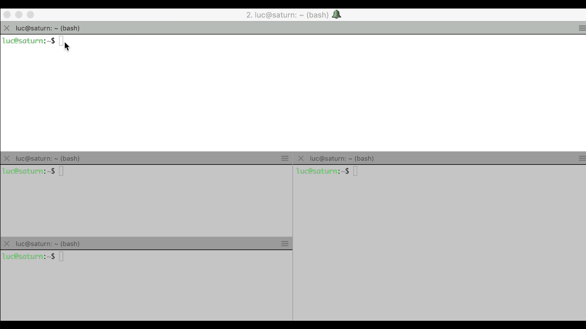
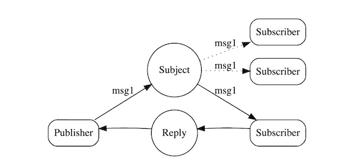
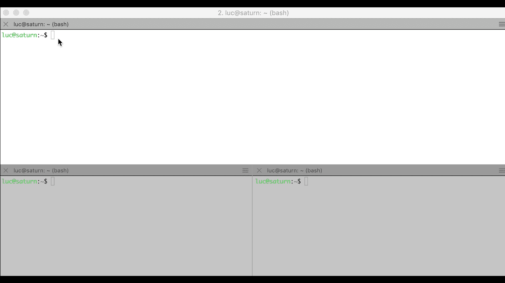

# NATS 入门

> 原文：<https://itnext.io/getting-started-with-nats-b752cbb17f74?source=collection_archive---------2----------------------->

## 高性能消息系统和 CNCF 项目


# 温和的介绍

NATS(https://NATs . io)是一款面向云原生应用、物联网设备消息传递和微服务架构的高性能消息传递系统。

它已经存在很长时间了，我们可以从它的 [GitHub 库](https://github.com/nats-io)中看到，0.5.1 版本已经于 2014 年 6 月发布。这是 Go 中实现的第一个版本，因为 NATS 起源于 Ruby，在 2010 年 10 月首次发布[！](https://github.com/nats-io/nats.rb/commits/master?after=77d8a8e1d5e6ea081086718a6c565642a197ab5f+699)

在过去的几年里，NATS 作为 CNCF 的项目获得了更多的关注。正如我们在下面的列表中所看到的，它目前正处于其他非常有前途的项目的孵化阶段。



CNCF 的孵化项目

NATS 是关于发布和订阅信息的。消息发布在 s*subject 上，*subject 是包含由点('.'分隔的标记的字符串)，它定义了一种沟通渠道。收听关于给定主题的传入消息的订户将接收到关于该主题发布的每条消息。

可以使用特殊字符，以便订阅者可以同时监听一组主题的传入消息，如下图所示。



来源:https://nats.io

*   给定标记的通配符*
*   >'允许收听层次结构中的所有主题

# 运行 NATS 服务器

在下一部分的例子中，我们将从 Go 版本运行 NATS 服务器。一旦我们下载了 [Go](https://golang.org/dl/) ，就可以使用以下命令启动服务器:

```
$ go get github.com/nats-io/nats-server
$ nats-server
```

Docker 镜像也是可用的，可以用下面的命令运行(Alpine 磁偏角通常是一个好的选择，因为它的小尺寸限制了攻击面)

```
$ docker run -p 4222:4222 -p 8222:8222 nats:alpine3.10
```

# 模式

NATS 实现了几种模式:

*   发布/订阅
*   相互竞争的消费者
*   请求/答复

下面我们将逐一说明。

## 发布订阅

发布者发送关于给定主题的消息，一个或几个订阅者收听该主题。每个订阅者都会收到发布者发送的消息。



来源:https://nats.io

为了说明这种模式，我们将使用在 [NATS 范例库](https://github.com/nats-io/go-nats-examples/tree/master/tools)中可用的发布者和订阅者 Go 客户端，它们可以用以下命令安装:

```
$ go get github.com/nats-io/go-nats-examples/tools/nats-sub
$ go get github.com/nats-io/go-nats-examples/tools/nats-pub
```

动画按以下方式分割:

*   顶部窗格:NATS 服务器使用调试和跟踪标志启动
*   左下面板:订户等待来自 *nats.demo* 主题的消息
*   右下面板:发布者发送关于 *nats.demo* 主题的 *Hi* 字符串

订阅者接收发布者发送的消息。



具有单个订户的发布-订阅示例

从服务器的日志(顶部面板)中，我们可以看到一些有趣的事情:

*   一个 id 与每个客户端相关联:订阅者的 *cid:1* ，发布者的 *cid:2*
*   *nats-sub* 客户端的订阅:[SUB nats.demo 1]
*   nats-pub 客户端的发布:[PUB nats.demo 2]
*   用户对消息的接收:[MSG nats.demo 1 2]
*   用于验证客户端状态的运行状况检查:[PING]、[PONG]

以下示例与上一个示例类似，只是有几个订户在等待关于 *nats.demo* 主题的传入消息。

每个订阅者都会收到发布者发送的消息。



有几个订阅者的发布-订阅示例

## 相互竞争的消费者

一个发布者就一个给定的主题发送几个消息，几个订阅者(定义为一个公共组的一部分)监听这个主题。发布者发送的每条消息只由组中的一个订阅者处理。



来源: [https://nats.io](https://nats.io))

为了说明这种模式，我们将使用与上面相同的发布者(nats-pub)和在 [NATS 的示例存储库](https://github.com/nats-io/go-nats-examples/tree/master/tools)中可用的队列订阅者客户端。该命令允许将订户定义为组的一部分，并且可以使用以下命令进行安装:

```
$ go get github.com/nats-io/go-nats-examples/tools/nats-qsub
```

动画按以下方式分割:

*   顶部窗格:NATS 服务器使用调试和跟踪标志启动
*   左下/上面板:在*我的群组*中的用户等待来自 *nats.demo* 主题的消息
*   左下方/下方面板:我的群组中的另一个用户正在等待主题为 nats.demo 的消息
*   右下面板:发布者发送关于主题 *nats.demo* 的 *Hello* 字符串

在 *nats.demo* subject 上发送的每条消息只被群组中的一个用户接收。



竞争消费者:消费者组中只有一个人处理每个传入的消息

## 请求-回复

发布者发送关于给定主题的消息，并等待来自该主题的订阅者之一的回复。



来源: [https://nats.io](https://nats.io))

为了说明这种模式，我们将使用在 [NATS 的示例库](https://github.com/nats-io/go-nats-examples/tree/master/tools)中可用的 nats-req 和 nats-rply 客户端，它们可以用以下命令安装:

```
$ go get github.com/nats-io/go-nats-examples/tools/nats-req
$ go get github.com/nats-io/go-nats-examples/tools/nats-rply
```

动画按以下方式分割:

*   顶部面板:NATS 服务器使用调试和跟踪标志启动
*   左下方:用户等待来自 *nats.demo* 主题的消息。该订户将使用字符串“我的回复”来回复收到的每条消息
*   右下:发布者在 *nats.demo* 主题上发送“*我的请求”*字符串，并等待回复



这里要注意一件有趣的事情:

*   在发送“我的请求”有效负载之前，请求者订阅 _INBOX.IohkarytGfOpCy6i.* *，*一个接收回复的特定主题(下面代码片段的第一行)
*   当订阅者收到“我的请求”有效负载时，它同时收到了应该回复的主题(第 5 行)
*   订户发送关于该主题的回复(第 7 行)
*   请求者收到了回复(第 9 行)
*   请求者取消订阅*_ inbox . iohkarytgfopcy 6 I . **主题

```
1  cid:2 — <<- [SUB _INBOX.IohkarytGfOpCy6i.* 1]
2  cid:2 — <<- [PUB nats.demo _INBOX.IohkarytGfOpCy6i.eFeQJZ65 10]
3  cid:2 — <<- MSG_PAYLOAD: [“my request”]
4  cid:1 — ->> [PING]
5  cid:1 — ->> [MSG nats.demo 1 _INBOX.IohkarytGfOpCy6i.eFeQJZ65 10]
6  cid:1 — <<- [PONG]
7  cid:1 — <<- [PUB _INBOX.IohkarytGfOpCy6i.eFeQJZ65 11]
8  cid:1 — <<- MSG_PAYLOAD: [“my response”]
9  cid:2 — ->> [MSG _INBOX.IohkarytGfOpCy6i.eFeQJZ65 1 11]
10 cid:2 — <-> [DELSUB 1]
```

## 摘要

在这篇文章中，我们简要介绍了 NATS，并举例说明了它提供的不同模式。NATS 系列中的其他几篇文章更深入地探讨了细节:

*   [通过 NATS 设置安全发布/订阅](/secure-pub-sub-with-nats-fcda983d0612)
*   [NATS 集群的设置](/setting-up-a-nats-cluster-92ca8fd6a6e1)
*   [NATS 流媒体概述](/overview-of-nats-streaming-ea0e80449507)
*   [JetStream:下一代 NATS 持久引擎](/jetstream-the-next-generation-of-nats-persistence-engine-cb6c2c80dd20)