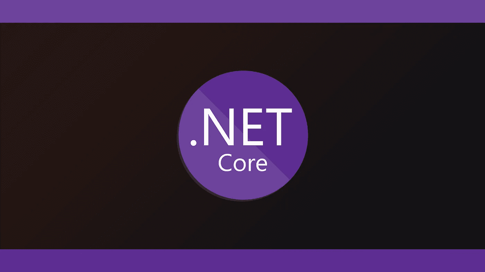

# 开始使用。网络核心

> 原文：<https://itnext.io/getting-started-with-net-core-9b26a096fa7f?source=collection_archive---------1----------------------->

## 如何用？网络核心



## 介绍

随着开源软件的兴起和每年涌现的强大新技术，微软越来越多地参与到开源项目中，其中之一就是。网芯。

这个框架为支持微软技术的开发人员和组织提供了一个开始迁移到开源模型的机会，也为那些主要在开源技术方面有经验的人提供了一个开始使用微软工具和框架的机会。

这种高价值的技术交叉为将遗留系统迁移到现代体系结构、桥接通常难以连接的系统以及与来自整个行业的在各种工具和方法方面受过交叉培训的团队一起开发新软件开辟了新的可能性。

在本文中，我们将看看如何用基本的 CRUD 实现为具有属性*名称*和*描述*的模拟项构建一个简单的 REST API。

本文使用的源代码副本可以在 GitHub 上的[处获得。](https://github.com/kenreilly/dotnet-core-example)

## **项目设置**

如果你还没有。NET 代码，[在这里为你的操作系统抓取一个副本](https://dotnet.microsoft.com/download)。

这个项目是用`dotnet new webapi -o ItemsAPI`初始化的。NET Core 样板文件放在`ItemsAPI` 文件夹中。该应用程序的项目配置文件创建于 **ItemsAPI.csproj** :

该文件定义了项目本身的配置细节，例如。应用程序所需的. NET Framework 版本和包。这个项目不使用任何额外的包，但是如果添加的话，它们会作为另一个`<PackageReference>`条目附加到`<ItemGroup>`中。

## 应用程序入口点

定义这个服务器应用程序入口点的文件是 **Program.cs** :

当使用命令`dotnet run`启动该应用时，调用 *Main* 方法，然后调用 *CreateWebHostBuilder* ，使用 **Startup** 类(包含应用启动配置)创建一个构建器。

## 启动配置

接下来是前面提到的 **Startup** 类，在 **Startup.cs** 中:

在该类中，定义了以下启动配置:

*   服务，在 *ConfigureServices 方法*中
*   HTTP 请求管道，在*中配置*方法

在*配置*中，还有一个检查来确定应用程序当前是否在开发模式下运行。这当然是特定于开发、测试、生产或其他的配置例程运行的地方。

## **items controller 类**

接下来是控制器文件**Controllers/items controller . cs**:

**ItemsController** 类具有属性`Route`和`ApiController`，这两个属性将控制器配置为在定义的路由上的 API 上使用。

属性 *items* 是一个**列表<Item>，它保存了一个 **Item** 对象列表，作为该应用程序的数据存储。在实践中，任何合适的存储或消息传递解决方案都可以用于任何必要的目的，但这是在搭建项目时保持设计简单的一个好例子，因为这种临时模拟解决方案只需要几秒钟就可以实现，并且具有静态、内部和易于恢复到干净状态(通过简单地重新启动服务器)的优点，所有这些都非常适合快速设置和测试概念或想法(因为出错的地方更少)。**

除了`Post()`、`Put()`和`Delete()`之外，这个类中还定义了几个`Get()`方法，它们构成了一组基本的 [CRUD](https://en.wikipedia.org/wiki/Create,_read,_update_and_delete) 操作。每一个都有一个装饰符作为前缀，比如`[HttpGet]`等等，它向框架指示除了(可选的)REST 端点将被服务的路径之外，还将实现什么 HTTP 方法。

此示例 API 实现了以下 HTTP 方法:

*   `[HttpGet]` *(返回存储项目列表)*
*   `[HttpGet("{index}")]` *(返回列表项的* ***索引*** *)*
*   `[HttpGet("/range/{a}/to/{b}")]` *(返回列表项* ***a*** *到****b****)*
*   `[HttpPost]` *(在 JSON 主体的列表中追加一个* ***项****)*
*   `[HttpPut("{index}")]` *(替换* ***索引*** *)*
*   `[HttpDelete("{index}")]` *(删除* ***索引*** *)*

这里使用的 **Item** 类定义了每个端点应该从传入的 JSON 数据和临时数据存储(条目列表)中获得哪些属性。这允许框架拒绝不适当的请求，并且除了代码完成和其他好处之外，还通过提供编辑时和编译时错误检查来帮助开发。接下来我们将看看 Item 类。

## 项目分类

最后一个是 **Item** 类，在 **Models/Items.cs** 中定义:

这个文件非常简单明了，它定义了属性*名称*和*描述*来为一个项目创建一个标准的数据结构。这里，为每个属性定义了默认的 *get* 和 *set* 访问器，但是这些访问器可以进一步详细定义，以提供更大程度的控制和数据验证。

## 测试

要启动服务器，在终端中运行命令`$ ./api-start.sh`(或者从 VS 代码中启动)。接下来，打开一个新的终端会话，并运行这些命令来执行它们各自命名的操作:

```
$ ./api-add-item.sh "Item Name" "Some item description text"
```

`./api-add-item.sh`脚本向 API 发送`HTTP POST`请求，传递与**项目**的结构匹配的 JSON 请求对象中的数据，该对象向列表中添加一个新项目，并返回该项目的 ***索引*** 。

```
$ ./api-list-items.sh
```

这个脚本向 API 发送一个`HTTP GET`，它只是以序列化 JSON 响应字符串的形式返回一个先前添加的项目列表。

## 结论

这篇文章展示了进入。NET 核心开发，它提供了强大而富于表现力的 [C#语言](https://docs.microsoft.com/en-us/dotnet/csharp/tour-of-csharp/)本身以及。NET 框架和 [NuGet 包](https://www.nuget.org/packages)库，使开发人员能够快速利用和构建开发人员社区的经验。

这个示例 API 应用程序是作为 GitHub 上的一个开源项目[提供的，可以派生出一个新的 API 服务器来服务于任何目的。](https://github.com/kenreilly/dotnet-core-example)

感谢你的阅读，祝你下次好运。网芯工程！


运行中的 API 的屏幕截图

> 肯尼斯·雷利( [8_bit_hacker](https://twitter.com/8_bit_hacker) )是 [LevelUP](https://lvl-up.tech/) 的 CTO