# Netmaker 入门:WireGuard 虚拟网络平台

> 原文：<https://itnext.io/getting-started-with-netmaker-a-wireguard-virtual-networking-platform-3d563fbd87f0?source=collection_archive---------0----------------------->

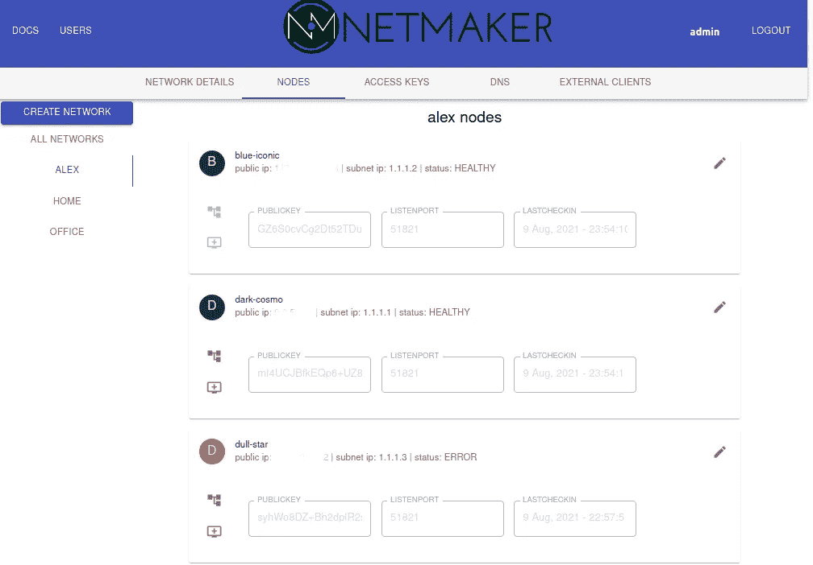

Gravitl 刚刚发布了 0.7 版本的 [Netmaker](https://github.com/gravitl/netmaker) ，这是一个通过 WireGuard 连接 Linux 服务器的网状 VPN。Netmaker 通常被视为 Tailscale、ZeroTier 或 OpenVPN 的替代产品。

在过去的四个月里，Netmaker 的功能集已经发展并专门支持 Kubernetes、物联网和远程网络连接。

V0.7 是一次重大的内部技术革新，将数据库从 MongoDB 迁移到 rqlite (RAFT consensus + sqlite)，增加了日志冗长性，并简化了 GRPC 模型。

Netmaker v0.7 增加了几个新特性，包括 UDP 打洞、NAT 遍历、Kubernetes 清单和多租户。

最近进行的测试显示，基于 Netmaker 的网络运行速度比其他顶级网状 VPN 选项(如 Tailscale 和 ZeroTier)快 50%以上。

在本文中，我们将浏览 Netmaker 的 UI 和客户机(netclient ),以了解该平台是如何工作的。在开始之前，有必要考虑一些用例。

虽然这个列表并不全面，但是 Netmaker 是一个高度可配置的平台，所以请花一些时间来阅读这个列表，它将有助于为给定的用例确定适当的配置。

# 远程连接

从事咨询、托管服务和系统管理的专业人员通常需要远程访问。Netmaker 为第三方提供了快速、安全的远程环境访问，并提供了站点间联网和出口网关等有用的功能。这对客户也很有用，他们可以设置第三方访问的到期日期，并在需要时轻松添加和删除访问。

# 库伯内特斯

在云之间运行集群非常具有挑战性。Netmaker 提供了一个跨云和混合环境运行集群的系统，具有连续、安全的网络。Netmaker 可以在多集群场景中为 Submariner 提供类似的功能。Netmaker 还可以跨多个云扩展单个集群，并允许安全访问集群外的资源，如数据库、API 和存储。有关 Kubernetes 用例的更多信息，请参见[本帖](/8-use-cases-for-kubernetes-over-vpn-unlocking-multicloud-flexibility-3958dab2219f)。

# 物联网

物联网设备需要快速、自动化和安全的网络，能够快速添加和移除设备。Netmaker 提供了一种简单的方法来动态地将物联网设备整合到一个扁平的私有网络中，设备可以自主地加入和离开，而不需要人工操作。由于网络运行在内核 WireGuard 之上，因此可以保证它们尽可能快地运行，以避免任何性能损失。

# 家庭网络

家庭实验室运营商和自主托管爱好者经常在寻找简化和保护家庭网络的方法，以实现远程访问和服务间的互连。Netmaker 简化了家庭网络模型，使其易于管理。

现在我们已经回顾了一些用例，让我们来谈谈 Netmaker 是如何工作的。

# **架构**

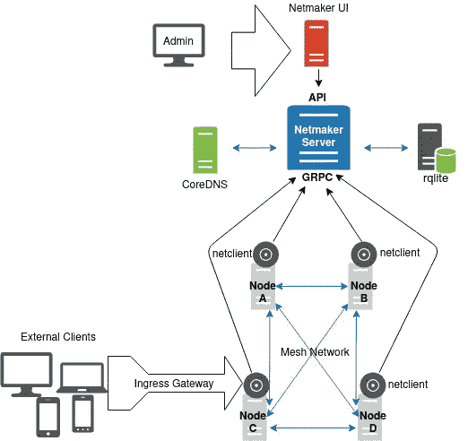

Netmaker 遵循客户机-服务器体系结构。Netmaker 服务器由一个用于管理网络的 UI 仪表板、一个 API 和一个与客户端通信的 GRPC 服务器组成。或者，可以部署管理私有 DNS 的 DNS 服务器(CoreDNS)。

客户机(netclients)是简单的二进制文件，设计用于在大多数 Linux 系统上运行。这些客户端自动进行 WireGuard 管理，并保持对等配置最新。

不要与“中心辐射”模型混淆，流量不通过服务器路由。相反，服务器充当虚拟网络的配置存储和状态管理服务。

客户机向服务器登记以维护它们的状态，寻找它们需要的任何改变，并检索对等点列表，这允许它们建立直接的对等连接(全网状)。这将创建一个类似于本地子网或 VPC 的拓扑。

# 安装

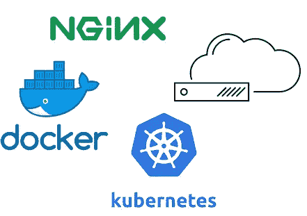

Netmaker 被设计为部署在容器中，尽管它也可以独立部署。Netmaker 可以与 docker、docker-compose 和 Kubernetes 清单一起部署。

对于 Kubernetes 集群，您可以使用[提供的清单](https://github.com/gravitl/netmaker/tree/develop/kube)来部署 Netmaker 服务器和 netclient daemonset。

对于中小型环境，Netmaker 通常部署在具有静态公共 IP 的云虚拟机上。Netmaker 应该在一个 Nginx 代理后面运行，并带有一个自定义域，如 netmaker.example.com。

[**您可以在这里查看有指导的【快速入门】安装**](https://netmaker.readthedocs.io/en/develop/quick-start.html) **。**

# 服务器使用

一旦 Netmaker 启动并运行，问题就变成了，你用它做什么？如果您不确定，请花点时间回顾一下用例。这将决定您希望如何设置您的网络，以及您希望启用哪些其他功能:

*   如果部署在 Kubernetes 上，Netmaker 包括一个 netclient daemonset，它将部署在集群中的 ever 节点上，并将它们添加到指定的 WireGuard 网络中。
*   如果部署站点到站点网络，您可能希望创建两个网络并用出口网关将它们桥接在一起。
*   如果部署为安全地访问远程资源，您可能希望使用“外部客户端”来扩展网络，从而允许 Windows 和 phone 用户访问网络。您可能还想用专用 DNS 扩展这个网络，这样您就可以通过“files.officenet.private”访问文件服务器。

记住这一点，让我们通过探索选项卡来深入了解 Netmaker 的各种功能。

# 网络

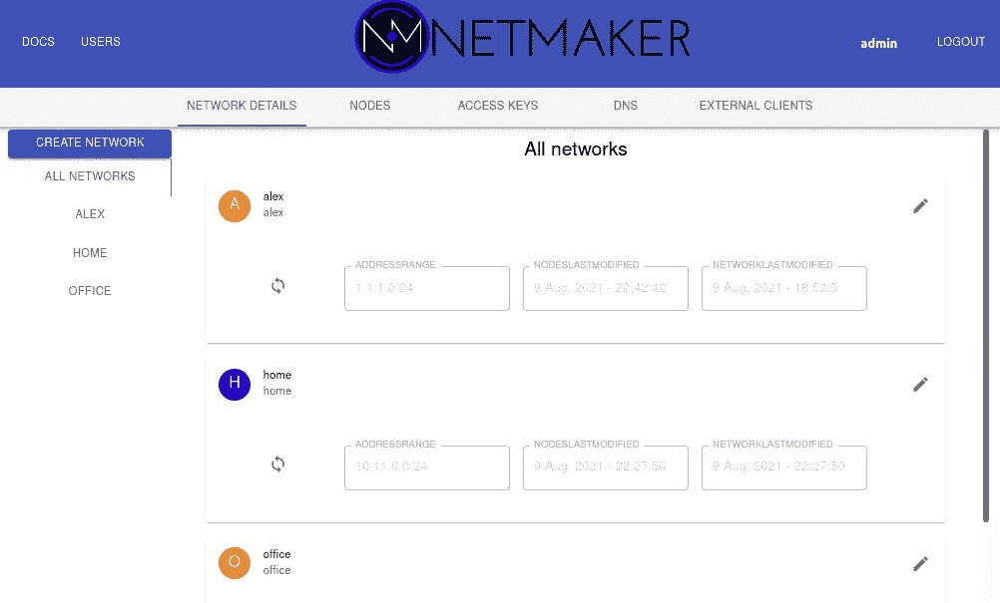

Netmaker 允许您定义任意数量的专用网络，这些网络可以在您喜欢的任何地址范围内运行。您只需给它命名，给它一个地址范围，并选择要启用的选项，例如:

*   **双栈:**向您的网络添加 ipv6 地址
*   **仅限本地:**网络不会通过公共互联网路由，例如，在数据中心、VPC 或家庭/办公室网络内。
*   **打孔:**端点和端口被动态配置和发现，允许对等体更容易地“打孔”通过 NAT。

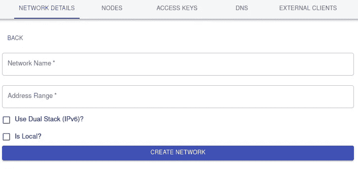

一旦创建了网络，就可以向网络管理员授予访问权限(参见下面的"**管理用户"**)。

网络管理员对他们创建的网络有很大程度的控制，而不需要对单个机器进行 SSH。例如，它们可以更改私有地址范围，节点会相应地更新自己。如果他们认为网络已经被破坏，他们可以使网络中的所有节点刷新他们的公钥。

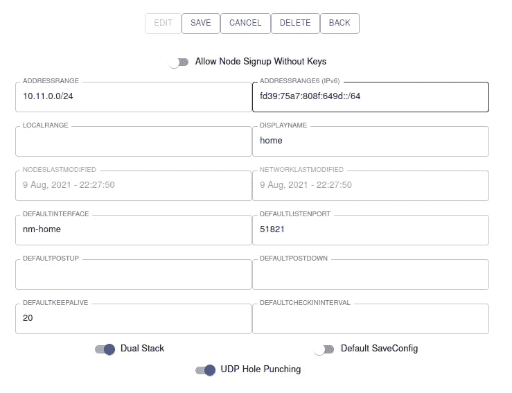

他们还可以在网络级别为节点设置设置“默认设置”，如 Keepalives、默认 WireGuard 端口、网络接口名称，以及为高级设置(如 iptables 配置)设置 post up/down 命令。

# **节点**


节点只是一台机器，通常是运行 Linux 的服务器，安装了 netclient 和 WireGuard。该节点通过专用网络连接到所有其他节点。一旦节点被添加到网络中，网络管理员就有了很大的控制权。从中央服务器，他们可以更改网络中单个机器上的许多网络设置，例如:

*   名字
*   私人地址
*   到期日期(到期后从网络引导)
*   WireGuard 设置

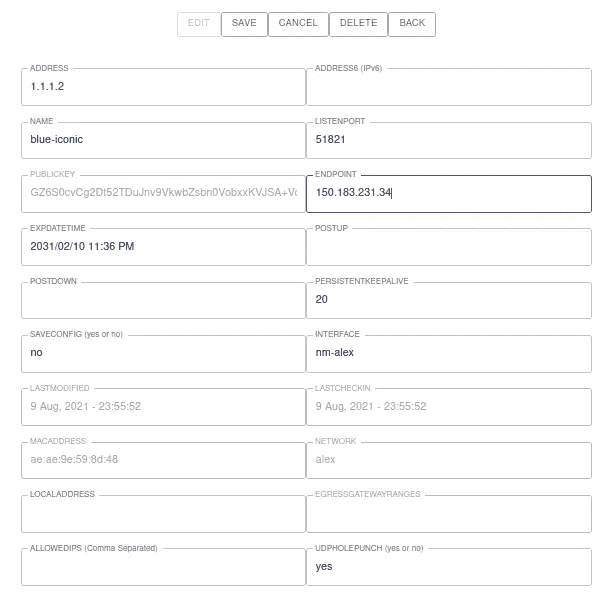

他们还可以删除不应再出现在网络中的节点，从而取消对它们的访问。

这使得网络管理员可以管理像 Kubernetes 和 IoT 这样的用例的半自动机器群。它还允许他们保持对受信任的用户网络的控制，其中他们知道哪些机器可以访问什么，以及如何在任何时候删除该访问。

重要的是，网络管理员可以将节点指定为**出口**或**入口**网关。这允许它们将流量从外部客户端**路由到**网络(入口)，或者从网络路由到指定的 IP 范围(出口)。这两个特性开辟了标准网状网络之外的广泛使用案例。

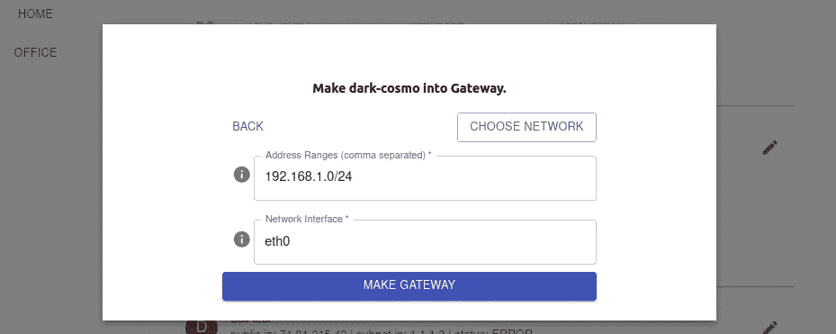

# 访问键

要访问网络，节点通常需要访问密钥(尽管您可以选择切换到手动批准过程)。

如果您允许朋友加入您的网络，访问密钥可以使用 1 次；如果您管理大量设备，访问密钥可以使用 100000 次。您可以创建任意多个，然后删除它们使其无效。

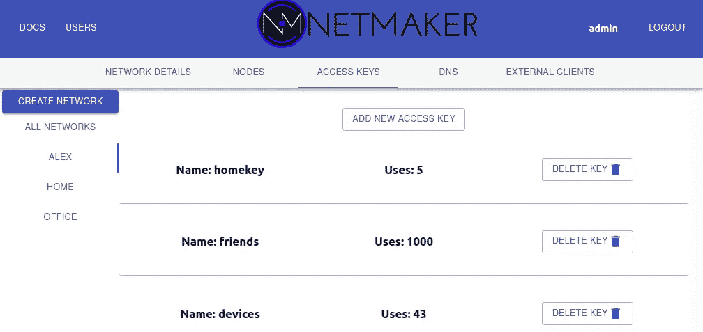

访问键只显示一次，并将显示三个选项:

1.  原始访问密钥，当客户端需要特殊配置时
2.  访问令牌，它将访问密钥与用于加入网络的参数(如地址、端口和网络名称)包装在一起。这个令牌由 netclient 解码，当您运行 **netclient join -t <令牌>时，参数被解析。**
3.  一个安装脚本，用于标准 Linux 服务器上的首次安装。它只需下载 netclient 并为您运行“join”命令。

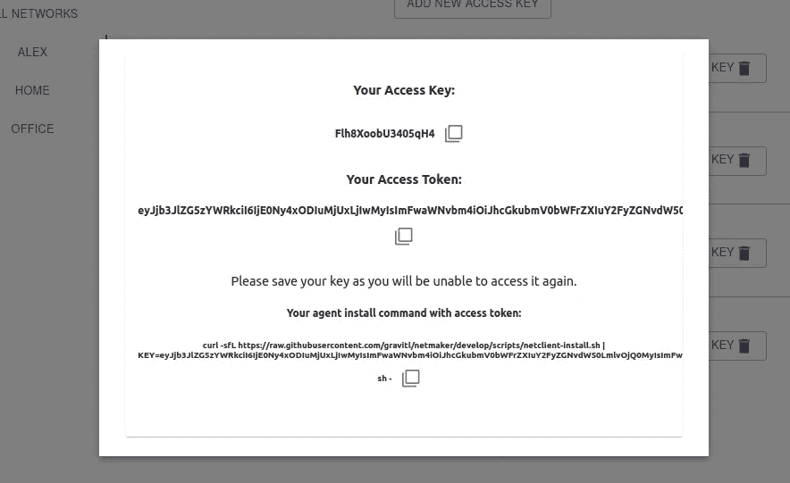

# 私有 DNS

如果启用，Netmaker 将通过 CoreDNS 为您维护专用 DNS。Netmaker 将为网络中的每个节点创建默认条目。

您还可以创建自定义 DNS 条目，例如 sqlserver.mynetwork。

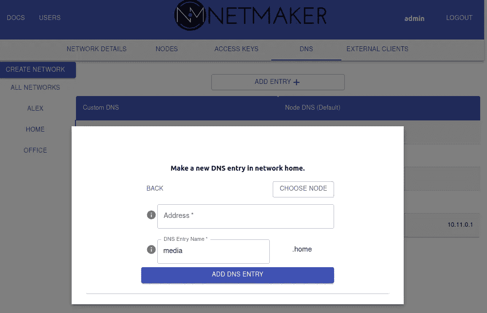

目前只有安装了 **resolvectl** 的 Linux 服务器支持 DNS 管理。

# 外部客户

标准 Linux 服务器目前支持 netclient，但是网络管理员可能希望允许来自运行 Windows、iOS、Android 或 MacOS 的设备的访问。

外部客户端允许**任何运行 WireGuard 的**设备安全地访问网络，而不允许运行 netclient。

管理员创建一个外部客户端，为 WireGuard 生成一个配置文件。该文件必须由客户端设备下载或扫描。

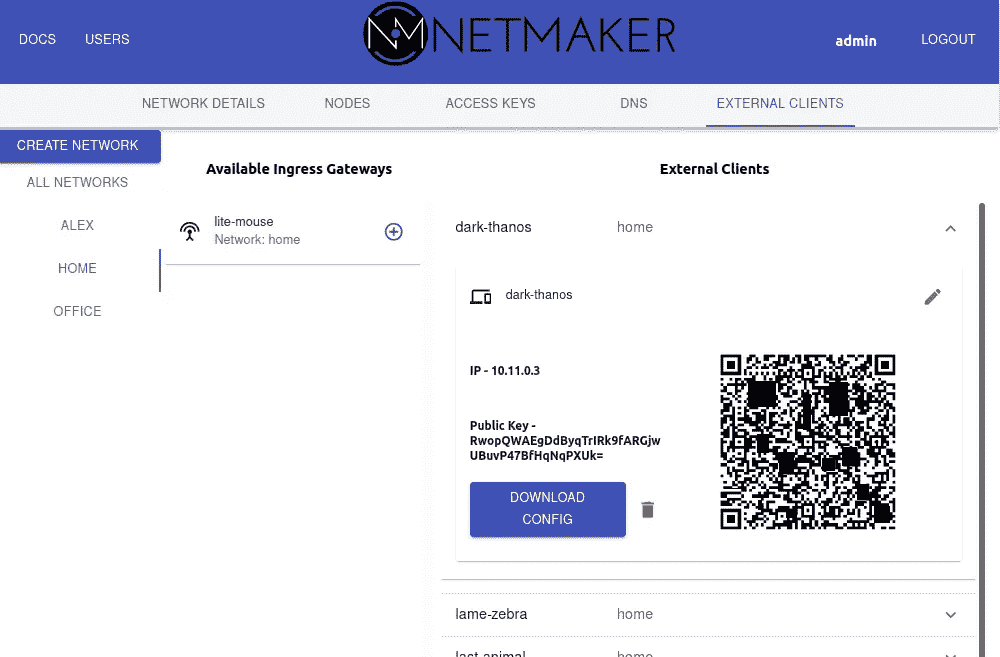

然后，设备通过指定的**入口网关访问网络。**设备可以访问整个网络，但如果网络发生重大变化，则必须手动更新。

随着越来越多的操作系统不断增加对网络客户机的支持，对外部客户机功能的需求将会减少，客户机应该运行网络客户机。

# 管理用户

Netmaker 超级管理员可以创建控制单个网络的“网络管理员”。这使得多个管理员能够在单个 Netmaker 实例上分别管理他们自己的网络。

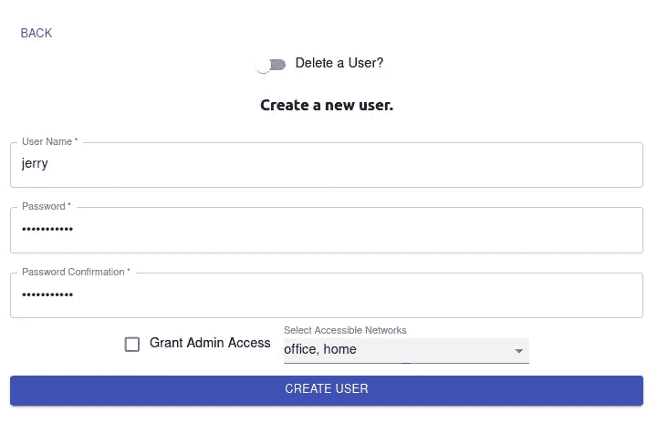

# 文件（documents 的简写）

对于本演练中未涉及的选项，在 netmaker 控制台的左上角总是有 [Docs](https://docs.netmaker.org/) 链接。


这包括服务器，但是管理员和用户仍然需要配置添加到网络中的设备。为此，让我们转向网络客户端。

# 网络客户端

netclient 是一个简单的 CLI，用于连接 Netmaker 服务器和本地 WireGuard 配置。neclient 将管理您想要添加到其中的任意数量的 Netmaker 网络。您可能希望一台单独的机器成为一个、两个或十个不同网络的一部分。单个 netclient 实例将管理所有这些。

```
alex@home:~$ sudo netclient --help
NAME:
   Netclient CLI - Netmaker's netclient agent and CLI. Used to perform interactions with Netmaker server and set local WireGuard config.USAGE:
   netclient [global options] command [command options] [arguments...]VERSION:
   v0.7.1COMMANDS:
   join       Join a Netmaker network.
   leave      Leave a Netmaker network.
   checkin    Checks for local changes and then checks into the specified Netmaker network to ask about remote changes.
   push       Push configuration changes to server.
   pull       Pull latest configuration and peers from server.
   list       Get list of networks.
   uninstall  Uninstall the netclient system service.
   help, h    Shows a list of commands or help for one commandGLOBAL OPTIONS:
   --help, -h     show help (default: false)
   --version, -v  print the version (default: false)
```

# 它是如何工作的

netclient 可以加入网络，推送和拉取更改，以及离开网络。它还有几个用于其他场景的助手命令。首次使用 netclient 加入网络时，它会尝试在您的设备上将自己设置为托管服务(除非您告诉它不要这样做)。

它将创建一个名为/etc/netclient 的文件夹，将自己添加到其中，并为您加入的任何网络创建“netconfig-networkname”格式的配置文件。这些配置文件包含机器的状态以及如何配置 WireGuard。

```
root@workstation:/etc/netclient# ls | sort
netclient
netconfig-default
netconfig-my-net
netconfig-testnet
nettoken-default
nettoken-my-net
nettoken-testnet
wgkey-default
wgkey-my-net
wgkey-testnet
```

然后，netclient 创建一个名为 netclient@networkname 的 systemd 服务，该服务将在一个计时器(默认为 30 秒)上定期运行“检查”。它将检查中央服务器，并将它的本地配置(netconfig 文件)与服务器告诉它的内容进行比较。它将进行适当的更改，下拉对等项列表，并重新配置 WireGuard。

```
root@workstation:/etc/netclient# ls -l /etc/systemd/system/netc*
190 Jul 16 17:05 /etc/systemd/system/netclient-default.timer
188 Jul 28 23:58 /etc/systemd/system/netclient-my-net.timer
199 Jul 15 20:39 /etc/systemd/system/netclient@.service
190 Jul 28 00:49 /etc/systemd/system/netclient-testnet.timer
```

这种关系不是单向的。如果需要从机器上修改机器的设置，用户可以进入“netconfig”文件，更改设置，netclient 将在下次检入时发布这些更改。

```
root@workstation:/etc/netclient# cat netconfig-testnet 
node:
    name: node-ZKTDz
    interface: nm-testnet
    network: testnet
    password: $2a$05$N5Uj0BiV/HhkqiA0GU.
    macaddress: 8h:90:b4:03:g1:u5
    localaddress: 192.168.1.11
    wgaddress: 1.2.3.2
    wgaddress6: ""
    roaming: "on"
    dns: "on"
    islocal: ""
    isdualstack: ""
    isingressgateway: "no"
    localrange: ""
    postup: ""
    postdown: ""
    port: 51821
    keepalive: 20
    publickey: Msm7Ab+QFQyq405Y840zhfZ4D1kkZVk36Eo2A=
    privatekey: ""
    endpoint: 83.12.45.70
    isstatic: "no"
    ipforwarding: "on"
    udpholepunch: "yes"
    saveconfig: "yes"
network: testnet
daemon: "on"
```

netclient 也可以作为简单的 CLI 运行，用于调试或用于没有 systemd 的机器。管理员可以运行“netclient pull”来获取最新的服务器设置，运行“netclient push”来将任何本地更改推送到服务器，运行“netclient leave”来离开网络。

# **获取网络客户端并加入网络**

要加入网络，需要两样东西:网络客户端和令牌。

netclient 可以从 github repo [这里](https://github.com/gravitl/netmaker/releases/tag/0.7)检索。令牌必须在服务器上生成，并带到要添加到网络的机器上。这可以在单个脚本中完成(如本演练的访问令牌部分)，也可以手动完成。

netclient 可以为大多数操作系统编译。如果您的架构不在 downloads 文件夹中，可以通过(go build)下载并构建源 repo。)，这应该足以为大多数平台创建一个功能性的二进制文件(尽管它目前只能在基于 Linux 的平台上运行)。

一旦 netclient 安装在机器上，并且检索到令牌，只需运行:

```
 sudo netclient join -t <token>
```

默认情况下，有许多选项会被忽略，但可能会有所帮助。您可以运行“netclient join - help”来查看完整的列表。例如:

**- daemon=off :** 不要安装在 systemd 中。手动管理 netclient

**-漫游=关:**维护静态 IP。不检查 IP 更改

**-interface =<value>:**要使用的本地接口名称

**- name= < value > :** 网络上节点的名称

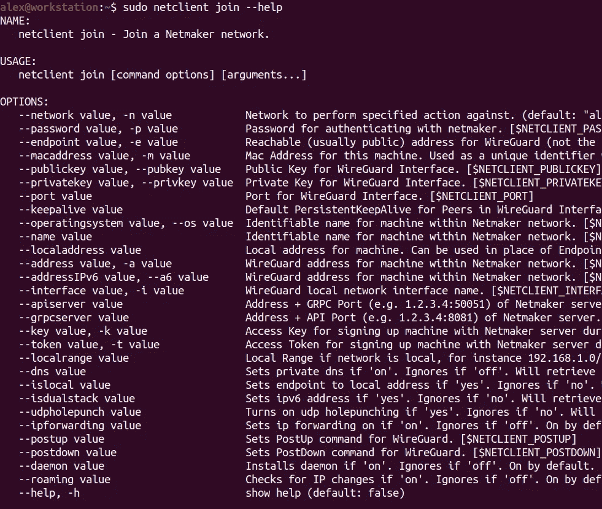

# **排除网络客户端故障**

可通过以下方式查看网络客户端日志:

```
systemctl status netclient@networkname
```

和

```
journalctl -u netclient@networkname
```

当遇到连接问题时，检查这些日志是非常宝贵的。

您可能还想运行**WG show<network name>**来查看连接是否通过以及您的对等体列表看起来是否正确。

最后，检查/etc/netclient 中的 netconfig 文件有助于确保设置看起来是正确的，或者运行 **netclient list** 来获得一些关于当前安装的网络的信息。

# **结论**

这是 Netmaker 的旋风之旅。省略了许多选项，这些选项对于保持这种演练的“高水平”是必要的。如果你有兴趣深入研究某个特定的主题或查看我们众多教程中的一个，我们鼓励你阅读[文档](http://docs.netmaker.org)。

另外，可以随时联系**support@gravitl.com**，或者加入[不和谐**这里**](https://discord.gg/zRb9Vfhk8A) 获取更多实时帮助。

*WireGuard 是 Jason A. Donenfeld 的注册商标。*