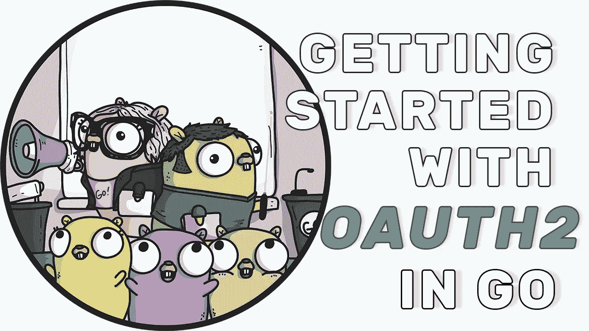

# Go 中的 OAuth2 入门

> 原文：<https://itnext.io/getting-started-with-oauth2-in-go-1c692420e03?source=collection_archive---------1----------------------->



这是本视频的文字版:[package main # 11:Go 中 OAuth2 入门](https://youtu.be/OdyXIi6DGYw)。

# Go 中的 OAuth2 入门

在任何应用程序中，身份验证通常都是非常重要的部分。你总是可以实现你自己的认证系统，但是这需要很多工作，注册，忘记密码表格等等。这就是 OAuth2 被创建的原因，它允许用户使用已经拥有的众多帐户中的一个来登录。

在这个视频中，我们将使用 oauth2 Go 包创建一个简单的 Google 登录网页。

# 谷歌项目，OAuth2 键

首先，让我们创建我们的 Google OAuth2 键。

*   前往[谷歌云平台](https://console.developers.google.com/)
*   创建新项目或使用现有项目
*   转到凭据
*   单击“创建凭据”
*   选择“OAuth 客户端 ID”
*   添加授权的重定向 URL，在我们的例子中是`localhost:8080/callback`
*   获取客户端 id 和客户端密码
*   把它保存在安全的地方

# OAuth2 如何与谷歌合作

*   从 Google API 控制台获取 OAuth 2.0 凭证。
*   从 Google 授权服务器获取一个访问令牌。
*   将访问令牌发送给 API。
*   如有必要，刷新访问令牌。

# 结构

我们将在 1 个 main.go 文件中完成所有工作，并注册 3 个 URL 处理程序:

*   /
*   /登录
*   /回调

# 初始处理程序和 OAuth2 配置

```
go **get** [golang.org/x/oauth2](http://golang.org/x/oauth2)
```

我们将 google 客户端 id 和 secret 保存在 env 变量中，并且只使用 os。代码中的 Getenv。

# /

现在让我们在索引页面上呈现一个 HTML。

# /登录

我们发送随机状态字符串。在我们的事业中，这不是随机的。

# /回调

1.  检查状态
2.  使用`code`获取令牌
3.  使用令牌获取用户信息

# 测试一下

```
go run main.go
```

# 结论

这就是我们在 Go 中整合 OAath2 和 Google 所需要做的一切。如您所见，它只有 70 行代码。

另外，马克·贝茨提供了一个不错的包[https://github.com/markbates/goth](https://github.com/markbates/goth)，它提供了多提供商认证。

[全码](https://github.com/plutov/packagemain/tree/master/11-oauth2)。