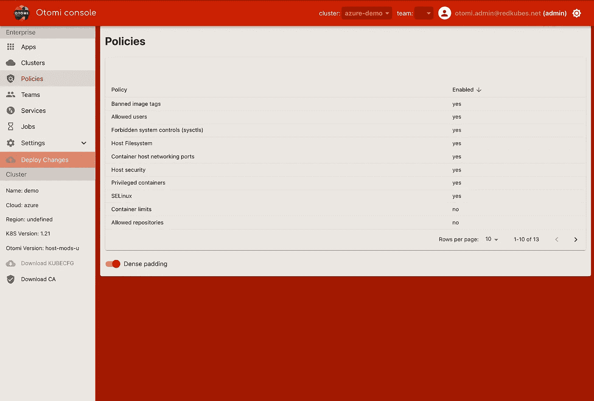
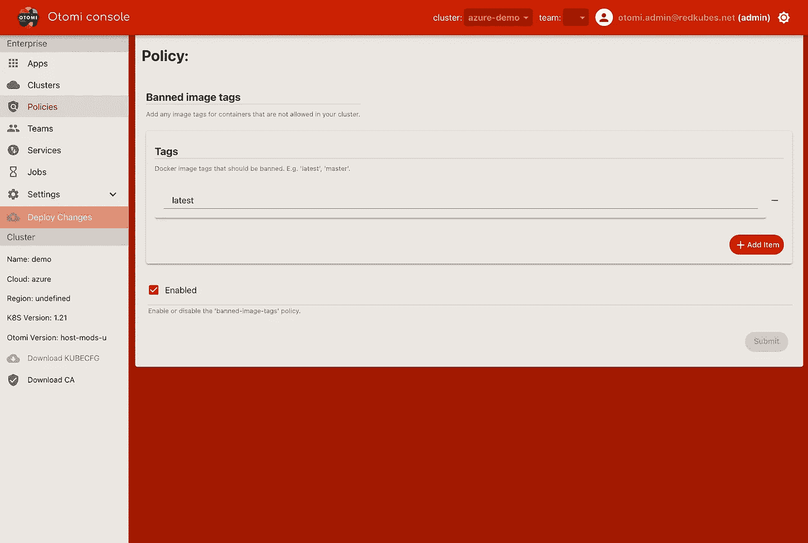
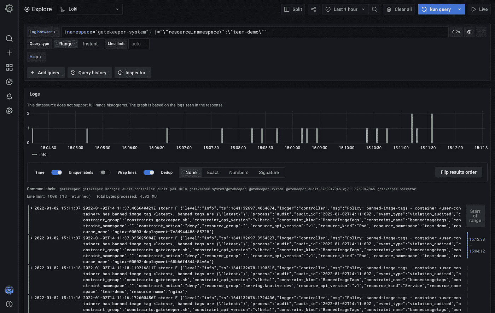

# OPA/网关守护设备入门

> 原文：<https://itnext.io/getting-started-with-opa-gatekeeper-c12a2c0640fa?source=collection_archive---------3----------------------->

# 使用 OPA/Gatekeeper 管理和实施 Kubernetes 安全策略

PodSecurityPolicy (PSP)在 Kubernetes 1.21 中已被弃用。有几个外部准入控制器可用，如 OPA/Gatekeeper，但开始使用 OPA 可能具有挑战性。

[Otomi](https://otomi.io/) 是一套完整的集成 K8s 应用和附加组件，结合了开发人员自助服务，使用 OPA/Gatekeeper 作为提供策略执行的标准。集成到 Otomi 中的所有应用程序都是基于合理的默认设置和最佳实践预先配置的。所有应用的配置都使用版本控制系统进行管理，其中所需的状态反映为代码，集群状态会自动更新。

Otomi 的一个关键原则是它易于使用，并从头开始提供安全性。在本文中，我将简要介绍如何使用 Otomi 开始使用 OPA/Gatekeeper。

# 安装 Otomi

首先，在您选择的云中的 Kubernetes 集群上安装 Otomi。您可以使用 Otomi Quickstart 在 AWS、Azure、GCP 提供 Kubernetes 集群，或者使用 Helm chart 安装 Otomi。要使用 Helm chart 安装 Otomi，请确保 Kubernetes 集群至少运行 16 个 CPU 线程，并且在 worker 节点池中有 32GB 以上的 RAM。

添加 Otomi 存储库:

```
helm repo add otomi https://otomi.io/otomi-core
helm repo update
```

使用以下值创建一个值文件:

```
cluster:
  k8sVersion: '1.20' # currently 1.18, 1.19, 1.20 and 1.21 are supported
  name: # the name of your cluster
  provider: # choose between aws, azure, google or onprem
```

安装图表:

```
helm install -f values.yaml otomi otomi/otomi
```

当安装程序作业(在默认名称空间中)完成时，从日志底部复制 URL 和生成的密码，并完成[安装后步骤](https://otomi.io/docs/installation/post-install/)。

您现在可以登录到控制台。在左侧窗格(在企业下)中，您将看到`Policies`，当您点击它时，您将看到 Otomi 中所有可用策略的列表。



# 使用 Otomi 控制台管理策略

Otomi 包含了 13 种可用的 OPA 策略，并对它们进行了改编，以供 Conftest 使用，以及用于 Otomi 生成的清单的静态分析。

您可以打开或关闭策略，还可以设置要使用的默认参数。选择您想要编辑的策略(启用/禁用或更改默认参数)，点击`Submit`并点击`Deploy Changes`。现在，更改将应用于 Otomi 配置。



# 网守模式

Otomi 支持 3 种看门人模式:

*   执行
*   许可(默认)
*   有缺陷的

在强制和许可模式下，可以打开或关闭各个策略。默认情况下，网关守护设备在许可模式下启用(记录和非阻塞)。

基于 Otomi 模式或通过使用 Otomi 控制台支持策略的定制。在特定需求的情况下，运营商可以添加他们自己的定制策略。

要更改模式，请打开 Gitea(在应用程序中)并导航至`values/env/charts/gatekeeper-operator.yaml`

要切换到强制模式，编辑文件并设置`disableValidatingWebhook=false`:

```
charts:
  gatekeeper-operator:
    disableValidatingWebhook: false
```

要禁用策略实施，请编辑文件并设置`enabled: false`:

```
charts:
  gatekeeper-operator:
    enabled: false
```

# 开发者支持

在 Otomi 控制台的 team 部分，开发人员可以使用 Gatekeeper 仪表板查看与其部署相关的所有违反策略的情况。首先，在 Otomi 中创建一个团队，如果你还没有这样做的话。在团队部分，点击`Apps`，然后点击`Gatekeeper`。



# 对任何种类的 YAML 资源运行策略检查

通过一个简单的命令，您可以测试舵图是否违反了任何策略。

生成的 YAML 文件被传输到 Conftest 中，并逐个测试策略。

```
$ helm template stable/keycloak | conftest test --policy ./policies/ --all-namespaces -
FAIL - Policy: container-limits - container <keycloak> has no resource limits
FAIL - Policy: container-limits - container <keycloak-test> has no resource limits
162 tests, 160 passed, 0 warnings, 2 failures, 0 exceptions
```

通过检查日志消息，您可以看到容器限制策略将两个资源标记为失败。现在，您所要做的就是修改模板，为指定的容器提供“敏感”数量的资源限制，我们的策略检查将成功通过！

如果您想采用新的 Helm 应用程序，但不想在集群中部署任何东西，除非它经过了充分的违规检查，否则这是非常有用的。Conftest 支持使用–data 选项向策略传递值，该选项允许策略设计者通过参数配置不同的设置。

# 策略例外功能

为了创造一些灵活性，Otomi 提供了通过检查每个资源的粒度注释信息来产生异常的能力。

例如:使用以下注释将允许整个窗格或窗格中的某些容器排除一个或多个策略:

```
# Annotation for the entire pod
policy.otomi.io/ignore: psp-allowed-repos
# Annotation for Istio sidecar based containers
policy.otomi.io/ignore-sidecar: psp-allowed-users,psp-capabilities
# Annotation for a specific container (name=app-container)
policy.otomi.io/ignore/app-container: banned-image-tags
```

# 包扎

实施 OPA/Gatekeeper 可能是一项具有挑战性的工作。一些云提供商已经将 Gatekeeper 集成到他们的托管 Kubernetes 服务中，但这导致了一种锁定，而 Otomi 则与云无关。在托管 Kubernetes 服务中使用集成策略也不总是非常灵活。例如，在 Azure 中，策略强制只能打开或关闭。没有在许可模式下运行的选项。

Otomi 使用 OPA/Gatekeeper 和 Conftest 提供完整的 Kubernetes 安全策略功能。在(默认)许可模式下，开发人员可以部署他们的应用程序，而不必直接遵从。然后，他们可以看到所有违规，并相应地调整他们的部署。有了 Otomi，你可以拥有所有的 OPA/Gatekeeper 功能，一套合理的实现默认策略，一个简单的用户体验和大量的灵活性，安装 Otomi 后立即可用。

今天开始使用大友。点击这里查看 GitHub repo。