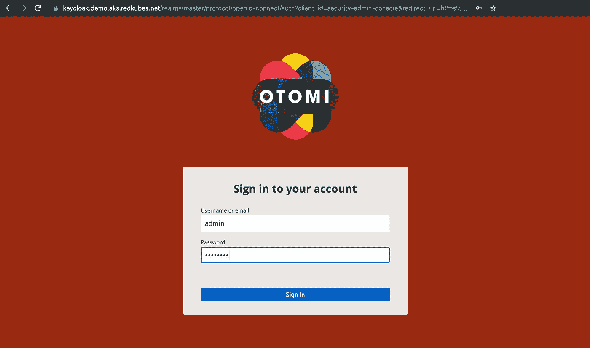
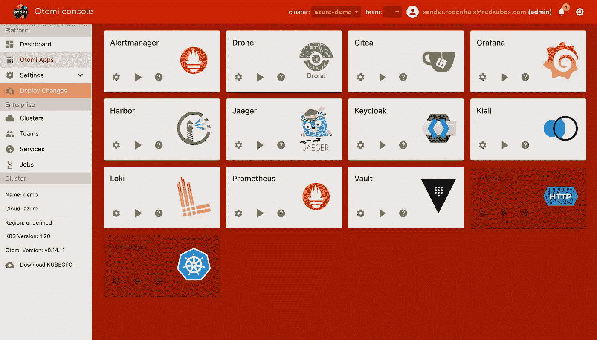
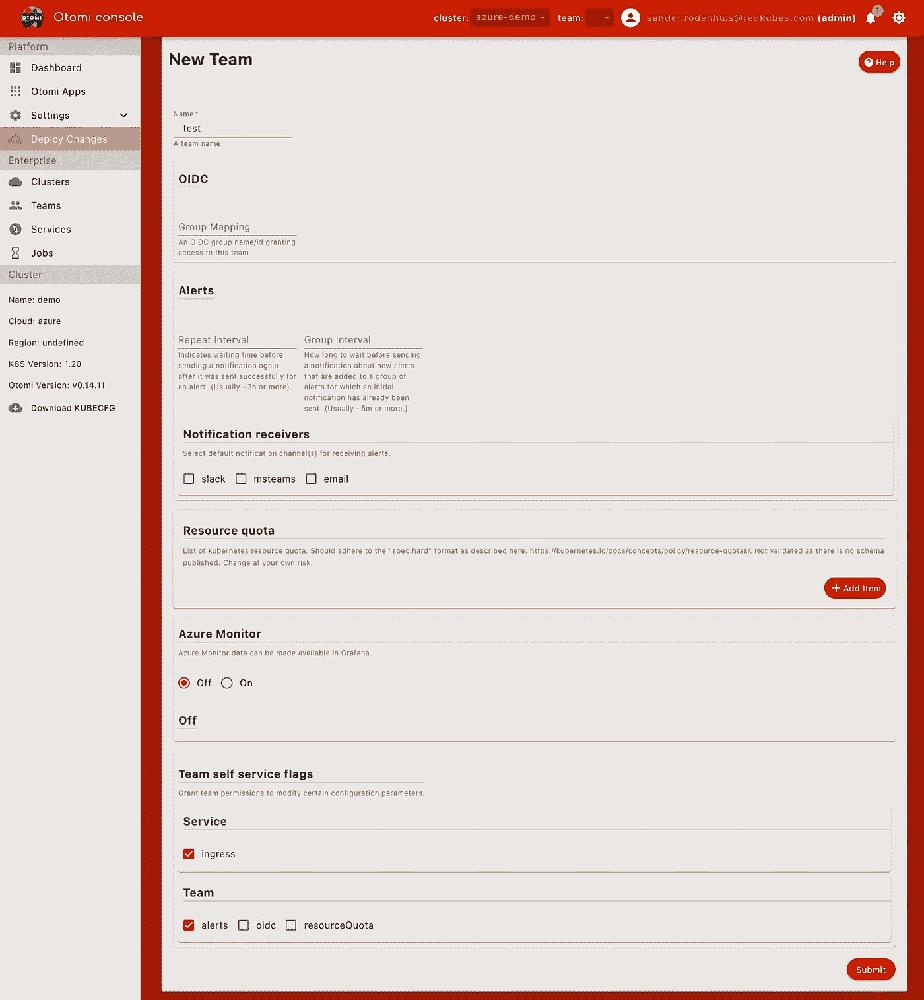
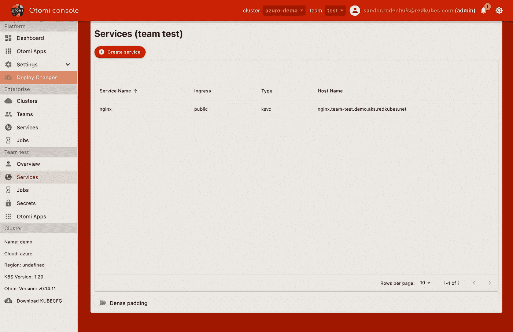
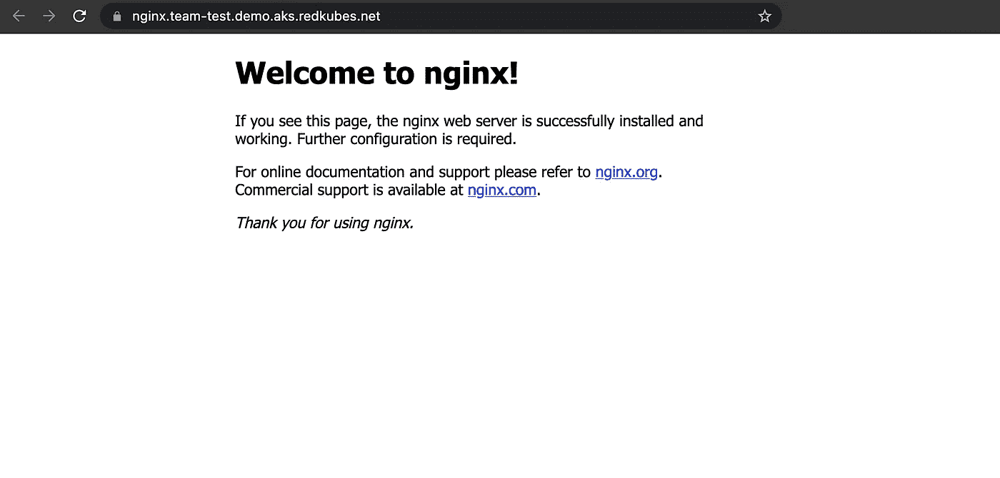

# Otomi 入门

> 原文：<https://itnext.io/getting-started-with-otomi-a82d361330a2?source=collection_archive---------1----------------------->

Otomi 是 Kubernetes 的一个单一包，包括 Istio、Knative、Prometheus、Harbor、Keycloak、Nginx ingress、External-DNS、Cert-manager、Hashicorp Vault、Gatekeeper、Drone、Gitea 等项目，并将它们与大量自动化和类似桌面的用户界面相结合。所有集成的项目都是预先配置的，这意味着它们在安装 Otomi 后就可以开箱即用。使用 Otomi，您将在 20 分钟内获得基于任何 Kubernetes 集群的完整企业级平台体验。点击阅读更多关于 Otomi [的信息。](https://otomi.io)

在这篇文章中，我将通过解释如何安装 Otomi 和创建一个服务来展示开始使用 Otomi 是多么容易。在这个例子中，我将在 AKS 上安装 Otomi。

## 属国

要在 AKS 上安装 Otomi，目前有一个依赖项。您需要能够访问 DNS 区域。这种依赖将很快被移除，允许您在没有任何外部依赖的情况下使用 Otomi。

在这个例子中，我不打算使用 KMS(加密配置值存储库中的密码)，也不打算使用 OIDC(将 Azure Active Directory 用作 IDP)。这两个选项都是可选的。当你不使用 OIDC 时，默认情况下，Otomi 会将 Keycloak 配置为 IDP。

## 安装 Otomi

首先，我们需要访问一个正在运行的 AKS 集群。对于这个例子，我使用 Azure 门户快速创建了一个

*   最新可用的 Kubernetes 版本(1.20.9)
*   3 个 Standard_D3_v2 实例的节点池
*   自动缩放(最小 3，最大 5)
*   蔚蓝 CNI
*   RBAC 已启用(必需)
*   Azure 策略和 Azure 监视器已禁用

请注意，Otomi 提供了一套完整的策略，因此不需要添加 Azure policy 插件，并且因为 Otomi 提供了 Prometheus 和 Loki，所以不需要使用 Azure Monitor。

AKS 正在运行，所以让我们获取凭证:

```
az aks get-credentials — resource-group otomi-aks-demo — name otomi-aks-demo — admin
```

让我们看看节点是否准备好了:

```
kubectl get nodes                                                                 
NAME                                STATUS   ROLES   AGE   VERSION
aks-agentpool-14128372-vmss000000   Ready    agent   77s   v1.20.9
aks-agentpool-14128372-vmss000001   Ready    agent   91s   v1.20.9
aks-agentpool-14128372-vmss000002   Ready    agent   83s   v1.20.9
```

我们现在需要做的唯一事情是设置一个 DNS 区域，创建一个服务主体，并将 SP 指定为 DNS 区域资源组的读取者和 DNS 区域本身的贡献者。完整的设置说明可以在[这里](https://github.com/kubernetes-sigs/external-dns/blob/master/docs/tutorials/azure.md)找到。

要使用 Helm Chart 安装 Otomi，我们现在首先必须创建一个“values.yaml”文件。在本例中，我使用了以下值:

```
cluster:
  domainSuffix: demo.aks.redkubes.net
  k8sVersion: "1.20"
  name: demo
  owner: redkubes
  provider: azureotomi:
  adminPassword: mypassword
  hasExternalDNS: truedns:
  provider:
    azure:
      resourceGroup: external-dns
      aadClientId: #################
      aadClientSecret: #################
      tenantId: #################
      subscriptionId: #################charts:
  cert-manager:
    email: admins@redkubes.com
    stage: production
  external-dns:
    domainFilters:
      - aks.redkubes.net
```

如你所见，我的 DNS 区域是 aks.redkubes.net，域名后缀是 demo.aks.redkubes.net，这意味着 Otomi 将为所有端点创建主机名，产生的 URL 如 Otomi 控制台的 otomi.demo.aks.redkubes.net 和 Keycloak 的 keycloak.demo.aks.redkubes.net。

现在让我们安装图表。首先，添加 Otomi Helm repo 并更新 repo:

```
helm repo add otomi [https://otomi.io/otomi-core](https://otomi.io/otomi-core)helm repo update
```

然后安装图表:

```
helm install -f values.yaml otomi otomi/otomi
NAME: otomi
LAST DEPLOYED: Sat Oct  9 09:36:43 2021
NAMESPACE: default
STATUS: deployed
REVISION: 1
TEST SUITE: None
NOTES:
The Otomi installer was successfully deployed on the cluster.Please inspect the output of the installer job (default/otomi) for any feedback or errors.Also visit otomi.io for further instructions and reference documentation.
```

为了监控安装的进度，我通常使用 K9s。Otomi 安装程序在默认名称空间中作为 Kubernetes 作业运行。

安装完成后(通常需要 20 分钟左右)，首先需要做的是在 Keycloak 中创建一个用户，并为该用户分配一个 Keycloak 角色(由 Otomi 创建)。为此，您首先需要登录到 Keycloak，因此我将转到 keycloak.demo.aks.redkubes.net，使用图表值中提供的`admin`用户和密码登录。



确保在 Keycloak 中选择了 Otomi 领域，然后创建一个用户。用户至少需要有一个电子邮件地址。然后你可以将用户分配到一个默认的 Otomi 组中(T1 组和 T2 组)。如需完整说明，请查看此处的 Otomi 文档[。](https://otomi.io/docs/installation/post-install-actions)

现在我可以登录到 Otomi 控制台。在我的例子中，控制台的 URL 是 otomi.demo.aks.redkubes.net



Otomi 控制台中所有应用程序的快捷键

要开始使用控制台，我们现在首先要启用无人机。Drone 用于将所需状态(由 Otomi API 创建的新配置代码)自动同步到集群。要启用 Drone，首先登录 Gitea，使用`otomi-admin` Gitea 用户帐户(由 Otomi 创建)和 values 中提供的密码。

然后进入无人机(使用 Otomi 控制台中的快捷键)。你会看到 Otomi 创建的`otomi/values`库。现在点击`activate`，再点击`activate repository`，再点击`save`。现在我们准备好使用 Otomi 控制台，创建一个团队并部署我们的第一个应用程序。

要在 Otomi 中创建一个新的服务(用于部署应用程序和/或公开服务)，我们首先需要创建一个团队。在 Otomi 控制台中，点击右侧菜单中的团队，然后点击`Create team`。我正在创建一个名为“测试”的团队，我将使用所有默认设置:



用 Otomi 控制台创建团队

默认情况下，Otomi 配置了多租户选项。这意味着每个团队都有自己的监控、警报、日志等等。我现在不打算在这里讨论所有的多租户细节。

现在只需按回车键或点击`Submit`，然后点击`Deply changes`。要查看团队创建的进度，请访问无人机。您将看到一个管道自动开始创建团队。现在，等待管道完成，这将需要几分钟时间。创建团队后，注意 Otomi 为团队创建了一个新角色(在本例中称为`team-test`)。现在，您可以创建更多用户，并只允许他们访问团队。

好了，现在我们准备创建我们的第一个服务。

在 Otomi 控制台(顶部栏)中，选择您的团队。在我的案例中，团队“测试”。在右边的菜单中，你会看到团队选项。点击`Services`，然后点击`Create service`。添加一个名称(如果您正在创建一个服务来公开预先部署的 Kubernetes 服务，请确保该名称与预先部署的 Kubernetes 服务的名称相匹配，选择`Public`(公开公开服务)并使用所有默认设置。在`Service type`下选择`New knative service`。该选项允许您部署一个映像，Otomi 将在其中自动创建一个新的 Knative 服务。

我将部署标签为`stable`的`nginxinc/nginx-unprivileged`映像。我使用默认的限制和请求。现在我只需要点击`Submit`，然后再点击`Deploy Changes`。同样，您可以检查无人机管道，查看何时成功部署了变更。

在团队服务中，您现在将看到创建的服务和服务的 URL。



Otomi 控制台中的团队服务列表

因为 Otomi 现在已经为服务自动配置了入口(使用 Istio)，在 DNS 区域创建了一个主机名，并创建了一个证书，所以可能需要几分钟 URL 才能工作。

让我们在控制台中单击 URL(https://nginx.team-test.demo.aks.redkubes.net ):



Nginx 正在运行并公开曝光！

现在，这只是如何安装 Otomi、创建团队和部署应用程序的一个简单示例。Otomi 提供了更多的功能和配置选项。查看 [https://otomi.io](https://otomi.io) 了解更多信息。

想看看我们在 GitHub 上的项目吗？去[https://github.com/redkubes/otomi-core](https://github.com/redkubes/otomi-core)和明星！