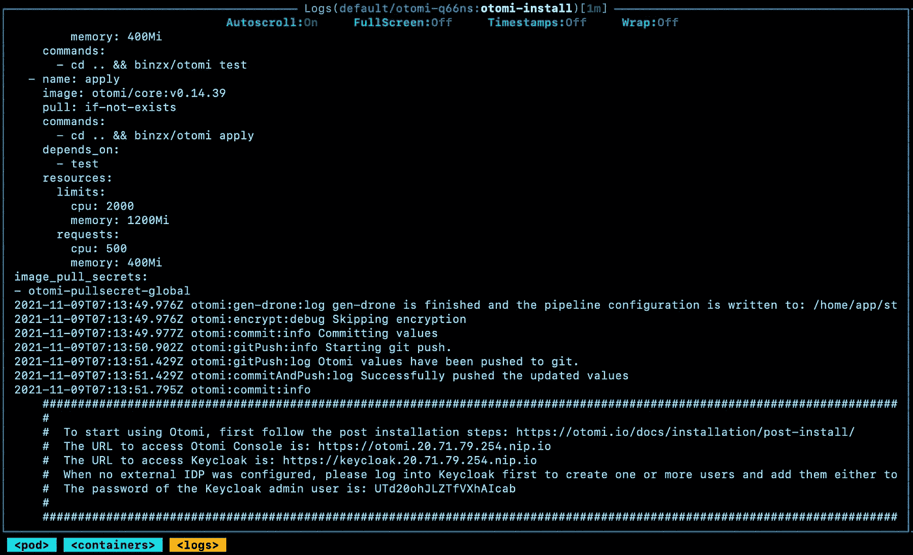
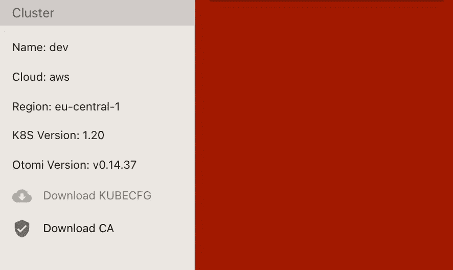

# 开始使用 Otomi 变得简单多了

> 原文：<https://itnext.io/getting-started-with-otomi-just-got-a-whole-lot-easier-c36129109a3d?source=collection_archive---------4----------------------->

在我的[上一篇文章](/getting-started-with-otomi-a82d361330a2)中，我演示了如何在 AKS 上安装 Otomi。然而，仍然有一个依赖。你需要有一个 DNS 区域。DNS 不仅用于名称解析，还用于使用 LetsEncrypt 生成证书。但是有了最新的版本，Otomi 现在可以没有任何依赖地安装了。Otomi 现在默认使用 [nip.io](http://nip.io/) 结合自动生成的 CA。

这完全兑现了 Otomi 的承诺:

*一个* *开源的、与云无关的、基于 Kubernetes 的平台，具有类似桌面的用户界面。Otomi 易于安装，并带有现成的预配置内置应用程序，以提供开箱即用的体验。就像你对你最喜欢的 Linux 发行版的期望一样。*

在这个帖子里。我将解释如何在没有任何外部依赖的情况下安装 Otomi。不依赖地运行 Otomi 只是为了实验/评估的目的，而不是为了运行面向客户的应用程序。对于所有其他用例，建议使用:

*   KMS 用于加密 Otomi 值存储库中的敏感值
*   使用公共 DNS 区域
*   自带 CA 或使用 LetsEncrypt

# 部署 Kubernetes 集群

同样，我们首先需要访问一个正在运行的 Kubernetes 集群。对于这个例子，我将(再次)在 Azure 中创建一个 AKS 集群，使用

*   最新可用的 Kubernetes 版本(1.20.9)
*   3 个 Standard_D3_v2 实例的节点池
*   自动缩放(最小 3，最大 5)
*   蔚蓝 CNI
*   RBAC 已启用(必需)
*   Azure 策略和 Azure 监视器已禁用

当群集启动并运行时，首先获取凭据:

```
az loginaz aks get-credentials --resource-group <resource-group> --name <cluster-name> --admin
```

# 安装 Otomi

现在使用舵图安装 Otomi。首先，创建一个仅包含**和**以下值的`values.yaml`文件:

```
cluster:owner: myselfk8sVersion: '1.20'name: my-clusterprovider: azure
```

如您所见，没有任何依赖性。只需填写所有者和集群名称。

部署图表:

```
helm repo add otomi [https://otomi.io/otomi-core](https://otomi.io/otomi-core)helm repo updatehelm install -f values.yaml otomi otomi/otomi
```

安装程序作业现在将在您的集群上安装 Otomi。您可以通过查看安装程序作业的日志来跟踪安装程序的进度:

```
kubectl logs jobs/otomi -n default -f
```

或者使用 [K9s](https://github.com/derailed/k9s) :



Otomi 安装程序的日志输出

安装程序完成后(可能需要 20 到 30 分钟)，从日志底部复制 URL 和生成的密码。

# 安装后步骤

现在，您需要做的第一件事是在 Keycloak 中创建一个新用户，并将该用户添加到`otomi-admin`组中。

转到:https://keycloak。 <your-ip>.nip.io，使用日志中提供的用户`admin` 和生成的密码登录。还建议更改自动生成的密码。查看[此处](https://otomi.io/docs/installation/post-install/#create-a-user-in-keycloak)了解如何在 Keycloak 中创建用户的完整说明。</your-ip>

现在您可以登录到 Otomi 控制台。去 https://otomi。 <your-ip>.nip.io，用新创建的用户登录。</your-ip>

你可能已经注意到了，浏览器显示这个网站的连接不安全。因为我们没有在 LetsEncrypt 中使用 DNS，也没有提供我们自己的 CA，所以 Otomi 自动为您生成了一个 CA。但是不用担心，您可以将生成的 CA 添加到您的钥匙串中。

在控制台的左窗格中，点击`Download CA`



下载 CA

然后将 CA 添加到您的钥匙串:

```
sudo security add-trusted-cert -d -r trustRoot -k /Library/Keychains/System.keychain ~/Downloads/ca.crt
```

要开始使用 Otomi 部署容器工作负载，首先需要激活 Drone。

要启用 Drone，请打开 Drone 应用程序(使用 Otomi 控制台中的快捷方式)，并使用新创建的用户通过 OpenID Connect 登录。

在 Drone 中，你会看到 Otomi 创建的`otomi/values`库。现在点击`Activate`，然后点击`Activate Repository`，再点击`Save`。现在你可以使用 Otomi 了。

在 [otomi.io](https://otomi.io/) 上可以找到完整的[安装后步骤](https://otomi.io/docs/installation/post-install/)。

# 教程

要开始探索 Otomi，请查看 [https://otomi.i](https://otomi.io/) o 上的教程，并使用它们来学习如何:

*   [使用 Keycloak 作为 IdP 时创建和管理用户](https://otomi.io/docs/tutorials/create-keycloak-users)
*   [构建、标记和推送一个图像到港口](https://otomi.io/docs/tutorials/build-tag-push)
*   创建一个 Kubernetes 服务
*   [使用 Otomi 控制台公开现有的 Kubernetes 服务](https://otomi.io/docs/tutorials/expose-service)
*   [创建一个有价值的服务](https://otomi.io/docs/tutorials/create-knative-svc)
*   [使用 Otomi 控制台](https://otomi.io/docs/tutorials/expose-ksvc)公开现有的 Knative 服务
*   [在 Hashicorp 金库中创建一个秘密](https://otomi.io/docs/tutorials/create-secret-vault)
*   [给 Kubernetes 添加一个在金库中创建的秘密](https://otomi.io/docs/tutorials/add-secret)
*   [在 Kubernetes](https://otomi.io/docs/tutorials/use-secret) 中使用秘密
*   [使用 Otomi 控制台创建 Knative 服务](https://otomi.io/docs/tutorials/create-ksvc-otomi)

更多教程将很快推出。

# Otomi 快速入门

为了更容易开始使用 Otomi， [quickstart repository](https://github.com/redkubes/quickstart) 现在提供了一种使用 Terraform 在您选择的云中创建 Kubernetes 集群的简单方法。目前，Azure 和 Google 云平台有一个快速入门。AWS 快速入门将很快推出。

# 结束语

Otomi 提供了 Kubernetes 顶级的全平台体验。它集成并预配置了一整套开源项目，如 Harbor、Knative、Istio、Prometheus、Keycloak、Gatekeeper 等等。通过在 Kubernetes 上安装 Otomi，您可以使用所有这些开箱即用的默认项目。因此，你不需要自己安装、配置和集成所有这些项目，你只需要安装 Otomi。

Otomi 非常适合用作内部(基于 Kubernetes)开发人员平台。默认情况下，Otomi 以许可模式运行，这意味着所有违反安全策略的行为都将被记录。团队可以直接访问所有安全日志并改善安全状况。这提供了一种边学边做的体验。

在没有依赖的情况下运行 Otomi，现在开始使用 Otomi 并探索它的所有特性变得非常容易。

不要再等了，试试吧！如果您遇到任何问题，请在这里报告它们[。](https://github.com/redkubes/otomi-core/issues)