# OutSystems 和 Microsoft Graph 入门—委托权限

> 原文：<https://itnext.io/getting-started-with-outsystems-and-microsoft-graph-123006356d41?source=collection_archive---------4----------------------->

您找到的大多数教程和 OutSystems 论坛答案都解释了如何使用应用程序凭证访问 Microsoft Graph API。在许多用例中，您希望使用带有当前登录用户凭证的图形。我还没有找到一个循序渐进的教程，所以这里有一个。

# 什么是 OutSystems？

OutSystems 是低代码应用平台。支持整个应用程序开发生命周期的可视化开发环境。低代码意味着您仍然可以使用自定义代码，无论是前端的 JavaScript 还是服务器端的 C#。你可以在他们的网站上了解更多关于 [OutSystems 的信息。](https://www.outsystems.com)

# **什么是微软图形？**

Graph 是 Microsoft 365 universe 数据的统一 REST API 网关，范围从查询到 Microsoft 365 租户的配置选项。你可以在这里阅读更多关于微软图形 API 的内容。

# **总结**

我们将创建一个新的 out systems responsive 应用程序，并配置登录流来验证您的 Azure Active Directory 租户。为此，我们使用了[微软登录连接器伪造组件](https://www.outsystems.com/forge/component-overview/6933/microsoft-login-connector-reactive)。然后，我们使用登录用户的 OAuth2 访问令牌对[Microsoft Graph API To-do tasks](https://docs.microsoft.com/en-us/graph/api/resources/todo-overview?view=graph-rest-1.0)端点执行操作。为此，我们使用另一个 Forge 组件 Microsoft Graph 来完成任务。

> 如果您已经配置了 OutSystems Users provider 来针对 Azure Active Directory 进行身份验证，您可能会想为什么我们要使用另一个组件来进行身份验证。简而言之，用户提供者使用 SAML 协议，该协议不提供 OAuth2 访问令牌。Microsoft Graph API 仅支持 OAuth2 访问令牌。

# **微软登录连接器伪造组件**

该组件是一个社区项目

*   文森特·科宁
*   保罗·戴维斯
*   米盖尔·阿马多
*   乌戈·科丁哈

这是一个非常高质量的组件，可以在您自己的环境中免费使用。根据我自己的经验，我知道创建和维护 Forge 项目是一项巨大的工作，而且在很多情况下，是在业余时间完成的。

# **微软 Graph API 待办任务伪造组件**

这是我对 OutSystems Forge 的贡献。你可以在这里找到我的 [OutSystems 简介](https://www.outsystems.com/profile/0qginuc0j5/overview)。如果你想了解更多关于我和 ISD FENIQS 的其他组件，请[访问 Anvil](https://anvil.isdfeniqs.com) 。Anvil 是我们所有外部系统组件的专用微型网站。

# **你需要什么**

要遵循本教程，您需要

*   外部系统开发环境。([个人环境就足够了](https://www.outsystems.com/PartnerSignup/GetStarted.aspx?PartnerId=bdbab3cf-076f-49e2-91ac-a9157081eace&utm_source=ISD%20FENIQS%20GmbH&utm_medium=partner&utm_campaign=partner-personal-environment&utm_content=personal-environment))
*   [来自 OutSystems Forge 的 Microsoft log in Connector Reactive](https://www.outsystems.com/forge/component-overview/6933/microsoft-login-connector-reactive)，以及[Microsoft log in Connector Core](https://www.outsystems.com/forge/component-overview/6924/microsoft-login-connector-core)(在安装第一个组件时自动安装)
*   来自 OutSystems Forge 的微软登录连接器管理。
*   来自 OutSystems Forge 的 Microsoft Graph 待办任务连接器。

现在是安装所有这些锻造组件的好时机🙂

# **我们将做什么**

*   在您的 Azure AD 中添加应用程序配置，以允许用户从您的外部系统应用程序登录。
*   配置 Microsoft 登录连接器和您的应用程序登录流。
*   检索访问令牌并使用它来执行 Microsoft Graph API 待办任务操作。

# **步步为营**

尽管是我们的用户根据 Azure Active Directory 进行身份验证，但我们需要在我们的租户中设置应用程序配置。我们告诉 Azure AD 允许来自特定应用程序的用户进行身份验证，并配置我们需要的所谓资源的权限。Microsoft Graph API 是一种资源。

**步骤 1 —注册 Azure 活动目录应用**

在[https://portal.azure.com](https://portal.azure.com)访问您的 Azure 门户网站

在顶部搜索栏中搜索应用程序注册，然后单击服务部分中的应用程序注册。

应用注册搜索

在应用程序注册列表屏幕中，单击新注册。

*   为您的应用程序提供一个有意义的名称
*   仅在该组织目录中选择**账户**。(我们只想允许来自我们自己组织的用户，而不是来自其他组织的用户)
*   在**重定向 URI** 下，从下拉列表中选择 **Web** 并输入 https://<your out systems environment>/Microsoft loginconnectorreactive/callback page
*   点击**注册**

注册申请

**步骤 2 —记下客户端 Id**

在您的新应用仪表板上，复制**客户端 id** 和**租户 id** 。我们稍后在 OutSystems 中配置 Microsoft 登录连接器时需要用到它。

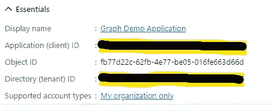

客户和租户 Id

**步骤 3 —生成密码**

在左侧窗格的管理下，单击**证书&机密**。检查**客户端密码**选项卡是否被选中，并点击**新客户端密码**。

输入密码的描述和到期时间。点击添加。

在以下屏幕中，立即**复制客户端密码(值)**非常重要。客户端密码在此屏幕上仅显示一次，以后无法检索。我们需要客户端密码(以及之前的客户端 id)来配置 Microsoft 登录连接器。

客户端机密是在 Value 下创建的

**第 4 步—配置权限**

最后一步是配置权限。在左窗格中点击 **API 权限**。您会注意到已经有一个权限集**用户。读取委托类型的**。这是用户登录所需的最低权限。

有两种类型的权限。

*   **委托** —您的应用程序以登录用户的身份访问 API。
*   **应用** —您的应用访问 API

在本教程中，我们将重点放在委托类型上，因为我们希望以登录用户的身份执行所有操作。

我们需要分配额外的权限。因为我们想要访问 Graph API 待办任务端点，所以我们需要添加以下权限

*   **任务。读写**

这使我们的应用程序有权读写登录用户的任务。还可以添加**任务。ReadWrite.Shared** 如果要对共享任务列表和任务进行操作。

*   点击**添加一个权限**
*   选择**微软图形**和**委托权限**
*   从权限列表中选择任务>任务。读写
*   点击**添加权限**

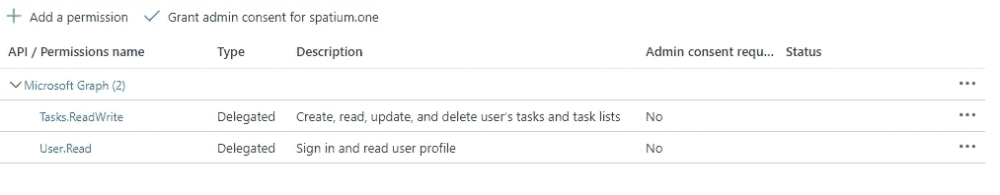

应用程序权限

**步骤 5——创建一个外部系统反应式应用程序**

在 Service Studio 中创建新的反应式 Web 应用程序。创建默认的反应式 Web 模块并发布它。目前我们让它保持原样。我们只需要这个空间，这样我们就可以一步完成 Microsoft 登录连接器的配置。

**步骤 6 —配置微软登录连接器**

现在，我们配置 Microsoft 登录连接器。我们使用可在 https://<your outsystems="" environment="">/Microsoft loginconnectormanagement 下访问的管理控制台</your>

在开始屏幕上添加一个新的应用程序，并填写详细信息。你需要

*   步骤 2 中的**客户 Id** 和**租户 Id**
*   **来自步骤 3 的客户端机密**

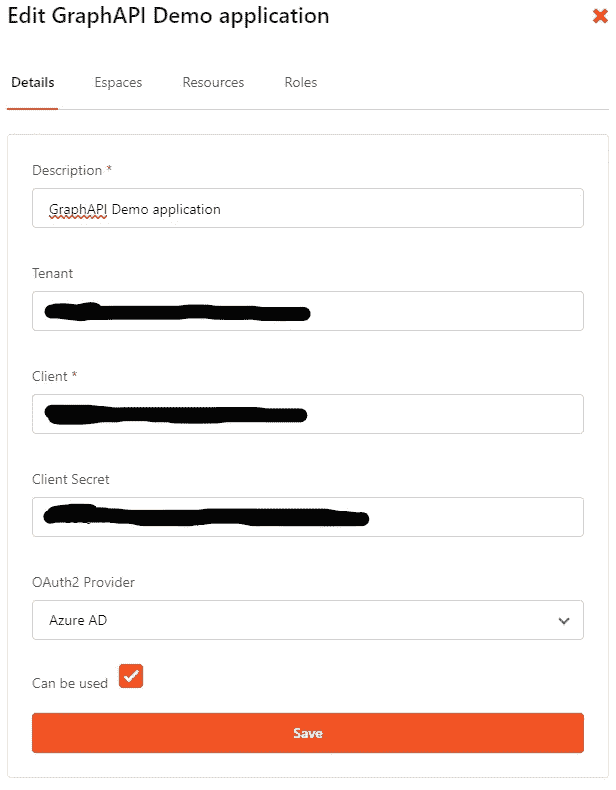

接下来单击 Espaces 选项卡并添加您创建的 Reactive Webapplication。屏幕上的这个应用叫做 GraphAPI。

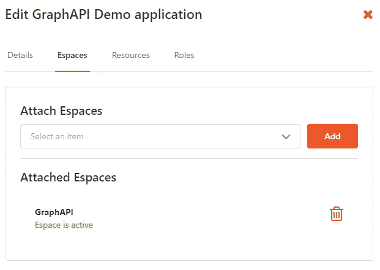

空间分配

最后，单击 Resources 选项卡，添加 Microsoft Graph API 资源作为默认资源。

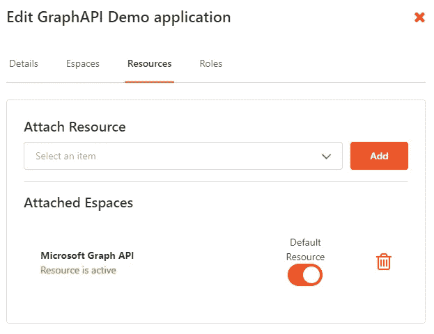

资源分配

**第 7 步—添加所需的依赖关系**

在 Service Studio 中打开您创建的 Reactive Web 模块。在开始修改默认登录流之前，我们首先需要一些依赖关系。

添加依赖关系

*   **来自 Microsoft loginconnectorreactive 模块的 GetOAuth2AuthenticationUrl**
*   **来自微软 LoginConnectorReactive 模块的 GetOAuth2LogoutUrl**

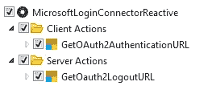

Microsoft loginconnectorreactive 依赖项

*   来自 MicrosoftLoginConnectorCore 模块的 **GetUserToken**
*   来自 MicrosoftLoginConnectorCore 模块的 GetUserInfoByUserId
*   来自 MicrosoftLoginConnectorCore 模块的静态实体

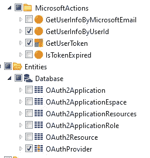

MicrosoftLoginConnectorCore 依赖项

**步骤 8 —修改登录流程**

我们从修改通用 UI 流中的通用 **OnException** 处理程序开始。

这里，我们将默认的服务器动作**User _ GetUnifiedLoginUrl**与来自 Microsoft loginconnectorreactive 模块的**getoauth 2 authenticationurl**进行交换。

使用配置服务器操作

*   将 **EspaceName** 设置为 **GetEntryEspaceName()**
*   将 **OAuthProviderId** 设置为**实体。OAuthProvider.AzureAd**

将其余部分留空，并更正以下 if 和 redirect 操作。您的流程现在应该看起来像这样

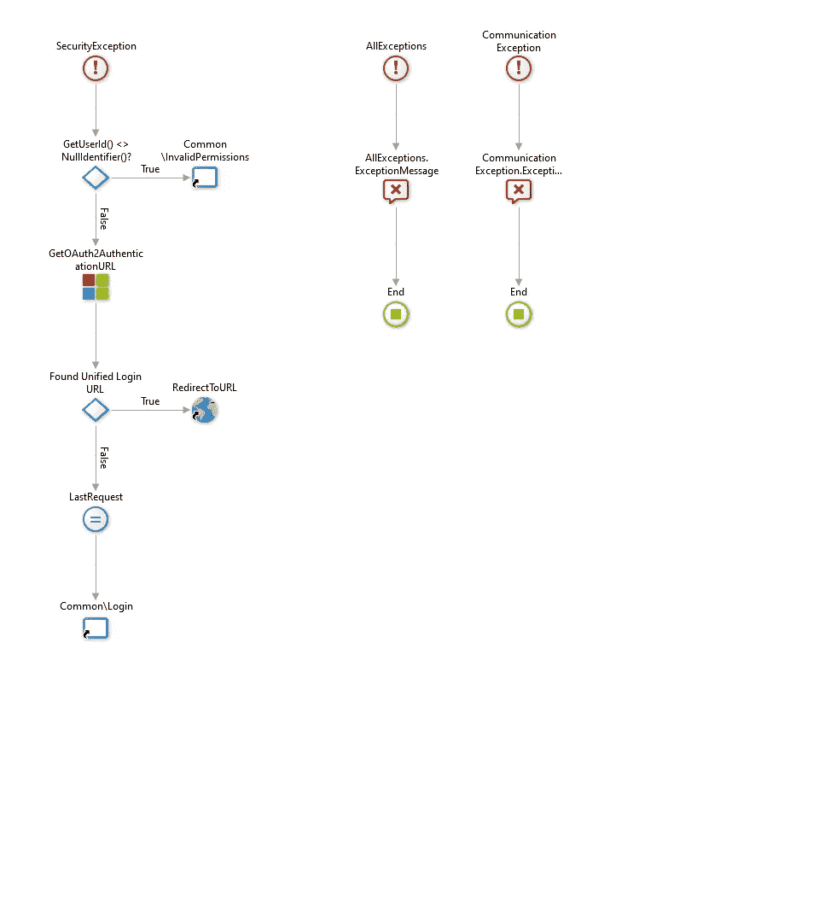

异常流

接下来，我们修改 **DoLogout** 服务器动作(在文件夹认证中)。将默认的服务器动作 **User_GetUnifiedLogoutUrl** 与来自 Microsoft loginconnectorreactive 模块的 **GetOAuth2LogoutUrl** 进行交换，并更正下面的 **if** 和 **redirect** 语句。

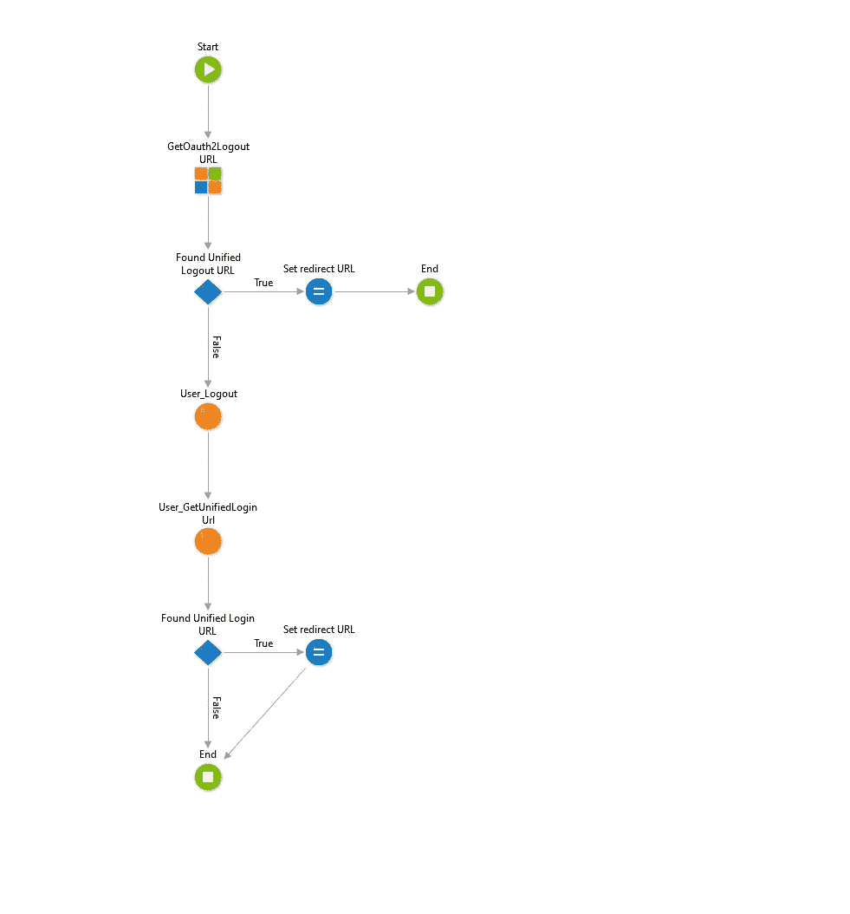

白云石流

**步骤 9 —创建一个屏幕并测试登录**

创建你的第一个屏幕(如开始)作为默认屏幕。发布您的应用程序并测试您是否可以使用 Azure AD 凭据登录。您应该使用新的 InPrivate 浏览器会话，因为 OutSystems 有一种 cookie 优先的身份验证方法。如果您已经在您的外部系统环境中通过了身份验证，您首先必须注销。

**步骤 10 —创建令牌检索服务器操作**

每当我们访问 Microsoft Graph API 时，我们都需要当前用户的访问令牌。幸运的是，Microsoft 登录连接器提供了一种简单的方法来检索访问令牌。

为了获得访问令牌，我们首先需要当前用户的 **Azure 电子邮件地址**。这个用于检索访问令牌。

这些是步骤

*   查找当前用户使用的 Azure 电子邮件地址
*   使用该电子邮件地址获取缓存访问令牌
*   如果当前用户没有缓存的访问令牌，则引发异常。

稍后，我们处理异常并将用户重定向到登录页面。

> 您可能想知道为什么用户可以访问，但是没有缓存的访问令牌。如果有人登录到一个拥有默认用户名和密码登录流的 Outsystems 应用程序，那么这个用户已经通过了身份验证，因此不会被重定向到 Azure AD 登录页面。也就是上面提到的 cookie first 认证机制。

创建一个新的服务器动作，并将其命名为 **GetOAuthToken** ，其中**没有输入参数**，只有一个**文本类型的输出参数 Token**。

*   从 MicrosoftLoginConnectorCore 模块添加 **GetUserInfoByUserId** 服务器操作。对于 **UserId** 参数，使用 **GetUserId()** 。

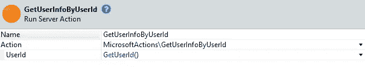

GetUserInfo 配置

*   添加一个条件为 GetUserInfoByUserId 的 If 语句。UserDoesNotHaveToken

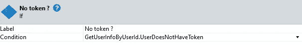

无标记 if 语句

*   在 **if 语句**的**真分支**上添加一个**引发异常**和一个新的用户异常。将异常命名为**令牌异常**。作为消息，您可以使用类似“用户没有访问令牌”的内容

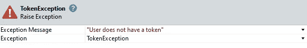

令牌异常配置

*   在错误分支上添加来自 MicrosoftLoginConnectorCore 模块的服务器操作 **GetUserToken** 。配置如下

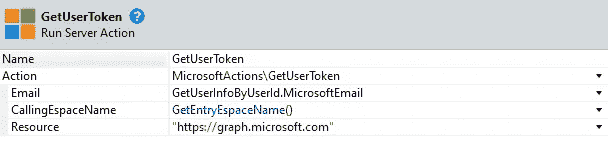

GetUserTokenConfiguration

*   将 GetUserToken 的令牌结果赋给输出参数。

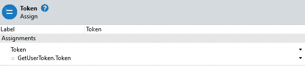

您的流程现在应该是这样的

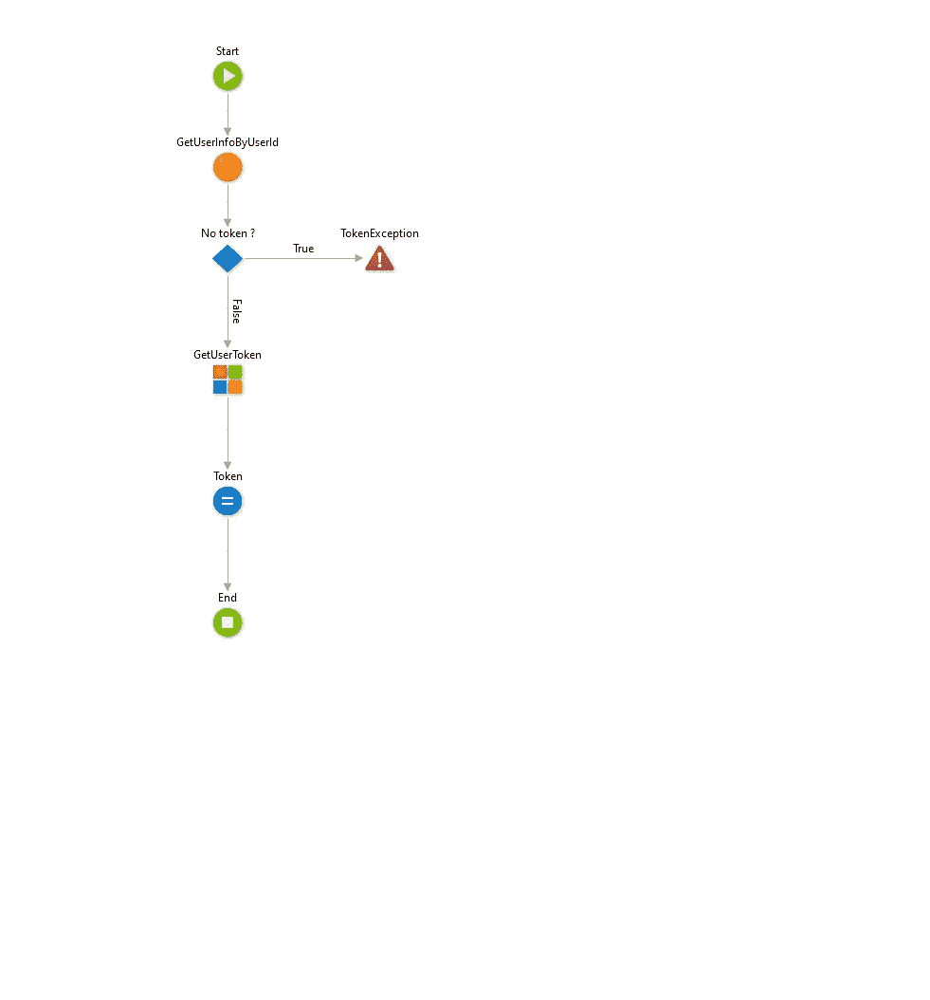

GetOAuthToken 流

**步骤 11 —处理令牌异常**

如果用户没有访问令牌，我们需要将用户重定向到登录 url 来执行登录。在许多情况下，这将是无缝的，因为用户很可能会自动登录。成功登录后，令牌被缓存，我们可以使用它。

*   在您的 **MainFlow** UI 流程中添加一个新的 **On Exception Action** (您也可以修改普通 UI 流程中的通用 **OnException** )。
*   配置异常处理程序来处理**令牌异常**。

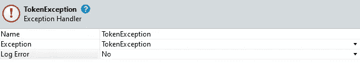

令牌异常处理程序

*   从 Microsoft loginconnectorreactive 模块添加**getoauth 2 authenticationurl**客户端操作并对其进行配置

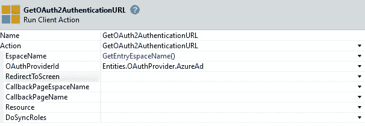

*   用设置为**getoauth 2 authenticationurl**操作的输出 Url 的**RedirectToUrl**destination 来交换默认结束。

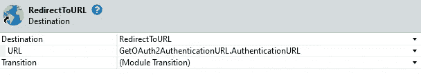

重定向图配置

> 如果这导致回调页面上出现 404，请参考 Microsoft loginconnectorreactive 组件的官方[文档。它向您展示了使用 FactoryConfiguration 的步骤。不幸的是，这在个人环境中不起作用。](https://www.outsystems.com/forge/Component_Documentation.aspx?ProjectId=6933&ProjectName=microsoft-login-connector-reactive)

**第 12 步—您的第一个 Microsoft Graph API 操作**

完成所有这些步骤后——感谢您到目前为止的参与——终于到了执行我们的第一个图形 API 操作的时候了。在我们创建的**开始**屏幕上，我们将检索当前用户的可用任务列表。

*   在您的应用程序中，向 **Graph_TodoTasks_IS** 模块添加一个新的依赖项。如果想进一步扩展应用程序，至少选择 **Graph_TaskListList** 操作或所有操作。(来自**微软图形待办任务**锻造组件)

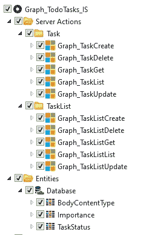

待办任务相关性

*   添加一个新的**数据动作**到你的开始屏幕( **GetTaskLists** )
*   将输出参数(如 List)设置为 TaskList_Result 的**列表**
*   将 **GetOAuthToken** 服务器动作添加到流中
*   将 Graph_TodoTasks_IS 模块中的**Graph _ task list**添加到流程中并进行配置

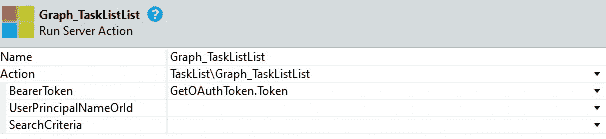

任务列表列表配置

*   添加具有以下条件的 if 语句

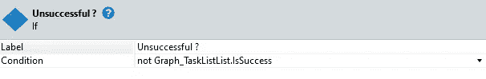

*   在**真分支**上引发新的异常**石墨烯异常**
*   将 **Graph_TaskListList** 动作的**结果**赋值给你的数据动作的**输出参数**。

您的流程现在应该是这样的

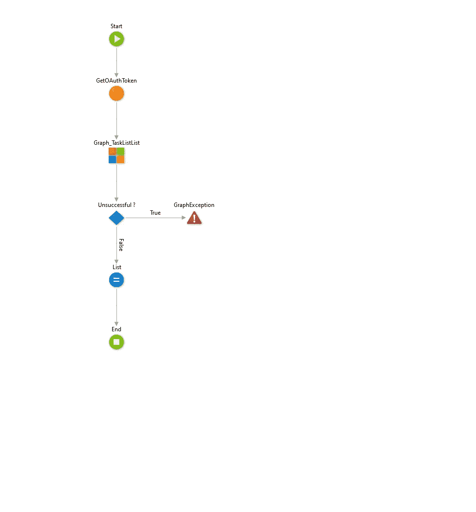

GetTaskLists 流

*   **将您的数据动作的列表输出参数**拖放到屏幕的主要内容区域来搭建一个表格。

就是这样。您可以尝试一下，看看是否能从查询中得到结果。使用 Microsoft 待办事项应用程序并创建更多列表。

探索 Microsoft Graph To-do Tasks Forge 组件中的其他操作，并使用委派的用户权限直接从 OutSystems 应用程序中创建任务列表和任务。

如果您在启动和运行时遇到困难，请使用 OutSystems 论坛获得帮助。非常欢迎对如何改进这篇文章提出建议。通过我的 [OutSystems Profile](https://www.outsystems.com/profile/0qginuc0j5/overview) 给我发消息，或者直接在 medium 上回复。