# 使用 Amazon RDS、CloudFormation、pgAdmin 和 Python 开始使用 PostgreSQL

> 原文：<https://itnext.io/getting-started-with-postgresql-using-amazon-rds-cloudformation-pgadmin-and-python-d11aa98e6409?source=collection_archive---------2----------------------->

# 介绍

在接下来的文章中，我们将探讨如何开始为 PostgreSQL 使用 Amazon 关系数据库服务(RDS)。CloudFormation 将用于在新的 VPC 中构建 PostgreSQL 主数据库实例和单个读取副本。AWS 系统管理器参数存储将用于存储我们的云形成配置值。Amazon RDS 事件通知将向我们的移动设备发送文本消息，让我们知道 RDS 实例何时可以使用。运行之后，我们将研究与数据库实例交互的各种方法，包括 pgAdmin、Adminer 和 Python。

# 技术

本文中使用的主要技术包括。

## 一种数据库系统

据其网站介绍， [PostgreSQL](https://www.postgresql.org/) ，俗称 Postgres，是世界上最先进的开源关系数据库。PostgreSQL 起源于 1986 年的加州大学伯克利分校，拥有 30 多年的核心开发经验。PostgreSQL 因其成熟的架构、可靠性、数据完整性、强大的功能集和可扩展性而赢得了良好的声誉。PostgreSQL 可以在所有主流操作系统上运行，并且自 2001 年以来一直是 ACID 兼容的。

## 亚马逊 RDS for PostgreSQL

据亚马逊介绍，[亚马逊关系数据库服务](https://aws.amazon.com/rds/) (RDS)提供了六种熟悉的数据库引擎可供选择，包括亚马逊 Aurora、PostgreSQL、MySQL、MariaDB、Oracle 数据库和 SQL Server。RDS 可用于几种数据库实例类型——针对内存、性能或 I/O 进行了优化。

Amazon RDS for PostgreSQL 使得在云中设置、操作和扩展 PostgreSQL 部署变得非常容易。亚马逊 RDS 支持最新的 [PostgreSQL 版本 11](https://www.postgresql.org/docs/11/release-11-4.html) ，其中包括性能、健壮性、事务管理、查询并行性等多项增强。

# 自动气象站云形成

据 Amazon 称， [CloudFormation](https://aws.amazon.com/cloudformation/) 提供了一种通用语言来描述和供应基于 AWS 的云环境中的所有基础设施资源。CloudFormation 允许您使用基于 JSON 或 YAML 的模板，以自动化和安全的方式，跨所有 AWS 区域和帐户建模和提供应用程序所需的所有资源。

# 示范

## 体系结构

下面，我们将看到演示中将要构建的架构。这不是典型的[三层 AWS 架构](https://blog.stratus10.com/aws-best-practices-3-tier-infrastructure)，其中 RDS 实例将被放置在私有子网(数据层)中，并且只能由运行在 AWS 上的应用层访问。演示的架构设计用于通过外部数据库客户端(如 pgAdmin)和应用程序(如本地 Python 脚本)与 RDS 进行交互，这将在本文后面详细介绍。

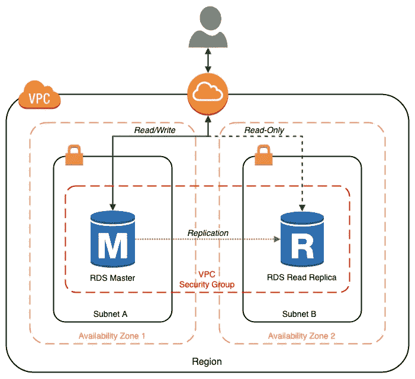

## 源代码

这篇文章的所有源代码都可以在 GitHub 的一个公共存储库中获得， [postgres-rds-demo](https://github.com/garystafford/aws-rds-postgres) 。

```
.
├── LICENSE.md
├── README.md
├── cfn-templates
│   ├── event.template
│   ├── rds.template
├── parameter_store_values.sh
├── python-scripts
│   ├── create_pagila_data.py
│   ├── database.ini
│   ├── db_config.py
│   ├── query_postgres.py
│   ├── requirements.txt
│   └── unit_tests.py
├── sql-scripts
│   ├── pagila-insert-data.sql
│   └── pagila-schema.sql
└── stack.yml
```

要克隆 [GitHub 库](https://github.com/garystafford/aws-rds-postgres)，执行以下命令。

```
git clone --branch master --single-branch --depth 1 --no-tags \ [https://github.com/garystafford/aws-rds-postgres.git](https://github.com/garystafford/aws-rds-postgres.git)
```

## 先决条件

在本演示中，我假设您已经拥有一个 AWS 帐户。此外，您的开发机器上安装了最新版本的 AWS CLI 和 Python 3。或者，对于 pgAdmin 和 Adminer，您还需要安装 Docker。

## 步伐

在本演示中，我们将执行以下步骤。

*   将云信息配置值放入参数存储中；
*   执行 CloudFormation 模板以创建 AWS 资源；
*   使用 Python 执行 SQL 脚本，用样本数据填充新数据库；
*   配置到 RDS PostgreSQL 实例的 pgAdmin 和 Python 连接；

# AWS 系统管理器参数存储

对于 AWS，通常使用像 [AWS 系统管理器参数存储](https://docs.aws.amazon.com/systems-manager/latest/userguide/systems-manager-parameter-store.html)和 [AWS 秘密管理器](https://aws.amazon.com/secrets-manager/)这样的服务来存储公开的、敏感的和秘密的配置值。这些值由您的代码使用，或者来自像 CloudFormation 这样的 AWS 服务。参数存储允许我们遵循适当的十二因素、云原生实践[将配置与代码](https://12factor.net/config)分离。

为了演示参数存储的使用，我们将把一些 CloudFormation 配置项放入参数存储中。该演示的 GitHub 存储库包括一个 shell 脚本`[parameter_store_values.sh](https://github.com/garystafford/aws-rds-postgres/blob/master/parameter_store_values.sh)`，它将把必要的参数放入参数存储中。

下面，我们看到几个演示的配置值，这些值已被放入参数存储。

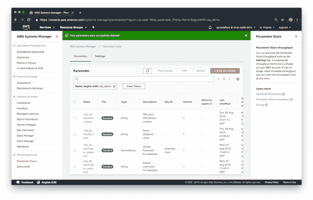

## 安全措施

我们的其他参数以 [String](https://docs.aws.amazon.com/systems-manager/latest/userguide/parameter-store-about-examples.html) 数据类型存储在参数存储中，而数据库的主用户密码以 [SecureString](https://docs.aws.amazon.com/systems-manager/latest/userguide/sysman-paramstore-securestring.html) 数据类型存储。参数存储使用一个 [AWS 密钥管理服务](https://aws.amazon.com/kms/) (KMS)客户主密钥(CMK)来加密安全参数值。

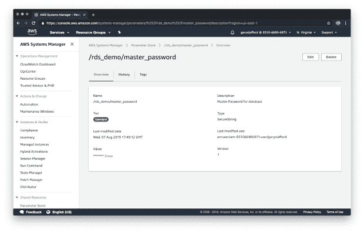

## 短信文本提醒选项

在运行参数存储脚本之前，您需要将脚本中的`/rds_demo/alert_phone`参数值(*显示在*下方)更改为您的移动设备号码，包括国家代码，例如“+12038675309”。亚马逊 SNS 将使用它发送短信，使用[亚马逊 RDS 事件通知](https://docs.aws.amazon.com/AmazonRDS/latest/UserGuide/USER_Events.html)。如果您不想使用这个消息传递特性，只需忽略这个参数，不要执行前面步骤中的`event.template` CloudFormation 模板。

```
aws ssm put-parameter \
  **--name /rds_demo/alert_phone** \
  --type String \
  --value "**your_phone_number_here**" \
  --description "RDS alert SMS phone number" \
  --overwrite
```

运行以下命令来执行 shell 脚本`parameter_store_values.sh`，它会将必要的参数放入参数存储中。

```
sh ./parameter_store_values.sh
```

# 云形成模板

GitHub 存储库包括两个 CloudFormation 模板，`[cfn-templates/event.template](https://github.com/garystafford/aws-rds-postgres/blob/master/cfn-templates/event.template)`和`[cfn-templates/rds.template](https://github.com/garystafford/aws-rds-postgres/blob/master/cfn-templates/rds.template)`。此事件模板包含两个资源，即 AWS SNS 主题和 AWS RDS 事件订阅。RDS 模板还包括几个资源，包括一个 VPC、互联网网关、 [VPC 安全组](https://docs.aws.amazon.com/vpc/latest/userguide/VPC_SecurityGroups.html)、两个公共子网、一个 RDS 主数据库实例和一个 [AWS RDS 读取副本](https://aws.amazon.com/rds/details/read-replicas/)数据库实例。

这些资源被分成两个 CloudFormation 模板，因此我们可以首先独立于创建或删除 RDS 实例来创建通知资源。这将确保我们收到所有关于数据库创建和删除的短信提醒。

## 模板参数

两个 CloudFormation 模板总共包含大约 15 个参数。大多数情况下，您可以使用我设置的默认值，或者选择覆盖它们。四个参数将从参数存储中实现。其中，master 数据库密码的处理略有不同，因为它是安全的(在参数存储中加密)。下面是显示这两种类型参数的模板片段。最后两个从参数存储中完成。

```
DBInstanceClass:
  Type: String
  Default: "db.t3.small"
DBStorageType:
  Type: String
  Default: "gp2"
DBUser:
  Type: String
  Default: "{{resolve:ssm:/rds_demo/master_username:1}}"
DBPassword:
  Type: String
 **Default: "{{resolve:ssm-secure:/rds_demo/master_password:1}}"**
  NoEcho: True
```

选择默认的 CloudFormation 参数值将导致两个最低配置的 RDS 实例在具有 10 GiB 通用(SSD)存储的 db.t3.small 实例上运行 PostgreSQL 11.4 数据库引擎。 [db.t3](https://docs.aws.amazon.com/AmazonRDS/latest/UserGuide/Concepts.DBInstanceClass.html#Concepts.DBInstanceClass.Types) DB 实例是最新一代可突发性能实例类的一部分。主实例没有针对[多 AZ](https://docs.aws.amazon.com/AmazonRDS/latest/UserGuide/Concepts.MultiAZ.html) 高可用性进行配置。但是，主副本和读取副本都在同一个 AWS 区域内的不同可用性区域(AZ)中运行。

## 参数版本化

将参数放入参数存储时，对参数的后续更新会导致该参数的版本号递增。注意在上面的例子中，参数的版本是 CloudFormation 所需要的，这里是“1”。如果您选择更新参数存储中的值，从而增加参数的版本，您还需要更新 CloudFormation 模板的参数中的相应版本号。

```
{
    "Parameter": {
 **"Name": "/rds_demo/rds_username",**
        "Type": "String",
        "Value": "masteruser",
 **"Version": 1,**
        "LastModifiedDate": 1564962073.774,
        "ARN": "arn:aws:ssm:us-east-1:1234567890:parameter/rds_demo/rds_username"
    }
}
```

## 验证模板

虽然我已经测试了这两个模板，但是我建议您自己验证这些模板，就像您通常对您正在创建的任何 CloudFormation 模板所做的那样。您可以使用 AWS CLI CloudFormation `validate-template` CLI 命令来验证模板。或者，或者我另外建议，你可以使用 [CloudFormation Linter](https://github.com/aws-cloudformation/cfn-python-lint) ，`cfn-lint`命令。

```
aws cloudformation validate-template \
  --template-body file://cfn-templates/rds.template

cfn-lint -t cfn-templates/cfn-templates/rds.template
```

## 创建堆栈

要执行第一个 CloudFormation 模板并创建包含两个事件通知资源的 [CloudFormation 堆栈](https://docs.aws.amazon.com/AWSCloudFormation/latest/UserGuide/stacks.html)，请运行以下`create-stack` CLI 命令。

```
aws cloudformation create-stack \
  --template-body file://cfn-templates/event.template \
  --stack-name RDSEventDemoStack
```

创建第一个堆栈只需要不到一分钟的时间。使用 AWS CloudFormation 控制台，确保在使用下面的命令创建第二个堆栈之前成功完成第一个堆栈。

```
aws cloudformation create-stack \
  --template-body file://cfn-templates/rds.template \
  --stack-name RDSDemoStack
```

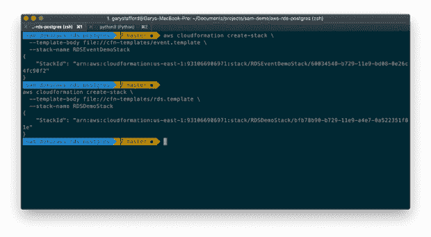

## 等我的短信

在我的测试中，CloudFormation RDS 堆栈平均需要 25-30 分钟来创建，15-20 分钟来删除，这看起来像是永恒的。您可以使用 AWS CloudFormation 控制台(下面显示的*)或继续使用 CLI 来跟踪 RDS 堆栈的创建进度。*

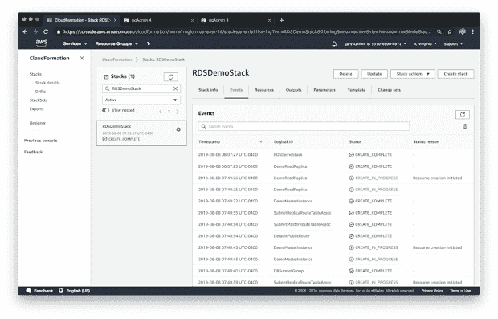

但是，如果您还记得，CloudFormation 事件模板创建了一个 AWS RDS 事件订阅。该资源将通过向我们的移动设备发送文本消息来通知我们数据库何时准备好。

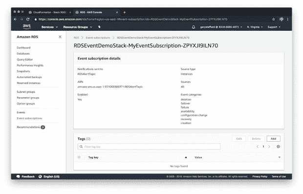

在 CloudFormation events 模板中，RDS 事件订阅被配置为针对几种特定的事件类型生成 Amazon 简单通知服务(SNS)通知，包括 RDS 实例的创建和删除。

```
MyEventSubscription:
  Properties:
    Enabled: true
    EventCategories:
      - availability
      - configuration change
 **- creation
      - deletion**      - failover
      - failure
      - recovery
    SnsTopicArn:
      Ref: MyDBSNSTopic
    SourceType: db-instance
  Type: AWS::RDS::EventSubscription
```

亚马逊社交网络将向您放入参数商店的手机号码发送短信。下面，我们看到在创建两个实例期间生成的消息，显示在 Apple iPhone 上。

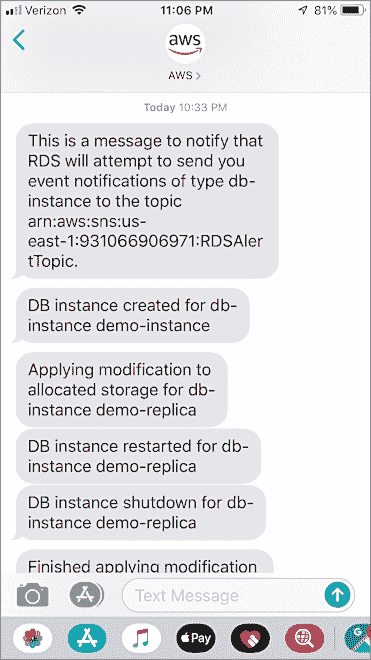

# 亚马逊 RDS 仪表板

一旦成功构建了 RDS CloudFormation 堆栈，查看结果的最简单方法就是使用 Amazon RDS 仪表板，如下所示。在这里，我们看到主复制副本实例和读取复制副本实例都已创建，可供我们使用。

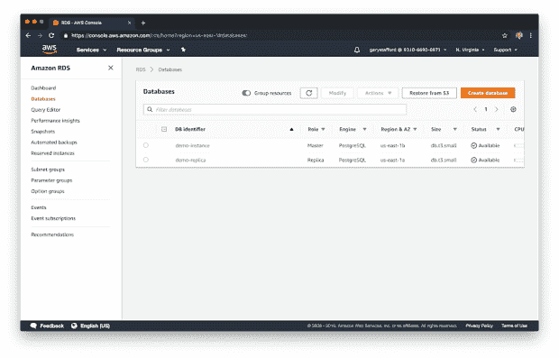

RDS 仪表板提供对每个 RDS 实例的 CloudWatch 监控。

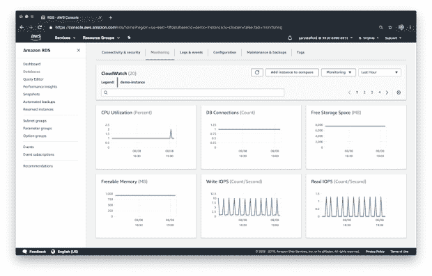

RDS 仪表板还提供了每个 RDS 实例的详细配置信息。

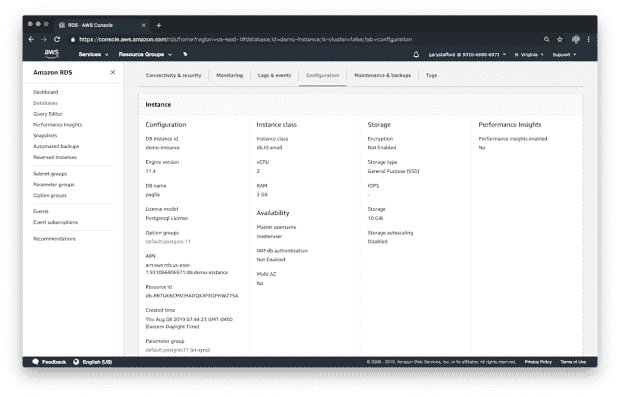

在 RDS 仪表板的 Connection & security 选项卡上，我们可以获取 RDS 实例的连接信息，包括 RDS 实例的端点。演示的下一部分将需要端点信息。

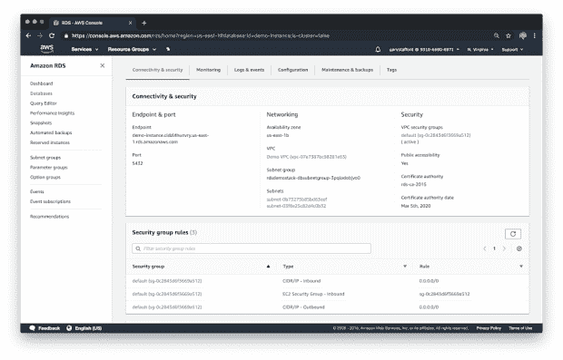

# 抽样资料

现在，我们已经在 AWS 上成功地提供和配置了 PostgreSQL 数据库实例和读取副本，并且数据库为空，我们需要一些测试数据。互联网上有几个来源的[示例 PostgreSQL 数据库](https://wiki.postgresql.org/wiki/Sample_Databases)可供探索。我们将使用由 [pgFoundry](http://pgfoundry.org/projects/dbsamples/) 提供的 [Pagila](http://pgfoundry.org/frs/shownotes.php?release_id=998) 样本电影租赁数据库。尽管这个数据库已经有几年的历史了，但它提供了一个相对复杂的关系模式(*表关系，如下图*所示)和大量要查询的样本数据，大约 100 个数据库对象和 46K 行数据。

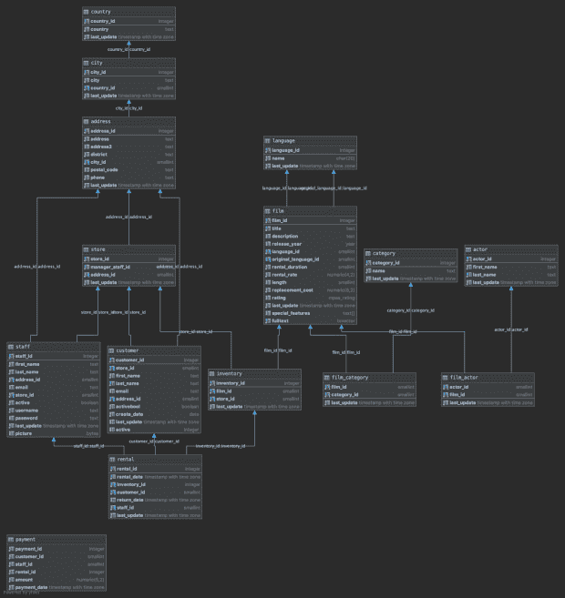

在 GitHub 存储库中，我包含了安装示例数据库的数据结构( [DDL](https://en.wikipedia.org/wiki/Data_definition_language) )、`sql-scripts/pagila-schema.sql`和数据本身( [DML](https://en.wikipedia.org/wiki/Data_Manipulation_Language) )、`sql-scripts/pagila-insert-data.sql`所需的两个 Pagila 数据库 SQL 脚本。

为了执行 Pagila SQL 脚本并安装示例数据，我包含了一个 Python 脚本。如果你不想使用 Python，你可以跳到这篇文章的管理员部分。Adminer 还能够导入 SQL 脚本。

在运行任何包含的 Python 脚本之前，您需要安装所需的 Python 包并配置`[database.ini](https://github.com/garystafford/aws-rds-postgres/blob/master/python-scripts/database.ini)`文件。

## Python 包

要使用提供的`[python-script/requirements.txt](https://github.com/garystafford/aws-rds-postgres/blob/master/python-scripts/requirements.txt)`文件安装所需的 Python 包，请运行以下命令。

```
cd python-scripts
pip3 install --upgrade -r requirements.txt
```

我们为脚本使用了两个包， [psycopg2](http://initd.org/psycopg/docs/index.html) 和 [configparser](https://docs.python.org/3/library/configparser.html) 。Psycopg 是 Python 的 PostgreSQL 数据库适配器。根据他们的网站，Psycopg 是 Python 编程语言最流行的 PostgreSQL 数据库适配器。`configparser`模块允许我们从类似 Microsoft Windows INI 文件的文件中读取配置。包含项目的一组 Python 单元测试也需要 [unittest](https://docs.python.org/3/library/unittest.html) 包，但不作为演示的一部分讨论。

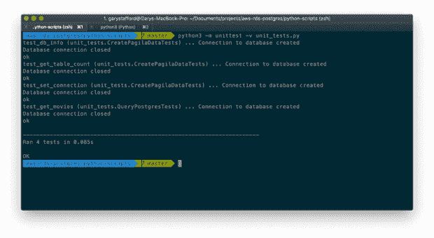

数据库配置

由`configparser`读取的`[python-scripts/database.ini](https://github.com/garystafford/aws-rds-postgres/blob/master/python-scripts/database.ini)`文件向我们的 RDS 主服务器和读取副本实例的数据库提供所需的连接信息。使用 CloudFormation RDS 模板或 Amazon RDS 仪表板中的输入参数和输出值来获取所需的连接信息，如下例所示。您的`host`值对于您的主副本和读取副本将是唯一的。主机值是实例的端点，列在 RDS 仪表板的“配置”选项卡中。

```
[docker]
host=localhost
port=5432
database=pagila
user=masteruser
password=5up3r53cr3tPa55w0rd

[master]
**host=demo-instance.dkfvbjrazxmd.us-east-1.rds.amazonaws.com**
port=5432
database=pagila
user=masteruser
password=5up3r53cr3tPa55w0rd

[replica]
**host=demo-replica.dkfvbjrazxmd.us-east-1.rds.amazonaws.com**
port=5432
database=pagila
user=masteruser
password=5up3r53cr3tPa55w0rd
```

配置好 INI 文件后，运行下面的命令，该命令执行提供的 Python 脚本`[python-scripts/create_pagila_data.py](https://github.com/garystafford/aws-rds-postgres/blob/master/python-scripts/create_pagila_data.py)`，创建数据结构并将示例数据插入主 RDS 实例的 Pagila 数据库。数据库将自动复制到 RDS 读取复制副本实例。在我的本地笔记本电脑上，我发现 Python 脚本创建所有 100 个数据库对象并插入 46K 行电影租赁数据大约需要 40 秒。相比之下，在本地使用基于 Docker 的 PostgreSQL 实例大约需要 13 秒。

```
python3 ./create_pagila_data.py
```

Python 脚本的主要功能`create_pagila_db()`，读取并执行两个外部 SQL 脚本。

```
def create_pagila_db():
    *"""
    Creates Pagila database by running DDL and DML scripts
    """* try:
        global conn
        with conn:
            with conn.cursor() as curs:
 **curs.execute(open("../sql-scripts/pagila-schema.sql", "r").read())
                curs.execute(open("../sql-scripts/pagila-insert-data.sql", "r").read())**                conn.commit()
                print('Pagila SQL scripts executed')
    except (psycopg2.OperationalError, psycopg2.DatabaseError, FileNotFoundError) as err:
        print(create_pagila_db.__name__, err)
        close_conn()
        exit(1)
```

如果 Python 脚本执行正确，您应该会看到输出，表明主 RDS 实例的数据库中现在有 28 个表。

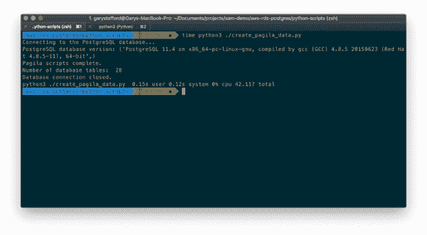

# pgAdmin

pgAdmin 是一个用于与 PostgreSQL 数据库进行交互和管理的常用工具。根据其[网站](https://www.pgadmin.org/)，pgAdmin 是 PostgreSQL 最受欢迎、功能最丰富的开源管理和开发平台。

该项目包括一个可选的[Docker Swarm](https://docs.docker.com/engine/swarm/stack-deploy/)文件。该堆栈将创建一组三个 Docker 容器，包括 PostgreSQL 11.4、Adminer 和 pgAdmin 4 的本地副本。拥有 PostgreSQL 的本地副本，使用[官方 Docker 镜像](https://hub.docker.com/_/postgres)，有助于开发和解决 RDS 问题。

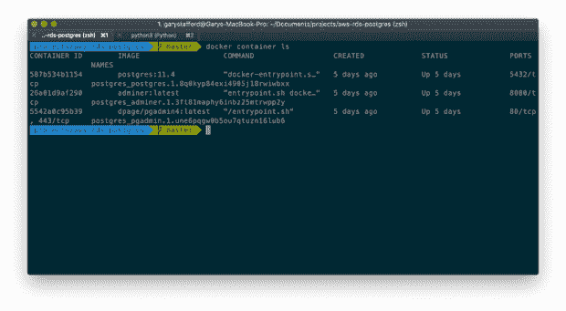

使用以下命令部署 Swarm 堆栈。

```
# create stack
docker swarm init
docker stack deploy -c stack.yml postgres

# get status of new containers
docker stack ps postgres --no-trunc
docker container ls
```

如果您不想启动整个 Docker Swarm 堆栈，您可以使用`docker run`命令创建一个 pgAdmin Docker 容器。正在使用的 pgAdmin 4 Docker 图像是 pgAdmin 推荐的图像[。](https://www.pgadmin.org/download/pgadmin-4-container/)

```
docker pull dpage/pgadmin4

docker run -p 81:80 \
  -e "PGADMIN_DEFAULT_EMAIL=user@domain.com" \
  -e "PGADMIN_DEFAULT_PASSWORD=SuperSecret" \
  -d dpage/pgadmin4

docker container ls | grep pgadmin4
```

## 数据库服务器配置

一旦 pgAdmin 启动并运行，我们就可以使用来自您的`database.ini`文件或 Amazon RDS 仪表板的连接字符串信息来配置主数据库服务器和读取副本数据库服务器(RDS 实例)。下面，我正在配置主 RDS 实例(服务器)。

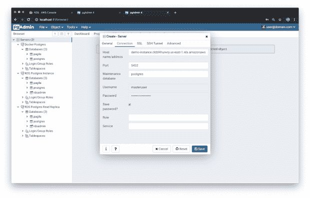

任务完成后，在下面，我们看到主 RDS 实例和 read 副本，以及在 pgAdmin 中配置的本地 Docker 实例(*屏幕截图的左侧*)。请注意 Pagila 数据库是如何从 RDS 主服务器自动复制到 read 复制副本实例的。

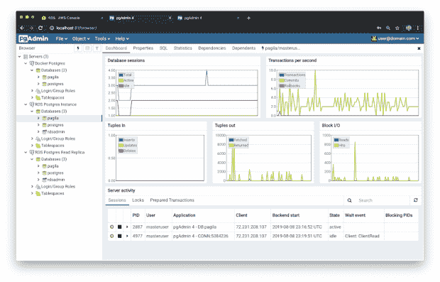

## 构建 SQL 查询

切换到 Query 选项卡，我们可以对任何数据库实例运行常规的 SQL 查询。下面，我对主 RDS 实例的 Pagila 数据库运行了一个简单的 SELECT 查询，返回电影标题的完整列表，以及它们的类型和发行日期。

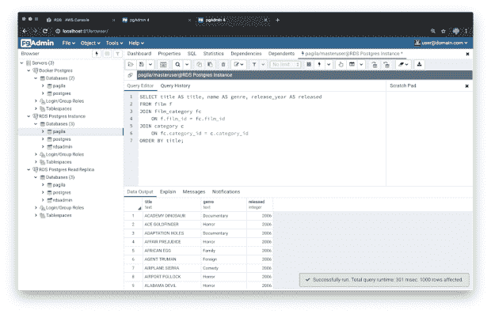

pgAdmin 查询工具甚至包括一个 [Explain](https://www.pgadmin.org/docs/pgadmin4/development/query_tool.html) 选项卡来查看相同查询的图形表示，这对优化非常有用。这里我们看到了同一个查询，显示了对执行顺序的分析。弹出窗口显示关于选定对象的信息。

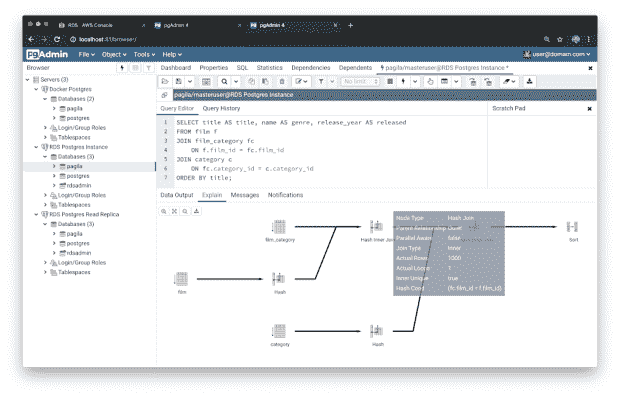

## 查询读取副本

为了演示读取副本的使用，下面我对 Pagila 数据库的 RDS 读取副本的副本运行了相同的查询。针对主实例的任何模式和数据更改都会复制到读取副本。

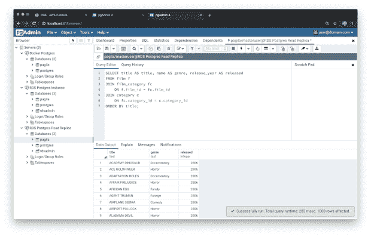

# 管理员

Adminer 是另一个很好的通用数据库管理工具，类似于 pgAdmin，但是具有一些不同的功能。根据它的[网站](https://www.adminer.org/)，使用 Adminer，你可以获得整洁的用户界面、对多个数据库的丰富支持、性能和安全性，所有这些都来自单个 PHP 文件。Adminer 是我处理数据库管理任务的首选工具。令人惊讶的是，Adminer 可以与 MySQL、MariaDB、PostgreSQL、SQLite、MS SQL、Oracle、SimpleDB、Elasticsearch 和 MongoDB 一起工作。

下面，我们看到在 Adminer 中显示的 Pagila 数据库的表和视图，以及关于每个数据库对象的一些有用的统计信息。

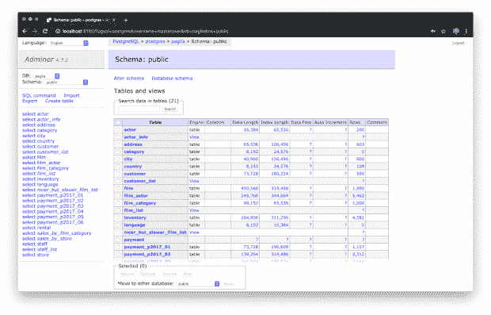

与 pgAdmin 类似，我们也可以在 Adminer 界面中运行查询，以及其他常见的开发和管理任务。

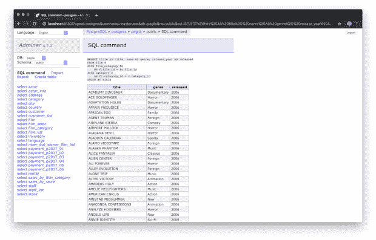

## 用 Adminer 导入 Pagila

Adminer 的另一个很棒的特性是能够轻松地导入和导出数据。作为 Python 的替代方法，您可以使用 Adminer 的 SQL 文件导入功能导入 Pagila 数据。下面，您将看到一个使用文件上传功能将 Pagila 数据库对象导入 Pagila 数据库的示例。

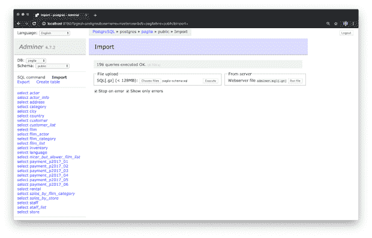

# 集成驱动电子设备

对于将我的 AWS 基础设施写成代码文件和 Python 脚本，我更喜欢 JetBrains[py charm Professional Edition](https://www.jetbrains.com/pycharm/)(v 19.2)。与所有 JetBrains IDEs 一样，PyCharm 能够连接和管理 PostgreSQL 数据库。您可以编写和运行 SQL 查询，包括 Pagila SQL 导入脚本。微软 [Visual Studio Code](https://code.visualstudio.com/) 是另一个优秀的免费选择，可在多个平台上使用。

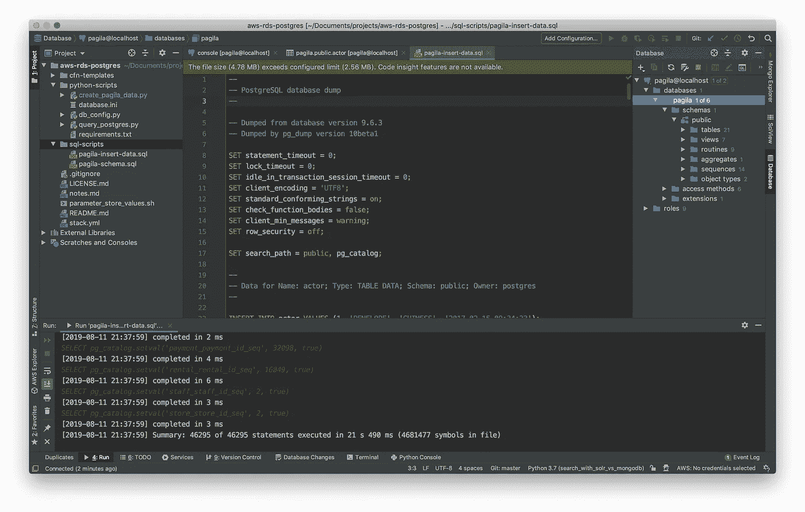

# Python 和 RDS

尽管我们的 IDE、pgAdmin 和 Adminer 对于构建和测试我们的查询很有用，但最终，我们仍然需要连接到 Amazon RDS PostgreSQL 实例，并从我们的应用程序代码执行数据操作。GitHub 存储库包含一个示例 python 脚本`[python-scripts/query_postgres.py](https://github.com/garystafford/aws-rds-postgres/blob/master/python-scripts/query_postgres.py)`。这个脚本使用与我们之前运行的 Pagila 数据创建脚本相同的 Python 包和连接函数。这一次，我们将使用 Python 执行与之前使用 pgAdmin 和 Adminer 相同的 SELECT 查询。

```
cd python-scripts python3 ./query_postgres.py
```

成功建立数据库连接后，脚本的主要功能`get_movies(return_count)`执行选择查询。该函数接受一个整数，表示从 SELECT 查询中返回的电影数量。脚本中有一个独立的函数负责在查询完成时关闭数据库连接。

```
def get_movies(return_count=100):
    """
    Queries for all films, by genre and year
    """

    try:
        global conn
        with conn:
            with conn.cursor() as curs:
                curs.execute("""
 **SELECT title AS title, name AS genre, release_year AS released
                    FROM film f
                             JOIN film_category fc
                                  ON f.film_id = fc.film_id
                             JOIN category c
                                  ON fc.category_id = c.category_id
                    ORDER BY title
                    LIMIT %s;**                """, (return_count,))

                movies = []
                row = curs.fetchone()
                while row is not None:
                    movies.append(row)
                    row = curs.fetchone()

                return movies
    except (psycopg2.OperationalError, psycopg2.DatabaseError) as err:
        print(get_movies.__name__, err)
    finally:
        close_conn()

def main():
    set_connection('docker')
    for movie in get_movies(10):
        print('Movie: {0}, Genre: {1}, Released: {2}'
              .format(movie[0], movie[1], movie[2]))
```

下面，我们看到一个 Python 脚本格式化输出的例子，仅限于前十部电影。


# 使用读取副本

为了获得更好的应用程序性能，最好将部分或全部数据库读取重定向到读取副本，而将写入、更新和删除操作留给主实例。在对`set_connection(section)`函数的调用中，只需传递所需的“副本”和“主”部分，就可以很容易地修改脚本，对读取副本而不是主 RDS 实例执行相同的查询。section 参数指的是`database.ini`文件中的两个部分之一。`configparser`模块将处理检索正确的连接信息。

```
set_connection('replica')
```

# 清理

完成演示后，清理所有 AWS 资源并停止计费的最简单方法是使用 AWS CLI 按以下顺序删除两个 CloudFormation 堆栈。

```
aws cloudformation delete-stack \
  --stack-name RDSDemoStack

# wait until the above resources are completely deleted
aws cloudformation delete-stack \
  --stack-name RDSEventDemoStack
```

当第一个 CloudFormation 堆栈被删除时，您应该会收到以下 SMS 通知。

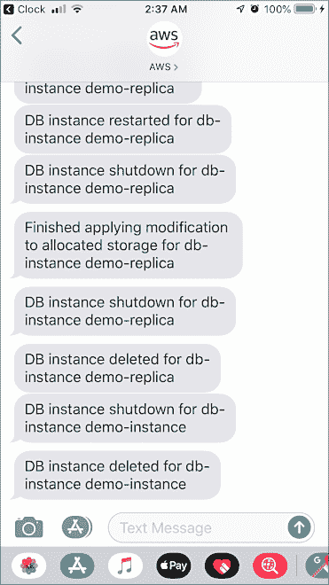

您可以使用以下命令删除正在运行的 Docker 堆栈。注意，您将丢失所有的 pgAdmin 服务器连接信息，以及您的本地 Pagila 数据库。

```
docker stack rm postgres
```

# 结论

在这篇简短的文章中，我们只是简单介绍了 Amazon RDS for PostgreSQL 的许多好处和功能。学习 PostgreSQL 和 Amazon RDS 的好处的最好方法是设置自己的 RDS 实例，插入一些示例数据，并开始用自己喜欢的数据库客户机或编程语言编写查询。

本文表达的所有观点都是我个人的，不一定代表我现在或过去的雇主或他们的客户的观点。

*原载于 2019 年 8 月 10 日*[*【http://programmaticponderings.com*](https://programmaticponderings.com/2019/08/09/getting-started-with-postgresql-using-amazon-rds-cloudformation-pgadmin-and-python/)*。*